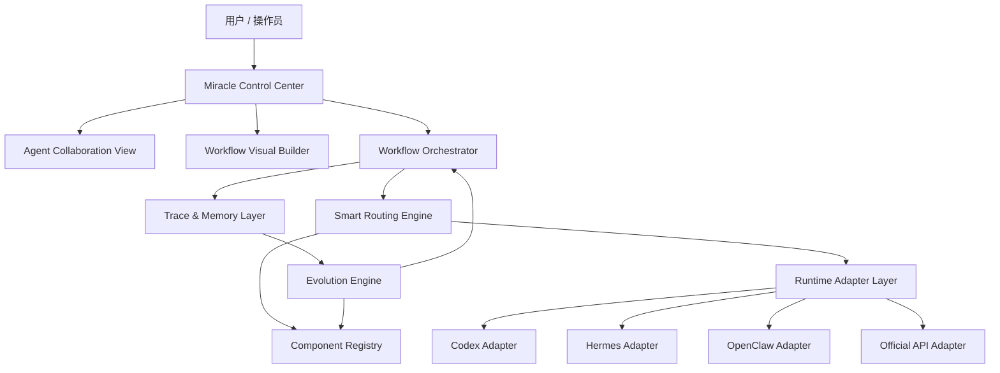

# Miracle 奇迹系统总体规划设计

## 1. 系统定位

Miracle 是一套面向个人、一人公司和小型 AI 团队的超级智能体系统。它不是单一聊天机器人，也不是单条内容生产流水线，而是一个统一管理智能体、工作流、组件库、工具、模型、产物、审核、执行记录和系统进化的控制平面。

第一阶段先服务现有资讯内容生产链路，随后扩展到：

- 生图任务。
- 生视频任务。
- AI 剧本制作。
- AI 漫剧全流程生成。
- 研究分析任务。
- 运营与分发任务。
- 代码与自动化任务。

Miracle 的核心目标是把“复杂多 Agent 协作”变成用户可理解、可组合、可监控、可复盘、可进化的工作系统。

## 2. 核心原则

| 原则 | 说明 |
|---|---|
| 多平台中立 | Codex、Hermes、OpenClaw、Claude Code、官方 API 都只是 Runtime Adapter，不让系统绑定单一平台。 |
| 组件库 + 节点 | 节点描述流程语义，组件库封装 skill、tool、MCP、prompt、provider、agent 等能力组合。 |
| 默认推荐 + 自由编排 | 普通用户使用推荐流程和 auto 模式，高级用户可自由改节点、组件和子工作流。 |
| 可视化优先 | 工作流状态、多 Agent 协同、产物流转、审核门和错误必须能被看见。 |
| 可审计执行 | 记录任务输入、节点状态、工具调用摘要、产物、错误、耗时、成本和审核，不记录隐藏推理链和密钥。 |
| 可进化但可控 | 系统可以提出流程进化建议，但正式模板升级必须经过用户批准。 |

## 3. 产品分层

### Miracle Control Center

任务启动、任务列表、工作流选择、Agent 状态、节点状态、成本、错误、审核门、产物和复盘入口。

### Agent Collaboration View

展示多 Agent 的职责、当前任务、依赖关系、等待对象、交接产物、工具调用和运行状态。

### Workflow Visual Builder

工作流可视化编排器，提供两种可切换模式：

- 无限画布模式：适合创作、策划、素材组织、分镜、复杂多产物任务。
- 流程节点模式：适合严谨 DAG、审核门、自动化、状态监控和执行复盘。

### Workflow Orchestrator

负责工作流模板、节点 DAG、子工作流、并行分支、条件分支、审核门、重试、fallback、暂停和恢复。

### Runtime Adapter Layer

统一接入不同执行平台：

- Codex。
- Hermes。
- OpenClaw。
- Claude Code。
- OpenAI / Anthropic / Google / 火山 / 其他官方 API。
- 本地脚本和第三方服务。

### Component Registry

管理所有可复用能力单元：

- tools。
- skills。
- MCP servers。
- prompts。
- model providers。
- script runners。
- Pencil、HyperFrames、TTS、image、video 等能力。

### Trace & Memory Layer

记录每次执行的链路、事件、状态、产物、错误、审核和复盘结果，为可视化和进化提供数据。

### Evolution Engine

基于执行数据生成工作流、组件库、Agent、prompt、provider 和审核策略的升级建议。

## 4. 第一条样本工作流

Miracle 的第一条样本来自现有“热点工具更新”项目。

这条工作流用于验证以下能力：

- 官方源采集和事实核验。
- 多 Agent 分工。
- 手动/自动审核门。
- 内容母稿、脚本、PPT、分镜、TTS、视频、发布包的产物流转。
- 任务 trace 和事件流。
- 后续工作流进化。

## 5. 核心创新点

### 5.1 多 Agent 协同可视化

用户要能清晰看到：

- 哪个 Agent 正在执行。
- 哪个 Agent 在等待。
- 哪个节点被阻塞。
- 哪个产物已经交接。
- 哪个审核门需要人工处理。
- 哪个工具或 provider 失败并触发 fallback。

### 5.2 双模式工作流编排

同一套底层 graph 支持两种展示和编辑方式：

- 无限画布：像创作白板，适合自由组织任务、素材、灵感、分支、产物和 Agent。
- 流程节点：像 DAG 编排器，适合看依赖、状态、审核门、输入输出和执行顺序。

### 5.3 组件库装备 Agent

Agent 不再只是 prompt 角色，而是可以被装备能力包：

| Agent | 推荐组件库 |
|---|---|
| 情报 Agent | 官方源采集组件库 |
| 内容 Agent | 母稿与平台分发组件库 |
| 原型 Agent | Pencil MCP 组件库 |
| TTS Agent | 配音字幕组件库 |
| 视频 Agent | HyperFrames 组件库 |
| 复盘 Agent | 审计与进化组件库 |

### 5.4 多平台同步接入

同一个节点可以由不同平台执行：

- Codex 适合本地项目、文件、脚本、工程化工作。
- Hermes 适合长期记忆、跨会话进化和跨平台消息入口。
- OpenClaw 适合 gateway、channel、session 和常驻助手形态。
- 官方 API 适合稳定、批量、可计费、可路由的模型调用。

## 6. 第一版文档交付范围

第一版只交付方案文档，文件如下：

1. `README.md`
2. `00_Miracle奇迹系统总体规划设计.md`
3. `01_核心架构与对象模型.md`
4. `02_组件库与插件体系设计.md`
5. `03_智能路由与工作流编排设计.md`
6. `04_多Agent协同与可视化设计.md`
7. `05_双模式工作流可视化编排设计.md`
8. `06_智能进化体系设计.md`
9. `07_后续对接路线图与任务拆解.md`

第一版不做：

- 不创建代码工程。
- 不选择具体前端框架。
- 不实现真实调度器。
- 不接入真实数据库。
- 不做多租户 SaaS。

## 7. 验收场景

| 场景 | 验收标准 |
|---|---|
| 默认资讯生产 | 用户输入“做一期 Codex/Claude Code 资讯内容”，系统能推荐 Flow A-G。 |
| 流程节点查看 | 用户能看到节点状态、Agent、输入输出、审核门、错误和产物。 |
| 无限画布查看 | 用户能以空间方式查看主题、素材、Agent、产物、灵感和版本分支。 |
| 多 Agent 协同 | 用户能看到谁在执行、谁在等待、谁被阻塞、谁产出了什么。 |
| 插入 Pencil 节点 | 在 MD 母稿前新增 Pencil 原型节点，不破坏下游。 |
| 新增子工作流 | 在 MD 母稿后新增“内容精细策划子流程”，并返回主流程。 |
| 多平台执行 | 同一节点可选择 Codex、Hermes、OpenClaw 或 API provider。 |
| 失败恢复 | TTS 缺凭证、视频渲染失败、来源访问失败时展示原因和恢复动作。 |

## 8. 关键假设

- “Harmas”暂按 Hermes Agent 理解；如果指其他平台，后续替换 adapter 名称即可。
- “类似 Lovart”只借鉴无限画布式创作和资产组织体验，不复制具体产品实现。
- 多平台同步是架构层同步设计，不代表第一轮实现必须同时跑通所有平台。
- 现有“热点工具更新”项目是 Miracle 的第一个真实工作流样本。

