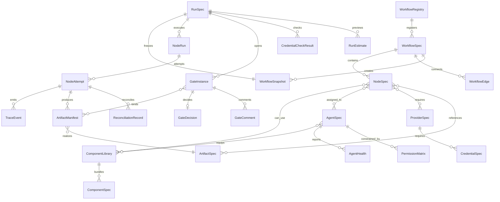

# 01_核心架构与对象模型

## 1. 设计目标

本文件定义 Miracle 的核心对象。后续无论用什么技术栈实现，都应先保持这些概念稳定：

- Workflow：工作流模板。
- Node：工作流节点。
- Component：可复用能力单元。
- Component Library：组件库。
- Agent：智能体角色和执行者。
- Runtime Adapter：执行平台适配器。
- Provider：模型或服务供应商。
- Run：一次任务实例。
- Node Run：某个 run 中固定节点的聚合实例。
- Node Attempt：节点的一次不可变执行尝试。
- Trace Event：执行事件。
- Artifact：产物资产。
- Gate：审核门。
- Gate Instance：某次 run 中绑定具体产物版本的审核实例。
- Gate Decision：针对 GateInstance 的不可变最终决定。
- Gate Comment：不改变放行结论的审核评论。
- Reconciliation Record：外部副作用结果不明确后的核对记录。
- Operation Revision：NodeRun 内一次业务意图版本；MVP 以字段和派生规则表达，不新增持久化聚合。
- Workflow Registry：工作流模板注册表。
- Agent Health：Agent 心跳、活跃度和阻塞状态。
- Permission Matrix：Agent 权限矩阵。
- Credential Spec：可版本化的凭证需求契约。
- Credential Check Result：某次 dry-run 或执行时的凭证检查事实。
- Run Estimate：启动前成本、耗时和风险预估。

## 2. 对象关系总览



## 3. WorkflowSpec

WorkflowSpec 是工作流模板，不是某次运行。它描述一类任务的默认流程、节点、依赖、审核门和推荐组件库。

```yaml
id: content-production-v0
name: 资讯内容生产全流程
version: 0.1.0
category: content_production
description: 官方源事实到 MD 母稿、脚本、分镜、TTS、视频、分发和复盘
default_mode: auto_with_review_gates
nodes:
  - A_fact_intelligence
  - B_md_master
  - C0_script_pool
  - C_storyboard
  - D_tts_caption
  - E_visual_video
  - F_final_render
  - G_distribution_retro
edges:
  - from: A_fact_intelligence
    to: B_md_master
  - from: B_md_master
    to: C0_script_pool
```

关键字段：

| 字段 | 说明 |
|---|---|
| `id` | 全局唯一标识。 |
| `version` | 工作流版本，用于进化和回退。 |
| `category` | 任务类型，如 content、image、video、drama、research。 |
| `default_mode` | 默认执行策略，如 auto、manual、hybrid。 |
| `nodes` | 节点列表。 |
| `edges` | 节点依赖边。 |
| `review_policy` | 审核门策略。 |
| `recommended_libraries` | 推荐组件库。 |

## 4. NodeSpec

NodeSpec 描述一个流程节点的语义、输入、输出、状态机、能力需求和可替换执行方式。

```yaml
id: B_md_master
name: 内容 MD 母稿
type: transform
capability_requirements:
  - content.longform_draft
  - fact.safe_writing
inputs:
  - name: approved_clean_events
    artifact_spec_id: clean_events
    required: true
    selector:
      run_scope: current
      status: approved
      strategy: latest_approved
outputs:
  - artifact_spec_id: md_master
allowed_libraries:
  - content-packaging-library
allowed_agents:
  - content-agent
review_gate: B_md_master_gate
subworkflow_enabled: true
fallback:
  retry: 1
  on_failure: block_with_reason
```

节点原则：

- 节点只描述“要完成什么”，不直接绑定某个模型。
- 节点可以声明能力需求，由路由器选择 agent、component 和 provider。
- 节点可以打开子工作流，例如“内容精细策划子流程”。
- 节点必须声明输入输出，方便画布、DAG 和 trace 同步。
- `review_gate` 是指向 GateSpec 的便捷引用；产物是否需要审核以
  `ArtifactSpec.review_policy` 为准。两者同时存在时必须引用同一个 GateSpec，
  否则 validate 失败。

## 5. ComponentSpec

ComponentSpec 是最小能力单元，可以是 skill、tool、MCP、prompt、script、API、模板或 UI 能力。

```yaml
id: pencil-prototype-mcp
name: Pencil 原型设计 MCP
kind: mcp_tool
capabilities:
  - prototype.pencil
  - design.canvas
inputs:
  - content_structure
outputs:
  - prototype_file
  - design_snapshot
runtime_requirements:
  mcp_server: pencil
security:
  credential_scope: local
  approval_required: false
```

Component 类型：

| 类型 | 示例 |
|---|---|
| `skill` | 内容包装 skill、TTS 字幕 skill、HyperFrames 视频 skill |
| `tool` | shell、web、browser、image generation、ffprobe |
| `mcp_tool` | Pencil MCP、filesystem MCP、browser MCP |
| `prompt` | 母稿 prompt、分镜 prompt、审核 prompt |
| `script_runner` | storyboard adapter、TTS runner、render runner |
| `api_provider` | OpenAI、Anthropic、火山、Google、OpenRouter |
| `template` | 资讯生产模板、短视频模板、漫剧模板 |

## 6. ComponentLibrary

ComponentLibrary 是组件组合包，用于降低用户自由组合成本。

```yaml
id: tts-caption-library
name: 配音字幕组件库
components:
  - tts-caption-workflow-skill
  - volc-tts-provider
  - subtitle-exporter
  - audio-manifest-validator
default_agent: tts-agent
recommended_nodes:
  - D_tts_caption
quality_gates:
  - audio_manifest_exists
  - captions_synced
  - credentials_checked
```

组件库解决两个问题：

1. 普通用户不需要手动拼 skill、tool、prompt、provider。
2. 高级用户仍然可以拆开组件库替换单个能力。

## 7. AgentSpec

AgentSpec 描述一个智能体角色、职责、工具权限、组件库装备和运行平台偏好。

```yaml
id: content-agent
name: 内容 Agent
role: 生成可发布 MD 母稿和平台内容资产
responsibilities:
  - longform_draft
  - platform_rewrite
  - title_packaging
equipped_libraries:
  - content-packaging-library
allowed_tools:
  - read_files
  - write_artifacts
  - web_reference
runtime_preferences:
  - codex
  - claude_code
  - official_api
memory_scope: project
```

Agent 状态：

```text
idle / queued / running / waiting / blocked / reviewing / done / failed
```

## 8. RuntimeAdapter

RuntimeAdapter 把 Miracle 的节点任务翻译成某个平台可以执行的形式。

| Adapter | 主要职责 |
|---|---|
| `codex` | 本地文件、代码、脚本、项目级 skill、MCP、子 Agent。 |
| `hermes` | 长期记忆、跨会话技能进化、消息入口。 |
| `openclaw` | gateway、channel、session、常驻助手、移动/聊天入口。 |
| `claude_code` | subagents、skills、dynamic workflows、hooks。 |
| `official_api` | 稳定批量调用、模型路由、成本控制、结构化输出。 |

Adapter 不应该改变 WorkflowSpec，只负责把统一任务请求转换成平台调用。

Adapter 也不直接写 `TraceEvent`、`ArtifactManifest` 或 `NodeRun`。它只返回
`AdapterResult` envelope，由 Orchestrator 统一校验、持久化和推进状态。

## 9. ProviderSpec

ProviderSpec 描述模型或服务供应商。

```yaml
id: openai-gpt-5-codex
kind: llm
capabilities:
  - code
  - reasoning
  - tool_use
context_window: high
cost_tier: medium
latency_tier: medium
quality_tier: high
fallbacks:
  - anthropic-claude-sonnet
  - openrouter-balanced
```

Provider 路由关注：

- 能力匹配。
- 成本。
- 质量。
- 速度。
- 上下文窗口。
- 可用性。
- 凭证状态。
- 历史表现。

## 10. RunSpec、WorkflowSnapshot、NodeRun 与 NodeAttempt

RunSpec 是一次真实任务实例。创建真实 run 时，必须冻结当时实际使用的工作流、
组件解析结果和 ProviderPolicy，不能在恢复时重新读取当前 stable 模板。

```yaml
run_id: run_20260618_001
workflow_id: content-production-v0
workflow_version: 0.1.0
workflow_hash: sha256:abc123
workflow_snapshot:
  path: runs/run_20260618_001/workflow.snapshot.yaml
resolved_components:
  B_md_master: content-packaging-library@0.3.0
  D_tts_caption: tts-caption-library@0.2.1
resolved_provider_policy:
  path: runs/run_20260618_001/provider-policy.snapshot.json
status: running
attention:
  - pending_review
  - blocked
created_at: 2026-06-18T10:00:00+08:00
mode: auto_with_review_gates
```

冻结规则：

- RunSpec 创建后只使用不可变的 workflow snapshot。
- stable WorkflowSpec 后续升级不影响已经启动的 run。
- resume、retry、replay 都以 snapshot 和已解析组件版本为准。
- 用户明确升级运行版本时，必须生成迁移事件和新执行计划。

RunSpec 主状态：

```text
created / queued / running / paused / cancelling /
cancelled / failed / completed / aborted
```

复杂工作流使用 `attention` 同时表达 `pending_review / blocked /
reconciliation_required` 等待处理事项。Run 只有在所有 required NodeRun、GateInstance
和 ArtifactManifest 满足完成条件，且没有未解决 reconciliation 时才能进入
`completed`。

NodeRun 是某个 run 中固定节点的聚合实例。同一次 run 中，每个 NodeSpec 最多对应
一个 NodeRun；retry、fallback、返工或重新执行不会创建新的 NodeRun。

```yaml
node_run_id: run001_D_tts
run_id: run_20260618_001
node_id: D_tts_caption
status: blocked
current_attempt_id: tts_run001_D_attempt_2
successful_attempt_id: null
attempt_count: 2
blocking_reason: missing_tts_credentials
```

NodeRun 状态：

```text
not_started / queued / running / paused / blocked / reconciling /
cancelled / failed / skipped / done
```

NodeAttempt 是一次真实执行尝试，完成后不可覆盖：

```yaml
attempt_id: tts_run001_D_attempt_2
node_run_id: run001_D_tts
operation_id: tts_run001_D_r1_sha256_storyboard222_real
business_revision: 1
input_fingerprint: sha256:storyboard222
execution_mode: real-run
status: succeeded
agent: tts-agent
adapter: official_api
provider: backup_tts
resolved_inputs:
  approved_storyboard:
    artifact_id: storyboard_run001_v2
    hash: sha256:storyboard222
    selected_by: latest_approved
started_at: 2026-06-18T10:05:00+08:00
ended_at: 2026-06-18T10:06:20+08:00
artifact_ids:
  - audio_run001_v2
provider_receipt: backup_tts_request_92837
```

NodeAttempt 终态：

```text
succeeded / failed / timed_out / cancelled / aborted / unknown
```

其中 NodeRun `done` 只表示节点执行动作完成。产物能否被下游读取，由
`ArtifactManifest.status` 和 GateInstance/GateDecision 决定。

副作用与重试规则：

- `operation_id` 标识一次稳定业务操作；网络重试、provider fallback，以及核对确认
  未执行后的重试保持不变。
- 审核驳回返工、用户主动重跑、resolved input 变化或 `preview -> real-run` 必须增加
  `business_revision` 并创建新的 `operation_id`。
- MVP 不新增 `NodeOperation` 持久化对象，按
  `node_run_id + business_revision + input_fingerprint + execution_mode` 派生
  `operation_id`。
- `attempt_id` 是单次执行尝试 ID；每次真实调用都创建新的 Attempt。
- 发布、删除、覆盖和付费生成必须记录 provider receipt。
- 外部调用前必须先写入 `attempt_dispatched`。存在 dispatched 但没有 received 时，
  进入 reconcile，禁止直接重试。
- AdapterResult 不明确时，NodeAttempt 以 `unknown` 终止，NodeRun 进入
  `reconciling`。核对结果追加为 ReconciliationRecord 和 TraceEvent，不覆盖原
  NodeAttempt。

```yaml
reconciliation_id: reconcile_publish_attempt_1
attempt_id: publish_attempt_1
outcome: confirmed_succeeded
provider_receipt: xhs_post_92837
resolved_at: 2026-06-18T11:20:00+08:00
```

只有 outcome 为 `confirmed_not_executed` 时，才允许创建新的副作用 Attempt。

## 11. TraceEvent

TraceEvent 是可视化、恢复和审计的数据基础。AuditEvent 是
`event_category: audit` 的受保护 TraceEvent 子类型，二者使用同一 envelope。

```yaml
event_id: evt_000108
sequence: 108
run_id: run_20260618_001
event_type: node_blocked
event_category: runtime
subject:
  type: node_run
  id: run001_D_tts
actor:
  type: system
  id: orchestrator
timestamp: 2026-06-18T10:42:00+08:00
payload:
  node_id: D_tts_caption
  reason: missing_tts_credentials
  visible_message: 缺少 TTS 凭证，节点已阻塞
```

`subject` 用于表达事件主语，可取 `run / node_run / node_attempt / artifact /
gate_instance / credential / workflow / registry / local_service`。`run_id` 对
Registry、Local Service 等 run 外事件可以为空；不得为了满足字段而虚构 node ID。

记录范围：

- 任务变量。
- 节点状态。
- Agent 状态。
- 工具调用名称、耗时、状态、错误。
- 产物路径。
- 审核意见。
- 决策摘要。

不记录：

- 隐藏推理链。
- API key、cookie、token。
- 未授权素材。
- 私密账号会话内容。

审计事件额外要求：

- 不允许静默覆盖。
- 记录 actor、确认票据或审批来源。
- 记录操作前后的关键摘要。
- 敏感信息必须脱敏。

## 12. ArtifactSpec 与 ArtifactManifest

ArtifactSpec 是 WorkflowSpec 中的产物契约，回答“节点应该生产什么”。

```yaml
id: md_master
name: MD 母稿
kind: markdown
path_template: runs/{run_id}/03_内容母稿/{artifact_version}/MD母稿.md
produced_by: B_md_master
consumed_by:
  - C0_script_pool
  - G_distribution_retro
review_policy:
  mode: manual
  gate_id: B_md_master_gate
```

ArtifactManifest 是某次 NodeAttempt 的真实产物，回答“这次任务实际生产了什么”。

```yaml
artifact_id: artifact_run001_md_master_v1
artifact_spec_id: md_master
run_id: run_20260618_001
node_run_id: run001_B_md_master
attempt_id: B_md_master_attempt_1
artifact_version: 1
path: runs/run_20260618_001/03_内容母稿/v1/MD母稿.md
hash: sha256:def456
size: 18420
status: pending_review
produced_by: B_md_master
source_event_id: evt_000108
created_at: 2026-06-18T10:42:00+08:00
```

ArtifactManifest 状态：

```text
draft / pending_review / approved / rejected / archived / external_only
```

`review_policy.mode` 的合法值和放行规则：

| mode | ArtifactManifest 初始放行规则 |
|---|---|
| `none` | Attempt succeeded 后直接进入 `approved`。 |
| `auto` | validators 全部通过后进入 `approved`，失败按 `on_fail` 处理。 |
| `manual` | 进入 `pending_review` 并创建 GateInstance。 |
| `conditional` | 先按风险条件解析为 auto 或 manual，并把解析结果写入运行事件。 |

规则：

- NodeSpec 引用 ArtifactSpec。
- NodeAttempt 产生 ArtifactManifest。
- Artifact Board 的运行产物卡绑定 ArtifactManifest。
- 真实路径、hash、审核状态和 source event 只进入 ArtifactManifest。
- 路径必须包含 `{artifact_version}` 或 `{attempt_id}`，不能静默覆盖旧版本。
- ArtifactAlias 可以维护 latest 和 latest approved 逻辑指针，但不能替代 Manifest。

## 13. GateInstance、GateDecision 与 GateComment

GateSpec 是模板规则；GateInstance 是某次 run 中绑定具体 ArtifactManifest 的审核
过程；GateDecision 是不可变最终决定。

```yaml
gate_instance_id: run001_B_gate_v2
gate_spec_id: B_md_master_gate
run_id: run_20260618_001
node_run_id: run001_B_md_master
artifact_ids:
  - artifact_run001_md_master_v2
status: pending_review
```

```yaml
decision_id: decision_run001_B_v2_approve
gate_instance_id: run001_B_gate_v2
decision: approved
reviewer:
  type: user
  id: local_user
decided_at: 2026-06-18T11:00:00+08:00
artifact_bindings:
  - artifact_id: artifact_run001_md_master_v2
    hash: sha256:222
comment: 该版本可以进入脚本池
```

正式规则：

- GateInstance 只允许 `pending_review / decided / invalidated`。
- `pending_review` 是 GateInstance 状态，不是 GateDecision。
- GateDecision 只保存 `approved / auto-approved / rejected / blocked / skipped`。
- `approved` 和 `auto-approved` 只放行 decision 中绑定的 artifact ID 和 hash。
- `rejected` 必须写返工意见。
- `blocked` 必须写缺失条件。
- `skipped` 必须写跳过原因。
- comment 保存为 GateComment 或 audit TraceEvent，不形成最终 GateDecision。
- 文件暂时不可读、审核环境不可用等问题写入 attention/blocking reason，不增加
  GateInstance 的 `blocked` 状态。
- 已批准文件 hash 变化时，原决定不再适用于修改后的内容，必须新建
  ArtifactManifest 和 GateInstance。

当节点已经生成待审核产物时：

```text
NodeRun.status = done
ArtifactManifest.status = pending_review
GateInstance.status = pending_review
GateDecision = not_created
```

下游放行必须同时验证具体 ArtifactManifest 和对应 GateDecision 的 artifact
binding，不能只查询 gate ID 或 ArtifactSpec ID。

## 14. WorkflowRegistry

WorkflowRegistry 管理工作流模板的来源、版本、状态和发布。它让 Miracle 的工作流不仅存在于 UI 或数据库中，也能作为文件进入 Git、PR、回滚和跨项目复用。

```yaml
id: github_templates
type: github_repo
repo: haozhangyue/miracle-agent-workflows
ref: main
template_statuses:
  - draft
  - experimental
  - stable
  - deprecated
  - blocked
```

支持来源：

| 来源 | 说明 |
|---|---|
| `local_project` | 当前项目内的 workflow 模板。 |
| `local_registry` | 本机共享模板目录。 |
| `github_repo` | GitHub 仓库中的模板集合。 |
| `builtin_template` | Miracle 内置模板。 |

Registry 必须支持：

- 模板发现。
- 版本比较。
- 本地覆盖。
- 发布 experimental。
- 标记 stable / deprecated。
- 回退版本。

## 15. AgentHealth

AgentHealth 是 Agent 可观测性的最小状态对象。

```yaml
agent_id: tts-agent
status: blocked
current_node: D_tts_caption
heartbeat_at: 2026-06-17T14:30:00+08:00
blocked_reason: missing_tts_credentials
waiting_for:
  - credential: VOLC_TTS_API_KEY
runtime_adapter: codex
provider: volc-tts
equipped_libraries:
  - tts-caption-library
```

健康状态：

```text
healthy / slow / stalled / blocked / failed
```

AgentHealth 必须能驱动 Agent Dashboard，回答“谁在执行、谁在等待、谁阻塞、怎么恢复”。

## 16. PermissionMatrix

PermissionMatrix 定义 Agent 的读写、工具、通信和下游权限。

```yaml
content-agent:
  can_read:
    - artifacts.clean_events
  can_write:
    - artifact_manifests.md_master
  can_call_tools:
    - read_files
    - write_markdown
  can_message:
    - review-agent
  can_auto_downstream: false
```

权限维度：

- 文件读写。
- 产物创建。
- 工具调用。
- MCP 调用。
- provider 使用。
- Agent 间通信。
- 审核门批准。
- 自动进入下游。

## 17. CredentialSpec 与 CredentialCheckResult

CredentialSpec 描述节点或 provider 需要的凭证契约，不保存真实密钥，也不保存
当前机器的检查状态。

```yaml
id: VOLC_TTS_API_KEY
used_by:
  - D_tts_caption
provider: volc-tts
scope: local_env
required: true
```

CredentialCheckResult 是某次 dry-run 或执行时的本地运行事实：

```yaml
credential_id: VOLC_TTS_API_KEY
run_id: run_20260618_001
status: available
checked_at: 2026-06-18T10:00:00+08:00
source: environment
expires_at: null
```

规则：

- CredentialSpec 可进入 Git，只记录凭证名、用途、范围和是否必需。
- CredentialCheckResult 不进入模板，只属于本地运行事实。
- dry-run 做预检，真实执行前再次检查。
- 不记录真实 token、password、cookie。

## 18. RunEstimate

RunEstimate 是任务启动前的预估结果。

```yaml
run_estimate:
  workflow_id: content-production-v0
  nodes_total: 8
  manual_gates: 4
  missing_credentials:
    - VOLC_TTS_API_KEY
  high_risk_nodes:
    - F_final_render
  estimated_duration: 45-90min
  estimated_cost_level: medium
```

RunEstimate 服务于 dry-run，让用户在执行前知道风险、成本、审核门和可能阻塞点。
