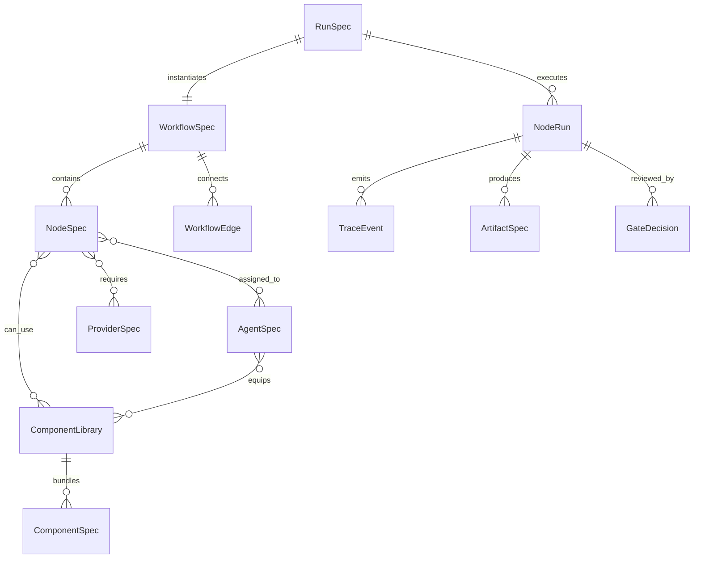

# 01_核心架构与对象模型

## 1. 设计目标

本文件定义 Miracle 的核心对象。后续无论用什么技术栈实现，都应先保持这些概念稳定：

- Workflow：工作流模板。
- Node：工作流节点。
- Component：可复用能力单元。
- Component Library：组件库。
- Agent：智能体角色和执行者。
- Runtime Adapter：执行平台适配器。
- Provider：模型或服务供应商。
- Run：一次任务实例。
- Trace Event：执行事件。
- Artifact：产物资产。
- Gate：审核门。

## 2. 对象关系总览



## 3. WorkflowSpec

WorkflowSpec 是工作流模板，不是某次运行。它描述一类任务的默认流程、节点、依赖、审核门和推荐组件库。

```yaml
id: content-production-v0
name: 资讯内容生产全流程
version: 0.1.0
category: content_production
description: 官方源事实到 MD 母稿、脚本、分镜、TTS、视频、分发和复盘
default_mode: auto_with_review_gates
nodes:
  - A_fact_intelligence
  - B_md_master
  - C0_script_pool
  - C_storyboard
  - D_tts_caption
  - E_visual_video
  - F_final_render
  - G_distribution_retro
edges:
  - from: A_fact_intelligence
    to: B_md_master
  - from: B_md_master
    to: C0_script_pool
```

关键字段：

| 字段 | 说明 |
|---|---|
| `id` | 全局唯一标识。 |
| `version` | 工作流版本，用于进化和回退。 |
| `category` | 任务类型，如 content、image、video、drama、research。 |
| `default_mode` | 默认执行策略，如 auto、manual、hybrid。 |
| `nodes` | 节点列表。 |
| `edges` | 节点依赖边。 |
| `review_policy` | 审核门策略。 |
| `recommended_libraries` | 推荐组件库。 |

## 4. NodeSpec

NodeSpec 描述一个流程节点的语义、输入、输出、状态机、能力需求和可替换执行方式。

```yaml
id: B_md_master
name: 内容 MD 母稿
type: transform
capability_requirements:
  - content.longform_draft
  - fact.safe_writing
inputs:
  - clean_events
  - topic_strategy
outputs:
  - md_master_draft
  - md_master_approved
allowed_libraries:
  - content-packaging-library
allowed_agents:
  - content-agent
review_gate:
  mode: manual
  allow_downstream_statuses:
    - approved
    - auto-approved
subworkflow_enabled: true
fallback:
  retry: 1
  on_failure: block_with_reason
```

节点原则：

- 节点只描述“要完成什么”，不直接绑定某个模型。
- 节点可以声明能力需求，由路由器选择 agent、component 和 provider。
- 节点可以打开子工作流，例如“内容精细策划子流程”。
- 节点必须声明输入输出，方便画布、DAG 和 trace 同步。

## 5. ComponentSpec

ComponentSpec 是最小能力单元，可以是 skill、tool、MCP、prompt、script、API、模板或 UI 能力。

```yaml
id: pencil-prototype-mcp
name: Pencil 原型设计 MCP
kind: mcp_tool
capabilities:
  - prototype.pencil
  - design.canvas
inputs:
  - content_structure
outputs:
  - prototype_file
  - design_snapshot
runtime_requirements:
  mcp_server: pencil
security:
  credential_scope: local
  approval_required: false
```

Component 类型：

| 类型 | 示例 |
|---|---|
| `skill` | 内容包装 skill、TTS 字幕 skill、HyperFrames 视频 skill |
| `tool` | shell、web、browser、image generation、ffprobe |
| `mcp_tool` | Pencil MCP、filesystem MCP、browser MCP |
| `prompt` | 母稿 prompt、分镜 prompt、审核 prompt |
| `script_runner` | storyboard adapter、TTS runner、render runner |
| `api_provider` | OpenAI、Anthropic、火山、Google、OpenRouter |
| `template` | 资讯生产模板、短视频模板、漫剧模板 |

## 6. ComponentLibrary

ComponentLibrary 是组件组合包，用于降低用户自由组合成本。

```yaml
id: tts-caption-library
name: 配音字幕组件库
components:
  - tts-caption-workflow-skill
  - volc-tts-provider
  - subtitle-exporter
  - audio-manifest-validator
default_agent: tts-agent
recommended_nodes:
  - D_tts_caption
quality_gates:
  - audio_manifest_exists
  - captions_synced
  - credentials_checked
```

组件库解决两个问题：

1. 普通用户不需要手动拼 skill、tool、prompt、provider。
2. 高级用户仍然可以拆开组件库替换单个能力。

## 7. AgentSpec

AgentSpec 描述一个智能体角色、职责、工具权限、组件库装备和运行平台偏好。

```yaml
id: content-agent
name: 内容 Agent
role: 生成可发布 MD 母稿和平台内容资产
responsibilities:
  - longform_draft
  - platform_rewrite
  - title_packaging
equipped_libraries:
  - content-packaging-library
allowed_tools:
  - read_files
  - write_artifacts
  - web_reference
runtime_preferences:
  - codex
  - claude_code
  - official_api
memory_scope: project
```

Agent 状态：

```text
idle / queued / running / waiting / blocked / reviewing / done / failed
```

## 8. RuntimeAdapter

RuntimeAdapter 把 Miracle 的节点任务翻译成某个平台可以执行的形式。

| Adapter | 主要职责 |
|---|---|
| `codex` | 本地文件、代码、脚本、项目级 skill、MCP、子 Agent。 |
| `hermes` | 长期记忆、跨会话技能进化、消息入口。 |
| `openclaw` | gateway、channel、session、常驻助手、移动/聊天入口。 |
| `claude_code` | subagents、skills、dynamic workflows、hooks。 |
| `official_api` | 稳定批量调用、模型路由、成本控制、结构化输出。 |

Adapter 不应该改变 WorkflowSpec，只负责把统一任务请求转换成平台调用。

## 9. ProviderSpec

ProviderSpec 描述模型或服务供应商。

```yaml
id: openai-gpt-5-codex
kind: llm
capabilities:
  - code
  - reasoning
  - tool_use
context_window: high
cost_tier: medium
latency_tier: medium
quality_tier: high
fallbacks:
  - anthropic-claude-sonnet
  - openrouter-balanced
```

Provider 路由关注：

- 能力匹配。
- 成本。
- 质量。
- 速度。
- 上下文窗口。
- 可用性。
- 凭证状态。
- 历史表现。

## 10. RunSpec 与 NodeRun

RunSpec 是一次真实任务实例。

```yaml
run_id: 2026-06-12-codex-claude-news
workflow_id: content-production-v0
status: running
created_at: 2026-06-12T22:00:00+08:00
mode: auto_with_review_gates
nodes:
  A_fact_intelligence:
    status: done
  B_md_master:
    status: pending_review
```

NodeRun 是单个节点的一次执行记录。

```yaml
node_id: D_tts_caption
status: blocked
agent: tts-agent
adapter: codex
provider: volc-tts
started_at: 2026-06-12T22:30:00+08:00
ended_at: null
blocking_reason: missing_tts_credentials
outputs: []
```

## 11. TraceEvent

TraceEvent 是可视化和审计的数据基础。

```json
{
  "ts": "2026-06-12T22:30:00+08:00",
  "run_id": "2026-06-12-codex-claude-news",
  "event": "node_blocked",
  "node_id": "D_tts_caption",
  "agent_id": "tts-agent",
  "reason": "missing_tts_credentials",
  "visible_message": "缺少 TTS 凭证，已暂停在配音节点"
}
```

记录范围：

- 任务变量。
- 节点状态。
- Agent 状态。
- 工具调用名称、耗时、状态、错误。
- 产物路径。
- 审核意见。
- 决策摘要。

不记录：

- 隐藏推理链。
- API key、cookie、token。
- 未授权素材。
- 私密账号会话内容。

## 12. ArtifactSpec

ArtifactSpec 描述产物资产。

```yaml
id: md_master_approved
name: MD 母稿已审核版
kind: markdown
path: 03_内容母稿/MD母稿_已审核.md
produced_by: B_md_master
consumed_by:
  - C0_script_pool
  - G_distribution_retro
status: approved
```

产物状态：

```text
draft / pending_review / approved / rejected / archived / external_only
```

## 13. GateDecision

审核门决定下游是否可读。

```yaml
gate_id: B_md_master_gate
node_id: B_md_master
mode: manual
decision: approved
reviewer: user
comment: 母稿方向通过，可以进入脚本池和分镜阶段
downstream_allowed: true
```

正式规则：

- `approved` 和 `auto-approved` 可以进入下游。
- `pending_review` 不允许进入下游。
- `rejected` 必须写返工意见。
- `blocked` 必须写缺失条件。
- `skipped` 必须写跳过原因。

