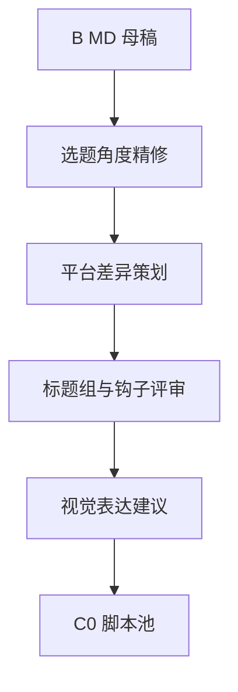

# 03_智能路由与工作流编排设计

## 1. 设计目标

Miracle 需要同时支持两种体验：

1. 用户只说目标，系统自动推荐合适工作流、Agent、组件库和 provider。
2. 高级用户手动编辑工作流节点、子工作流、组件和平台。

因此路由系统分为四层：

```text
Intent Router -> Workflow Router -> Component Router -> Provider Router
```

## 2. 四层智能路由

### 2.1 Intent Router

判断用户要做什么类型的任务。

| 意图 | 示例 |
|---|---|
| `content_news` | 做一期 AI 工具更新精讲 |
| `image_generation` | 生成产品封面、插图、角色图 |
| `video_generation` | 生成短视频、横版视频、广告片 |
| `script_drama` | 写剧本、分场、角色对白 |
| `comic_drama` | 全流程 AI 漫剧生成 |
| `research` | 深度调研、竞品分析、技术报告 |
| `coding` | 开发、修 bug、重构、测试 |
| `operations` | 分发、复盘、监控、日报 |

输出：

```yaml
intent: content_news
confidence: 0.91
recommended_workflow_categories:
  - content_production
  - media_packaging
```

### 2.2 Workflow Router

选择工作流模板。

候选策略：

- 默认推荐工作流。
- 轻量工作流。
- 全流程工作流。
- 用户自定义工作流。
- 历史相似任务工作流。
- 系统建议进化工作流。

示例：

```yaml
selected_workflow: content-production-v0
mode: auto_with_review_gates
reason:
  - 用户目标包含资讯内容生产
  - 当前项目已有稳定 Flow A-G
  - 任务涉及视频与分发，需要完整链路
```

### 2.3 Component Router

为每个节点选择组件库和组件。

示例：

```yaml
node: D_tts_caption
selected_library: tts-caption-library
selected_components:
  - tts-caption-workflow-skill
  - volc-tts-provider
  - subtitle-exporter
  - audio-manifest-validator
```

选择依据：

- 节点能力需求。
- 组件库适配度。
- 是否稳定。
- 是否已通过类似任务验证。
- 是否需要用户授权。
- 是否存在凭证。

### 2.4 Provider Router

选择模型、API 或执行平台。

示例：

```yaml
node: B_md_master
adapter: codex
provider: gpt-5-codex
fallbacks:
  - claude-code-sonnet
  - openai-api-gpt-5
reason:
  - 需要读取本地项目文档
  - 需要生成 Markdown 产物
  - Codex 对当前工作区上下文最强
```

Provider Router 考虑：

- 能力。
- 质量。
- 成本。
- 速度。
- 上下文。
- 工具权限。
- API 可用性。
- 历史成功率。
- 失败时的 fallback。

## 3. 执行模式

### 3.1 Auto 模式

Auto 是 Run 启动后的执行控制策略，不是工作流来源或创建方式。用户先通过“推荐模板、
从模板自定义、AI 生成草案”确定 Workflow，再由 Auto 策略自动推进允许自动执行的节点。

适合：

- 高频标准任务。
- 低风险阶段。
- 已验证稳定模板。

默认约束：

- 高风险节点保留人工审核门。
- 新组合只进入建议或草案。
- 失败 fallback 必须记录原因。
- 不能未经批准覆盖稳定模板。

### 3.2 Manual 模式

Manual 是执行控制策略。用户确认 Workflow 后，手动控制节点、Agent、组件库和 provider
等关键执行决策。

适合：

- 新业务设计。
- 复杂媒体项目。
- 首次跑通新链路。
- 高风险外部发布。

### 3.3 Hybrid 模式

Hybrid 是执行控制策略。系统推进低风险环节，用户确认关键决策。

适合 Miracle 的默认体验：

- 系统自动给出方案。
- 用户确认工作流和关键审核门。
- 执行中自动推进低风险节点。
- 在高价值产物前暂停审核。

## 4. 工作流编排能力

Miracle 工作流必须支持：

| 能力 | 说明 |
|---|---|
| 串行节点 | A -> B -> C。 |
| 并行节点 | 多个 Agent 同时采集、评审或生成候选。 |
| 条件分支 | 根据审核结果、内容类型、是否需要视频决定路径。 |
| 子工作流 | 节点内部展开更细流程。 |
| 人工审核门 | 高价值产物进入下游前暂停。 |
| 自动审核门 | 检查文件、schema、来源、manifest 等结构条件。 |
| fallback | provider、tool 或 agent 失败时降级。 |
| retry | 临时错误重试。 |
| pause/resume | 长任务可暂停恢复。 |
| cancel/timeout | 用户取消、系统超时和强制中止可被准确表达。 |
| skip | 用户明确跳过某阶段。 |
| fork/merge | 生成多个候选分支后合并选择。 |

## 5. 子工作流设计

每个节点可以选择开启子工作流。

示例：Flow B 内容 MD 母稿后新增“内容精细策划子流程”。



子工作流规则：

- 子工作流拥有自己的节点和 trace。
- 子工作流必须声明返回主流程的出口。
- 子工作流产物可以成为主流程节点输入。
- 子工作流失败时不能让主流程状态不明，必须返回 `blocked` 或 `failed`。

## 6. 示例：插入 Pencil 原型节点

目标：在生成 MD 母稿前，用 Pencil MCP 做结构或视觉原型。


节点定义：

```yaml
id: prototype_pencil_before_md
name: MD 前置原型设计
type: creative_planning
capability_requirements:
  - prototype.pencil
  - content.structure_design
inputs:
  - name: clean_events_input
    artifact_spec_id: clean_events
    required: true
    selector:
      run_scope: current
      status: approved
      strategy: latest_approved
outputs:
  - artifact_spec_id: content_structure_prototype
  - artifact_spec_id: visual_layout_snapshot
allowed_libraries:
  - pencil-prototype-library
downstream:
  - B_md_master
```

## 7. NodeRun、NodeAttempt 与输入解析

```text
not_started
-> queued
-> running
-> done
```

异常路径：

```text
running -> paused -> queued
running -> blocked -> queued
running -> failed -> queued
queued / running / paused -> cancelled
running -> reconciling -> done / failed
running -> skipped
```

状态含义：

| 状态 | 含义 |
|---|---|
| `not_started` | 尚未进入队列。 |
| `queued` | 已满足前置条件，等待执行。 |
| `running` | 正在执行。 |
| `paused` | 用户或系统主动暂停，可 resume 到新一轮 queued/running。 |
| `blocked` | 缺凭证、缺输入或外部条件不足。 |
| `reconciling` | 外部副作用结果不明确，正在核对。 |
| `failed` | 执行失败，需要修复。 |
| `cancelled` | 用户或系统取消 NodeRun。 |
| `skipped` | 本轮跳过。 |
| `done` | 节点执行动作完成，不代表产物已审核。 |

审核和产物状态必须与 NodeRun 分开：

| 对象 | 状态或决策 |
|---|---|
| NodeRun | `not_started / queued / running / paused / blocked / reconciling / cancelled / failed / skipped / done` |
| NodeAttempt | `succeeded / failed / timed_out / cancelled / aborted / unknown` |
| GateInstance | `pending_review / decided / invalidated` |
| GateDecision | `approved / auto-approved / rejected / blocked / skipped` |
| ArtifactManifest | `draft / pending_review / approved / rejected / archived / external_only` |

节点生成待审核产物后的正确表达：

```yaml
node_run:
  status: done
artifact_manifest:
  status: pending_review
gate_instance:
  status: pending_review
gate_decision: null
```

边条件必须声明判断对象：

```yaml
condition:
  gate_spec_id: B_md_master_gate
  decision_in: [approved, auto-approved]
```

运行时该条件必须解析到当前 selected artifact 对应的 GateInstance/GateDecision，
不能复用同一 GateSpec 下其他产物版本的批准结果。

或：

```yaml
condition:
  input_name: approved_md_master
  resolved_artifact_status_in: [approved]
```

NodeSpec 输入通过 selector 声明选择策略：

```yaml
inputs:
  - name: approved_md_master
    artifact_spec_id: md_master
    required: true
    selector:
      source_scope: edges
      run_scope: current
      status: approved
      strategy: latest_approved
```

Orchestrator 创建 NodeAttempt 前必须解析并冻结具体 artifact ID 和 hash。运行期间即使
产生更新版本，当前 Attempt 的输入也不漂移。

selector 默认 `source_scope: edges`，只能选择由入边可达并传递的 ArtifactSpec；
确需跨图查询时必须显式声明 `source_scope: run`，并由 validate 标记为高风险。

重试、fallback、审核返工和重新执行都只新增 NodeAttempt，不新增 NodeRun 或 DAG
节点。但它们不一定属于同一个业务 operation：

| 场景 | operation_id |
|---|---|
| 网络重试、provider fallback | 保持不变 |
| unknown 核对为未执行后的重试 | 保持不变 |
| 审核返工、用户主动重跑 | 创建新 operation |
| resolved input 变化 | 创建新 operation |
| preview 转 real-run | 创建新 operation |

MVP 使用 `node_run_id + business_revision + input_fingerprint + execution_mode`
派生 operation ID，不新增 NodeOperation 持久化对象。NodeAttempt 为 `unknown` 时，
NodeRun 进入 `reconciling`，核对完成前不能直接执行下一次真实副作用。

### 7.1 Required/Optional Edge 与 Join Policy

执行依赖只来自 EdgeSpec，输入选择不能绕过 DAG：

```yaml
join_policy:
  start_when: required_inputs_ready
  optional_inputs:
    wait_policy: wait_if_active
    max_wait: 30m
    on_terminal_without_artifact: continue_without_optional
    on_timeout: require_user_decision
```

规则：

- required input 必须存在传递对应 ArtifactSpec 的 required edge。
- optional input 可以由 optional edge 提供，不得阻塞 required inputs 已满足的节点。
- `no_wait` 表示不等待可选分支；`wait_if_active` 表示分支已启动才等待，但必须同时
  声明最大等待时间、分支终止但没有合格产物时的动作和超时动作。
- 可选分支失败、取消、跳过或产物被拒绝后，不得让下游无限等待；
  `continue_without_optional` 表示按缺少该可选输入继续。
- `wait_until_timeout` 必须声明超时；`manual` 交给用户决定。
- Flow A-G 的 G 节点由 required `B -> G` 边提供 md_master；`F -> G` 为 optional。
  视频分支未启用时不等待；已启动时最多等待 30 分钟，分支无合格产物终止时继续
  纯 MD 分发，超时则要求用户决定。
- required edge 的上游被 skipped 时，必须声明 skip propagation、替代输入或阻塞原因。

## 8. 推荐模板体系

第一批推荐模板：

| 模板 | 用途 |
|---|---|
| `content-production-full` | 资讯内容全流程，包含 MD、脚本、分镜、TTS、视频、分发。 |
| `content-md-only` | 只生成 MD 母稿和发布包。 |
| `content-video-from-md` | 从已审核 MD 继续做视频。 |
| `image-generation-pack` | 生图、封面、配图、角色图。 |
| `video-generation-pack` | 视频脚本、分镜、素材、生成、审看。 |
| `drama-script-pack` | 剧本、角色、对白、分场。 |
| `comic-drama-full` | 漫剧从剧本到图像、配音、视频。 |
| `research-report-pack` | 深度研究和报告生成。 |

## 9. 路由解释

Auto 模式必须给出可解释结果：

```yaml
recommendation:
  workflow: content-production-full
  reason:
    - 任务要求资讯内容生产
    - 需要视频和分发
    - 现有 Flow A-G 已验证
  review_gates:
    - B_md_master
    - C_storyboard
    - D_tts_caption
    - F_final_render
  fallback:
    - TTS provider 不可用时进入 blocked，不伪造完成
```

用户应该能看到系统为什么这么搭配，而不是只看到一个不可解释的“自动执行”。
