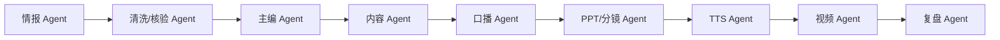
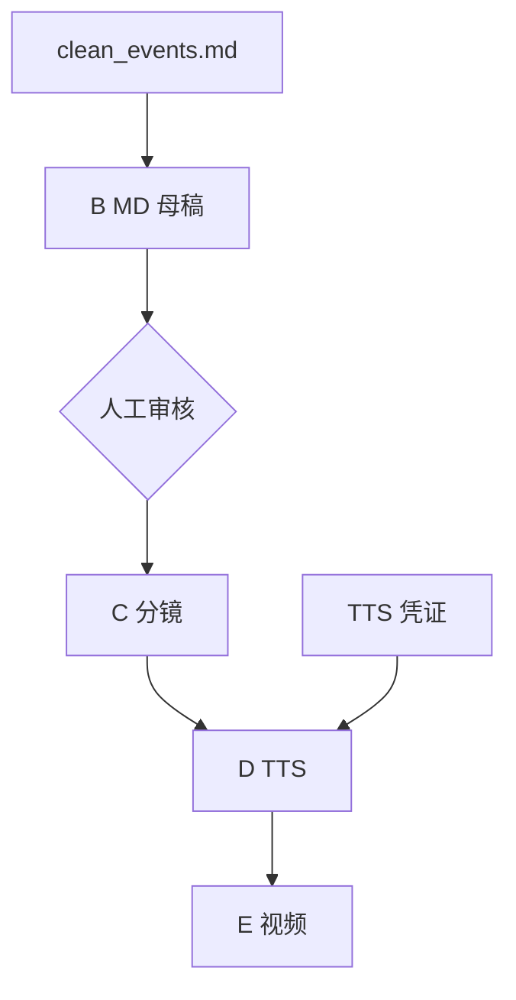

# 04_多Agent协同与可视化设计

## 1. 设计目标

Miracle 必须让用户清晰看到多 Agent 如何协同，而不是只看到一个长任务在后台黑箱运行。

用户需要回答四个问题：

1. 谁在做？
2. 做到哪里了？
3. 卡在哪里？
4. 产出了什么？

## 2. Agent 可视化基础字段

每个 Agent 在 UI 中至少展示：

| 字段 | 说明 |
|---|---|
| Agent 名称 | 情报 Agent、内容 Agent、TTS Agent 等。 |
| 职责 | 当前 Agent 的长期职责。 |
| 所属工作流 | 当前参与哪个 Workflow 和 Run。 |
| 当前节点 | 正在处理哪个 Node。 |
| 状态 | idle、queued、running、waiting、blocked、reviewing、done、failed。 |
| 装备组件库 | 当前可用 skill/tool/component library。 |
| Runtime Adapter | Codex、Hermes、OpenClaw、Claude Code、API。 |
| Provider | 模型或外部服务。 |
| 上游依赖 | 等待哪些节点或产物。 |
| 下游交接 | 产物交给哪个 Agent 或节点。 |
| 本轮输入 | 文件、来源、任务变量。 |
| 本轮输出 | 产物、摘要、manifest。 |
| 工具调用摘要 | 工具名称、状态、耗时、错误。 |
| 成本耗时 | token、API 成本、运行时长。 |
| 健康状态 | healthy、slow、stalled、blocked、failed。 |
| 权限摘要 | 可读、可写、可调用工具、可通信对象。 |

## 3. Agent 状态

```text
idle / queued / running / waiting / blocked / reviewing / done / failed
```

| 状态 | UI 表现 | 用户动作 |
|---|---|---|
| `idle` | 灰色空闲 | 可分配任务 |
| `queued` | 排队中 | 可调整优先级 |
| `running` | 高亮执行中 | 可查看实时事件 |
| `waiting` | 等待中 | 查看等待对象 |
| `blocked` | 红色阻塞 | 处理凭证、输入或错误 |
| `reviewing` | 等待审核 | 批准、驳回或评论 |
| `done` | 完成 | 查看产物 |
| `failed` | 失败 | 重试、替换组件、进入修复 |

命名边界：

- `reviewing` 是 Agent 状态，表示 Agent 或用户正在执行审核动作。
- `pending_review` 是节点、产物或审核门状态，表示产物等待审核。
- 两者在 UI 上可以同屏显示，但底层事件要区分。

### 3.1 合法状态流转

```text
idle -> queued -> running -> done
running -> waiting -> running
running -> reviewing -> done
running -> blocked -> queued
running -> failed -> queued
reviewing -> queued
```

非法流转必须拒绝并记录审计事件：

- `pending_review` 不能直接进入下游。
- `blocked` 不能直接标记 `done`。
- `failed` 不能绕过修复进入 `approved`。
- 审核驳回时，`rejected` 写入 Gate / Artifact / NodeRun；被分配返工的 Agent 进入 `queued`。

## 4. 四个核心视图

### 4.1 Agent Map

用途：看所有 Agent 的职责分布和协作关系。



展示内容：

- Agent 角色卡。
- 当前状态颜色。
- 当前节点。
- 装备组件库。
- 与其他 Agent 的交接边。
- 是否有等待或阻塞。

### 4.2 Execution Timeline

用途：看任务从启动到完成的时间线。

示例：

```text
22:00 启动任务
22:03 情报 Agent 开始采集
22:16 清洗 Agent 生成 Clean Event
22:30 内容 Agent 生成 MD 母稿待审核
22:35 用户批准 MD 母稿
22:40 TTS Agent 阻塞：缺少凭证
```

展示内容：

- 节点开始/结束。
- 工具调用。
- 错误。
- fallback。
- 审核。
- 产物生成。

### 4.3 Dependency Graph

用途：看哪个 Agent 等哪个节点、哪个产物、哪个审核门。



展示内容：

- 数据依赖。
- 审核依赖。
- 凭证依赖。
- 外部服务依赖。
- blocked 原因。

### 4.4 Artifact Board

用途：看产物从 raw item 到 MD、PPT、TTS、视频、发布包的流转。

列建议：

```text
事实底稿 -> 内容资产 -> 视觉资产 -> 音频字幕 -> 视频资产 -> 分发资产 -> 复盘资产
```

卡片字段：

- 产物名称。
- 类型。
- 所属节点。
- 状态。
- 文件路径或外部链接。
- 下游消费者。
- 审核状态。

## 5. Agent 协同模式

### 5.1 串行交接

上游 Agent 完成后，把 approved 产物交给下游。

示例：

```text
情报 Agent -> 清洗 Agent -> 内容 Agent -> PPT Agent
```

### 5.2 并行协作

多个 Agent 同时完成不同分支。

示例：

```text
脚本 Agent A：长视频脚本
脚本 Agent B：短视频脚本
脚本 Agent C：图文轮播脚本
脚本评审 Agent：汇总评分
```

### 5.3 对抗评审

生成 Agent 与评审 Agent 分离。

示例：

```text
内容 Agent 生成母稿
核验 Agent 检查事实风险
主编 Agent 检查内容爆点
审核 Agent 汇总是否放行
```

### 5.4 Lead Agent 编排

总控 Agent 负责拆任务、分配 Agent、汇总状态和处理异常。

适合：

- 长任务。
- 多分支任务。
- 需要多个平台协同。

## 6. Agent 装备组件库

Agent 卡片必须展示装备情况。

| Agent | 默认装备 |
|---|---|
| 总控 Agent | 工作流编排组件库、trace 组件库 |
| 情报 Agent | 官方源采集组件库 |
| 清洗/核验 Agent | 事实清洗核验组件库 |
| 主编 Agent | 爆点选题组件库 |
| 内容 Agent | 内容母稿与平台分发组件库 |
| 原型 Agent | Pencil 原型组件库 |
| PPT/分镜 Agent | 视觉策划组件库 |
| TTS Agent | TTS 字幕组件库 |
| 视频 Agent | HyperFrames 视频组件库 |
| 复盘 Agent | 审计复盘组件库 |

### 6.1 组件装备面板

组件装备面板需要展示：

- 当前装备组件库。
- 组件库包含的 skill、tool、MCP、prompt、provider。
- 组件库状态：draft、experimental、stable、deprecated、blocked。
- 最近成功率和失败原因。
- 权限风险和凭证需求。
- 是否允许自动进入下游。

装备变更必须写入审计事件，不能静默改变 Agent 能力边界。

## 7. 多平台 Agent 展示

同一个 Agent 角色可以由不同 runtime 执行。

UI 应区分：

```text
Agent Role: 内容 Agent
Runtime: Codex
Provider: GPT-5 Codex
Session: local workspace
```

或：

```text
Agent Role: 情报 Agent
Runtime: Official API
Provider: OpenAI Responses API + web search
Session: server job
```

这样用户能知道“职责是谁”和“实际由哪个平台执行”。

### 7.1 模型热切换

模型热切换入口应放在 Agent 详情面板中，但切换前必须检查：

- 新 provider 是否满足当前节点能力需求。
- 当前 Agent 是否有权限使用。
- 凭证是否存在。
- 成本和质量是否明显变化。
- 是否需要重新 dry-run。

切换事件必须记录：

```yaml
event: provider_switched
agent_id: content-agent
node_id: B_md_master
from: gpt-5-codex
to: claude-sonnet
reason: 用户要求提高长文质量
```

## 8. 错误与阻塞可视化

blocked 节点必须展示：

- 阻塞原因。
- 影响下游。
- 可恢复动作。
- 是否可 fallback。
- 是否需要人工输入。

示例：

```yaml
status: blocked
reason: missing_tts_credentials
affected_nodes:
  - E_visual_video
  - F_final_render
actions:
  - 配置 VOLC_TTS_API_KEY
  - 切换到备用 TTS provider
  - 跳过 TTS，仅生成无配音视频审看版
```

### 8.1 审核返工循环

审核门不仅展示 pending 状态，还要展示可执行动作。这里的 `pending_review` 属于审核门/产物状态，不是 AgentHealth 状态：

```text
pending_review -> approved -> downstream_allowed
pending_review -> rejected -> queued
pending_review -> blocked -> waiting
pending_review -> comment -> pending_review
```

驳回必须记录：

- 驳回原因。
- 返回节点。
- 修改建议。
- 是否保留当前草稿。

## 9. Agent Health Dashboard

Agent Health Dashboard 是多 Agent 可视化的默认入口。

推荐布局：

```text
左侧：Agent 健康列表
中间：任务流转链 / Agent Map
右侧：Agent 详情、模型、组件库、权限
下方：事件流、工具调用、审计日志
顶部：运行中、等待、阻塞、待审核、失败数量
```

健康卡展示：

- Agent 名称。
- 当前状态。
- 当前节点。
- runtime adapter。
- provider。
- 装备组件库。
- 最近事件时间。
- 等待对象。
- 可恢复动作。

## 10. 与现有 trace 的关系

Miracle 可以继承现有 `task_trace.json` 和 `task_events.jsonl` 思路。

建议扩展：

- `agent_runs`：记录 Agent 执行。
- `node_runs`：记录节点执行。
- `artifact_events`：记录产物流转。
- `gate_decisions`：记录审核。
- `provider_calls`：记录模型和 API 调用。

这些数据共同驱动 Agent Map、Timeline、Dependency Graph 和 Artifact Board。
