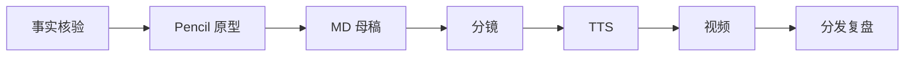

# 05_双模式工作流可视化编排设计

## 1. 设计目标

Miracle 的工作流编排需要两种可切换模式：

1. 无限画布模式：类似 Lovart 的自由创作画布。
2. 流程节点模式：类似传统 DAG/节点编排。

两种模式必须共用同一套底层 `WorkflowSpec`，不能生成两套割裂流程。

```text
Unified Workflow Graph
-> Canvas View
-> Node DAG View
```

## 2. 为什么需要双模式

### 无限画布适合创作

内容、视频、漫剧、视觉策划不是一开始就能严格画成 DAG。它们往往需要先把主题、素材、灵感、角色、分镜、草图、版本分支铺开。

无限画布适合：

- 灵感策划。
- 素材组织。
- 内容项目。
- 视觉资产。
- 分镜。
- 漫剧。
- 复杂多产物任务。

### 流程节点适合执行

一旦进入真实执行，就需要明确依赖、输入输出、状态、审核门和失败恢复。

流程节点适合：

- 严谨流程。
- 自动化任务。
- 审核门。
- 条件分支。
- 任务状态监控。
- 执行复盘。

## 3. 统一底层 Graph

底层 graph 至少包含：

```yaml
workflow_id: content-production-v0
nodes: []
edges: []
canvas_layout: {}
dag_layout: {}
artifacts: []
agents: []
groups: []
```

原则：

- `nodes` 和 `edges` 是真实执行结构。
- `canvas_layout` 只是无限画布的位置、分组和视觉表达。
- `dag_layout` 只是流程节点视图的位置。
- 画布对象可以是非执行对象，但转为节点后必须生成 NodeSpec。

## 4. 无限画布模式

### 4.1 画布对象

| 对象 | 说明 |
|---|---|
| 任务卡 | 一个待完成任务，可转为节点。 |
| Agent 卡 | 一个 Agent 角色或运行实例。 |
| 素材卡 | 图片、视频、音频、网页、PDF、Markdown、数据源。 |
| 产物卡 | MD、PPT、分镜、字幕、视频、发布包。 |
| 节点卡 | 已经进入正式 workflow 的节点。 |
| 灵感卡 | 尚未结构化的想法。 |
| 版本分支 | 多个候选方向或草案。 |
| 区域 | 主题区、事实区、母稿区、视频区、分发区、复盘区。 |

### 4.2 内容生产画布布局建议

```text
左侧：任务目标 / 主题 / 用户约束
上方：事实源 / 参考链接 / 素材
中间：工作流节点 / Agent 协作
右侧：内容产物 / 视频产物 / 分发产物
下方：审核 / 问题 / 复盘 / 进化建议
```

### 4.3 画布到节点

用户可以把画布对象转为正式节点。

示例：

```text
灵感卡：先做 Pencil 原型
-> 转为任务卡：Pencil 原型设计
-> 转为 NodeSpec：prototype.pencil
-> 插入 Flow A 和 Flow B 之间
```

转换时必须补齐：

- 节点名称。
- 输入。
- 输出。
- 能力需求。
- 推荐组件库。
- 执行 Agent。
- 审核策略。

### 4.4 画布交互

第一版原型需要验证：

- 新增卡片。
- 拖拽卡片。
- 卡片分组。
- 卡片转节点。
- 节点插入工作流。
- 查看卡片对应产物。
- 查看 Agent 状态。
- 切换到流程节点模式。

## 5. 流程节点模式

### 5.1 节点展示字段

每个节点卡展示：

- 节点名。
- 状态。
- 执行 Agent。
- Runtime Adapter。
- Provider。
- 输入。
- 输出。
- 组件库。
- 审核策略。
- 错误或阻塞原因。
- 耗时和成本。

### 5.2 节点类型

| 类型 | 说明 |
|---|---|
| `source` | 数据源、任务输入、用户输入。 |
| `transform` | 生成、清洗、改写、转换。 |
| `review_gate` | 人工或自动审核。 |
| `branch` | 条件分支。 |
| `parallel_group` | 并行任务组。 |
| `subworkflow` | 子工作流入口。 |
| `artifact` | 产物节点。 |
| `external_service` | 外部 API 或平台。 |

### 5.3 编排能力

流程节点模式必须支持：

- 拖拽新增节点。
- 连接节点。
- 删除边。
- 插入节点。
- 节点折叠。
- 子工作流展开。
- 并行分支。
- 条件分支。
- 审核门。
- fallback 路径。
- 查看执行状态。

## 6. 双视图同步机制

### 6.1 从画布到 DAG

当用户在无限画布中把任务卡转为节点：

1. 创建 NodeSpec。
2. 用户选择插入位置或由系统推荐插入位置。
3. 更新 WorkflowSpec edges。
4. 在流程节点模式中出现新节点。
5. 在画布中节点卡变为正式 workflow node。

### 6.2 从 DAG 到画布

当用户在流程节点模式新增节点：

1. 创建 NodeSpec。
2. 根据节点类型分配画布区域。
3. 在无限画布中生成节点卡。
4. 如果节点输出产物，预生成产物占位卡。

### 6.3 布局分离

不要把画布位置当成执行依赖。

```yaml
edges:
  - from: A
    to: B
canvas_layout:
  A:
    x: 120
    y: 300
  B:
    x: 680
    y: 120
```

执行依赖只看 `edges`，不看卡片位置。

## 7. 示例：内容生产双视图

### 流程节点视图



### 无限画布视图

```text
[主题区] Codex/Claude Code 更新
[事实区] 官方源、Raw Item、Clean Event
[原型区] Pencil 原型草图、版式结构
[内容区] MD 母稿、标题库、脚本池
[视频区] 分镜、TTS、HyperFrames、成片
[分发区] 发布包、小红书、知乎、公众号
[复盘区] 质检、问题、进化建议
```

## 8. UI 验收标准

第一版原型阶段必须验证：

| 能力 | 验收 |
|---|---|
| 双模式切换 | 同一工作流可在画布和 DAG 中切换。 |
| 节点状态同步 | DAG 状态变化后，画布节点卡同步状态。 |
| Agent 状态同步 | Agent 正在执行哪个节点，在两种模式都可见。 |
| 产物同步 | 节点产出文件后，画布中出现产物卡。 |
| 插入节点 | 在 MD 前插入 Pencil 节点，DAG 和画布同时更新。 |
| 子工作流 | 内容精细策划子流程可折叠/展开。 |
| 错误展示 | blocked/failed 节点在两种模式都有清晰原因。 |

## 9. 实现注意事项

虽然第一版不选技术栈，但后续原型应避免：

- 画布和 DAG 各维护一份不同数据。
- 卡片位置影响执行顺序。
- 只展示漂亮图形，不展示输入输出和状态。
- 只做流程编辑，不做执行监控。
- 只做 Agent 列表，不展示交接和等待关系。

Miracle 的视觉编排不是装饰层，而是任务执行和系统理解的主入口。

