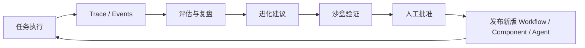

# 06_智能进化体系设计

## 1. 设计目标

Miracle 不只是执行工作流，还要从每次执行中学习：

- 哪些节点经常失败。
- 哪些 Agent 经常返工。
- 哪些 provider 成本高但质量不稳定。
- 哪些 prompt 需要改写。
- 哪些组件库值得固化。
- 哪些用户偏好应该成为默认设置。

但进化必须可控。系统可以建议，不应未经批准修改稳定工作流。

## 2. 进化闭环



## 3. 采集数据

每次运行应采集：

| 数据 | 用途 |
|---|---|
| 节点成功率 | 发现脆弱节点。 |
| 节点耗时 | 找出瓶颈。 |
| provider 成本 | 做成本路由。 |
| provider 失败率 | 做 fallback。 |
| 审核驳回原因 | 改 prompt、规则或组件。 |
| 用户手动修改 | 学习偏好。 |
| 产物质量评分 | 优化模板和 Agent。 |
| 工具错误 | 改 runner 或权限。 |
| 返工次数 | 判断流程是否过粗。 |
| 跳过节点 | 判断默认模板是否太重。 |

## 4. 进化建议类型

### 4.1 工作流级建议

示例：

- 在 MD 母稿前增加 Pencil 原型节点。
- 把 TTS 从视频阶段拆成独立审核阶段。
- 把内容精细策划拆成子工作流。
- 给视频生成增加低成本审看版节点。

### 4.2 节点级建议

示例：

- 给 TTS 节点增加凭证预检。
- 给事实核验节点增加来源冲突检查。
- 给分镜节点增加字幕安全区检查。
- 给最终渲染节点增加 ffprobe 自动校验。

### 4.3 组件库级建议

示例：

- 把连续复用 3 次以上的 prompt 固化为 skill。
- 把某组 tool + validator 打包成组件库。
- 给组件库增加新的 fallback provider。

### 4.4 Agent 级建议

示例：

- 内容 Agent 装备新的标题评审组件。
- 视频 Agent 默认增加渲染前 inspect。
- 复盘 Agent 增加发布数据回收字段。

### 4.5 Provider 级建议

示例：

- 某模型在长文质量上更稳定，推荐用于 MD 母稿。
- 某 TTS provider 在中文术语上错误率高，不再作为默认。
- 某视频 API 成本高，只用于高质量模式。

## 5. 沙盒验证

进化建议不能直接进入 stable。

验证流程：

1. 标记为 `suggested`。
2. 生成实验版 WorkflowSpec 或 ComponentLibrary。
3. 用历史任务或小样任务回放。
4. 对比质量、成本、耗时、失败率。
5. 生成验证报告。
6. 用户批准后发布。

状态：

```text
suggested -> experimental -> validated -> approved -> stable
```

失败路径：

```text
experimental -> rejected
validated -> rejected
```

## 6. 记忆体系

Miracle 需要三类记忆。

### 6.1 用户偏好记忆

记录：

- 更偏好质量还是速度。
- 是否喜欢人工审核。
- 常用平台。
- 内容风格。
- 标题偏好。
- 可接受成本。

### 6.2 项目记忆

记录：

- 当前项目工作流。
- 已验证组件库。
- 常见失败。
- 凭证要求。
- 产物目录约定。
- 历史决策。

### 6.3 系统经验记忆

记录：

- 通用 workflow pattern。
- 跨项目可复用组件。
- provider 质量表现。
- 常见错误恢复动作。

## 7. 个性化推荐

Auto 模式应结合用户偏好和项目历史。

示例：

```yaml
recommendation:
  workflow: content-production-full-with-prototype
  reason:
    - 用户偏好更好的设计质量
    - 最近视频任务中分镜返工较多
    - Pencil 原型节点可以提前暴露视觉结构问题
```

推荐必须可解释，并允许用户选择：

- 接受本次。
- 设为默认。
- 本次跳过。
- 永久不再推荐。

## 8. 进化权限

| 动作 | 是否允许自动 |
|---|---|
| 生成进化建议 | 允许 |
| 生成实验模板 | 允许 |
| 沙盒回放 | 允许 |
| 修改 stable 工作流 | 不允许 |
| 修改 stable 组件库 | 不允许 |
| 修改 Agent 权限 | 不允许 |
| 启用付费 provider | 需要批准 |
| 删除旧版本 | 需要批准 |

## 9. 版本管理

所有工作流、组件库、Agent 和 prompt 都要版本化。

```yaml
entity: workflow
id: content-production-v0
old_version: 0.1.0
new_version: 0.2.0
change_type: minor
reason: 增加 Pencil 原型节点作为可选前置流程
approved_by: user
created_at: 2026-06-12T22:00:00+08:00
```

版本升级类型：

| 类型 | 说明 |
|---|---|
| `patch` | 修复错误，不改变流程结构。 |
| `minor` | 增加可选节点或组件，不破坏兼容。 |
| `major` | 改变主流程或输入输出契约。 |

## 10. 进化看板

Miracle 应提供 Evolution Board：

| 列 | 内容 |
|---|---|
| 新建议 | 系统刚生成的建议。 |
| 待验证 | 用户认为值得测试。 |
| 实验中 | 正在沙盒任务里验证。 |
| 待批准 | 验证通过，等待用户决定。 |
| 已发布 | 已进入 stable。 |
| 已拒绝 | 不采纳但保留原因。 |

## 11. 与现有项目复盘的衔接

“热点工具更新”已有复盘、版本迭代、任务审计日志和计划表。Miracle 应把这些沉淀升级为结构化进化输入：

- 复盘报告 -> evolution signals。
- 审计日志 -> trace events。
- 版本迭代记录 -> workflow changelog。
- 计划表 -> roadmap tasks。
- 失败记录 -> improvement candidates。

