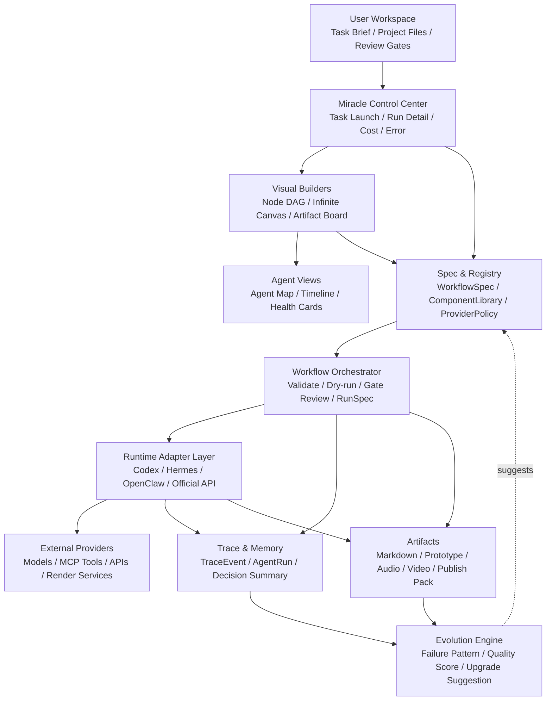
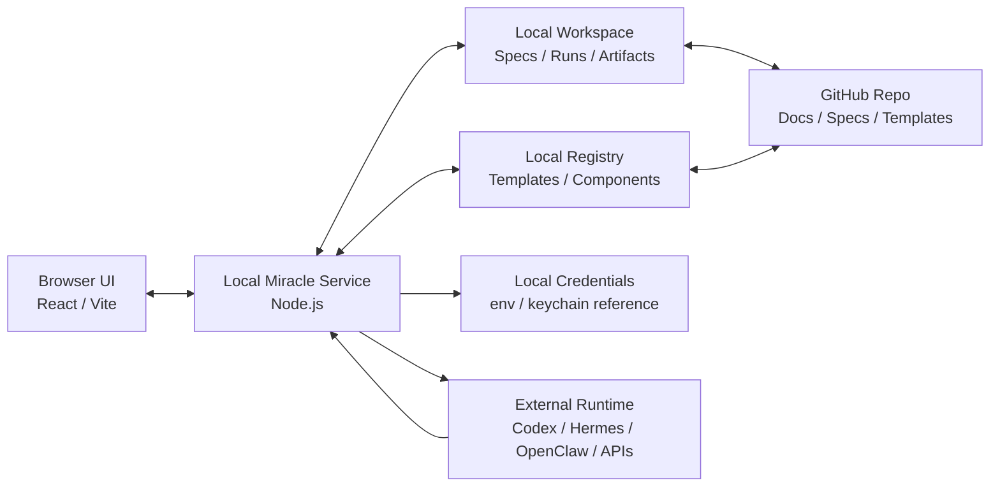
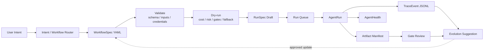
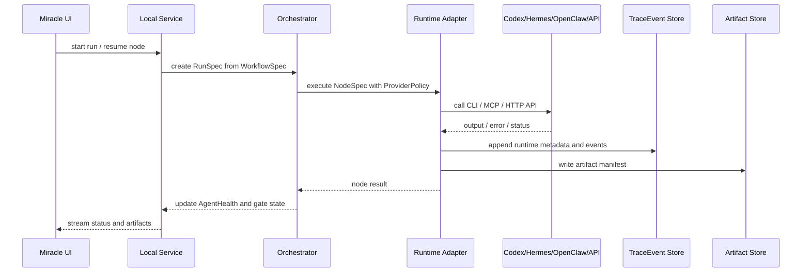
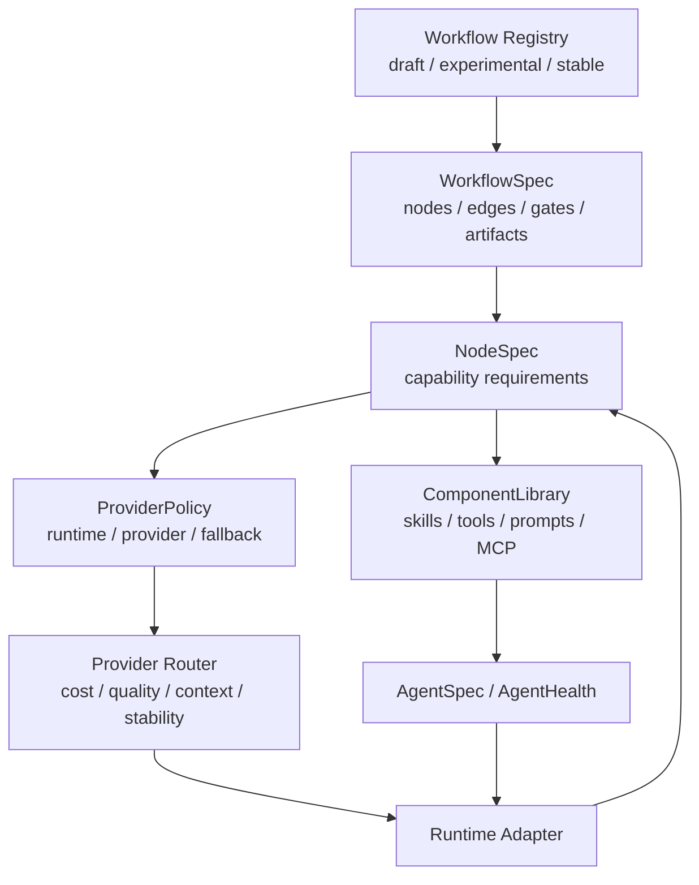
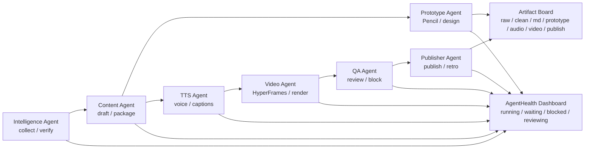
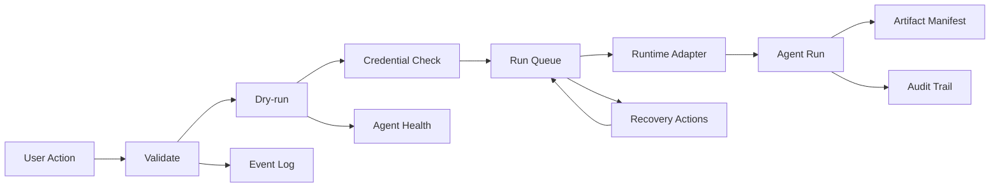

# 14_技术架构选型与系统架构图

## 1. 目标与结论

本文件承接 `P1.5 技术架构选型与系统架构图`，用于把 Miracle 从“Spec 优先的 Agent OS 规划”推进到可进入产品原型和详细技术设计的架构阶段。

核心结论：

- MVP 推荐采用 `本地 Web + 本地服务` 架构。
- Mermaid 图作为可维护、可审阅、可 diff 的架构源。
- PNG 展示图作为评审和沟通用的视觉资产，不替代 Mermaid 和正文中的精确依赖关系。
- 第一版不做账号系统、云同步、多租户和复杂后台调度。
- 第一版优先证明 `WorkflowSpec -> Validate/Dry-run -> Node DAG -> Agent Health -> Artifact Board -> Gate Review -> Evolution` 的闭环。

展示图总览：


## 2. 推荐技术栈

| 层级 | 推荐方案 | 备选方案 | 结论 |
|---|---|---|---|
| 应用形态 | 本地 Web + 本地服务 | 桌面应用、纯静态 Web | 本地 Web + 服务最适合读写项目文件、调用 CLI/MCP/API，并保留未来云化空间。 |
| 前端框架 | React + Vite + TypeScript | Next.js、纯 SPA、桌面壳 | MVP 不需要 SSR，Vite 更轻，适合快速原型和本地控制台。 |
| UI 状态 | Zustand 或轻量 store | Redux、复杂状态机 | 先服务 DAG、Canvas、RunDetail、AgentHealth 的共享状态，不提前引入重型框架。 |
| 节点 DAG | React Flow / XYFlow | Rete、LiteGraph、自研 | React Flow 生态成熟，适合节点状态、审核门、子工作流折叠和运行态高亮。 |
| 无限画布 | tldraw 优先 | Excalidraw、Konva、Fabric | tldraw 更适合自由画布、卡片和对象编辑；复杂定制不足时再评估 Konva。 |
| 本地服务 | Node.js 本地服务 | Python 服务、纯 CLI | Node 与前端同栈，适合文件读写、adapter 调用、validate/dry-run 和本地 API。 |
| Spec 存储 | YAML/JSON 文件 | 数据库单一存储 | WorkflowSpec、ComponentSpec、Registry 需要可 diff、可 Git 管理。 |
| Run/Event 存储 | JSONL + manifest | SQLite、DuckDB | MVP 用 JSONL 保持可读；Run 数量增长后再引入 SQLite 索引。 |
| Runtime Adapter | CLI adapter + HTTP/API adapter + MCP adapter | 为每个平台写独立执行器 | 统一 adapter contract，差异进入 metadata 和 provider policy。 |
| 凭证策略 | 环境变量 + 本地配置引用 | 明文写入配置、云端密钥库 | MVP 不把密钥写入 Git；缺凭证进入 `blocked` 并给恢复动作。 |
| 架构图源 | Mermaid | 纯图片、手工绘图 | Mermaid 负责精确表达，PNG 负责评审展示。 |

## 3. 总体系统架构

Miracle 的系统分层分为 6 层：

1. 用户工作区：任务输入、项目文件、人工审核。
2. Miracle 控制中心：任务启动、Run 详情、成本、错误、审计。
3. 可视化构建器：Node DAG、Infinite Canvas、Artifact Board。
4. Spec 与 Registry：WorkflowSpec、ComponentLibrary、ProviderPolicy、布局。
5. Orchestrator 与 Runtime Adapter：validate、dry-run、run queue、adapter 调用。
6. Trace、Artifact 与 Evolution：事件、产物、状态、复盘和进化建议。



展示图：


## 4. 本地优先部署形态

MVP 推荐的部署形态：

- 用户通过 Browser UI 访问本地 Miracle 控制台。
- 本地 Node Service 负责文件读写、adapter 调用、validate/dry-run、trace 写入。
- 工作流、组件库和 registry 以 YAML/JSON 存在项目目录或本地 registry。
- run 事件以 JSONL 记录，产物以文件路径、manifest 或外部链接追踪。
- GitHub 仓库用于文档、spec、模板和可版本化配置，不存大媒体、不存密钥。



架构边界：

| 边界 | 规则 |
|---|---|
| UI 到 Service | UI 不直接调用外部模型或写文件，统一走本地服务。 |
| Service 到 Workspace | 只读写 Miracle 管理的 spec、run、trace、artifact manifest。 |
| Workspace 到 Git | 只提交文档、spec、schema、模板、小型配置。 |
| 大媒体文件 | 只记录路径、manifest、hash 或外部链接。 |
| 凭证 | 只记录引用，不写入 Git。 |

## 5. WorkflowSpec 到 RunTrace 数据流

`WorkflowSpec` 是唯一真相。UI 操作、YAML 修改、Registry 模板拉取最终都必须落成 spec diff；执行依赖只看 `edges`，不看画布坐标。



展示图：


## 6. Runtime Adapter 调用链路

Runtime Adapter 的目标不是把所有平台能力抹平，而是统一 5 件事：

1. 统一启动入口。
2. 统一输入输出契约。
3. 统一事件记录。
4. 统一错误和 blocked 原因。
5. 统一 provider、成本、fallback、runtime metadata。



适配器最小契约：

| 字段 | 说明 |
|---|---|
| `adapter_id` | 如 `codex`、`hermes`、`openclaw`、`official_api`。 |
| `provider` | 模型或平台能力来源。 |
| `input_artifacts` | 节点输入产物。 |
| `output_artifacts` | 节点输出产物。 |
| `events` | 标准 TraceEvent。 |
| `status` | `running / waiting / blocked / done / failed` 等。 |
| `failure_reason` | 失败、阻塞、降级原因。 |
| `recovery_actions` | 重试、补凭证、改 provider、人工输入等恢复动作。 |

## 7. Registry、ComponentLibrary 与 ProviderRouter

Registry 负责“有哪些模板和组件可以用”，ComponentLibrary 负责“一个节点可装备哪些能力”，ProviderRouter 负责“本次执行用哪个 runtime 和 provider”。



关系规则：

- 节点不直接绑定单一模型，节点声明能力需求和推荐组件库。
- 组件库可以组合 skill、tool、prompt、MCP、provider hint 和 runtime hint。
- ProviderRouter 根据能力、成本、质量、稳定性、上下文和历史表现选择 provider。
- 对 stable 模板的自动进化只生成建议，不自动覆盖。

## 8. 多 Agent 协同与运行态可视化

Agent 协同视图必须回答 4 个问题：

1. 谁在执行。
2. 谁在等待。
3. 谁被阻塞。
4. 谁产出了什么。



展示图：


## 9. 产品能力架构视角

`14` 不替代后续 `15_产品信息架构与设计图规划.md`，但可以先给出产品能力级架构，帮助技术选型理解界面压力。

产品能力分为 4 个主域：

- Control Center：任务启动、Run 列表、Run 详情、审计。
- Workflow Builder：Spec 编辑、Node DAG、Infinite Canvas、子工作流。
- Agent Collaboration：Agent Map、Health Dashboard、Dependency Graph、Timeline。
- Assets & Review：Artifact Board、Gate Review、Recovery Actions、Publishing Pack。

展示图：


## 10. 运维与运行态架构

Miracle 第一版虽是本地优先系统，但仍然需要“可观测、可恢复、可审计”的运行态设计。



展示图：


状态处理规则：

| 状态 | 含义 | 用户可见信息 |
|---|---|---|
| `idle` | Agent 空闲 | 可接收任务。 |
| `queued` | 等待执行 | 前置节点、队列位置。 |
| `running` | 执行中 | 当前节点、adapter、provider、耗时。 |
| `waiting` | 等待外部输入 | 等待对象、预计恢复动作。 |
| `blocked` | 缺凭证、缺输入或被策略阻止 | blocked reason、恢复动作。 |
| `reviewing` | 等待审核 | 审核门、审核产物、可选决策。 |
| `done` | 节点完成 | 输出产物、下游节点。 |
| `failed` | 执行失败 | 错误、重试/fallback 建议。 |

## 11. 文件、数据库与 Git 边界

| 数据类型 | MVP 存储 | 是否进入 Git | 说明 |
|---|---|---|---|
| `WorkflowSpec` | YAML | 是 | 工作流模板必须可 diff、可回滚。 |
| `ComponentSpec` | YAML/JSON | 是 | 组件库配置可版本化。 |
| `AgentSpec` | YAML/JSON | 是 | Agent 职责、可装备组件、权限边界可审阅。 |
| `ProviderPolicy` | YAML/JSON | 是 | 不包含密钥，只包含 provider 策略。 |
| `RunSpec` | JSON | 可选 | 草案可入 Git，真实 run 可仅本地。 |
| `TraceEvent` | JSONL | 默认不进 Git | 历史 run 量大，必要时只提交脱敏样本。 |
| `ArtifactManifest` | JSON | 可选 | 记录路径、hash、状态和来源节点。 |
| 大媒体产物 | 文件路径/外部链接 | 否 | 不把音频、视频等大文件直接纳入 Git。 |
| 凭证 | env/keychain/本地私有配置 | 否 | Git 中只允许保存引用名和缺失检查规则。 |

SQLite 引入时机：

- 当 run 数量增加，JSONL 查询变慢时，引入 SQLite 作为索引层。
- SQLite 不替代 YAML/JSON spec；spec 仍是可版本化源。
- SQLite 可由 JSONL 和 manifest 重建，避免单点不可迁移。

## 12. MVP 架构边界

MVP 必做：

- 读写 `WorkflowSpec YAML v0`。
- 导入“热点工具更新”Flow A-G。
- Validate/Dry-run 输出缺失凭证、审核门、成本和风险。
- Node DAG 展示节点、状态、Agent、输入输出、审核门和错误。
- AgentHealth Dashboard 展示运行、等待、阻塞和恢复动作。
- Artifact Board 展示产物流转。
- Gate Review 支持 approve、reject、comment、block。
- Infinite Canvas 做轻量原型，验证空间组织和节点转换。

MVP 暂不做：

- 不做账号系统。
- 不做云同步。
- 不做多租户。
- 不做完整后台调度平台。
- 不做所有 adapter 的真实执行打通。
- 不做自动覆盖 stable workflow 的进化发布。
- 不做大媒体资产入库。

## 13. 风险与备选方案

| 风险 | 影响 | 对策 |
|---|---|---|
| 过早做桌面应用 | 打包、权限、跨平台复杂度上升 | MVP 先本地 Web + 服务，桌面壳留到产品化阶段。 |
| 纯静态 Web 不够用 | 无法稳定读写本地文件和调用 adapter | 本地服务统一处理文件、CLI、MCP、API。 |
| JSONL 查询能力不足 | 历史 run 多后查看慢 | MVP 后引入 SQLite 索引，不替代 spec 文件。 |
| tldraw 定制不足 | 无限画布对象和执行节点映射受限 | 先验证体验，复杂阶段再评估 Konva/Fabric。 |
| Adapter 差异过大 | 多平台接入成本膨胀 | 统一事件协议，平台差异进入 adapter metadata。 |
| 生成图不精确 | 位图容易过度概括 | Mermaid 和正文作为事实源，PNG 只作评审展示。 |
| Auto 模式不可控 | 错误流程可能影响稳定模板 | Auto 只生成建议，高风险变更必须人工批准。 |

## 14. 下一步

`14` 完成后，建议进入：

```text
15_产品信息架构与设计图规划.md
```

`15` 需要把本文确定的技术边界转成产品侧信息架构、页面地图、核心交互流、低保真线框和高保真原型计划。

