# 14_技术架构选型与系统架构图

## 1. 目标与结论

本文件承接 `P1.5 技术架构选型与系统架构图`，用于把 Miracle 从“Spec 优先的 Agent OS 规划”推进到可进入产品原型和详细技术设计的架构阶段。

核心结论：

- MVP 推荐采用 `本地 Web + 本地服务` 架构。
- Mermaid 图作为可维护、可审阅、可 diff 的架构源。
- PNG 展示图作为评审和沟通用的视觉资产，不替代 Mermaid 和正文中的精确依赖关系。
- `WorkflowSpec` 是模板与编排真相，不是运行事实真相。
- RunSpec 创建时冻结 `WorkflowSnapshot / resolved components / resolved ProviderPolicy`。
- 运行事实由 `RunSpec / NodeRun / NodeAttempt / TraceEvent / ArtifactManifest /
  GateInstance / GateDecision / CredentialCheckResult` 共同承载。
- 第一版不做账号系统、云同步、多租户和复杂后台调度。
- 第一版优先证明 `WorkflowSpec -> Validate/Dry-run -> RunSpec Snapshot -> NodeRun/Attempt ->
  Agent Health -> Artifact Board -> Gate Review -> Evolution` 的闭环。
- 根据 `15_架构方案评审意见.md`，本轮先修高返工成本边界，再继续产品信息架构和原型规划。

展示图总览：

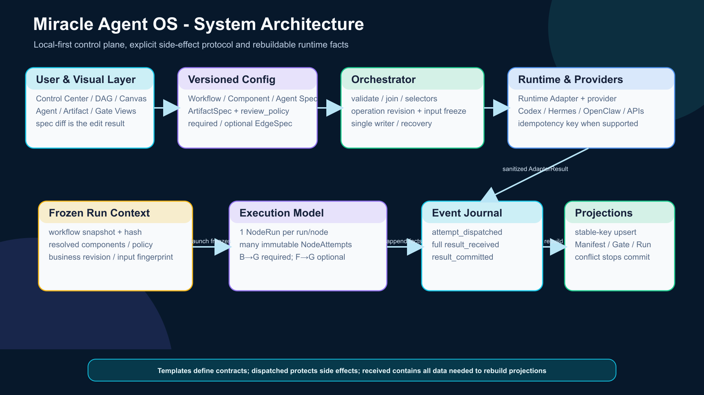

## 2. 推荐技术栈

| 层级 | 推荐方案 | 备选方案 | 结论 |
|---|---|---|---|
| 应用形态 | 本地 Web + 本地服务 | 桌面应用、纯静态 Web | 本地 Web + 服务最适合读写项目文件、调用 CLI/MCP/API，并保留未来云化空间。 |
| 前端框架 | React + Vite + TypeScript | Next.js、纯 SPA、桌面壳 | MVP 不需要 SSR，Vite 更轻，适合快速原型和本地控制台。 |
| UI 状态 | Zustand 或轻量 store | Redux、复杂状态机 | 先服务 DAG、Canvas、RunDetail、AgentHealth 的共享状态，不提前引入重型框架。 |
| 节点 DAG | React Flow / XYFlow | Rete、LiteGraph、自研 | React Flow 生态成熟，适合节点状态、审核门、子工作流折叠和运行态高亮。 |
| 无限画布 | tldraw 轻量原型 | Excalidraw、Konva、Fabric | MVP 中 Canvas 是空间组织视图，不与 Node DAG 同等级承担严肃执行编辑。 |
| 本地服务 | Node.js 本地服务 | Python 服务、纯 CLI | Node 与前端同栈，适合文件读写、adapter 调用、validate/dry-run 和本地 API。 |
| Spec 存储 | YAML/JSON 文件 | 数据库单一存储 | WorkflowSpec、ComponentSpec、Registry 需要可 diff、可 Git 管理。 |
| Run/Event 存储 | JSONL + manifest | SQLite、DuckDB | MVP 用 JSONL 保持可读；Run 数量增长后再引入 SQLite 索引。 |
| Runtime Adapter | CLI adapter + HTTP/API adapter + MCP adapter | 为每个平台写独立执行器 | 统一 adapter contract，差异进入 metadata 和 provider policy。 |
| 凭证策略 | 环境变量 + 本地配置引用 | 明文写入配置、云端密钥库 | MVP 不把密钥写入 Git；缺凭证进入 `blocked` 并给恢复动作。 |
| 架构图源 | Mermaid | 纯图片、手工绘图 | Mermaid 负责精确表达，PNG 负责评审展示。 |

## 3. 总体系统架构

Miracle 的系统分层分为 6 层：

1. 用户工作区：任务输入、项目文件、人工审核。
2. Miracle 控制中心：任务启动、Run 详情、成本、错误、审计。
3. 可视化构建器：Node DAG、Infinite Canvas、Artifact Board。
4. Spec 与 Registry：WorkflowSpec、ComponentLibrary、ProviderPolicy、布局。
5. Orchestrator 与 Runtime Adapter：validate、dry-run、run queue、adapter 调用。
6. Trace、Artifact 与 Evolution：事件、产物、状态、复盘和进化建议。

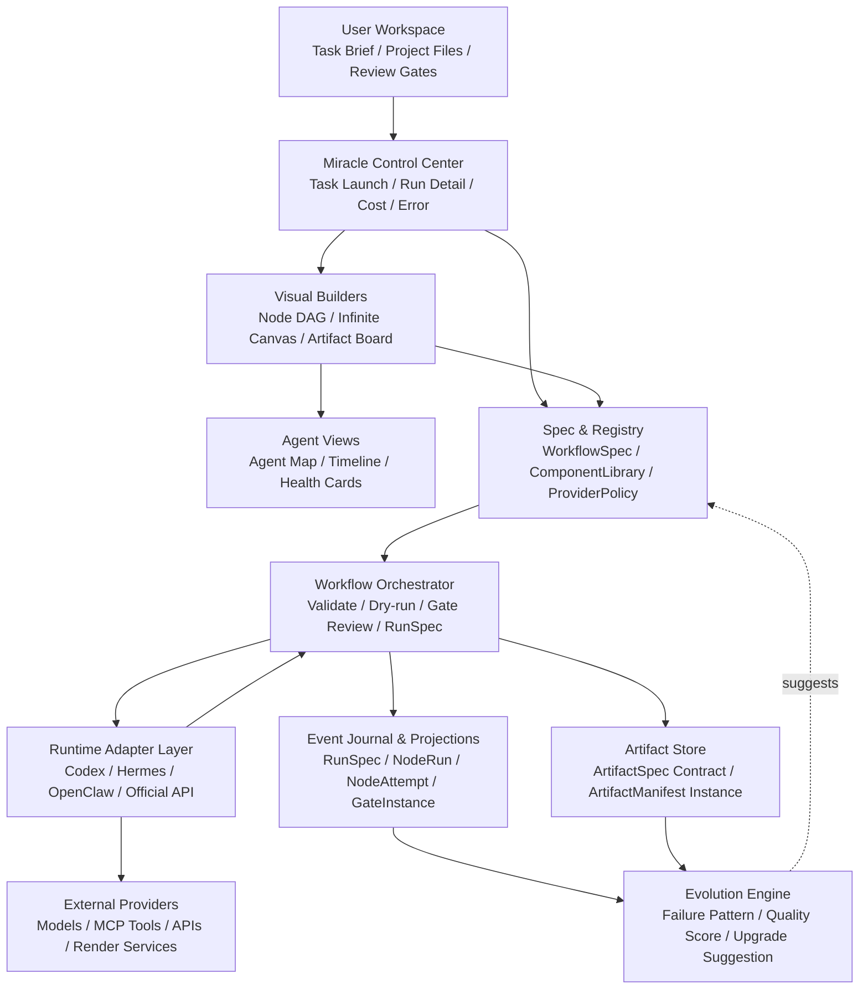

展示图：


## 4. 本地优先部署形态

MVP 推荐的部署形态：

- 用户通过 Browser UI 访问本地 Miracle 控制台。
- 本地 Node Service 负责文件读写、adapter 调用、validate/dry-run、trace 写入。
- 工作流、组件库和 registry 以 YAML/JSON 存在项目目录或本地 registry。
- run 事件以 JSONL 记录，产物以文件路径、manifest 或外部链接追踪。
- GitHub 仓库用于文档、spec、模板和可版本化配置，不存大媒体、不存密钥。

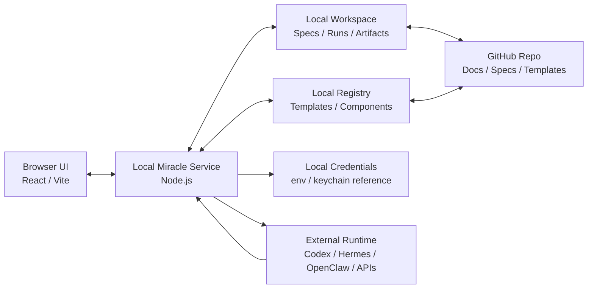

架构边界：

| 边界 | 规则 |
|---|---|
| UI 到 Service | UI 不直接调用外部模型或写文件，统一走本地服务。 |
| Service 监听地址 | MVP 默认只绑定 `127.0.0.1`，不暴露公网入口。 |
| UI 请求校验 | 所有 API 使用不可猜测 session token；浏览器写操作同时校验 Origin/CSRF，CORS 禁止通配符。 |
| Service 到 Workspace | 使用受控 workspace handle；路径规范化后校验 allowlist，并防止符号链接逃逸。 |
| Adapter 调用 | CLI、MCP、HTTP/API 调用必须经过 provider policy 和 tool allowlist。 |
| Workspace 到 Git | 只提交文档、spec、schema、模板、小型配置。 |
| 大媒体文件 | 只记录路径、manifest、hash 或外部链接。 |
| 危险操作 | 删除、覆盖、发布、真实付费调用使用短时确认票据，并写入 AuditEvent。 |
| 凭证 | 只记录引用，不写入 spec、trace 或 Git。 |

补充规则：

- 敏感读取接口也必须校验 token，不能只保护写操作。
- session token 不得进入 URL、日志、TraceEvent 或 Git。
- Local Service 不接受任意绝对路径。

## 5. WorkflowSpec 到 RunTrace 数据流

真相边界必须分层：

```text
WorkflowSpec / ComponentSpec / AgentSpec / ProviderPolicy 是可版本化配置真相。
RunSpec / NodeRun / NodeAttempt / TraceEvent / ArtifactManifest /
GateInstance / GateDecision / CredentialCheckResult 是运行事实真相。
Visual Builder、YAML/JSON、CLI/SDK 都只是编辑器或视图。
```

UI 操作、YAML 修改、Registry 模板拉取最终都必须落成 spec diff；执行依赖只看 `edges`，不看画布坐标。真实 run 的状态、产物路径、审核结果和错误原因不能直接写回 stable `WorkflowSpec`。

```mermaid
flowchart LR
  Intent["User Intent"]
  Router["Intent / Workflow Router"]
  Spec["WorkflowSpec YAML"]
  Validate["Validate<br/>schema / inputs / credentials"]
  DryRun["Dry-run<br/>cost / risk / gates / fallback"]
  RunSpec["RunSpec Snapshot<br/>workflow version / hash / resolved policy"]
  NodeRun["NodeRun"]
  Attempt["NodeAttempt<br/>resolved artifact IDs / hashes"]
  Dispatch["attempt_dispatched"]
  Queue["Run Queue"]
  Adapter["Runtime Adapter"]
  Result["AdapterResult"]
  Persist["Orchestrator Persist"]
  Events["TraceEvent JSONL"]
  Artifacts["Artifact Manifest"]
  Gate["GateInstance / Decision"]
  Health["AgentHealth"]
  Review["Gate Review"]
  Evolution["Evolution Suggestion"]

  Intent --> Router --> Spec --> Validate --> DryRun --> RunSpec --> NodeRun --> Queue --> Attempt --> Dispatch --> Adapter --> Result --> Persist
  Persist --> Events
  Persist --> Artifacts
  Review --> Gate
  Gate --> Persist
  Persist --> Health
  Artifacts --> Review
  Events --> Evolution
  Review --> Evolution
  Evolution -.draft or experimental update.-> Spec
```

展示图：

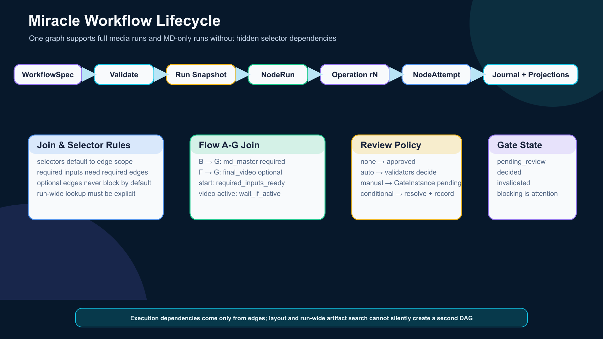

## 6. Runtime Adapter 调用链路

Runtime Adapter 的目标不是把所有平台能力抹平，而是统一 5 件事：

1. 统一启动入口。
2. 统一输入输出契约。
3. 统一事件记录。
4. 统一错误和 blocked 原因。
5. 统一 provider、成本、fallback、runtime metadata。

职责边界：

```text
ProviderRouter 负责选择 runtime adapter、provider、fallback 和执行策略。
Runtime Adapter 负责把 NodeRun 请求翻译成平台调用。
Adapter 返回 `AdapterResult` envelope，包括 operation、attempt、provider receipt、
artifact descriptors、events 和 failure metadata。
Adapter 不直接修改 WorkflowSpec / NodeSpec，也不直接写运行事实存储。
```

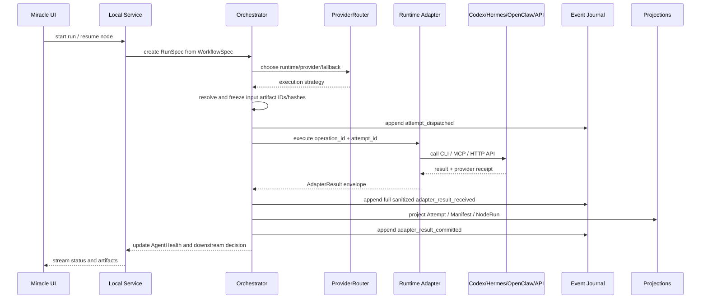

适配器最小契约：

| 字段 | 说明 |
|---|---|
| `adapter_id` | 如 `codex`、`hermes`、`openclaw`、`official_api`。 |
| `provider` | 模型或平台能力来源。 |
| `operation_id` | 稳定业务操作 ID；网络重试/fallback 不变，返工、输入变化或 preview 转 real-run 新建。 |
| `attempt_id` | 每次真实执行尝试的唯一 ID。 |
| `provider_receipt` | 外部平台请求 ID、发布 ID 或事务凭证。 |
| `input_artifacts` | 已解析并冻结的具体 artifact ID 和 hash。 |
| `output_artifacts` | 节点输出产物。 |
| `events` | 标准 TraceEvent。 |
| `status` | Adapter 调用结果，如 `succeeded / failed / unknown`。 |
| `failure_reason` | 失败、阻塞、降级原因。 |
| `recovery_actions` | 重试、补凭证、改 provider、人工输入等恢复动作。 |

## 7. Registry、ComponentLibrary 与 ProviderRouter

Registry 负责“有哪些模板和组件可以用”，ComponentLibrary 负责“一个节点可装备哪些能力”，ProviderRouter 负责“本次执行用哪个 runtime、provider、fallback 和执行策略”。

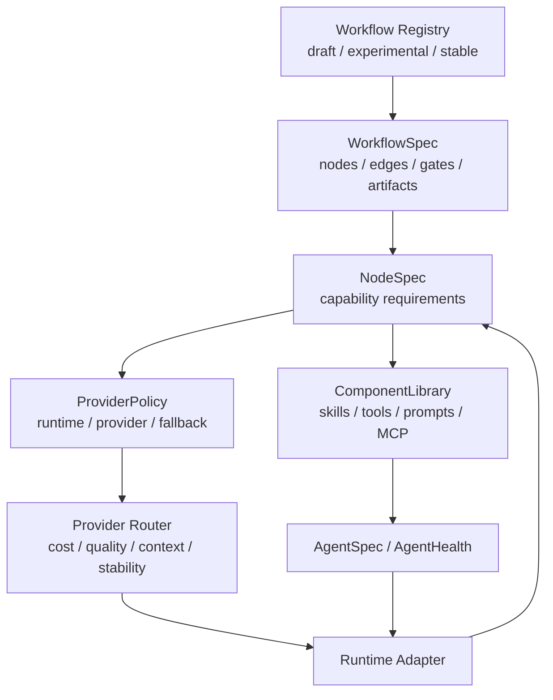

关系规则：

- 节点不直接绑定单一模型，节点声明能力需求和推荐组件库。
- 组件库可以组合 skill、tool、prompt、MCP、provider hint 和 runtime hint。
- ProviderRouter 根据能力、成本、质量、稳定性、上下文和历史表现选择 runtime adapter、provider、fallback 和执行策略。
- Runtime Adapter 只执行 NodeRun 请求并返回 result、events、artifacts 和 failure metadata。
- Runtime Adapter 不直接写 Event Journal 或任何投影。
- Runtime Adapter 不直接修改 `WorkflowSpec`、`NodeSpec` 或 stable 模板。
- 对 stable 模板的自动进化只生成建议，不自动覆盖。

## 8. 多 Agent 协同与运行态可视化

Agent 协同视图必须回答 4 个问题：

1. 谁在执行。
2. 谁在等待。
3. 谁被阻塞。
4. 谁产出了什么。

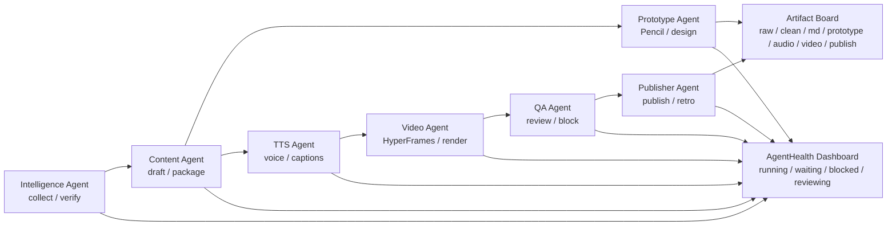

展示图：

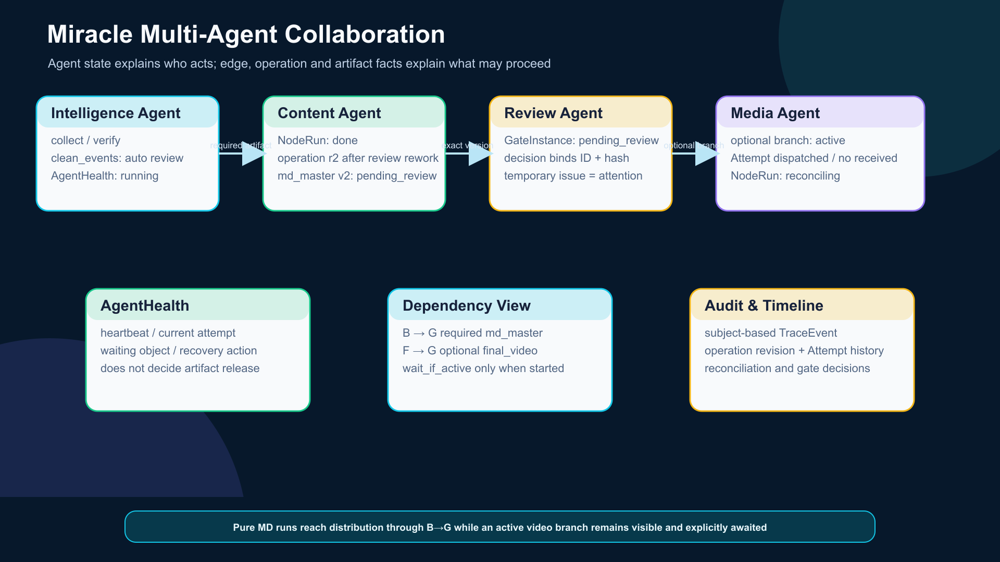

## 9. 产品能力架构视角

`14` 不替代后续 `16_产品信息架构与设计图规划.md`，但可以先给出产品能力级架构，帮助技术选型理解界面压力。

产品能力分为 4 个主域：

- Control Center：任务启动、Run 列表、Run 详情、审计。
- Workflow Builder：Spec 编辑、Node DAG、Infinite Canvas、子工作流。
- Agent Collaboration：Agent Map、Health Dashboard、Dependency Graph、Timeline。
- Assets & Review：Artifact Board、Gate Review、Recovery Actions、Publishing Pack。

展示图：

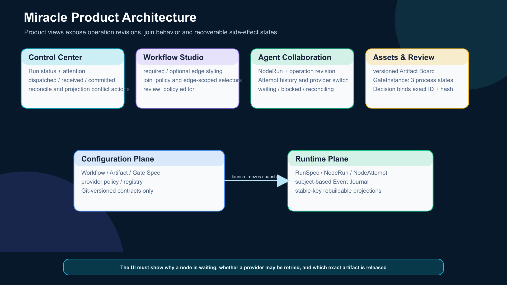

## 10. 运维与运行态架构

Miracle 第一版虽是本地优先系统，但仍然需要“可观测、可恢复、可审计”的运行态设计。

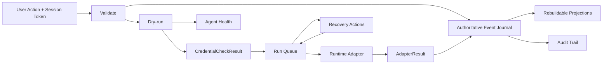

展示图：

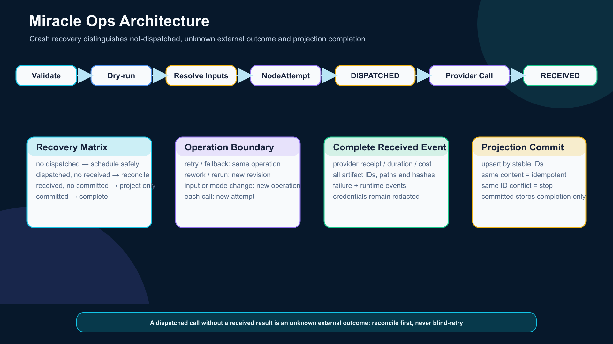

状态分层规则：

| 对象 | 状态范围 | 说明 |
|---|---|---|
| AgentHealth | `idle / queued / running / waiting / blocked / reviewing / done / failed` | 描述 Agent 当前行为与健康。 |
| RunSpec | `created / queued / running / paused / cancelling / cancelled / failed / completed / aborted` + attention flags | 描述整个 run 的主状态和并存关注事项。 |
| NodeRun | `not_started / queued / running / paused / blocked / reconciling / cancelled / failed / skipped / done` | 每个 run/node 的固定聚合实例。 |
| NodeAttempt | `succeeded / failed / timed_out / cancelled / aborted / unknown` | 一次不可变执行尝试。 |
| GateInstance | `pending_review / decided / invalidated` | 某次 run 中绑定具体产物版本的审核过程实例。 |
| GateDecision | `approved / auto-approved / rejected / blocked / skipped` | 针对 GateInstance 的不可变最终决定。 |
| ArtifactManifest | `draft / pending_review / approved / rejected / archived / external_only` | 描述某次运行真实产物的可用性。 |

状态边界：

- `pending_review` 不写入 AgentHealth、NodeRun 或 GateDecision。
- `reviewing` 不作为 GateDecision 的持久状态。
- NodeRun `done` 只代表生成动作完成。
- comment 写入 GateComment 或 AuditEvent，不形成 GateDecision。
- Gate 审核临时受阻写入 attention/blocking reason，不增加 GateInstance.blocked 状态。
- 下游放行验证 GateDecision 绑定的具体 artifact ID/hash 与 ArtifactManifest。
- 非法状态跳转必须拒绝并记录审计事件。

## 11. 文件、数据库与 Git 边界

| 数据类型 | MVP 存储 | 是否进入 Git | 说明 |
|---|---|---|---|
| `WorkflowSpec` | YAML | 是 | 工作流模板必须可 diff、可回滚。 |
| `ComponentSpec` | YAML/JSON | 是 | 组件库配置可版本化。 |
| `AgentSpec` | YAML/JSON | 是 | Agent 职责、可装备组件、权限边界可审阅。 |
| `ProviderPolicy` | YAML/JSON | 是 | 不包含密钥，只包含 provider 策略。 |
| `RunSpec` | JSON | 默认不进 Git | 冻结 workflow version/hash、snapshot 路径、组件版本和 provider policy。 |
| `Event Journal / TraceEvent` | append-only JSONL | 默认不进 Git | 权威运行源；每个 run 单写入器和全局 sequence。 |
| `NodeRun / NodeAttempt` | JSON projection | 否 | 可由 journal 重建；Attempt 终态不覆盖。 |
| `ArtifactManifest` | JSON projection | 可选 | 记录版本路径、hash、attempt 和来源事件。 |
| `GateInstance / GateDecision` | JSON projection | 可选 | 绑定具体 artifact ID/hash；Decision 不可变。 |
| `CredentialCheckResult` | JSON/JSONL | 否 | 当前环境检查结果，不污染 CredentialSpec。 |
| 大媒体产物 | 文件路径/外部链接 | 否 | 不把音频、视频等大文件直接纳入 Git。 |
| 凭证 | env/keychain/本地私有配置 | 否 | Git 中只允许保存引用名和缺失检查规则。 |

SQLite 引入时机：

- 当 run 数量增加，JSONL 查询变慢时，引入 SQLite 作为索引层。
- SQLite 不替代 YAML/JSON spec；spec 仍是可版本化源。
- SQLite 可由 JSONL 和 manifest 重建，避免单点不可迁移。

Event Journal 恢复与幂等规则：

- `TraceEvent` 必须包含 `event_id`、`sequence`、`event_type`、`event_category`、
  `subject`、`actor`、`timestamp` 和 `payload`；run 外事件允许 `run_id` 为空。
- `subject.type` 支持 run、node_run、node_attempt、artifact、gate_instance、
  credential、workflow、registry 和 local_service，不虚构 node ID。
- sequence 由 Orchestrator 单写入器分配，同一 run 内全局递增。
- event_id 用于去重，已存在 event_id 的写入视为幂等成功。
- AuditEvent 是 `event_category: audit` 的受保护 TraceEvent 子类型。
- 每个业务操作必须有稳定 `operation_id`；网络重试/fallback 复用，审核返工、用户
  重跑、输入变化和 preview 转 real-run 创建新 business revision。每次真实执行尝试
  使用唯一 `attempt_id`。
- MVP 由 `node_run_id + business_revision + input_fingerprint + execution_mode`
  派生 operation ID，不新增 NodeOperation 持久化对象。
- NodeAttempt 创建前必须冻结 resolved input artifact IDs 和 hashes。
- 外部副作用必须记录 `provider_receipt`，并在执行前按 operation_id 查重。
- `ArtifactManifest` 必须记录 `artifact_spec_id`、`run_id`、`node_run_id`、
  `attempt_id`、`artifact_version`、`source_event_id`、`hash/path/status`。
- 产物路径包含 artifact version 或 attempt ID，不覆盖历史版本。
- 外部调用前先追加 `attempt_dispatched`；dispatched 未 received 时必须 reconcile，
  禁止直接重试。
- `adapter_result_received` 保存完整脱敏 AdapterResult，包括 artifact descriptor、
  failure、provider/runtime metadata、成本和耗时；投影完成后追加
  `adapter_result_committed`。
- 恢复时对 received 未 committed 的 operation 只补齐投影，不重复调用 provider。
- 投影使用 attempt_id、node_run_id、artifact_id、gate_instance_id、decision_id 和
  reconciliation_id 稳定键 upsert；同键内容冲突进入 projection conflict。
- Run/Node/Gate/Artifact 状态均由 journal 重放重建。
- retry、fallback、resume 必须写入审计事件。
- 外部副作用节点必须区分 `dry-run`、`preview`、`real-run`。
- 外部结果不明确时，NodeAttempt 终止为 `unknown`，NodeRun 进入 `reconciling`；
  核对通过 ReconciliationRecord/TraceEvent 追加，禁止覆盖 Attempt 或直接重试。
- SQLite 后续只做索引层，不替代源事件和 manifest。

## 12. MVP 架构边界

MVP 必做：

- 读写 `WorkflowSpec YAML v0`。
- 导入“热点工具更新”Flow A-G。
- Validate/Dry-run 输出缺失凭证、审核门、成本和风险。
- Node DAG 展示节点、状态、Agent、输入输出、审核门和错误。
- AgentHealth Dashboard 展示运行、等待、阻塞和恢复动作。
- Artifact Board 展示产物流转。
- Gate Review 支持 approve、reject、comment、block。
- Gate Review 创建 GateInstance，并让最终 Decision 绑定 artifact ID 和 hash。
- Infinite Canvas 做轻量原型和空间组织视图，验证任务卡、素材卡、产物卡、节点卡和“任务卡转节点”进入 dry-run。
- Flow A-G 中 B -> G 是 md_master required edge，F -> G 是 final_video optional edge；
  G 以 required_inputs_ready 启动，视频分支已启动时 wait_if_active。

MVP 暂不做：

- 不做账号系统。
- 不做云同步。
- 不做多租户。
- 不做完整后台调度平台。
- 不做所有 adapter 的真实执行打通。
- 不做自动覆盖 stable workflow 的进化发布。
- 不做大媒体资产入库。
- 不做 React Flow 与 tldraw 的完整双向实时编辑同步。
- 不让 Infinite Canvas 在 MVP 中承担与 Node DAG 同等级的一等执行编辑器职责。

## 13. 风险与备选方案

| 风险 | 影响 | 对策 |
|---|---|---|
| 过早做桌面应用 | 打包、权限、跨平台复杂度上升 | MVP 先本地 Web + 服务，桌面壳留到产品化阶段。 |
| 纯静态 Web 不够用 | 无法稳定读写本地文件和调用 adapter | 本地服务统一处理文件、CLI、MCP、API。 |
| JSONL 查询能力不足 | 历史 run 多后查看慢 | MVP 后引入 SQLite 索引，不替代 spec 文件。 |
| tldraw 定制不足 | 无限画布对象和执行节点映射受限 | 先验证体验，复杂阶段再评估 Konva/Fabric。 |
| Adapter 差异过大 | 多平台接入成本膨胀 | 统一事件协议，平台差异进入 adapter metadata。 |
| 生成图不精确 | 位图容易过度概括 | Mermaid 和正文作为事实源，PNG 只作评审展示。 |
| Auto 模式不可控 | 错误流程可能影响稳定模板 | Auto 只生成建议，高风险变更必须人工批准。 |
| Spec 与 Run 真相混写 | 运行状态和审核结果污染 stable 模板 | 明确 WorkflowSpec 是模板真相，运行事实进入 RunSpec snapshot、NodeRun、TraceEvent、ArtifactManifest、GateDecision、CredentialCheckResult。 |
| Run 未冻结模板版本 | 恢复时错误读取最新 stable 模板 | RunSpec 固化 workflow snapshot、hash、组件版本和 provider policy。 |
| Adapter 直接落库 | 多写入点导致运行事实不一致 | Adapter 只返回 envelope，由 Orchestrator 统一持久化。 |
| 本地服务边界过宽 | 文件、CLI、MCP、API 调用存在产品化风险 | session token + Origin/CSRF、受控 workspace handle、规范化和符号链接检查、短时确认票据。 |
| JSONL 缺少恢复语义 | crash 后无法判断继续、重试或完成 | 统一事件 envelope、operation/attempt ID、receipt、manifest、GateDecision 和重建规则。 |
| 投影写入一半 | Manifest 已写但 Attempt/NodeRun 未更新 | Event Journal 使用 received/committed 提交协议，恢复时补投影而不重调 provider。 |
| 外部调用后、本地 received 前崩溃 | 可能重复发布、删除或付费 | 调用前写 attempt_dispatched；缺 received 时 reconcile，并优先使用 provider 幂等键。 |
| operation 边界过宽 | 返工被旧成功结果错误拦截 | 区分 attempt 与 business revision；返工、输入变化和执行模式变化创建新 operation。 |
| 可选视频边阻塞分发 | 纯 Markdown 流程无法进入 G | B -> G required、F -> G optional，并声明 required_inputs_ready/wait_if_active。 |
| received 结果不完整 | Journal 无法重建 Manifest 和运行投影 | received 保存完整脱敏 AdapterResult，投影按稳定键幂等 upsert。 |
| 多个 approved 产物 | 下游输入不确定或运行中漂移 | NodeSpec 声明 selector，NodeAttempt 创建前冻结具体 artifact ID/hash。 |
| 审核误放行新版本 | Gate approved 被错误复用于后续文件 | GateInstance 绑定 artifact ID，Decision 同时绑定 hash；内容变化后重新审核。 |

## 14. 下一步

`14` 完成后，建议进入：

```text
16_产品信息架构与设计图规划.md
```

`16` 需要把本文确定的技术边界转成产品侧信息架构、页面地图、核心交互流、低保真线框和高保真原型计划。所有页面状态、审核动作和产物状态都必须引用本文修订后的状态分层。
