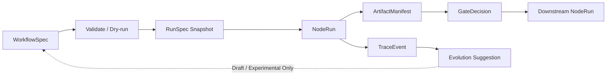
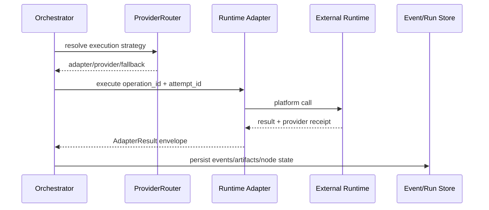

# 15-2_架构方案二次评审意见

## 1. 评审背景

本文是对第一次架构评审修订后的全项目二次审核。

第一次评审主要解决了以下问题：

- `WorkflowSpec` 与运行事实的边界。
- Agent、NodeRun、GateDecision、Artifact 的状态分层。
- Local Service 的基本安全边界。
- JSONL 的恢复与幂等基础规则。
- ProviderRouter 与 Runtime Adapter 的职责边界。
- Infinite Canvas 在 MVP 中的优先级。

本轮复审确认：上述调整方向正确，核心结论已经进入
`14_技术架构选型与系统架构图.md`，但部分旧设计仍然保留在对象模型、
编排草案、状态机、Visual Builder 和 MVP 原型文档中。

本轮重点不再讨论整体技术方向，而是检查：

1. 修订后的架构规则是否真正传播到所有核心文档。
2. 模板数据和运行数据是否已经完全分开。
3. 中断恢复、重试和外部副作用是否有可实现的规则。
4. 产品原型是否会继续引用旧状态和旧对象模型。
5. 展示图是否与最新正文保持一致。

## 2. 总体结论

当前架构不需要推倒重做，第一次评审提出的主方向仍然成立。

但是在进入 `16_产品信息架构与设计图规划.md` 或代码实现前，建议再完成一次
范围受控的模型收口，优先解决以下问题：

| 优先级 | 问题 | 主要影响 |
|---|---|---|
| P1 | RunSpec 没有冻结实际运行版本 | 恢复时可能使用错误的工作流版本 |
| P1 | ArtifactSpec 与实际运行产物混写 | 模板产物契约和真实文件无法区分 |
| P1 | NodeRun 状态与 GateDecision 仍有混用 | DAG、审核门和下游放行逻辑不一致 |
| P1 | Adapter 直接写运行存储，幂等键不足 | 中断或重试可能造成重复产物和重复发布 |
| P1 | Local Service 请求认证仍然偏宽松 | 恶意网页或路径逃逸可能触发本地危险操作 |
| P2 | TraceEvent 与 AuditEvent 关系未统一 | 事件协议、审计和恢复实现容易分叉 |
| P2 | pause/resume 有能力描述但没有对应状态 | 暂停、取消、超时无法准确表达 |
| P2 | CredentialSpec 混入当前环境检查结果 | 可版本化配置被本机运行状态污染 |
| P2 | PNG 架构图没有跟随正文修订 | 评审和产品设计可能继续参考旧模型 |

推荐决策：

```text
先修复 P1 模型和协议问题，再同步 P2 文档及展示资产，
完成后进入产品信息架构与原型规划。
```

## 3. P1-1 RunSpec 必须冻结工作流运行版本

### 3.1 当前问题

当前 RunSpec 示例主要记录：

```yaml
run_id: run_20260618_001
workflow_id: content-production-v0
status: running
```

它只能说明任务由哪个工作流创建，却不能说明创建时具体使用的是哪个版本、
哪些节点、哪些边、哪些组件和哪套 ProviderPolicy。

### 3.2 具体案例

以“热点工具更新”Flow A-G 为例：

1. 上午 10:00 启动任务，当时工作流版本是 `0.1.0`。
2. 任务执行到 D 节点 TTS 后暂停。
3. 下午 15:00 修改 stable 模板，在 A 和 B 之间插入 Pencil 原型节点。
4. 晚上系统重启，尝试恢复上午的任务。

如果恢复时只通过：

```yaml
workflow_id: content-production-v0
```

重新读取当前模板，系统读到的会是下午修改后的版本。此时系统无法回答：

- 上午启动的任务是否应该执行 Pencil 节点？
- 已经完成的 A、B、C 节点是否仍然有效？
- 新版本的边和旧运行事件如何对应？
- 恢复后应该继续 D 节点，还是重新生成执行计划？

### 3.3 建议模型

每次创建真实 RunSpec 时，应冻结运行所依据的配置：

```yaml
run_id: run_20260618_001
workflow_id: content-production-v0
workflow_version: 0.1.0
workflow_hash: sha256:abc123
workflow_snapshot:
  path: runs/run_20260618_001/workflow.snapshot.yaml
resolved_components:
  B_md_master: content-packaging-library@0.3.0
  D_tts_caption: tts-caption-library@0.2.1
resolved_provider_policy:
  path: runs/run_20260618_001/provider-policy.snapshot.json
created_at: 2026-06-18T10:00:00+08:00
status: running
```

### 3.4 核心规则

- RunSpec 创建后使用不可变的 workflow snapshot。
- stable WorkflowSpec 后续升级不能改变已经启动的 run。
- resume、retry 和 replay 都以 run snapshot 为准。
- 如果用户明确选择升级运行版本，应创建迁移事件和新的执行计划，不能静默替换。

通俗理解：

```text
WorkflowSpec 是可以持续修改的施工模板。
RunSpec snapshot 是某次工程开工时冻结的施工图。
```

## 4. P1-2 ArtifactSpec 与 ArtifactManifest 必须分开

### 4.1 当前问题

部分文档将 ArtifactSpec 同时用于：

- 声明节点应该产生什么。
- 表示某次运行实际产生了什么文件。
- 承载产物当前审核状态。
- 作为 Artifact Board 中的运行产物卡。

这会再次混合模板真相和运行事实。

### 4.2 具体案例

工作流规定 B 节点要输出 MD 母稿：

```yaml
id: md_master
kind: markdown
produced_by: B_md_master
```

星期一和星期二分别执行一次后，系统产生：

```text
runs/run_monday/03_内容母稿/MD母稿.md
runs/run_tuesday/03_内容母稿/MD母稿.md
```

如果两张产物卡都只绑定同一个 `ArtifactSpec: md_master`，系统无法区分：

- 当前卡片对应哪次 run。
- 文件的真实路径和 hash。
- 哪个文件已经审核，哪个文件仍是草稿。
- 重试后是覆盖旧文件还是生成了新版本。
- 下游实际读取的是哪一个文件。

### 4.3 建议模型

#### ArtifactSpec：模板中的产物契约

```yaml
id: md_master
kind: markdown
path_template: runs/{run_id}/03_内容母稿/MD母稿.md
produced_by: B_md_master
consumed_by:
  - C0_script_pool
review_required: true
```

它回答：

```text
这个节点应该生产什么。
```

#### ArtifactManifest：某次运行的真实产物

```yaml
artifact_id: artifact_run001_md_master_v1
artifact_spec_id: md_master
run_id: run_20260618_001
node_run_id: B_md_master_attempt_1
path: runs/run_20260618_001/03_内容母稿/MD母稿.md
hash: sha256:def456
size: 18420
status: pending_review
produced_by: B_md_master
source_event_id: evt_000108
created_at: 2026-06-18T10:42:00+08:00
```

它回答：

```text
这次任务实际生产了什么。
```

### 4.4 核心规则

- NodeSpec 引用 ArtifactSpec。
- NodeRun 产生 ArtifactManifest，而不是产生 ArtifactSpec。
- Artifact Board 中的运行产物卡绑定 ArtifactManifest。
- ArtifactManifest 必须反向引用 ArtifactSpec。
- hash、真实路径、审核状态和 source event 只进入运行事实。

## 5. P1-3 NodeRun 与 GateDecision 状态必须彻底分开

### 5.1 当前问题

部分文档仍采用类似状态流：

```text
running -> pending_review -> approved -> done
```

这里混合了三种不同问题：

- NodeRun：节点有没有执行完成。
- Artifact：生成的产物当前是否可用。
- GateDecision：审核人做出了什么决定。

### 5.2 具体案例

B 节点已经成功生成 MD 母稿，但用户还未审核。

正确表达应为：

```yaml
node_run:
  node_id: B_md_master
  status: done

artifact_manifest:
  artifact_id: artifact_run001_md
  status: pending_review

gate_decision:
  gate_id: B_md_master_gate
  decision: pending_review
```

此时：

- B 节点的生成动作已经完成，所以 NodeRun 是 `done`。
- 母稿还不能进入下游，所以 Artifact 是 `pending_review`。
- 审核门还没有决定，所以 GateDecision 是 `pending_review`。

用户点击批准后：

```yaml
gate_decision:
  decision: approved
  downstream_allowed: true

artifact_manifest:
  status: approved
```

NodeRun 不需要再从 `pending_review` 变成 `approved`，因为节点执行动作早已结束。

### 5.3 边条件也要明确归属

不建议继续使用：

```yaml
condition: status in ["approved", "auto-approved"]
```

因为无法知道 `status` 属于 NodeRun、Artifact 还是 Gate。

建议改为：

```yaml
condition:
  gate_id: B_md_master_gate
  decision_in:
    - approved
    - auto-approved
```

或：

```yaml
condition:
  artifact_id: md_master
  status_in:
    - approved
```

### 5.4 建议状态分层

| 对象 | 建议状态 |
|---|---|
| AgentHealth | `idle / queued / running / waiting / blocked / reviewing / done / failed` |
| NodeRun | `not_started / queued / running / paused / blocked / failed / cancelled / timed_out / skipped / done` |
| GateDecision | `pending_review / approved / auto-approved / rejected / commented / blocked / skipped` |
| ArtifactManifest | `draft / pending_review / approved / rejected / archived / external_only` |

## 6. P1-4 Adapter 不应直接写运行事实存储

### 6.1 当前问题

当前时序设计中，Runtime Adapter 调用外部 runtime 后，直接写入：

- TraceEvent Store。
- Artifact Store。
- 节点执行结果。

这会产生多个独立写入点。如果执行过程在中间崩溃，运行事实可能不一致。

### 6.2 具体案例：TTS 生成中断

假设 TTS Adapter 执行：

1. 调用火山 TTS 成功。
2. 写入音频文件成功。
3. 写 ArtifactManifest 成功。
4. 写 `node_completed` 事件时进程崩溃。

恢复后可能出现：

```text
音频文件存在
ArtifactManifest 存在
NodeRun 仍显示 running
TraceEvent 中没有完成事件
```

用户点击重试后，系统可能再次调用付费 TTS，并产生第二份音频。

### 6.3 建议调用链路

Adapter 只负责调用平台并返回结果 envelope：

```yaml
operation_id: tts_run001_D
attempt_id: tts_run001_D_attempt_2
status: succeeded
provider_receipt: volc_request_92837
artifacts:
  - artifact_spec_id: tts_audio
    path: audio/final.wav
    hash: sha256:789
events:
  - event_type: provider_call_completed
failure: null
```

然后由 Orchestrator 或统一 Event Store 负责：

1. 接收 AdapterResult。
2. 写入 TraceEvent。
3. 写入 ArtifactManifest。
4. 更新 NodeRun。
5. 写入必要的 AuditEvent。
6. 决定是否进入审核门或下游节点。

通俗理解：

```text
Adapter 是执行人员。
Orchestrator 是统一记账和确认结果的人。
```

### 6.4 当前幂等键仍然不足

目前建议使用：

```text
run_id + node_id + attempt
```

它可以区分每次尝试，但不能阻止真实副作用重复发生。

例如 G 节点发布小红书：

```text
run_001 + G_publish + attempt_1
run_001 + G_publish + attempt_2
```

两个 key 不同，第二次重试仍可能再次发布同一内容。

建议拆分：

```yaml
operation_id: publish_run001_xiaohongshu
attempt_id: publish_run001_xiaohongshu_attempt_2
```

- `operation_id`：一次业务操作的稳定 ID，重试时不变。
- `attempt_id`：每次真实执行尝试的唯一 ID。
- `provider_receipt`：外部平台返回的请求 ID、发布 ID 或事务凭证。

### 6.5 外部副作用节点规则

发布、删除、覆盖、付费生成等节点应遵守：

- 执行前按 `operation_id` 检查是否已经成功。
- 记录 provider receipt。
- 明确 `dry-run / preview / real-run`。
- 失败状态不明确时先进入 `unknown/reconcile_required`，不能直接重试。
- 后续实现可采用 outbox 或提交确认机制，但当前阶段先固化协议。

## 7. P1-5 Local Service 安全规则需要继续收口

### 7.1 当前问题

仅监听 `127.0.0.1` 并不能自动保证安全。

如果本地服务可以：

- 读写 workspace。
- 删除文件。
- 调用 CLI。
- 调用 MCP。
- 访问外部 API。
- 发布真实内容。

那么恶意网页、错误插件或路径逃逸仍可能触发危险操作。

### 7.2 具体案例：恶意网页调用本地接口

假设 Miracle 暴露：

```http
POST http://127.0.0.1:3000/api/delete-file
```

用户打开一个恶意网页后，网页尝试向这个地址发送请求。如果 Local Service 只检查
Origin，或者没有不可猜测的 token，请求就可能进入本地服务。

### 7.3 具体案例：路径逃逸

用户或插件传入：

```text
/workspace/project/allowed/../../.ssh/id_rsa
```

字符串看起来以 workspace 开头，但规范化后已经逃离允许目录。

符号链接也可能造成类似问题：

```text
/workspace/project/assets/private-link -> ~/.ssh
```

### 7.4 建议安全规则

Local Service 至少应满足：

```text
只绑定 127.0.0.1
+ 所有 API 使用不可猜测的 session token
+ 浏览器写操作校验 Origin/CSRF
+ 路径规范化后检查 workspace allowlist
+ 防止符号链接逃逸
+ tool/provider allowlist
+ 危险操作二次确认
+ AuditEvent
```

补充规则：

- 敏感读取接口也需要 token，不能只保护写操作。
- token 不写入 URL、日志、TraceEvent 或 Git。
- 文件操作应基于受控 workspace handle，不接受任意绝对路径。
- 发布、删除、覆盖和真实付费调用必须使用短时确认票据。
- CORS 不能使用通配符。

## 8. P2-1 TraceEvent 与 AuditEvent 需要统一协议

### 8.1 当前问题

部分示例使用：

```json
{
  "event": "agent_blocked"
}
```

新规则使用：

```json
{
  "event_id": "evt_001",
  "event_type": "agent_blocked"
}
```

同时，AuditEvent 已用于权限变化、危险操作和恢复动作，但尚未明确它与 TraceEvent
的关系。

### 8.2 建议决策

推荐定义：

```text
AuditEvent 是 TraceEvent 的受保护子类型。
```

所有事件使用统一 envelope：

```yaml
event_id: evt_000108
sequence: 108
run_id: run_20260618_001
node_id: D_tts_caption
event_type: node_blocked
event_category: runtime
actor:
  type: system
  id: orchestrator
timestamp: 2026-06-18T10:42:00+08:00
payload:
  reason: missing_tts_credentials
```

危险操作或人工决策标记为：

```yaml
event_category: audit
```

并额外要求：

- 不允许静默覆盖。
- 记录 actor。
- 记录操作前后的关键摘要。
- 记录确认票据或审批来源。
- 敏感信息必须脱敏。

### 8.3 具体事件案例

普通运行事件：

```yaml
event_type: node_completed
event_category: runtime
```

用户批准最终视频：

```yaml
event_type: gate_approved
event_category: audit
actor:
  type: user
  id: local_user
```

删除产物：

```yaml
event_type: dangerous_action_confirmed
event_category: audit
payload:
  action: delete_artifact
  target_artifact_id: artifact_final_video_v1
```

## 9. P2-2 pause、cancel、timeout 需要真实状态

### 9.1 当前问题

文档已经声明支持 pause/resume，但 NodeRun 状态中没有：

- `paused`
- `cancelled`
- `timed_out`
- `aborted`

因此产品和实现无法准确表达用户主动暂停、主动取消和系统超时。

### 9.2 具体案例

#### 用户暂停视频渲染

不应表示为：

```yaml
status: waiting
```

因为这不是等待外部条件，而是用户主动暂停。

应表示为：

```yaml
status: paused
pause_reason: user_requested
```

#### TTS 等待 30 分钟超时

不应表示为普通 `failed`，应保留超时原因：

```yaml
status: timed_out
timeout_seconds: 1800
```

#### 用户取消发布任务

```yaml
status: cancelled
cancelled_by: user
```

### 9.3 建议流转

```text
queued -> running
running -> paused -> queued
running -> blocked -> queued
running -> timed_out -> queued
running -> failed -> queued
queued/running/paused -> cancelled
running -> done
```

规则：

- `cancelled` 是终态，恢复时创建新的 attempt。
- `paused` 可以 resume。
- `timed_out` 是否重试由 failure policy 决定。
- 进程被强制终止可使用 `aborted`，并进入人工或自动 reconcile。

## 10. P2-3 CredentialSpec 不能保存当前环境状态

### 10.1 当前问题

当前示例把以下字段放入 CredentialSpec：

```yaml
status: missing
```

但 `missing` 只是当前机器、当前会话和当前时间的检查结果，不是可版本化配置。

### 10.2 具体案例

开发者 A 没有配置 `VOLC_TTS_API_KEY`，提交：

```yaml
status: missing
```

开发者 B 已经配置密钥，但拉取代码后 Spec 仍然显示 missing。此时配置文件描述的不是
凭证契约，而是开发者 A 当时的本机状态。

### 10.3 建议拆分

CredentialSpec：

```yaml
id: VOLC_TTS_API_KEY
used_by:
  - D_tts_caption
provider: volc-tts
scope: local_env
required: true
```

CredentialCheckResult：

```yaml
credential_id: VOLC_TTS_API_KEY
run_id: run_20260618_001
status: available
checked_at: 2026-06-18T10:00:00+08:00
source: environment
expires_at: null
```

规则：

- CredentialSpec 可进入 Git。
- CredentialCheckResult 只属于本地运行事实。
- dry-run 做预检。
- 真实执行前再次检查，避免凭证在 dry-run 后失效。
- 永远不记录真实 key、token、cookie 或 password。

## 11. P2-4 PNG 架构图需要同步更新

### 11.1 当前问题

正文已增加：

```text
WorkflowSpec
-> RunSpec snapshot
-> NodeRun
-> TraceEvent / ArtifactManifest
-> GateDecision
```

但现有 PNG 仍然主要展示：

```text
WorkflowSpec -> Validate -> Dry-run -> Node DAG -> Agent Execute
```

这容易让只看图的评审者误解：

- Node DAG 是运行事实的一部分。
- RunSpec 和 NodeRun 不重要。
- Gate Review 没有持久化 GateDecision。
- Evolution 可以直接更新 stable WorkflowSpec。
- Adapter 可以直接写事件和产物存储。

### 11.2 建议生命周期图



### 11.3 建议 Adapter 时序图



## 12. 跨文档同步范围

本轮建议重点同步以下文档：

| 文档 | 需要修订的重点 |
|---|---|
| `01_核心架构与对象模型.md` | RunSpec snapshot、ArtifactSpec/Manifest、事件 envelope、凭证检查结果 |
| `03_智能路由与工作流编排设计.md` | NodeRun 状态、GateDecision 条件、pause/cancel/timeout |
| `09_WorkflowSpec与Registry技术草案.md` | RunSpec v0、ArtifactManifest v0、条件表达、operation/attempt ID |
| `10_AgentHealth与多Agent状态机设计.md` | Agent 状态与 NodeRun 状态边界、AuditEvent 协议 |
| `11_VisualBuilder与Spec双向同步设计.md` | 运行产物卡绑定 Manifest，模板编辑仍绑定 Spec |
| `12_MVP原型功能清单与界面草图.md` | 页面状态来源、暂停取消、产物实例和审核决策 |
| `14_技术架构选型与系统架构图.md` | Adapter 持久化边界、安全规则、稳定 operation ID |
| `assets/architecture/*.png` | 根据最新 Mermaid 和对象边界重新生成 |

## 13. 建议修改顺序

### 第一阶段：先定对象和协议

1. 修改 `01_核心架构与对象模型.md`。
2. 修改 `03_智能路由与工作流编排设计.md`。
3. 修改 `09_WorkflowSpec与Registry技术草案.md`。
4. 修改 `14_技术架构选型与系统架构图.md`。

这一阶段必须先完成，因为后续 UI、存储和流程设计都依赖这些模型。

### 第二阶段：同步状态和产品表达

5. 修改 `10_AgentHealth与多Agent状态机设计.md`。
6. 修改 `11_VisualBuilder与Spec双向同步设计.md`。
7. 修改 `12_MVP原型功能清单与界面草图.md`。

### 第三阶段：同步展示资产

8. 更新 Mermaid 图。
9. 重新生成 PNG 架构图。
10. 全项目搜索旧字段和旧状态口径。

## 14. 本轮不需要展开的实现细节

以下内容仍可留到 P3 技术详细设计：

- JSONL 文件的具体目录和分片策略。
- SQLite 表结构和索引设计。
- outbox 的具体数据库实现。
- Event Store 的具体库或框架。
- token 生成和轮换的代码实现。
- 完整 RBAC 和多用户权限。
- Runtime Adapter SDK 的完整接口代码。
- React Flow 与 tldraw 的完整同步算法。

当前阶段只需把对象、职责和协议边界定义清楚。

## 15. 二次修订验收标准

完成本轮修订后，应能够清楚回答：

1. 某次 run 如何证明自己使用的是哪个 WorkflowSpec 版本？
2. ArtifactSpec 和某次运行真实生成的文件有什么区别？
3. 节点执行完成但产物未审核时，各对象分别是什么状态？
4. 下游判断的是 NodeRun、ArtifactManifest 还是 GateDecision？
5. Adapter 执行成功但系统写入中断时，如何避免重复生成或重复发布？
6. 同一业务操作重试时，operation ID 和 attempt ID 如何变化？
7. 本地网页为什么不能只依靠 `127.0.0.1` 和 Origin 校验？
8. pause、cancel、timeout 和 failed 有什么区别？
9. CredentialSpec 为什么不能保存 `status: missing`？
10. Mermaid、PNG、对象模型和产品原型是否使用同一套最新口径？

## 16. 最终评审建议

本轮复审后的建议是：

```text
第一次架构修订方向正确，但尚未完全传播到全项目。
先完成 P1 对象模型和执行协议收口，再同步 P2 状态、UI 和图资产。
不需要推倒重做，也不建议带着这些不一致直接进入代码实现。
```

这次修改的核心不是增加更多复杂设计，而是确保：

```text
模板是模板，运行是运行；
执行是执行，审核是审核；
Adapter 负责调用，Orchestrator 负责落账；
重试可以发生，但真实副作用不能重复发生。
```
