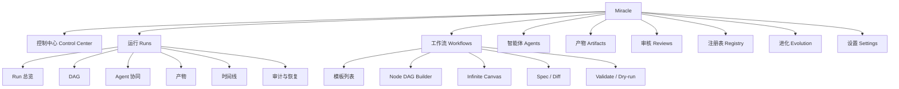
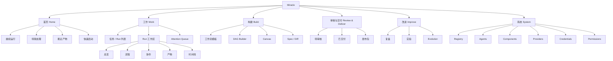
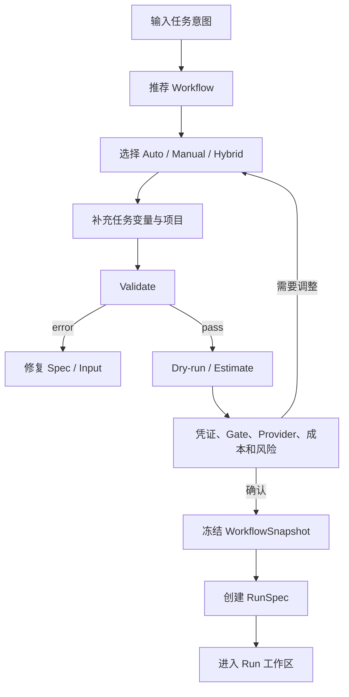
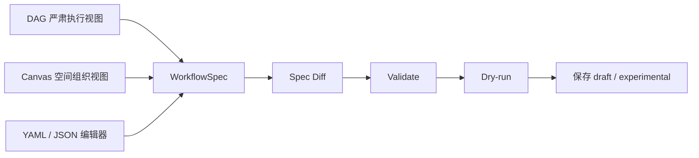
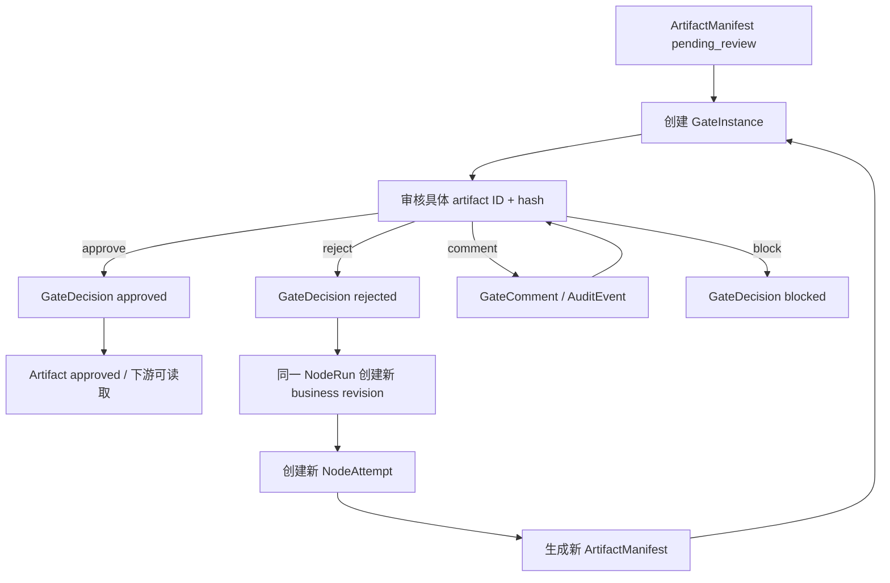
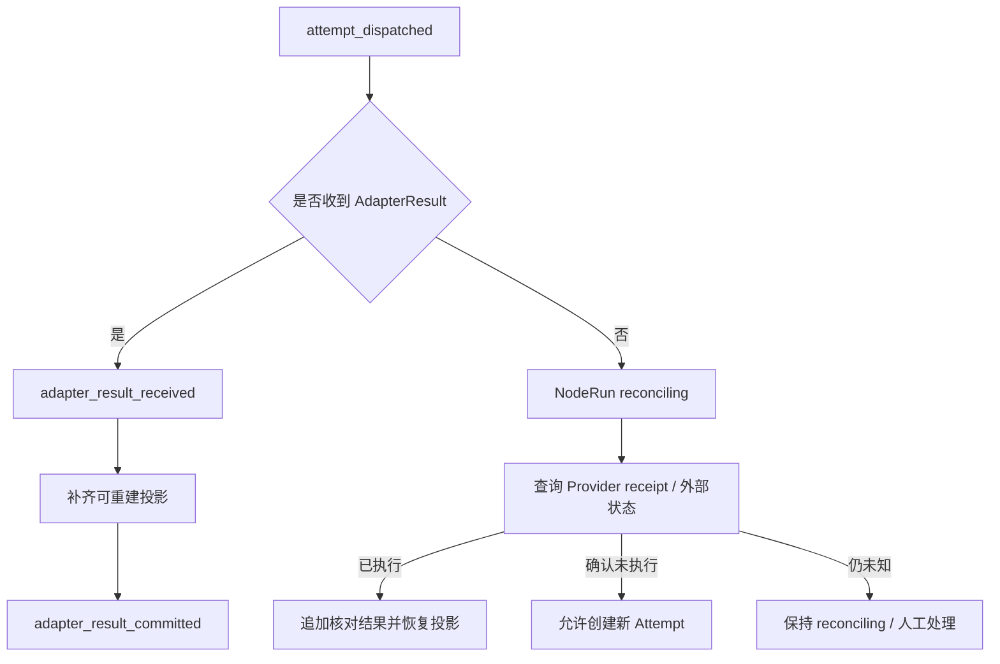

# 16_abtest_产品信息架构与设计图规划

> 文档阶段：P2 产品信息架构与原型设计
> 文档性质：A/B 对照设计与可点击原型测试计划
> 设计基线：除 `16_产品信息架构与设计图规划.md` 外的现有项目文档
> 测试对象：信息架构、页面入口、Run 工作区组织和异常恢复路径
> 不变约束：核心对象模型、状态分层、WorkflowSpec/Run 真相边界和安全边界

## 1. 文档目标

本文不直接选定唯一产品信息架构，而是为 Miracle 设计两套可比较的 IA：

- **方案 A：对象域导航（Domain-first）**
  以 Run、Workflow、Agent、Artifact、Gate、Registry、Evolution 等产品对象分区。
- **方案 B：任务与 Run 中心导航（Task-first）**
  以启动任务、执行工作、处理异常、审核产物和改进流程等用户任务分区。

两套方案使用相同的 WorkflowSpec、RunSpec、NodeRun、NodeAttempt、
ArtifactManifest、GateInstance、GateDecision、AgentHealth 和 Event Journal 数据，
只改变用户如何找到信息、理解状态并完成操作。

本轮需要回答：

1. 新用户能否快速理解 Miracle 是“工作流控制平面”，而不是普通聊天产品。
2. 用户能否从任务启动自然进入 Run，并判断当前最需要处理的事项。
3. 用户能否区分 Run、NodeRun、NodeAttempt、Artifact、Gate 和 Agent 的状态。
4. 用户遇到 blocked、pending review 或 reconciling 时，能否找到正确恢复动作。
5. 高级用户能否在 DAG、Canvas 和 Spec 之间切换而不误改稳定模板。
6. 哪套 IA 更适合作为 MVP 默认入口，另一套是否应保留为高级工作台或对象浏览器。

## 2. 设计依据与事实优先级

### 2.1 产品定位

Miracle 是面向个人、一人公司和小型 AI 团队的本地优先 Agent OS 和工作流控制平面，
统一管理：

- 多 Agent 协同。
- 工作流模板和真实 Run。
- 组件库、工具、模型、Provider 和 Runtime Adapter。
- 产物版本、审核门、运行事件和异常恢复。
- 工作流复盘、实验和进化建议。

第一条真实样本为“热点工具更新”Flow A-G：

```text
A 情报采集与事实核验
-> B 内容 MD 母稿
-> C0 脚本池生成与评审
-> C PPT / 视频分镜
-> D TTS / 字幕
-> E HyperFrames 视觉视频
-> F 音画整合与最终渲染
-> G 分发复盘
```

### 2.2 产品事实来源

产品设计出现冲突时，按以下顺序处理：

1. `01`、`03`、`09`、`10`、`14` 中的当前对象、协议和状态定义。
2. `15-4` 最终复核已经采纳的架构决策。
3. `00`、`02`、`04`、`05`、`06` 中的产品定位和能力设计。
4. `07`、`12`、`13` 中的阶段范围、原型要求和验收标准。
5. `08` 中的竞品借鉴原则。
6. 历史评审文档只用于理解决策过程，不覆盖当前有效口径。

### 2.3 不允许被 A/B 测试改变的规则

- WorkflowSpec 是模板与编排真相。
- Run 启动时冻结 WorkflowSnapshot、组件版本和 ProviderPolicy。
- Event Journal 是权威追加日志，运行页面是可重建投影。
- 同一 Run 中每个固定节点只有一个 NodeRun，多次执行使用不同 NodeAttempt。
- NodeRun `done` 只代表节点执行动作完成，不代表产物已经审核放行。
- `pending_review` 属于 GateInstance 和 ArtifactManifest。
- GateDecision 必须绑定具体 artifact ID 和 hash。
- 外部调用只有 dispatched、没有 received 时进入 `reconciling`，禁止直接重试。
- DAG 是 MVP 的严肃执行视图；Canvas 是轻量空间组织和实验视图。
- UI、DAG、Canvas、YAML/JSON 都是同一 Spec 的编辑器或视图。
- stable 模板不能被 UI、自动进化或同步冲突静默覆盖。

## 3. 目标用户与核心任务

### 3.1 主要用户

| 用户 | 主要目标 | 主要风险 |
|---|---|---|
| 一人公司操作者 | 用推荐模板完成完整内容生产任务 | 被复杂对象和状态淹没 |
| 工作流设计者 | 调整节点、Gate、组件库和 Provider 策略 | 误改 stable 或把 layout 当依赖 |
| 多 Agent 总控 | 查看执行、等待、阻塞、交接和恢复动作 | 只看到 Agent，不知道任务影响 |
| 审核者 | 审核具体产物版本并决定是否放行 | 批准错误版本或误把评论当决定 |
| 系统维护者 | 管理 Registry、凭证、权限和 Adapter | 将当前环境状态写入模板配置 |

### 3.2 MVP 核心 Jobs To Be Done

1. 当我准备执行一个复杂任务时，我要先看到流程、成本、凭证、审核门和风险。
2. 当任务运行时，我要知道现在执行到哪里、谁在做、什么在等待。
3. 当任务阻塞时，我要知道原因、影响范围和安全的恢复动作。
4. 当产物需要审核时，我要确认具体版本、内容和 hash，再决定批准或返工。
5. 当我修改工作流时，我要看到 Spec diff，并确认改动不会污染正在运行的任务。
6. 当一次运行结束时，我要查看产物、成本、失败和进化建议。

## 4. A/B 测试策略

### 4.1 测试阶段

当前仍处于 P2，不适合直接做线上流量实验。测试分两步：

```text
第一步：可点击原型对照测试
-> 第二步：MVP 内可观测的受控实验
```

第一步验证导航、理解和任务完成；第二步在真实 MVP 中验证长期使用效率。

### 4.2 核心变量

| 变量 | 方案 A | 方案 B |
|---|---|---|
| 一级导航 | 按产品对象划分 | 按用户任务划分 |
| 默认首页 | Control Center 对象总览 | 今日工作与待处理事项 |
| Run 入口 | 独立 Runs 工作域 | 所有任务的默认落点 |
| 异常入口 | 分散在 Run、Agent、Gate、Artifact | 统一 Attention Queue |
| Builder 入口 | 独立 Workflow 工作域 | 从任务启动、Run 或“构建”进入 |
| 产物与审核 | 独立 Artifact/Gate 工作域 | 统一“审核与交付”任务域 |
| 高级对象 | 一级可见 | 收入 System/Library 二级区域 |

### 4.3 控制变量

两版必须保持一致：

- 测试任务和示例数据。
- 页面数量和可用功能。
- 状态、文案和恢复动作。
- Flow A-G 节点、Agent、产物和审核门。
- 字体、颜色、组件、密度和交互反馈。
- 桌面测试视口。
- 测试主持脚本和成功判定。

不能让 A/B 测试退化成不同视觉风格的偏好测试。

## 5. 方案 A：对象域导航

### 5.1 设计假设

如果一级导航直接对应系统核心对象，高级用户会更容易建立稳定心智模型，并快速访问
Workflow、Agent、Artifact、Gate 和 Registry。

风险是新用户需要先理解对象关系，才能完成“启动任务”和“解决阻塞”等实际工作。

### 5.2 一级信息架构



### 5.3 页面地图

| ID | 页面 | 核心内容 | 主动作 |
|---|---|---|---|
| A01 | 控制中心 | Run、Agent、审核、阻塞、成本和最近产物摘要 | 新建 Run |
| A02 | Run 列表 | 主状态、attention、工作流版本、时间、成本 | 打开 Run |
| A03 | Run 总览 | 进度、attention、当前节点、审核和恢复建议 | 继续处理 |
| A04 | Run DAG | NodeRun、Attempt、输入、输出、Gate 和依赖 | 查看节点详情 |
| A05 | Agent Collaboration | Agent Map、Health、等待对象和交接 | 查看 Agent |
| A06 | Artifact Board | ArtifactManifest 版本流转和消费者 | 打开产物 |
| A07 | Gate Review | 具体产物版本、hash、决定和返工目标 | 批准或驳回 |
| A08 | Workflow Studio | DAG、Canvas、Spec、diff 和 dry-run | 编辑模板 |
| A09 | Registry | Workflow、Component、Agent、Provider 版本 | 安装或发布 |
| A10 | Evolution Board | 建议、实验、验证、批准和发布 | 创建实验 |

### 5.4 全局导航线框

```text
┌───────────────────────────────────────────────────────────────────────┐
│ Miracle    全局搜索                         运行状态   凭证   设置     │
├──────────────┬────────────────────────────────────────────────────────┤
│ 控制中心     │                                                        │
│ 运行         │                    当前页面                            │
│ 工作流       │                                                        │
│ 智能体       │                                                        │
│ 产物         │                                                        │
│ 审核         │                                                        │
│ 注册表       │                                                        │
│ 进化         │                                                        │
│ 设置         │                                                        │
└──────────────┴────────────────────────────────────────────────────────┘
```

### 5.5 方案 A 的优势与风险

优势：

- 与对象模型和未来 API/CLI 结构一致。
- 高级用户可以直接进入目标对象。
- Registry、Evolution 和 Agent 管理拥有明确空间。
- 适合长期扩展为完整控制平面。

风险：

- 一级导航数量较多。
- 新用户可能不知道应该从 Run、Workflow 还是 Agent 开始。
- blocked、pending review、reconciliation 等行动项分散。
- 用户可能在模板对象和运行对象之间来回跳转。

## 6. 方案 B：任务与 Run 中心导航

### 6.1 设计假设

如果产品围绕“启动工作、查看进度、处理异常、审核交付、改进流程”组织，新用户会更快
完成真实任务。Run 成为整合 Workflow、Agent、Artifact、Gate 和 Trace 的主容器。

风险是高级对象被收进二级页面后，专业用户可能需要更多跳转。

### 6.2 一级信息架构



### 6.3 页面地图

| ID | 页面 | 核心内容 | 主动作 |
|---|---|---|---|
| B01 | 首页 | 继续运行、待审核、阻塞、对账、最近产物 | 继续最重要事项 |
| B02 | 快速启动 | 意图、推荐模板、执行模式、输入和项目 | 进入预检 |
| B03 | 启动预检 | Validate、dry-run、凭证、Gate、成本和风险 | 启动 Run |
| B04 | Run 工作区 | 任务摘要、主状态、attention 和阶段导航 | 处理当前阶段 |
| B05 | 流程 | DAG/Canvas 切换、节点详情和 Spec diff | 查看或编辑流程 |
| B06 | 协作 | Agent Map、Health、等待和交接 | 处理 Agent 阻塞 |
| B07 | 审核与交付 | Artifact 预览、Gate、版本、发布包 | 批准或返工 |
| B08 | Attention Queue | blocked、pending review、reconciling、conflict | 执行恢复动作 |
| B09 | 构建 | 模板、组件、Provider 策略和实验副本 | 编辑工作流 |
| B10 | 改进 | 复盘、Evolution 建议、实验结果 | 发布实验版本 |

### 6.4 全局导航线框

```text
┌───────────────────────────────────────────────────────────────────────┐
│ Miracle    搜索任务、产物、Agent               + 新任务    系统状态   │
├──────────────┬────────────────────────────────────────────────────────┤
│ 首页         │  待我处理 4                                             │
│ 工作         │  ├─ 母稿待审核                                         │
│ 构建         │  ├─ TTS 缺少凭证                                       │
│ 审核与交付   │  ├─ 发布调用等待对账                                   │
│ 改进         │  └─ Spec 同步冲突                                      │
│ 系统         │                                                        │
└──────────────┴────────────────────────────────────────────────────────┘
```

### 6.5 方案 B 的优势与风险

优势：

- 默认围绕用户下一步行动组织。
- Run 成为 Workflow、Agent、Artifact、Gate 和 Timeline 的共同上下文。
- Attention Queue 统一承接待审核、阻塞、对账和冲突。
- 新用户不必先理解全部对象模型。

风险：

- Registry、Agent 和 Component 等对象入口更深。
- 高级用户可能认为任务域导航过于概括。
- “审核与交付”可能同时承载过多 Artifact/Gate/发布信息。
- 需要严格保持页面面包屑和对象链接，避免专业信息被隐藏。

## 7. 推荐的实验结论假设

原型制作前的推荐假设是：

```text
方案 B 更适合成为 MVP 默认 IA；
方案 A 更适合作为高级对象浏览器和后续专业模式。
```

原因：

- Miracle 的第一价值是帮助用户运行和控制复杂任务，不是让用户维护对象目录。
- Run 是模板、节点、Agent、产物、审核和事件在运行态的共同容器。
- blocked、pending review 和 reconciling 都要求用户完成明确动作。
- MVP 首先要证明端到端闭环，任务导向比完整对象覆盖更重要。

该结论只是设计假设，必须通过原型任务测试验证。

## 8. 两版共享的 Run 工作区

无论最终选择 A 或 B，Run 工作区都使用统一的页面骨架。

### 8.1 页面结构

```text
顶部：Run 名称 / 工作流版本 / 主状态 / attention / 成本 / 耗时
左侧：阶段导航与 Flow A-G
中间：当前视图
右侧：上下文详情、恢复动作、版本和关联对象
底部：实时事件、审计和系统消息
```

### 8.2 Run 工作区视图

| 视图 | 回答的问题 | 主要数据 |
|---|---|---|
| 总览 | 当前进度和最重要行动是什么 | RunSpec、attention、关键事件 |
| 流程 | 哪些节点完成、等待、阻塞或跳过 | WorkflowSnapshot、NodeRun |
| 协作 | 谁在执行、等待和交接 | AgentSpec、AgentHealth、TraceEvent |
| 产物 | 实际生成了哪些版本，谁会消费 | ArtifactManifest、ArtifactSpec |
| 审核 | 哪个具体版本需要什么决定 | GateInstance、GateDecision |
| 时间线 | 运行中发生了什么 | Event Journal / TraceEvent |
| 恢复 | 为什么失败或结果未知，下一步是什么 | Attempt、receipt、reconciliation |

### 8.3 状态展示规则

状态标签必须同时显示“对象类型 + 状态”，禁止只显示一个无归属的状态词。

正确示例：

```text
Run · running
Attention · pending review
Node · done
Artifact · pending review
Gate · pending review
Agent · reviewing
Attempt · timed out
Node · reconciling
```

禁止示例：

```text
状态：审核中
状态：完成
状态：阻塞
```

## 9. 核心页面设计图规划

### 9.1 P2D-AB01 产品信息架构对照图

输出：

- 方案 A 完整页面树。
- 方案 B 完整页面树。
- 一级入口数量、导航深度和跨域跳转对比。

验收：

- 所有 MVP 能力均能找到明确页面归属。
- 同一能力在两版中的数据来源和操作权限一致。

### 9.2 P2D-AB02 首页对照图

方案 A 首页强调系统对象摘要：

```text
Run 数量 / Agent 状态 / 待审核 / Artifact / 成本 / 最近事件
```

方案 B 首页强调下一步行动：

```text
继续运行 / 待我处理 / 快速启动 / 最近交付 / 系统风险
```

主要测试：

- 用户能否在 10 秒内指出下一步应该做什么。
- 用户能否找到“启动新任务”和“继续阻塞任务”。

### 9.3 P2D-AB03 任务启动流程图



主要测试：

- 用户是否理解 dry-run 不是正式执行。
- 用户是否理解启动后 stable 模板变化不会影响当前 Run。

### 9.4 P2D-AB04 Run 总览对照图

方案 A：

- 对象摘要卡并列展示 Run、Node、Agent、Artifact 和 Gate。
- 用户从对象卡进入对应工作域。

方案 B：

- 首屏先展示“现在发生什么”和“下一步动作”。
- 对象详情通过阶段卡、上下文面板和深链接展开。

### 9.5 P2D-AB05 Workflow Builder 双模式图



界面必须明确：

- DAG 与 Canvas 共用节点和边。
- `layouts` 变化不改变执行依赖。
- Canvas 任务卡转节点后必须进入 diff、validate 和 dry-run。
- stable 修改默认创建 override 或新版本。

### 9.6 P2D-AB06 Agent Collaboration 结构图

```text
左侧：Agent 健康列表
中间：协作关系 / 交接 / 等待图
右侧：职责、Runtime、Provider、组件库和权限
底部：工具调用、事件和审计
顶部：running / waiting / blocked / reviewing 统计
```

Agent 卡必须显示：

- Agent role。
- 当前 NodeRun。
- Runtime Adapter。
- Provider。
- 当前状态。
- 等待对象。
- 最近事件。
- 交接产物。
- 恢复动作。

### 9.7 P2D-AB07 Artifact Board 结构图

列结构：

```text
事实底稿
-> 内容资产
-> 原型资产
-> 音频字幕
-> 视频资产
-> 分发资产
-> 复盘资产
```

每张运行产物卡绑定 ArtifactManifest，并显示：

- ArtifactSpec 类型。
- artifact ID 和版本。
- Run、NodeRun、Attempt。
- 状态、路径或外部链接、hash。
- producer、consumer 和 source event。
- 审核状态和 GateInstance。
- latest/latest approved 逻辑指针。

### 9.8 P2D-AB08 Gate Review 返工图



审核页必须：

- 在主按钮附近展示 artifact version 和 hash 摘要。
- 驳回时要求填写原因和返工目标。
- 评论不能改变放行结论。
- 文件内容变化后提示原批准失效。

### 9.9 P2D-AB09 异常恢复与对账图



UI 禁止在 `dispatched but not received` 状态下提供普通“重试”按钮。

### 9.10 P2D-AB10 Evolution 实验图

```text
新建议 -> 待验证 -> 实验中 -> 待批准 -> 已发布
                      └──────────────> 已拒绝
```

每条建议显示：

- 触发证据。
- 影响 Workflow/Node/Component/Agent/Provider。
- 基线版本和实验版本。
- 质量、耗时、成本和失败率变化。
- 是否涉及 stable 变更或付费 Provider。

## 10. 关键交互任务

两套原型必须完成相同任务。

### T1 启动 Flow A-G

目标：

- 输入“制作一期 Codex/Claude Code 资讯内容”。
- 选择推荐 Workflow。
- 完成 validate、dry-run 和启动确认。

成功条件：

- 用户发现缺失凭证和人工审核门。
- 用户能说明 Run 启动后使用冻结快照。

### T2 处理 TTS 凭证阻塞

初始状态：

```text
NodeRun D_tts_caption · blocked
Attempt count · 0
Reason · missing_tts_credentials
```

允许动作：

- 配置凭证。
- 切换备用 Provider。
- 跳过 TTS，生成无配音审看版。

成功条件：

- 用户不把阻塞误认为 Agent 失败。
- 用户能找到安全恢复动作并理解影响下游。

### T3 审核并驳回 MD 母稿

成功条件：

- 用户确认具体 artifact version。
- 用户填写驳回原因。
- 用户理解返工会在同一 NodeRun 下创建新 revision、operation 和 Attempt。

### T4 插入 Pencil 节点

目标：

- 在 A 和 B 之间插入 Pencil 原型节点。
- 查看 Spec diff。
- validate 并 dry-run。
- 保存为 experimental 版本。

成功条件：

- 用户没有直接覆盖 stable。
- 用户理解 Canvas 位置不决定执行顺序。

### T5 在 DAG 和 Canvas 之间切换

成功条件：

- 用户能找到同一节点。
- 用户理解两种视图共享 Spec，但布局独立。
- 用户能区分“隐藏卡片”和“删除 NodeSpec”。

### T6 处理外部发布结果未知

初始状态：

```text
Attempt · unknown
NodeRun · reconciling
Provider receipt · available
```

成功条件：

- 用户选择“核对外部状态”，而不是直接重试发布。
- 用户能说明重复调用可能产生重复发布或费用。

### T7 处理 Spec 同步冲突

成功条件：

- 用户查看 UI 与文件 diff。
- 用户选择保留 UI、保留文件或手动合并。
- 系统不静默覆盖 stable。

### T8 完成纯 Markdown 分发

测试 Flow G 的 join 语义：

- B -> G 为 required。
- F -> G 为 optional。
- 视频分支未启动时不等待。
- 视频分支已启动时最多等待 30 分钟。

成功条件：

- 用户理解没有视频不代表 Run 必然失败。
- 用户能在超时后选择继续纯 MD 或继续等待。

## 11. 原型页面清单

### 11.1 方案 A 原型

| 原型 ID | 页面 |
|---|---|
| PA-01 | 对象域控制中心 |
| PA-02 | Run 列表 |
| PA-03 | Run 总览 |
| PA-04 | Run DAG 与节点详情 |
| PA-05 | Agent Collaboration |
| PA-06 | Artifact Board |
| PA-07 | Gate Review |
| PA-08 | Workflow Studio 双模式 |
| PA-09 | Registry |
| PA-10 | Evolution Board |

### 11.2 方案 B 原型

| 原型 ID | 页面 |
|---|---|
| PB-01 | 任务型首页 |
| PB-02 | 快速启动 |
| PB-03 | Validate / Dry-run 预检 |
| PB-04 | Run 工作区 |
| PB-05 | 流程与双模式 |
| PB-06 | 协作 |
| PB-07 | 审核与交付 |
| PB-08 | Attention Queue |
| PB-09 | 构建工作台 |
| PB-10 | 改进与实验 |

### 11.3 共享关键状态

每版至少制作以下可点击状态：

1. 空状态。
2. 正常运行。
3. pending review。
4. blocked：缺少 TTS 凭证。
5. failed：工具执行失败。
6. timed out：Attempt 超时。
7. reconciling：外部结果未知。
8. Gate rejected：返工。
9. Spec conflict：UI 与文件冲突。
10. Run completed：产物和复盘完成。

## 12. 低保真视觉规范

### 12.1 布局

- 桌面基准视口：`1440 × 960`。
- 左侧主导航：`224px`。
- 右侧上下文面板：`320-360px`。
- 顶部全局栏：`56px`。
- Run 状态栏：`64-72px`。
- 底部事件抽屉：默认收起，展开高度不超过视口 `36%`。

### 12.2 信息密度

- 首屏最多显示 1 个主动作、3 个次动作和 5 个关键状态摘要。
- 高级 ID、hash、operation 和 attempt 默认摘要展示，可展开查看完整值。
- 同一视觉区域不同时使用超过 3 种状态强调色。
- warning、blocked、failed、reconciling 必须有图标、文字和对象归属，不能只靠颜色。

### 12.3 节点卡

节点卡默认显示：

```text
节点名
NodeRun 状态
当前 Agent
输入就绪数 / 输出产物数
Gate 或 attention
耗时 / 成本
```

Attempt、operation、resolved inputs 和事件放在详情面板中。

### 12.4 文案原则

文案优先回答：

```text
发生了什么
为什么发生
影响什么
现在可以做什么
```

示例：

```text
TTS 节点尚未开始，因为缺少 VOLC_TTS_API_KEY。
视频分支将无法继续，但你仍可选择生成无配音审看版。
```

避免：

```text
Error 401
Blocked
Operation failed
```

## 13. 可用性测试设计

### 13.1 测试方式

首轮使用 8-10 名目标用户进行主持式、交叉顺序测试：

- 一半先测 A，再测 B。
- 一半先测 B，再测 A。
- 每位用户使用相同 Flow A-G 数据和任务。
- 两版之间设置短暂间隔，降低记忆影响。

若样本不足，至少完成：

- 3 名偏执行型用户。
- 3 名偏工作流设计型用户。

### 13.2 主要指标

| 指标 | 定义 | 目标 |
|---|---|---:|
| 首个正确动作时间 | 从进入页面到点击正确主动作 | B 比 A 快 20% 或以上 |
| 任务完成率 | 无主持帮助完成测试任务 | 不低于 80% |
| 错误对象率 | 把 Agent/Node/Gate/Artifact 状态混淆的次数 | 每任务低于 1 次 |
| 恢复动作成功率 | blocked/reconciling 时选择正确动作 | 不低于 85% |
| 导航回退次数 | 进入错误页面后返回 | 每任务不超过 2 次 |
| stable 误改率 | 尝试直接覆盖 stable | 0 |
| 审核版本确认率 | 决定前检查 artifact version/hash | 不低于 90% |
| 主观清晰度 | 1-7 分，“我知道下一步做什么” | 平均不低于 5.5 |

### 13.3 质性问题

每个方案结束后询问：

1. 你认为这个产品的核心对象是什么？
2. 如果任务停住，你会先去哪里？
3. Workflow 和 Run 有什么区别？
4. 节点完成后，为什么产物仍可能不能进入下游？
5. 哪些信息太早出现，哪些信息出现得太晚？
6. 你更希望从“对象”还是“任务”开始工作，为什么？

### 13.4 选择标准

最终决策使用加权评分：

| 维度 | 权重 |
|---|---:|
| 核心任务完成率 | 30% |
| 异常恢复正确率 | 25% |
| 状态理解准确率 | 20% |
| 导航效率 | 15% |
| 主观清晰度 | 10% |

方案获胜必须同时满足：

- 总分领先至少 8%。
- stable 误改率为 0。
- reconciling 场景没有严重错误。
- Gate 审核不出现错误版本批准。

如果总分差异小于 8%，采用混合方案：

```text
方案 B 作为默认任务导航
+ 方案 A 作为 System / Explorer 专业对象视图
```

## 14. MVP 埋点与审计事件规划

原型阶段记录测试观察；MVP 阶段增加本地、脱敏的产品事件。

建议事件：

```text
home_primary_action_clicked
run_created
run_workspace_opened
attention_item_opened
recovery_action_selected
gate_review_opened
gate_decision_submitted
artifact_version_expanded
builder_view_switched
spec_diff_opened
validate_started
dry_run_completed
stable_overwrite_prevented
reconciliation_started
```

事件最小字段：

```yaml
event_name: attention_item_opened
variant: A
session_id: local_test_session
task_id: T2
object_type: node_run
object_state: blocked
timestamp: 2026-06-19T10:00:00+08:00
```

规则：

- 不记录密钥、Cookie、Prompt 私密输入或产物正文。
- 产品分析事件不能替代权威 Event Journal。
- 审核、发布、删除、覆盖和 Provider 调用仍写正式 AuditEvent。
- 测试 variant 不能改变运行协议或权限边界。

## 15. Pencil 原型制作要求

### 15.1 文件组织

建议一个 Pencil 文件包含三个顶层区：

```text
00_Shared Components
01_Variant A Domain-first
02_Variant B Task-first
```

### 15.2 共享组件

- App Shell。
- Global Search。
- Run Status Bar。
- Attention Badge。
- Node Card。
- Agent Health Card。
- Artifact Card。
- Gate Review Panel。
- Recovery Action Panel。
- Event Timeline Row。
- Spec Diff Panel。
- Validate/Dry-run Summary。

### 15.3 组件状态

所有关键组件至少覆盖：

```text
default / hover / selected / disabled / loading /
success / warning / blocked / failed / reconciling
```

### 15.4 原型连线

每版至少串联：

```text
首页
-> 启动任务
-> Validate / Dry-run
-> Run 工作区
-> TTS blocked
-> Recovery Action
-> Gate Review
-> Rejected
-> New Attempt
-> Artifact approved
-> Run completed
```

另建两条高级用户支线：

```text
Workflow Builder -> 插入 Pencil 节点 -> Spec Diff -> Experimental
Run reconciling -> Provider 核对 -> 恢复投影或新 Attempt
```

## 16. 无障碍与安全要求

- 所有状态提供文字，不只依赖颜色。
- 键盘可完成导航、打开详情、审核和关闭弹层。
- 破坏性动作与普通恢复动作视觉分离。
- 发布、删除、覆盖 stable、真实付费调用需要明确确认。
- Gate approve/reject 不能因 Enter 键误触。
- hash、receipt、ID 可复制，但默认不占据主要视觉层级。
- 本地路径只显示 workspace 内相对路径；完整路径按权限展开。
- 凭证页面只显示配置状态和引用名，不显示值。

## 17. 原型验收清单

### 17.1 信息架构

- A、B 两版包含相同 MVP 能力。
- 每个页面有明确上级、入口和返回路径。
- Run、Workflow、Agent、Artifact、Gate、Registry 和 Evolution 均可定位。
- 方案 B 的专业对象没有因收纳到二级导航而不可访问。

### 17.2 状态与数据

- 页面状态与当前对象模型一致。
- NodeRun、NodeAttempt、ArtifactManifest、GateInstance 和 GateDecision 不混用。
- Run 主状态与 attention flags 同时可见。
- Artifact 卡展示真实版本，不用 ArtifactSpec 代替运行实例。

### 17.3 核心流程

- Flow A-G 可完整演示。
- TTS blocked 有恢复动作。
- Gate reject 会创建新 revision/operation/Attempt。
- DAG/Canvas 切换不改变执行边。
- Pencil 节点插入经过 diff、validate 和 dry-run。
- reconciling 场景不提供盲目重试。
- 纯 Markdown 分发不被可选视频分支无条件阻塞。

### 17.4 A/B 测试

- 两版测试任务、数据和视觉风格一致。
- 原型事件或主持记录能区分 variant。
- 成功条件和严重错误在测试前定义。
- 结果可以形成明确的保留、合并或淘汰决策。

## 18. 建议推进顺序

```text
1. 评审本文的 A/B 变量和不变约束
2. 在 Pencil 建立共享组件
3. 先制作 PA-01~PA-04 和 PB-01~PB-04
4. 串联 T1、T2、T3、T6 四个高风险任务
5. 进行第一轮 3-5 人快速测试
6. 修正导航和状态表达
7. 补齐两版全部 10 个页面
8. 完成 8-10 人对照测试
9. 选择默认 IA 或形成混合方案
10. 将通过评审的 IA 作为 v0.6.0 产品原型基线
```

## 19. 本轮建议结论

本轮不应同时高保真制作两套完整视觉系统。应先复用同一低保真组件，优先比较：

1. 首页是否以对象摘要或待处理任务为中心。
2. Run 是否是默认工作上下文。
3. 异常事项是否集中进入 Attention Queue。
4. Workflow、Agent、Artifact 和 Gate 是否需要长期占据一级导航。

优先建议先实现方案 B 的任务主线，同时实现方案 A 的对象域导航作为对照。若测试结果
支持方案 B，则保留方案 A 的对象视图作为高级模式，不丢失 Miracle 面向专业用户的
控制平面能力。
