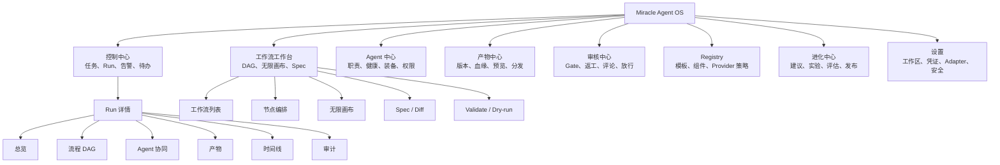
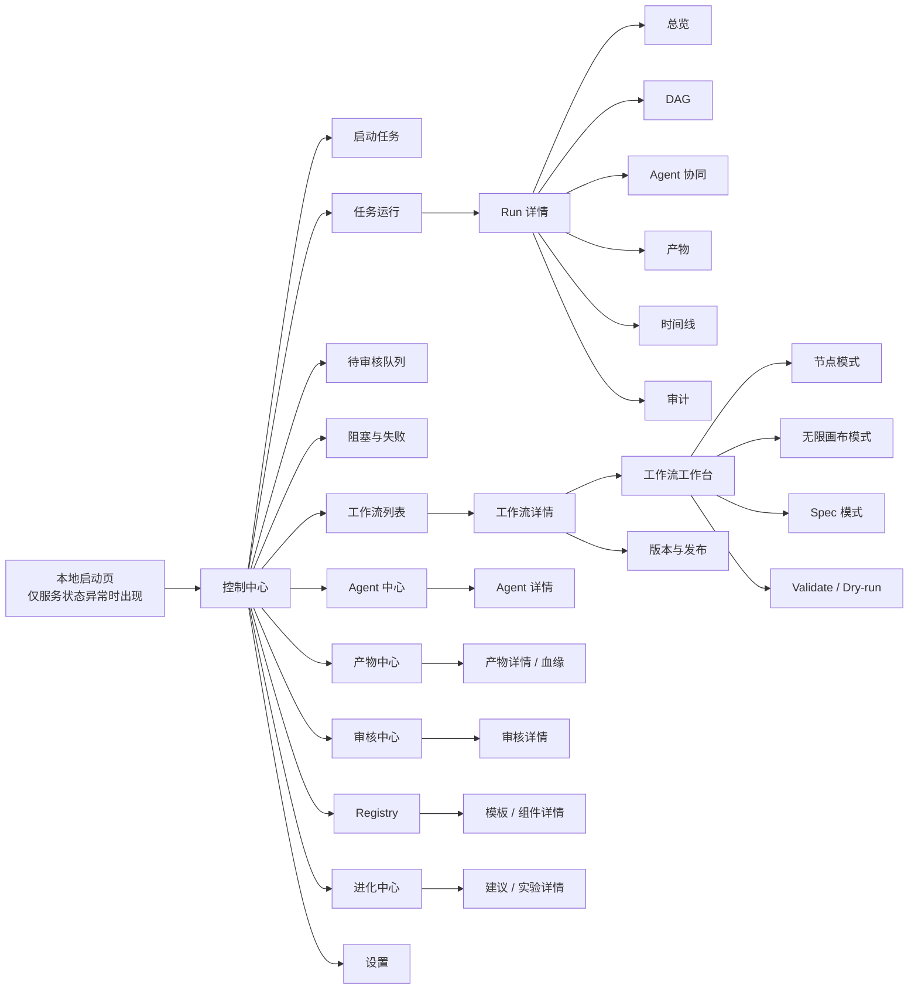
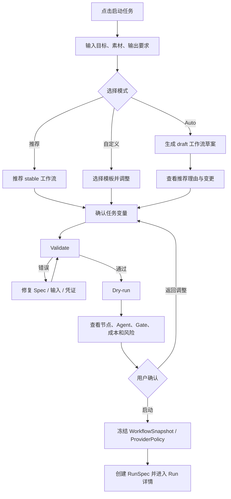
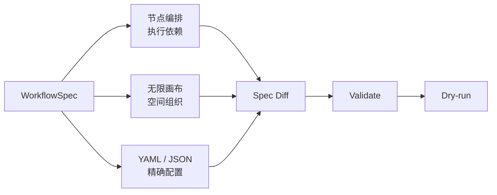
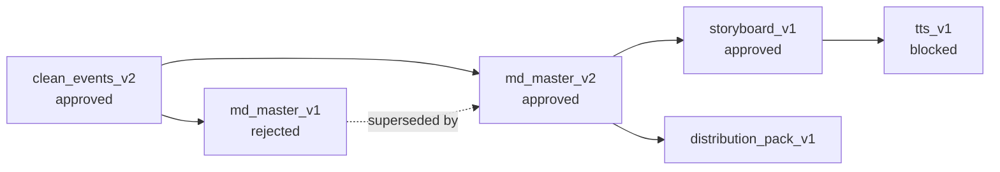
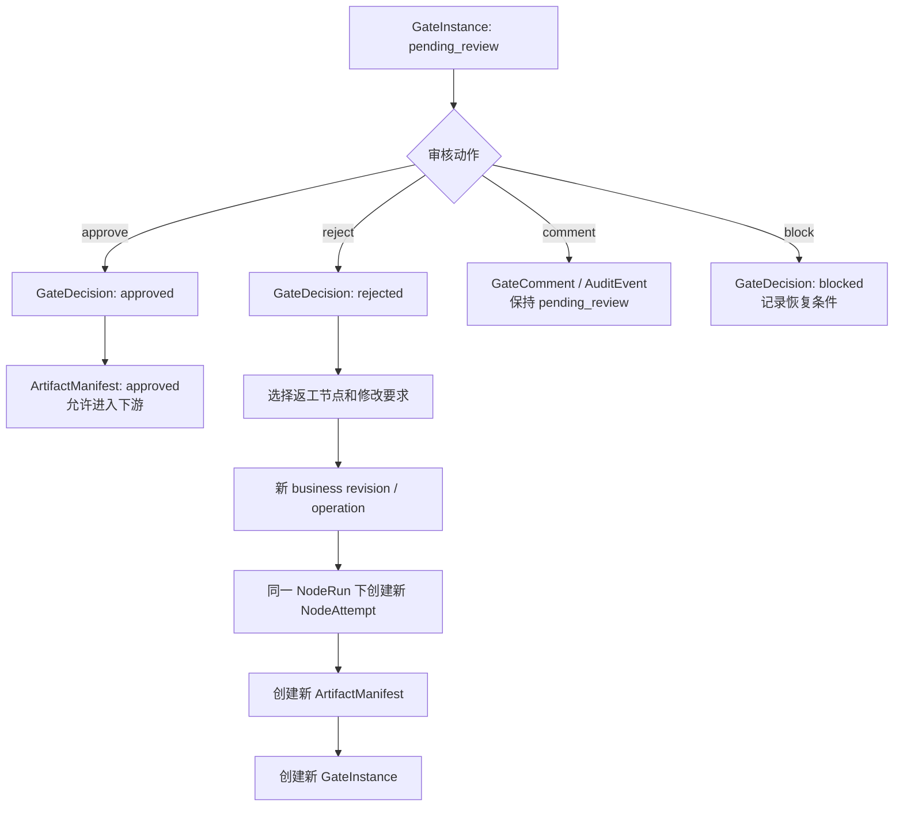
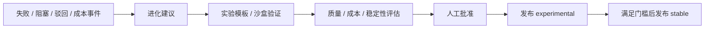
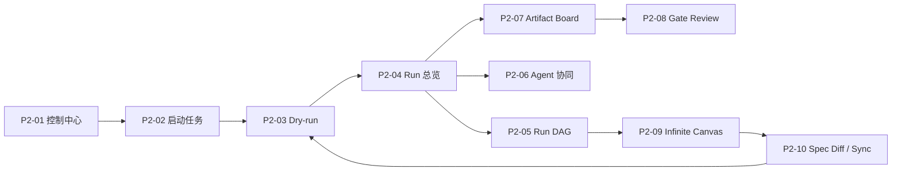

# 16_产品信息架构与设计图规划

> 文档状态：P2 第一版产品设计基线
>
> 前置输入：`09-15` 技术草案、架构选型与四轮架构评审结论
>
> 设计目标：把已确认的 Spec、Run、Agent、Artifact、Gate 和 Registry 模型转换为
> 可理解、可操作、可审计的产品体验
>
> 本文不重新讨论底层技术栈，不替代后续 Pencil 原型和 P3 详细技术设计

## 1. 产品阶段目标

Miracle P2 的目标不是把全部规划一次性画成高保真页面，而是先验证用户能否在一个复杂
多 Agent 任务中稳定完成以下闭环：

```text
选择或描述任务
-> 系统推荐工作流
-> Validate / Dry-run
-> 用户确认启动
-> 查看 DAG 与多 Agent 协同
-> 处理阻塞和审核
-> 查看产物及版本
-> 完成分发与复盘
-> 把改进建议发布为实验版本
```

第一版产品原型必须回答 6 个问题：

1. 用户从哪里启动任务，如何理解系统推荐的工作流。
2. 用户如何同时看清 Run、Node、Agent、Artifact 和 Gate。
3. 用户如何在 DAG 与无限画布之间切换而不产生两套流程。
4. 用户如何处理 `blocked / failed / pending_review / reconciling`。
5. 用户如何知道一次修改影响了哪个 Spec、Run 或产物版本。
6. 用户如何把一次成功运行沉淀为模板、组件或进化建议。

## 2. 产品定位与设计原则

### 2.1 产品定位

Miracle 的产品定位统一为：

> 面向内容生产、媒体资产和复杂智能任务的本地优先 Agent OS。

它不是单纯的聊天窗口、自动化连线工具或 Agent 列表，而是管理以下对象的统一控制平面：

- 工作流模板与版本。
- 任务运行实例与执行快照。
- 多 Agent 职责、状态和协作关系。
- 组件库、工具、技能、MCP 和 Provider。
- 产物版本、审核决定和分发结果。
- 失败恢复、审计记录和进化建议。

### 2.2 设计原则

| 原则 | 产品要求 |
|---|---|
| 运行优先 | 首页优先回答“现在发生了什么”，不做营销式欢迎页。 |
| 双层导航 | 主导航按工作域组织，Run 内按运行对象组织。 |
| 逐步展开 | 默认流程降低使用成本，高级配置按需展开。 |
| 状态可解释 | 每个异常状态必须显示原因、影响和恢复动作。 |
| Spec 可追踪 | 配置修改必须显示 spec diff、版本和影响范围。 |
| 运行事实只读 | 历史 Run 不能因模板更新被重写。 |
| 高风险可控 | 审核、发布、付费调用、覆盖和删除必须显式确认。 |
| 信息密度适中 | 控制台以扫描和操作效率为主，不使用大面积装饰性卡片。 |
| 中文优先 | 产品概念使用中文，协议对象保留英文名作为辅助。 |
| 本地优先 | 明确本地文件、外部 Provider、Git 和凭证引用的边界。 |

## 3. 用户角色与使用模式

### 3.1 核心用户角色

| 角色 | 核心目标 | 默认入口 |
|---|---|---|
| 任务发起者 | 快速启动任务并掌握进度。 | 控制中心 |
| 工作流设计者 | 组合节点、Agent、组件库和审核门。 | 工作流工作台 |
| 审核者 | 审核事实、内容、音频、视频和发布包。 | 审核中心 |
| 运行维护者 | 处理失败、凭证、Provider 和对账问题。 | Run 详情 / Agent 中心 |
| 模板维护者 | 管理 stable、experimental 和本地覆盖。 | Registry |
| 系统管理员 | 管理本地目录、凭证引用和安全策略。 | 设置 |

MVP 仍是单用户本地系统，上述角色表示职责视角，不引入多用户账号和 RBAC。

### 3.2 三种任务启动模式

| 模式 | 适用用户 | 产品行为 |
|---|---|---|
| 推荐模式 | 大多数用户 | 输入任务后由系统推荐 stable 工作流和默认组件。 |
| 自定义模式 | 熟悉流程的用户 | 从模板开始，允许调整节点、Agent、Provider 和 Gate。 |
| Auto 模式 | 希望系统辅助规划的用户 | 系统生成工作流草案和路由建议，用户确认后才能启动。 |

Auto 模式只能生成 `draft / experimental` 方案，不能静默修改 stable 工作流，也不能
越过人工审核门。

## 4. 总体产品信息架构

Miracle 的产品结构采用 8 个一级工作域：



### 4.1 一级导航

建议左侧主导航固定为：

```text
控制中心
任务运行
工作流
Agent
产物
审核
Registry
进化
设置
```

说明：

- “控制中心”是全局运营视图。
- “任务运行”是 Run 列表和历史查询。
- “工作流”是模板设计与版本管理入口。
- “Agent、产物、审核”提供跨 Run 的专业视图。
- “Registry”管理可复用能力，不和工作流编辑器混为一个页面。
- “进化”只展示建议和实验，不直接修改 stable 资产。

### 4.2 全局顶栏

顶栏保持紧凑，包含：

- 当前工作区。
- 全局搜索。
- 快速启动任务。
- 待审核数量。
- 阻塞与失败数量。
- Local Service 状态。
- 用户菜单与设置入口。

全局搜索范围：

```text
Run / Workflow / Node / Agent / Artifact / Gate / Component / Event
```

### 4.3 全局状态入口

顶栏的待办入口不只显示数字，展开后按紧急程度分组：

1. 需要人工决定：待审核、对账中、危险操作确认。
2. 需要修复：缺凭证、节点失败、Provider 不可用。
3. 需要关注：运行过慢、成本超预算、模板有远端更新。

## 5. 核心对象与页面归属

| 对象 | 主要页面 | 页面中的角色 |
|---|---|---|
| `WorkflowSpec` | 工作流工作台 | 模板与执行依赖的配置真相。 |
| `WorkflowSnapshot` | Run 详情 | 本次运行冻结的工作流版本。 |
| `RunSpec` | Run 详情 | 本次任务输入、策略和主状态。 |
| `NodeSpec` | DAG / Spec | 节点能力、输入输出和失败策略。 |
| `NodeRun` | Run DAG | 单个固定节点在本次 Run 中的聚合状态。 |
| `NodeAttempt` | 节点详情 | 重试、fallback、返工和真实执行历史。 |
| `AgentSpec` | Agent 中心 | Agent 的职责和静态能力。 |
| `AgentHealth` | Run / Agent 中心 | 当前状态、心跳、等待和恢复动作。 |
| `ArtifactSpec` | 工作流 / 产物中心 | 模板中的产物契约。 |
| `ArtifactManifest` | Run / 产物中心 | 某次运行的真实产物版本。 |
| `GateSpec` | 工作流工作台 | 模板中的审核策略。 |
| `GateInstance` | 审核中心 | 某次 Run 对具体产物的审核过程。 |
| `GateDecision` | 审核记录 | 不可变审核结果。 |
| `TraceEvent` | 时间线 / 审计 | 权威运行事件和审计事件。 |
| `ComponentLibrary` | Registry / Agent | 可装备能力组合。 |
| `ProviderPolicy` | 工作流 / 设置 | 路由、成本、质量和 fallback 策略。 |

产品设计不得把以下对象混为同一概念：

- WorkflowSpec 与 RunSpec。
- NodeRun 与 NodeAttempt。
- ArtifactSpec 与 ArtifactManifest。
- Agent 角色与 Runtime Adapter。
- Agent `reviewing` 与 Gate `pending_review`。
- Gate action 与 GateDecision result。

## 6. 页面地图



## 7. 应用壳层与页面布局

### 7.1 桌面优先布局

MVP 以桌面端为主要使用环境，推荐最小设计宽度 `1280px`，目标设计宽度
`1440px / 1600px`。

```text
┌──────────────────────────────────────────────────────────────────────────┐
│ 顶栏：工作区 / 搜索 / 快速启动 / 待办 / Local Service / 用户             │
├──────────────┬───────────────────────────────────────────────────────────┤
│ 一级导航      │ 页面标题 / 面包屑 / 页面级操作                            │
│              ├───────────────────────────────────────────────────────────┤
│ 控制中心      │                                                           │
│ 任务运行      │ 主内容区                                                   │
│ 工作流        │                                                           │
│ Agent        │                                                           │
│ 产物          │                                                           │
│ 审核          │                                                           │
│ Registry     │                                                           │
│ 进化          │                                                           │
│ 设置          │                                                           │
└──────────────┴───────────────────────────────────────────────────────────┘
```

### 7.2 Run 内二级导航

Run 详情使用固定二级标签：

```text
总览 | 流程 DAG | Agent 协同 | 产物 | 时间线 | 审计
```

页面顶部固定显示：

- Run 名称和 ID。
- WorkflowSnapshot 版本。
- 主状态。
- attention flags。
- 已运行时间和成本。
- 暂停、恢复、取消等操作。

### 7.3 工作流工作台二级导航

工作流编辑采用分段控件切换：

```text
节点编排 | 无限画布 | Spec
```

这三个入口编辑同一个 WorkflowSpec：

- 节点编排修改 nodes、edges、gates 和节点配置。
- 无限画布修改空间组织，也可将非执行卡片转换为 NodeSpec。
- Spec 显示 YAML/JSON、diff 和验证结果。

## 8. 控制中心设计

### 8.1 页面目标

控制中心帮助用户在 10 秒内回答：

1. 有多少任务正在运行。
2. 哪些任务需要我处理。
3. 哪些 Agent 或节点被阻塞。
4. 最近产生了哪些重要产物。
5. 今天的成本、耗时和成功率如何。

### 8.2 页面结构

```text
┌──────────────────────────────────────────────────────────────────────────┐
│ 控制中心                                      [启动任务] [导入工作流]     │
├──────────────────────────────────────────────────────────────────────────┤
│ 运行中 3    待审核 4    阻塞 2    失败 1    今日成本 ¥--                  │
├───────────────────────────────┬──────────────────────────────────────────┤
│ 需要处理                       │ 运行中的任务                              │
│ · B 母稿等待审核               │ Run / Workflow / 进度 / 当前节点 / Agent │
│ · TTS 缺少凭证                 │ 状态 / 耗时 / 成本 / 下一动作             │
│ · 发布节点正在对账             │                                          │
├───────────────────────────────┼──────────────────────────────────────────┤
│ Agent 健康                     │ 最近产物                                  │
│ healthy / slow / blocked       │ MD / PPT / 音频 / 视频 / 发布包           │
├───────────────────────────────┴──────────────────────────────────────────┤
│ 最近事件：审核、失败、fallback、Provider 切换、模板发布                    │
└──────────────────────────────────────────────────────────────────────────┘
```

### 8.3 交互规则

- 点击状态数字进入对应过滤后的专业页面。
- “需要处理”只显示有明确用户动作的项目。
- 运行中任务按 attention 严重程度排序，不按创建时间简单排序。
- 控制中心不承载复杂编辑，进入 Run 或 Workflow 后再处理细节。

## 9. 启动任务流程

### 9.1 启动向导

启动任务采用 4 步向导：

```text
1. 描述任务
2. 选择或确认工作流
3. Validate / Dry-run
4. 确认并启动
```

### 9.2 流程图



### 9.3 Dry-run 确认页

确认页分为 5 个区域：

- 执行摘要：节点数、Agent 数、并行分支和预计耗时。
- 风险与阻塞：缺失凭证、高成本、外部发布和大文件。
- 审核门：哪些节点必须人工批准。
- Provider 计划：首选、fallback、成本等级。
- 产物计划：将生成哪些 ArtifactSpec 实例。

禁止只显示“检查通过”。用户必须能展开看到执行计划和关键决策。

## 10. Run 详情设计

### 10.1 Run 总览

Run 总览聚合主状态，不替代专业视图：

```text
┌──────────────────────────────────────────────────────────────────────────┐
│ Run: Codex / Claude Code 资讯内容     running + pending_review           │
│ Workflow: content-production-v0@0.5  [暂停] [取消] [更多]                │
├──────────────────────────────────────────────────────────────────────────┤
│ 进度 5/8  │ 当前耗时 42m │ 成本 ¥-- │ Agent 4 active │ 产物 9            │
├───────────────────────────────┬──────────────────────────────────────────┤
│ 当前执行                       │ 需要处理                                  │
│ C0 脚本池：running             │ B 母稿审核                                │
│ D TTS：blocked                 │ VOLC_TTS_API_KEY 缺失                     │
├───────────────────────────────┼──────────────────────────────────────────┤
│ 工作流缩略图                   │ 最近产物                                  │
│ A -> B -> C0 -> C -> D ...    │ md_master_v2 / storyboard_v1              │
├───────────────────────────────┴──────────────────────────────────────────┤
│ 最近事件与下一步                                                     │
└──────────────────────────────────────────────────────────────────────────┘
```

### 10.2 主状态和 attention flags

Run 顶部必须同时显示：

```text
主状态：running
关注项：pending_review / blocked / reconciling
```

不能把 Run 简化为一个颜色。主状态回答“Run 是否还在运行”，attention 回答“是否需要
处理异常或审核”。

## 11. Workflow Node DAG 设计

### 11.1 页面结构

```text
┌──────────────────────────────────────────────────────────────────────────┐
│ Run / Workflow 名称     [Validate] [Dry-run] [节点|画布|Spec] [保存]      │
├───────────────┬───────────────────────────────────────┬──────────────────┤
│ 节点库/筛选    │ DAG 画布                               │ 节点详情          │
│ source        │ A -> B -> C0 -> C -> D -> E -> F      │ 配置 / 运行       │
│ transform     │       └───────────────> G              │ 输入输出 / Agent  │
│ gate          │                                        │ Attempts / 错误   │
│ subworkflow   │                                        │ 恢复动作          │
├───────────────┴───────────────────────────────────────┴──────────────────┤
│ 事件抽屉：当前节点事件 / 审计 / 日志                                     │
└──────────────────────────────────────────────────────────────────────────┘
```

### 11.2 节点卡信息层级

节点卡默认只显示高频信息：

- 节点名称和类型图标。
- NodeRun 聚合状态。
- 当前 Agent。
- 当前 Attempt 进度。
- 输入和输出数量。
- Gate、错误或阻塞徽标。

展开详情后显示：

- NodeSpec 摘要。
- resolved input artifact IDs 和 hashes。
- 全部 NodeAttempts。
- operation revision 和 execution mode。
- Runtime Adapter、Provider 和 fallback。
- ArtifactManifest。
- GateInstance 和 GateDecision。
- 成本、耗时、错误和恢复动作。

### 11.3 状态视觉规则

| 状态 | 主要视觉 | 必须显示 |
|---|---|---|
| queued | 中性描边 | 排队原因和前置依赖。 |
| running | 蓝色强调和进度 | 当前 Agent、开始时间。 |
| waiting | 黄色提示 | 等待对象。 |
| blocked | 红色边框 | 阻塞原因和恢复动作。 |
| reconciling | 紫色提示 | Provider receipt、对账动作，禁用直接重试。 |
| failed | 红色实心状态 | 错误摘要、retry/fallback 条件。 |
| done | 绿色完成 | 产物数量和下游状态。 |
| pending_review | 产物/Gate 徽标 | 待审核产物和审核入口。 |

### 11.4 编辑态与运行态

工作流工作台必须明确两种上下文：

- 模板编辑态：编辑 WorkflowSpec，可保存 diff、validate、dry-run 和发布版本。
- Run 运行态：查看 WorkflowSnapshot 和运行事实，不允许改写历史 snapshot。

运行中需要调整流程时，系统应创建 Run patch 或新的 workflow draft，不能直接篡改
stable WorkflowSpec。

## 12. 双模式工作流工作台

### 12.1 模式切换



切换模式时保持：

- 当前选中对象。
- 缩放和视口位置。
- 未保存变更状态。
- Validation 问题数量。
- 当前 workflow version。

### 12.2 无限画布页面结构

```text
┌──────────────────────────────────────────────────────────────────────────┐
│ Workflow 名称        [节点编排|无限画布|Spec] [整理布局] [发布]           │
├───────────────┬────────────────────────────────────────┬─────────────────┤
│ 对象工具栏     │ 自由画布                                │ 对象详情         │
│ 任务卡         │ [主题区] [事实区] [原型区]              │ 基础信息         │
│ Agent 卡      │ [内容区] [视频区] [分发区] [复盘区]     │ 绑定 Spec        │
│ 素材卡         │                                         │ 转为节点         │
│ 产物卡         │                                         │ 版本/关系        │
│ 区域/便签      │                                         │                  │
├───────────────┴────────────────────────────────────────┴─────────────────┤
│ 状态条：对象数 / 正式节点数 / 未绑定对象 / Validate 结果 / 未保存 diff    │
└──────────────────────────────────────────────────────────────────────────┘
```

### 12.3 卡片转节点

任务卡转 NodeSpec 时使用右侧配置抽屉，不在画布中央弹出大表单：

1. 选择节点类型。
2. 绑定输入和输出。
3. 选择 Agent 与组件库。
4. 选择插入位置。
5. 配置审核和失败策略。
6. 查看 spec diff。
7. Validate 后确认。

### 12.4 双视图同步反馈

每次结构修改后显示：

```text
新增 1 NodeSpec
新增 2 EdgeSpec
新增 1 ArtifactSpec
需要重新 Dry-run
```

只移动卡片时显示：

```text
CanvasLayout 已更新
执行依赖未变化
```

## 13. Agent Collaboration 设计

### 13.1 页面结构

```text
┌──────────────────────────────────────────────────────────────────────────┐
│ Agent 协同    healthy 6 / slow 1 / blocked 1       [Map|Timeline|依赖]   │
├──────────────────┬────────────────────────────────────┬──────────────────┤
│ Agent 健康列表    │ 协作关系图                          │ Agent 详情        │
│ 情报 Agent        │ 情报 -> 核验 -> 内容 -> 视频        │ 当前节点          │
│ 内容 Agent        │           └-> 审核 Agent            │ 等待对象          │
│ TTS Agent blocked │                                      │ 装备组件          │
│ 视频 Agent idle   │                                      │ Provider/权限     │
├──────────────────┴────────────────────────────────────┴──────────────────┤
│ 交接与事件：输入产物 -> Agent -> 输出产物 -> 下游 Agent                   │
└──────────────────────────────────────────────────────────────────────────┘
```

### 13.2 Agent 健康卡

默认字段：

- Agent 名称和职责。
- 运行状态与健康级别。
- 当前节点。
- Runtime Adapter / Provider。
- 最近事件时间。
- 等待对象或阻塞原因。
- 当前输出或交接产物。

点击卡片后再展示组件库、权限、全部工具调用和 provider 切换。

### 13.3 三种协同视图

| 视图 | 解决问题 |
|---|---|
| Agent Map | 谁和谁协作，职责如何分布。 |
| Execution Timeline | 每个 Agent 在什么时间执行、等待或交接。 |
| Dependency Graph | 谁在等待哪个节点、产物、凭证或 Gate。 |

Artifact Board 不作为 Agent 页第四个标签重复实现，而是提供跳转和局部交接带，完整资产
管理进入产物中心。

### 13.4 Provider 热切换

Provider 切换入口位于 Agent 详情的“运行配置”区：

```text
当前：Codex / GPT-5 Codex
候选：Official API / Claude / Local Model
```

确认前必须显示：

- 能力是否满足。
- 凭证是否就绪。
- 成本和质量变化。
- 是否创建新 Attempt。
- 是否需要重新 dry-run。

## 14. Artifact Board 设计

### 14.1 信息架构

产物中心支持两种视图：

1. Board：按业务阶段查看流转。
2. Lineage：按 producer、版本、审核和 consumer 查看血缘。

### 14.2 Board 页面

```text
事实底稿 | 内容资产 | 原型资产 | 音频字幕 | 视频资产 | 分发资产 | 复盘资产
---------|----------|----------|----------|----------|----------|---------
clean v2 | md v1    | pencil 1 | tts v1   | video v1 | pack v1  | retro 1
approved | rejected | approved | blocked  | draft    | waiting  | draft
```

产物卡默认显示：

- 名称、类型和版本。
- ArtifactManifest 状态。
- 所属 Run 和 producer NodeRun。
- hash 是否变化。
- Gate 状态。
- 下游消费者数量。
- 本地路径或外部链接。

### 14.3 产物详情

详情页分为：

- 预览/摘要。
- 元数据。
- 版本历史。
- 血缘关系。
- 审核记录。
- 下游消费。
- 文件操作与安全提示。

`latest` 和 `latest approved` 只作为逻辑指针展示，下游真实读取必须显示具体
artifact ID 和 hash。

### 14.4 产物血缘



## 15. Gate Review 审核中心

### 15.1 审核队列

审核队列按以下优先级排序：

1. 阻塞下游的人工审核。
2. 发布、付费调用等高风险审核。
3. 即将超时的审核。
4. 普通内容和资产审核。

筛选维度：

- Workflow / Run。
- 产物类型。
- Gate 类型。
- 风险等级。
- 等待时长。

### 15.2 审核详情

```text
┌──────────────────┬────────────────────────────────────┬──────────────────┐
│ 待审核队列        │ 产物预览 / 差异 / 版本              │ 审核操作          │
│ B 母稿 v2         │ md_master_v2                        │ [批准]            │
│ C 分镜 v1         │ 与 v1 的 diff                       │ [驳回]            │
│ F 成片 v1         │ 来源、hash、事实风险                │ [阻塞] [跳过]     │
│                  │                                      │ 评论与返工节点    │
├──────────────────┴────────────────────────────────────┴──────────────────┤
│ 历史决定、评论、ArtifactManifest、GateInstance 和审计事件                │
└──────────────────────────────────────────────────────────────────────────┘
```

### 15.3 审核返工流程



### 15.4 审核安全规则

- reject 必须填写原因和返工目标。
- approve/reject/block/skip 生成不可变 GateDecision。
- comment 不结束 GateInstance。
- 文件 hash 变化后旧批准失效。
- 批准按钮必须显示将放行的具体 artifact ID 和 hash。
- 发布类 Gate 必须再次显示目标平台和可能的外部副作用。

## 16. Registry 与组件管理

### 16.1 Registry 页面

Registry 使用列表和详情布局，支持：

- Workflow templates。
- Component libraries。
- Agent templates。
- Provider policies。

筛选：

```text
来源 / 类型 / 状态 / 版本 / 兼容性 / 最近更新
```

状态：

```text
draft / experimental / stable / deprecated / blocked
```

### 16.2 组件库详情

详情显示：

- 组件库包含的 skill、tool、MCP、prompt 和 provider。
- 输入输出能力。
- 需要的凭证。
- 权限范围。
- 兼容节点类型。
- 最近运行表现。
- 被哪些 Agent 和 Workflow 使用。

### 16.3 发布与升级

```text
local override
-> draft
-> experimental
-> sample run / evaluation
-> user approval
-> stable
```

远端模板升级时必须先显示：

- 版本差异。
- breaking changes。
- 本地覆盖冲突。
- 受影响工作流。
- 回退点。

## 17. Evolution Board 设计

Evolution Board 的列：

```text
新建议 -> 待验证 -> 实验中 -> 待批准 -> 已发布 -> 已拒绝
```

建议卡必须包含：

- 建议来源事件。
- 影响的 Workflow、Node、Agent 或 Component。
- 预期收益。
- 风险和验证方法。
- 生成的 spec diff。
- 建议发布状态。

第一版不允许建议直接修改 stable：



## 18. 错误、阻塞与恢复体验

所有异常详情统一采用：

```text
发生了什么
为什么发生
影响哪些节点和下游
系统已经做了什么
用户可以做什么
执行动作会产生什么后果
```

### 18.1 缺凭证

```text
状态：blocked
原因：缺少 VOLC_TTS_API_KEY
影响：D TTS 无法启动；视频分支尚未激活；MD 分发不受影响
动作：配置凭证 / 切换 Provider / 跳过音频分支
```

### 18.2 外部调用未知

```text
状态：reconciling
原因：已记录 attempt_dispatched，但未收到完整 AdapterResult
风险：外部平台可能已经执行，直接重试可能重复发布或重复付费
动作：查询 Provider receipt / 人工确认 / 标记未执行后重试
```

`reconciling` 状态不显示直接重试按钮。

### 18.3 Spec 冲突

```text
本地 UI 修改：B 节点 ProviderPolicy
文件修改：B 节点 inputs
远端更新：content-production-v0@0.6
```

用户可选择：

- 保留 UI 修改。
- 接受文件修改。
- 创建 local override。
- 手动合并。

stable 模板默认不能被覆盖。

## 19. 状态、颜色与术语规范

### 19.1 状态颜色

颜色只是辅助信息，必须同时显示文本和图标：

| 类别 | 建议色义 |
|---|---|
| running / active | 蓝色 |
| done / approved / healthy | 绿色 |
| waiting / slow / pending_review | 黄色 |
| stalled / warning | 橙色 |
| blocked / failed / rejected | 红色 |
| reconciling / experimental | 紫色 |
| idle / draft / deprecated | 灰色 |

### 19.2 中文术语

产品界面建议采用：

| UI 中文 | 协议对象 |
|---|---|
| 工作流模板 | WorkflowSpec |
| 运行快照 | WorkflowSnapshot |
| 任务运行 | RunSpec / Run |
| 节点运行 | NodeRun |
| 执行尝试 | NodeAttempt |
| 产物契约 | ArtifactSpec |
| 产物实例 | ArtifactManifest |
| 审核过程 | GateInstance |
| 审核决定 | GateDecision |
| 运行事件 | TraceEvent |
| 组件库 | ComponentLibrary |
| 运行时适配器 | Runtime Adapter |

对象详情和开发者模式可同时显示英文名，默认用户界面不要求用户记住所有协议术语。

## 20. 关键交互流程清单

Pencil 原型至少覆盖以下 10 条流程：

| ID | 流程 | 验证重点 |
|---|---|---|
| UX01 | 推荐模式启动 Flow A-G | 推荐理由、变量、dry-run、确认。 |
| UX02 | TTS 凭证缺失 | blocked 原因、影响范围、恢复动作。 |
| UX03 | 在 B 前插入 Pencil 节点 | DAG、Canvas、Spec diff 同步。 |
| UX04 | B 后新增内容精细策划子工作流 | 子流程折叠、输入输出和回主流程。 |
| UX05 | MD 审核驳回并返工 | 新 operation、Attempt、Artifact 和 Gate。 |
| UX06 | 查看多 Agent 协作 | 谁在运行、等待、阻塞和交接。 |
| UX07 | 查看产物版本与血缘 | latest、approved、hash 和下游读取。 |
| UX08 | 从 DAG 切换无限画布 | 同一 WorkflowSpec、选择和状态保持。 |
| UX09 | 外部发布进入 reconciling | Provider 对账和禁止盲目重试。 |
| UX10 | 进化建议发布 experimental | 建议来源、验证、审批和版本。 |

## 21. Pencil 原型页面清单

### 21.1 P0 必须设计

| Frame ID | 页面 | 主要状态 |
|---|---|---|
| `P2-01` | 控制中心 | running、pending_review、blocked 混合状态。 |
| `P2-02` | 启动任务-任务描述 | 推荐/自定义/Auto。 |
| `P2-03` | 启动任务-Dry-run | 缺凭证、Gate、成本和风险。 |
| `P2-04` | Run 总览 | 主状态 + attention flags。 |
| `P2-05` | Run DAG | NodeRun、Attempt、Gate 和 blocked。 |
| `P2-06` | Agent Collaboration | Map、健康卡、等待与交接。 |
| `P2-07` | Artifact Board | 版本、审核状态和血缘入口。 |
| `P2-08` | Gate Review | 批准、驳回、评论和返工。 |
| `P2-09` | Infinite Canvas | 七个业务区域和多类型卡片。 |
| `P2-10` | Spec Diff / Sync | UI、文件、远端模板冲突。 |

### 21.2 P1 建议设计

| Frame ID | 页面 |
|---|---|
| `P2-11` | 工作流列表与版本管理。 |
| `P2-12` | Agent 中心与组件装备。 |
| `P2-13` | 产物详情与 Lineage。 |
| `P2-14` | Registry 模板和组件详情。 |
| `P2-15` | Evolution Board。 |
| `P2-16` | 设置-工作区、凭证与 Adapter。 |

### 21.3 原型连接关系



## 22. 原型视觉方向

Miracle 是操作型控制台，视觉设计应保持：

- 低干扰中性色背景。
- 蓝色表示运行和主操作，绿色表示成功，红色表示失败和阻塞。
- 紫色只用于 experimental、reconciling 等少量特殊语义。
- 页面使用分栏、表格、时间线和图形关系，不堆叠装饰卡片。
- 卡片圆角不超过 8px。
- 图标优先使用统一图标库。
- 紧凑标题，不在工作台内使用超大字号。
- DAG 和 Canvas 让内容成为主视觉，不套装饰性外框。
- 重要状态不能只依赖颜色。

## 23. 响应式与可访问性边界

### 23.1 响应式

MVP 以桌面端为验收对象：

- `>= 1440px`：三栏完整布局。
- `1280-1439px`：压缩左侧导航和右侧详情宽度。
- `< 1280px`：右侧详情改为抽屉，仍可查看但不作为主要编辑环境。
- 移动端只提供状态查看、审核和简单恢复，不承载 DAG/Canvas 编辑。

### 23.2 可访问性

- 状态同时使用图标、颜色和文本。
- 所有图形节点可通过键盘选中。
- 画布提供对象列表视图作为辅助入口。
- 关键按钮有明确动词，如“批准产物”“开始对账”，不只写“确定”。
- 危险操作说明影响对象和不可逆结果。
- 时间、成本、hash、ID 使用可复制文本。

## 24. MVP 产品边界

### 24.1 本阶段必须完成

- 产品信息架构和页面地图。
- P0 页面低保真原型。
- 10 条关键交互流程。
- DAG、Agent、Artifact、Gate 和 Canvas 的状态一致性。
- 中文术语和状态规范。
- 原型评审清单。

### 24.2 本阶段暂不做

- 多用户账号、组织、租户和复杂权限后台。
- 多人实时协作。
- 移动端完整编辑器。
- 云端模板市场。
- 完整媒体编辑器。
- 自动发布 stable 工作流。
- 真实执行器和心跳服务。
- 高保真品牌官网或营销页。

## 25. 原型验收标准

### 25.1 信息架构

- 用户能从控制中心进入 Run、Workflow、Agent、Artifact 和 Review。
- Run 内 6 个二级视图职责清晰，不重复维护同一份事实。
- 工作流模板和运行实例有明显上下文区分。
- Registry、设置和进化中心不挤入运行主流程。

### 25.2 核心任务

- 用户能在 4 步内完成任务启动和 dry-run 确认。
- 用户能在 Run DAG 中定位当前节点、Agent、Attempt、错误和恢复动作。
- 用户能在 Agent 视图中看清等待和交接关系。
- 用户能在 Artifact Board 中找到当前批准版本和来源。
- 用户能完成审核驳回、填写返工要求并回到新 Attempt。
- 用户能从 DAG 切换 Canvas，并确认两者属于同一 WorkflowSpec。

### 25.3 架构一致性

- UI 不把 WorkflowSpec 当作运行事实。
- 历史 Run 不因模板修改而变化。
- NodeRun 和 NodeAttempt 分层可见。
- pending_review 只属于 GateInstance/ArtifactManifest。
- reconciling 不允许直接重试。
- UI 结构变化能形成 spec diff。
- layout 变化不改变执行 edges。

### 25.4 可用性

- 核心页面在 1440px 下没有文字或控件重叠。
- blocked、failed、pending_review 和 reconciling 能仅凭文本识别。
- 页面首屏能看到当前状态和主要下一动作。
- 低频技术字段默认折叠，但可以追溯。

## 26. P2 评审决策清单

进入高保真原型前，需要确认：

| ID | 决策项 | 本文建议 |
|---|---|---|
| P2D01 | 一级导航是否采用 8 个工作域 | 采用，控制中心和任务运行分开。 |
| P2D02 | Run 详情是否采用 6 个固定标签 | 采用，总览/DAG/Agent/产物/时间线/审计。 |
| P2D03 | Workflow Builder 是否三模式切换 | 采用，节点/画布/Spec。 |
| P2D04 | Artifact Board 是否独立为全局专业页面 | 采用，同时在 Run 内提供过滤视图。 |
| P2D05 | 审核是否独立工作域 | 采用，支持跨 Run 待办。 |
| P2D06 | Infinite Canvas 是否进入 P0 原型 | 采用，但实现优先级仍低于 DAG。 |
| P2D07 | 原型是否桌面优先 | 采用，移动端只验证查看和审核。 |
| P2D08 | 是否先做低保真再做视觉规范 | 采用，先验证信息密度和任务闭环。 |

## 27. 后续交付步骤

本文评审通过后，P2 按以下顺序推进：

1. 使用 Pencil 创建 `P2-01` 至 `P2-10` 低保真页面。
2. 串联 UX01、UX02、UX03、UX05、UX06、UX08、UX09 七条优先流程。
3. 使用 Flow A-G 的真实数据填充页面，不使用无意义占位文本。
4. 进行一次产品信息架构评审，检查导航、对象归属和页面重复。
5. 进行一次任务可用性评审，重点测试启动、阻塞、审核和返工。
6. 根据评审结果形成视觉规范和高保真原型。
7. P2 通过后发布 `v0.6.0 产品信息架构与原型基线`。
8. 进入 P3，输出工程目录、Schema、语义校验器、Local Service API 和实现任务拆解。

## 28. 第一版结论

Miracle 第一版产品不应从“万能聊天入口”开始，也不应先展示复杂的无限画布。产品主线应
先建立可控的任务运行闭环：

```text
控制中心
-> 启动任务
-> Dry-run
-> Run DAG
-> Agent 协同
-> Artifact / Gate
-> 复盘与进化
```

工作流工作台作为第二条主线，负责把成熟经验沉淀为可版本化模板：

```text
WorkflowSpec
<-> 节点编排
<-> 无限画布
<-> YAML / JSON
-> Validate
-> Dry-run
-> draft / experimental / stable
```

这两条主线共同构成 Miracle 的产品骨架：运行中心负责“把复杂任务管住”，工作流工作台
负责“把成功方法沉淀并复用”。
