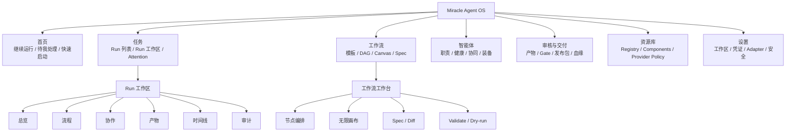
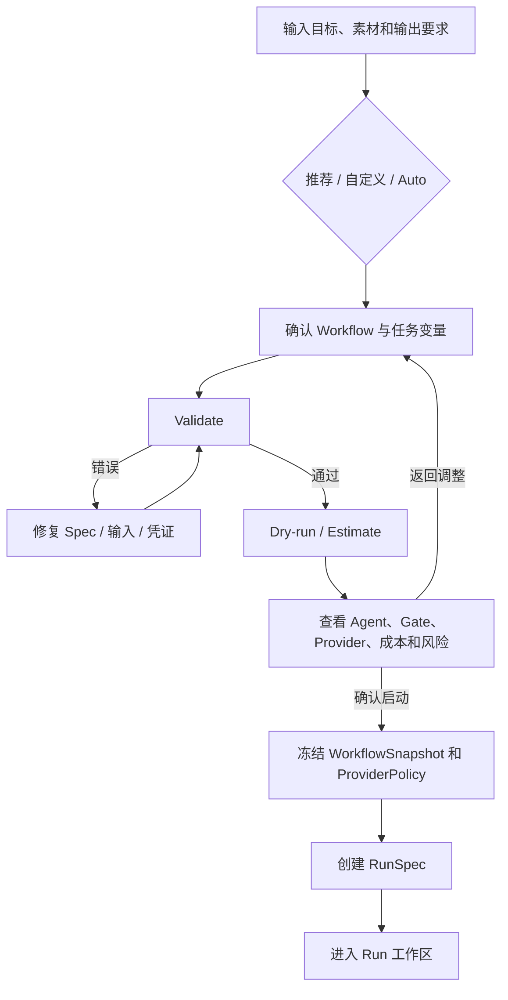
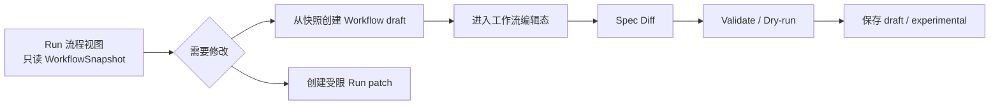
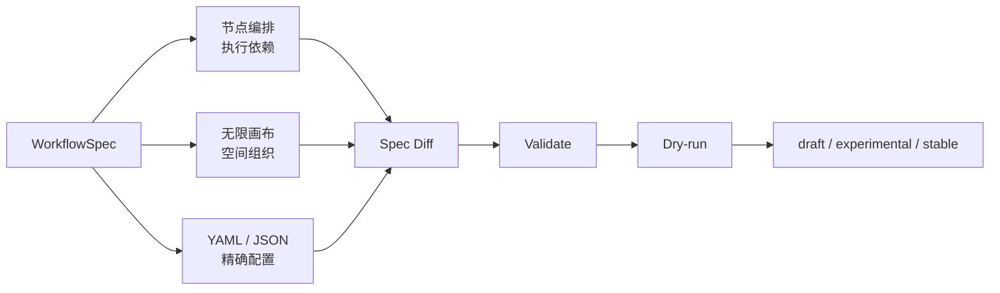
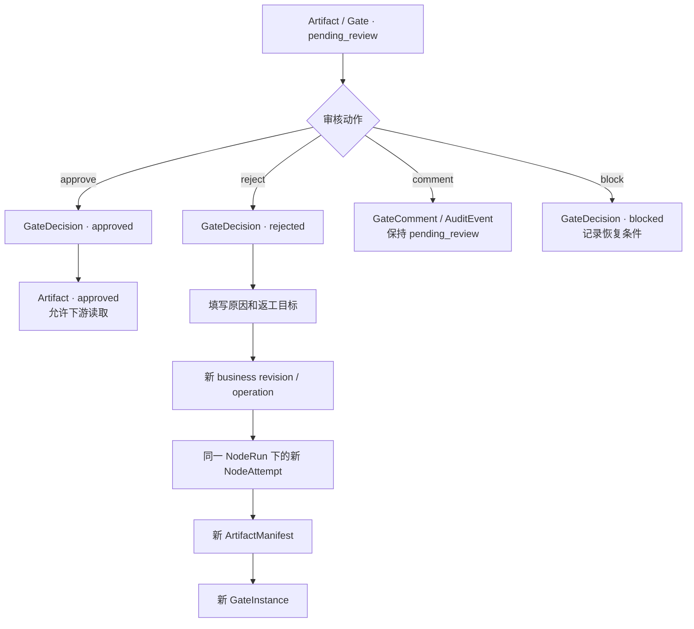
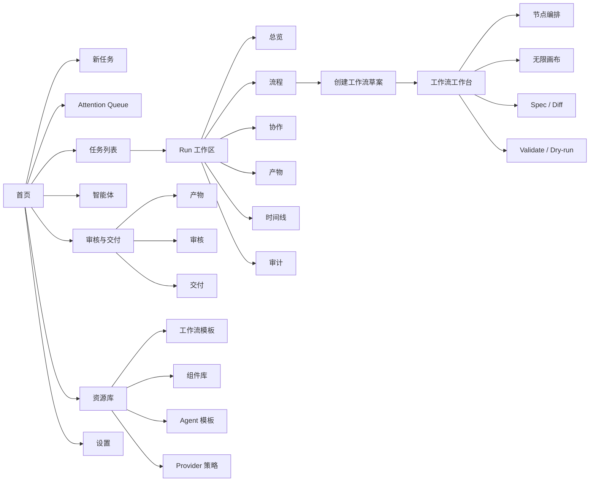

# 16_融合_产品信息架构与设计图规划

> 文档状态：P2 融合产品方案候选基线
>
> 融合来源：`16_产品信息架构与设计图规划.md` 与
> `16_abtest_产品信息架构与设计图规划.md`
>
> 融合原则：以正式版的架构对象和职责边界为事实基线，吸收 A/B 版的任务导向入口、
> Attention Queue、统一 Run 工作区和可量化原型测试方法
>
> 本文不覆盖原两份文档；原文件继续作为基线方案和对照研究记录
>
> 文档关系与 AI 阅读建议见 `17_文档资产关联与AI阅读导航.md`

## 1. 融合结论

Miracle 第一版产品采用：

```text
任务导向的默认入口
+ Run 中心的执行工作区
+ 专业对象可直接访问
+ 独立的工作流编辑态
+ 全局 Attention Queue
```

不采用两个极端：

- 不采用所有核心对象全部长期占据一级导航的纯对象域方案。
- 不采用把 Agent、Artifact、Registry 等专业对象全部收进 System 的纯任务域方案。

最终产品骨架：

```text
首页：告诉用户现在最应该做什么
任务：启动、运行、恢复和完成复杂任务
工作流：设计、验证和发布可版本化流程
智能体：查看职责、健康、协同、装备和权限
审核与交付：处理产物、Gate、版本、发布包和交付
资源库：管理模板、组件、Provider 策略和可复用能力
设置：管理工作区、凭证、Adapter 和本地安全
```

Evolution 在 MVP 中不单独占据一级导航：

- 单次运行的复盘和建议放在 Run 完成页。
- 工作流实验和版本升级放在工作流详情。
- 跨工作流的完整 Evolution Center 作为后续增强能力。

## 2. 为什么采用融合方案

### 2.1 正式版保留的核心价值

正式版的主要优势：

- WorkflowSpec、RunSpec、NodeRun、NodeAttempt、ArtifactManifest、GateInstance 等对象
  有明确页面归属。
- 模板编辑态和 Run 运行态边界清楚。
- Agent、Artifact、Registry 等 Miracle 核心能力不会被隐藏。
- 适合长期扩展为完整 Agent OS 控制平面。

这些内容属于产品架构基线，不能为了降低导航数量而丢失。

### 2.2 A/B 版吸收的核心价值

A/B 版最值得吸收：

- 首页从对象统计转向“继续运行、待我处理、快速启动、最近交付”。
- 使用统一 Attention Queue 承接审核、阻塞、失败、对账和冲突。
- Run 成为 WorkflowSnapshot、Agent、Artifact、Gate 和 Trace 的共同运行上下文。
- 状态标签显示对象归属，例如 `Artifact · pending_review`。
- 使用真实任务、严重错误和量化指标验证原型。

### 2.3 明确不吸收的设计

| 不采用项 | 原因 | 融合处理 |
|---|---|---|
| Agent 收入 System 二级菜单 | 多 Agent 协同是 Miracle 核心卖点 | Agent 保留一级入口 |
| Run 页面直接编辑 Workflow | 会混淆 WorkflowSnapshot 与 WorkflowSpec | Run 只读；修改需创建草案或 Run patch |
| Artifact、Gate、发布包全部挤入单页 | 信息量过大，专业资产管理能力被削弱 | 统一工作域，内部使用产物/审核/交付子视图 |
| 用“工作、构建、改进、系统”作为一级名称 | 名称抽象，首次使用不容易预测内容 | 使用任务、工作流、智能体、资源库等明确名称 |
| 完整制作两套 10 页原型再比较 | 成本高，且两版页面不完全等价 | 先制作融合主方案，仅对少量未决入口做局部对照 |
| 预设 B 必须比 A 快 20% | 会给实验带来方向性偏差 | 记录客观差值，以严重错误和任务成功率决策 |

## 3. 不可变产品与架构边界

以下规则不因信息架构、页面布局或原型测试而改变：

1. `WorkflowSpec` 是模板与编排的配置真相。
2. Run 启动时冻结 `WorkflowSnapshot`、组件版本和 `ProviderPolicy`。
3. `Event Journal` 是权威追加日志，运行页面是可重建投影。
4. 同一 Run 中每个固定节点只有一个 `NodeRun`。
5. retry、fallback、返工和重新执行通过不同 `NodeAttempt` 保留历史。
6. `NodeRun.done` 不代表产物已审核放行。
7. `pending_review` 属于 `GateInstance` 和 `ArtifactManifest`。
8. `GateDecision` 必须绑定具体 artifact ID 和 hash。
9. dispatched 未 received 时进入 `reconciling`，禁止盲目重试。
10. DAG 是严肃执行视图，Canvas 是空间组织和实验视图。
11. DAG、Canvas、YAML/JSON 编辑同一份 WorkflowSpec。
12. layout 变化不改变执行 edges。
13. stable 模板不能被 UI、同步冲突或自动进化静默覆盖。
14. Run 中展示的是冻结快照和运行事实，不直接编辑 stable WorkflowSpec。

## 4. 产品定位与目标用户

### 4.1 产品定位

> Miracle 是面向个人、一人公司和小型 AI 团队的本地优先 Agent OS 与工作流控制平面。

第一条真实样本仍是“热点工具更新”Flow A-G：

```text
A 情报采集与事实核验
-> B 内容 MD 母稿
-> C0 脚本池生成与评审
-> C PPT / 视频分镜
-> D TTS / 字幕
-> E HyperFrames 视觉视频
-> F 音画整合与最终渲染
-> G 分发复盘
```

### 4.2 核心用户

| 用户 | 核心目标 | 默认入口 |
|---|---|---|
| 一人公司操作者 | 用推荐模板完成完整任务 | 首页 / 任务 |
| 任务发起者 | 启动任务并掌握进度 | 首页 / 任务 |
| 多 Agent 总控 | 查看执行、等待、阻塞和交接 | 智能体 / Run 协作 |
| 工作流设计者 | 调整节点、Gate、组件和 Provider | 工作流 |
| 审核者 | 审核具体产物版本并决定放行 | 审核与交付 |
| 系统维护者 | 管理模板、组件、凭证和 Adapter | 资源库 / 设置 |

MVP 为本地单用户系统，上述角色是职责视角，不引入账号、组织或复杂 RBAC。

### 4.3 核心 Jobs To Be Done

1. 启动复杂任务前，看到流程、Agent、凭证、审核门、成本和风险。
2. 任务运行时，知道执行到哪里、谁在做、什么在等待。
3. 任务异常时，理解原因、影响范围和安全恢复动作。
4. 审核产物时，确认具体版本和 hash 后再决定放行或返工。
5. 修改工作流时，看到 Spec diff，并确认不会污染正在运行的任务。
6. 运行结束后，查看产物、成本、失败和进化建议。

## 5. 融合信息架构

### 5.1 一级导航

最终一级导航采用 7 个工作域：

```text
首页
任务
工作流
智能体
审核与交付
资源库
设置
```



### 5.2 导航职责

| 一级入口 | 用户问题 | 主要对象 |
|---|---|---|
| 首页 | 现在最应该做什么 | Run 摘要、Attention、最近产物 |
| 任务 | 哪些任务在运行，如何继续或恢复 | RunSpec、WorkflowSnapshot、TraceEvent |
| 工作流 | 如何设计和发布可复用流程 | WorkflowSpec、NodeSpec、GateSpec |
| 智能体 | 谁在执行，能力和健康如何 | AgentSpec、AgentHealth、PermissionMatrix |
| 审核与交付 | 哪些产物需要审核，如何交付 | ArtifactManifest、GateInstance、发布包 |
| 资源库 | 有哪些可复用模板和能力 | Registry、ComponentLibrary、ProviderPolicy |
| 设置 | 本地环境是否可以安全运行 | Workspace、Credential、Runtime Adapter |

### 5.3 为什么 Agent 保持一级入口

Agent 不属于普通系统配置：

- 用户需要跨 Run 查看 Agent 当前负载和健康。
- Agent 有长期职责、组件装备、权限和 Provider。
- Miracle 的核心差异之一是多 Agent 协同可视化。
- 如果 Agent 只存在于 Run 内，用户无法建立系统级职责和能力认知。

因此：

```text
Run 内“协作” = 当前任务的 Agent 运行视图
一级“智能体” = 跨任务的 Agent 管理与健康视图
```

### 5.4 为什么 Artifact 和 Gate 合并到一个工作域

运行产物和审核决定高度关联：

- 用户通常先看到待审核产物，再做 Gate 决定。
- 发布包和交付状态依赖已批准产物。
- Artifact Board、审核队列和发布包需要共享过滤条件。

但内部仍必须保留三个子视图：

```text
产物
审核
交付
```

不能将 ArtifactManifest、GateInstance 和发布结果合并为同一个对象。

### 5.5 为什么 Evolution 暂不占一级入口

MVP 中 Evolution 仍是重要能力，但使用频率低于任务、Agent 和审核：

- 单次运行建议在 Run 完成页查看。
- 工作流改进在工作流版本页查看。
- 实验发布在工作流详情中处理。

待跨工作流建议数量和实验规模增长后，再升级为独立 Evolution Center。

## 6. 全局应用壳层

### 6.1 桌面布局

```text
┌──────────────────────────────────────────────────────────────────────────┐
│ 工作区 / 全局搜索 / + 新任务 / Attention / Local Service / 用户          │
├──────────────┬───────────────────────────────────────────────────────────┤
│ 首页          │ 页面标题 / 面包屑 / 页面主操作                            │
│ 任务          ├───────────────────────────────────────────────────────────┤
│ 工作流        │                                                           │
│ 智能体        │ 主内容区                                                   │
│ 审核与交付    │                                                           │
│ 资源库        │                                                           │
│ 设置          │                                                           │
└──────────────┴───────────────────────────────────────────────────────────┘
```

推荐尺寸：

- 桌面原型视口：`1440 × 960`。
- 左侧导航：`216-224px`。
- 顶部全局栏：`56px`。
- 右侧上下文面板：`320-360px`。
- Run 状态栏：`64-72px`。
- 底部事件抽屉展开不超过视口高度 `36%`。

### 6.2 全局顶栏

顶栏包含：

- 当前工作区。
- 全局搜索。
- `+ 新任务`。
- Attention 数量。
- Local Service 和 Adapter 状态。
- 用户菜单和设置。

全局搜索范围：

```text
Run / Workflow / Node / Agent / Artifact / Gate / Component / Event
```

### 6.3 面包屑与对象深链接

任务导向导航不能隐藏专业对象，所有详情必须提供深链接：

```text
任务 / Run-20260619 / 流程 / D_tts_caption
智能体 / tts-agent / 当前 Run
审核与交付 / md_master_v2 / Gate-B-002
工作流 / content-production-v0 / 版本 0.6
```

## 7. 首页设计

### 7.1 页面目标

首页在 10 秒内回答：

1. 我现在最应该处理什么。
2. 哪些任务正在运行。
3. 哪些异常会阻塞下游。
4. 最近生成了什么重要产物。
5. 如何快速启动新任务。

### 7.2 首页结构

```text
┌──────────────────────────────────────────────────────────────────────────┐
│ 早上好                                     [+ 新任务] [导入工作流]        │
├──────────────────────────────────────────────────────────────────────────┤
│ 待我处理 4                                                              │
│ [母稿待审核] [TTS 缺凭证] [发布等待对账] [Spec 同步冲突]                 │
├──────────────────────────────────────┬───────────────────────────────────┤
│ 继续运行                              │ 快速启动                           │
│ Run / 当前阶段 / 进度 / 下一动作      │ 推荐模板 / 最近模板 / 从描述开始   │
├──────────────────────────────────────┼───────────────────────────────────┤
│ 最近交付                              │ Agent 健康                         │
│ MD / 音频 / 视频 / 发布包             │ healthy / slow / blocked           │
├──────────────────────────────────────┴───────────────────────────────────┤
│ 系统风险：凭证、Provider、成本预算、Local Service                       │
└──────────────────────────────────────────────────────────────────────────┘
```

### 7.3 首页优先级

首页信息排序：

1. 需要人工决定。
2. 会阻塞下游的异常。
3. 正在运行且需要关注的任务。
4. 最近完成和最近交付。
5. 系统级提醒。

对象总数不作为首页主视觉，只在需要时展示。

## 8. Attention Queue

### 8.1 定位

Attention Queue 是跨 Run 的行动队列，不是新的底层状态对象。

它聚合：

```text
pending_review
blocked
failed
reconciling
timed_out
spec_conflict
credential_missing
dangerous_action_confirmation
```

### 8.2 分组规则

| 分组 | 示例 | 用户动作 |
|---|---|---|
| 需要决定 | 待审核、发布确认、超时选择 | 批准、驳回、继续或取消 |
| 需要修复 | 缺凭证、输入缺失、Provider 失败 | 配置、补输入、切换 Provider |
| 需要核对 | dispatched 未 received | 查询 receipt、人工确认 |
| 需要关注 | 运行过慢、成本超预算 | 查看影响、调整策略 |
| 配置冲突 | UI、文件和远端版本冲突 | 保留、合并或创建 override |

### 8.3 Attention 卡片

必须显示：

- 对象类型和对象 ID。
- 所属 Run / Workflow。
- 当前状态。
- 发生原因。
- 影响范围。
- 推荐动作。
- 最晚处理时间或已等待时间。

示例：

```text
NodeRun · blocked
D_tts_caption
原因：缺少 VOLC_TTS_API_KEY
影响：视频分支无法继续；MD 分发不受影响
动作：配置凭证 / 切换 Provider / 跳过 TTS
```

## 9. 任务启动流程

### 9.1 三种启动模式

| 模式 | 默认用户 | 行为 |
|---|---|---|
| 推荐模式 | 大多数用户 | 推荐 stable 工作流和默认组件 |
| 自定义模式 | 熟悉流程的用户 | 从模板开始调整参数和策略 |
| Auto 模式 | 需要系统辅助规划的用户 | 生成 draft 方案，确认后启动 |

Auto 模式不得自动发布 stable，也不得越过人工审核门。

### 9.2 四步启动向导

```text
1. 描述任务
2. 确认工作流与输入
3. Validate / Dry-run
4. 确认并启动
```



### 9.3 Dry-run 确认页

必须展示：

- 执行节点和并行分支。
- 参与 Agent。
- 缺失凭证和外部依赖。
- 人工审核门。
- Provider 和 fallback。
- 预计耗时和成本。
- 将生成的产物。
- 高风险外部副作用。

禁止只显示“检查通过”。

## 10. Run 工作区

### 10.1 产品定位

Run 工作区是一次真实任务的共同运行上下文：

```text
WorkflowSnapshot
+ RunSpec
+ NodeRun / NodeAttempt
+ AgentHealth
+ ArtifactManifest
+ GateInstance / GateDecision
+ TraceEvent
```

### 10.2 页面骨架

```text
顶部：Run 名称 / WorkflowSnapshot / 主状态 / Attention / 成本 / 耗时
左侧：Flow A-G 阶段导航
中间：当前主视图
右侧：对象详情、影响范围和恢复动作
底部：事件、审计和系统消息抽屉
```

### 10.3 固定视图

Run 内使用 6 个固定视图：

```text
总览 | 流程 | 协作 | 产物 | 时间线 | 审计
```

| 视图 | 回答的问题 | 主要数据 |
|---|---|---|
| 总览 | 当前进度和下一步是什么 | RunSpec、attention、关键事件 |
| 流程 | 哪些节点完成、等待或阻塞 | WorkflowSnapshot、NodeRun |
| 协作 | 谁在执行、等待和交接 | AgentSpec、AgentHealth |
| 产物 | 生成了哪些版本，谁会消费 | ArtifactManifest、ArtifactSpec |
| 时间线 | 运行中按时间发生了什么 | TraceEvent / Event Journal |
| 审计 | 谁做了哪些高风险决定 | AuditEvent、GateDecision |

审核操作通过产物详情或 Attention 打开审核抽屉；跨 Run 审核统一进入“审核与交付”。

### 10.4 主状态与 Attention

Run 顶部同时显示：

```text
Run · running
Attention · pending_review
Attention · blocked
```

主状态回答 Run 是否仍在运行；Attention 表示是否需要人工处理。

### 10.5 Run 编辑边界

Run 中的流程视图默认只读：

- 展示冻结的 WorkflowSnapshot。
- 展示 NodeRun、NodeAttempt 和实际 resolved inputs。
- 允许暂停、恢复、取消、重试或发起对账。
- 不允许直接修改 stable WorkflowSpec。
- 不允许改变历史 snapshot。

需要调整结构时提供明确动作：

```text
创建工作流草案
创建 local override
创建 Run patch
```

处理流程：



`Run patch` 的具体执行范围由 P3 定义；P2 原型只验证入口和风险提示。

## 11. Run 流程与节点详情

### 11.1 DAG 是默认执行视图

节点卡默认显示：

- 节点名称。
- `NodeRun` 状态。
- 当前 Agent。
- 输入就绪数和输出产物数。
- Gate 或 Attention。
- 耗时和成本。

节点详情展示：

- NodeSpec 摘要。
- resolved artifact IDs 和 hashes。
- 当前及历史 NodeAttempts。
- operation revision 和 execution mode。
- Runtime Adapter、Provider 和 fallback。
- ArtifactManifest。
- GateInstance 和 GateDecision。
- 错误、影响和恢复动作。

### 11.2 状态必须带对象归属

正确：

```text
Run · running
NodeRun · done
Artifact · pending_review
Gate · pending_review
Agent · reviewing
Attempt · timed_out
NodeRun · reconciling
```

不推荐：

```text
状态：完成
状态：审核中
状态：阻塞
```

### 11.3 异常状态

| 状态 | 必须显示 | 操作限制 |
|---|---|---|
| waiting | 等待对象 | 不显示无意义重试 |
| blocked | 原因、影响和恢复动作 | 修复后重新调度 |
| failed | 错误摘要、retry/fallback 条件 | 不能绕过修复生成 approved |
| timed_out | Attempt 和外部状态 | 先判断是否可安全重试 |
| reconciling | receipt、核对动作和重复副作用风险 | 禁止普通重试 |

## 12. 工作流工作台

### 12.1 编辑上下文

工作流工作台是 WorkflowSpec 的正式编辑器，与 Run 工作区分离。

三种模式：

```text
节点编排 | 无限画布 | Spec
```



### 12.2 DAG 与 Canvas 边界

- DAG 编辑 nodes、edges、gates 和执行配置。
- Canvas 编辑空间组织，可将任务卡转为 NodeSpec。
- Spec 模式编辑 YAML/JSON 和精确字段。
- 三种模式共享同一 WorkflowSpec。
- CanvasLayout 和 DagLayout 不参与执行依赖。
- stable 修改默认创建新版本或 local override。

### 12.3 Canvas MVP

Canvas 包含：

```text
主题区 / 事实区 / 原型区 / 内容区 / 视频区 / 分发区 / 复盘区
```

对象：

- 任务卡。
- Agent 卡。
- 素材卡。
- 产物卡。
- 节点卡。
- 灵感卡。
- 区域。
- 版本分支。

任务卡转节点必须经过：

```text
补齐输入输出
-> 选择 Agent 和组件库
-> 选择插入位置
-> 生成 Spec diff
-> Validate
-> Dry-run
```

## 13. 智能体中心

### 13.1 跨 Run Agent 视图

一级“智能体”页面用于查看：

- Agent 名称和职责。
- 当前状态和健康级别。
- 当前 Run 和 NodeRun。
- Runtime Adapter 和 Provider。
- 组件装备。
- 权限摘要。
- 等待对象。
- 最近产物和交接对象。
- 最近成功率、失败原因和成本。

### 13.2 Run 内协作视图

```text
左侧：当前 Run Agent 健康列表
中间：协作关系 / 等待 / 交接图
右侧：Agent 详情、Provider、装备和权限
底部：工具调用、事件和审计
```

支持三种视图：

| 视图 | 用途 |
|---|---|
| Agent Map | 查看职责和协作关系 |
| Execution Timeline | 查看执行、等待和交接时间 |
| Dependency Graph | 查看节点、产物、凭证和 Gate 依赖 |

### 13.3 Provider 热切换

切换前必须显示：

- 能力是否满足当前节点。
- 凭证是否存在。
- 当前 Agent 是否有权限。
- 成本和质量变化。
- 是否创建新 Attempt。
- 是否需要重新 Dry-run。

## 14. 审核与交付

### 14.1 子导航

```text
产物 | 审核 | 交付
```

### 14.2 产物

提供两种视图：

- Board：按事实、内容、原型、音频、视频、分发和复盘阶段查看。
- Lineage：按 producer、version、Gate 和 consumer 查看血缘。

产物卡必须显示：

- ArtifactManifest ID 和 ArtifactSpec。
- version。
- Run、NodeRun、NodeAttempt。
- 状态、路径或外部链接、hash。
- producer、consumer 和 source event。
- GateInstance。
- latest 和 latest approved 逻辑指针。

### 14.3 审核

审核队列优先级：

1. 阻塞下游的审核。
2. 发布和付费调用等高风险审核。
3. 即将超时的审核。
4. 普通内容和媒体审核。

审核前必须显示：

- artifact ID。
- version。
- hash。
- 与上一版本的差异。
- 上游来源和下游影响。

### 14.4 审核返工



### 14.5 交付

交付视图管理：

- 已批准发布包。
- 发布目标。
- 发布前确认。
- 外部平台 receipt。
- 分发状态。
- 交付清单和复盘入口。

真实发布、删除、覆盖和付费调用必须再次确认。

## 15. 资源库

资源库管理可复用能力：

```text
工作流模板
组件库
Agent 模板
Provider 策略
```

状态：

```text
draft / experimental / stable / deprecated / blocked
```

详情包含：

- 来源和版本。
- 输入输出能力。
- skill、tool、MCP、prompt 和 provider。
- 凭证与权限要求。
- 兼容对象。
- 最近运行表现。
- 被哪些 Workflow 和 Agent 使用。

发布过程：

```text
local override
-> draft
-> experimental
-> sample run / evaluation
-> user approval
-> stable
```

## 16. Evolution 的上下文化设计

### 16.1 Run 完成页

展示：

- 成功和失败节点。
- 返工次数。
- 成本和耗时。
- 用户审核意见。
- 候选进化建议。

### 16.2 工作流详情

增加“实验与改进”子视图：

```text
新建议 -> 待验证 -> 实验中 -> 待批准 -> 已发布 / 已拒绝
```

建议必须包含：

- 触发证据。
- 影响对象。
- 预期收益。
- 风险。
- spec diff。
- 验证结果。

任何建议都不能直接修改 stable。

## 17. 错误与恢复体验

所有异常统一回答：

```text
发生了什么
为什么发生
影响什么
系统已经做了什么
用户现在可以做什么
每个动作会产生什么后果
```

### 17.1 TTS 凭证缺失

```text
NodeRun · blocked
原因：缺少 VOLC_TTS_API_KEY
影响：视频分支无法继续；MD 分发不受影响
动作：配置凭证 / 切换 Provider / 跳过 TTS
```

### 17.2 外部结果未知

```text
NodeRun · reconciling
原因：已记录 attempt_dispatched，但没有完整 AdapterResult
风险：外部平台可能已经执行
动作：查询 Provider receipt / 人工确认 / 确认未执行后创建新 Attempt
```

不提供普通“重试”按钮。

### 17.3 Spec 冲突

显示：

- UI 修改。
- 文件修改。
- 远端模板更新。
- 受影响字段。
- stable 风险。

允许：

- 保留 UI。
- 接受文件。
- 手动合并。
- 创建 local override。

不允许静默覆盖 stable。

## 18. 页面地图



## 19. Pencil 原型范围

### 19.1 融合主方案页面

| Frame ID | 页面 | 关键状态 |
|---|---|---|
| `P2F-01` | 任务型首页 | 继续运行、待我处理、快速启动 |
| `P2F-02` | 新任务-描述与推荐 | 推荐/自定义/Auto |
| `P2F-03` | Validate / Dry-run | 缺凭证、Gate、成本、风险 |
| `P2F-04` | Run 总览 | running + 多个 Attention |
| `P2F-05` | Run 流程 | 只读快照、NodeRun、Attempt |
| `P2F-06` | Attention Queue | review、blocked、reconciling、conflict |
| `P2F-07` | Run 协作 | Agent Map、健康、等待和交接 |
| `P2F-08` | 审核与交付 | Artifact、Gate、版本和返工 |
| `P2F-09` | 工作流 DAG 编辑态 | NodeSpec、EdgeSpec、Diff |
| `P2F-10` | Infinite Canvas | 七个区域和任务卡转节点 |
| `P2F-11` | 智能体中心 | 跨 Run 健康、装备和 Provider |
| `P2F-12` | 资源库 | 模板、组件、Agent 和策略 |

### 19.2 第一轮优先页面

先制作：

```text
P2F-01 首页
P2F-02 新任务
P2F-03 Dry-run
P2F-04 Run 总览
P2F-05 Run 流程
P2F-06 Attention Queue
P2F-07 Run 协作
P2F-08 审核与交付
```

工作流编辑、Canvas、智能体中心和资源库在主任务闭环通过后补齐。

### 19.3 共享组件

- App Shell。
- Global Search。
- Run Status Bar。
- Attention Badge / Item。
- Node Card。
- Agent Health Card。
- Artifact Card。
- Gate Review Panel。
- Recovery Action Panel。
- Event Timeline Row。
- Spec Diff Panel。
- Validate / Dry-run Summary。

组件状态：

```text
default / hover / selected / disabled / loading /
success / warning / blocked / failed / reconciling
```

## 20. 关键交互任务

| ID | 任务 | 成功标准 |
|---|---|---|
| T1 | 启动 Flow A-G | 发现凭证、Gate、风险并理解冻结快照 |
| T2 | 处理 TTS blocked | 找到安全动作并理解对下游影响 |
| T3 | 驳回 MD 母稿 | 确认版本/hash并创建新 revision/Attempt |
| T4 | 插入 Pencil 节点 | 不覆盖 stable，经过 diff/validate/dry-run |
| T5 | DAG 与 Canvas 切换 | 理解共用 Spec、布局不影响依赖 |
| T6 | 处理 reconciling | 先核对 Provider，不盲目重试 |
| T7 | 处理 Spec 冲突 | 查看差异并选择 override 或合并 |
| T8 | 纯 Markdown 分发 | 理解视频分支可选和等待策略 |
| T9 | 查看多 Agent 协同 | 识别执行者、等待对象和交接产物 |
| T10 | 从 Run 创建工作流草案 | 理解 Run 快照只读和模板编辑边界 |

## 21. 低保真视觉规范

### 21.1 信息密度

- 首屏最多 1 个主动作、3 个次动作和 5 个关键摘要。
- 高级 ID、hash、operation 和 attempt 默认折叠。
- 同一区域不同时使用超过 3 种强调色。
- 状态必须有图标、文字和对象归属。
- 控制台使用表格、分栏、时间线和关系图，不堆叠装饰性卡片。

### 21.2 状态色义

| 状态 | 色义 |
|---|---|
| running / active | 蓝色 |
| done / approved / healthy | 绿色 |
| waiting / pending_review | 黄色 |
| stalled / warning | 橙色 |
| blocked / failed / rejected | 红色 |
| reconciling / experimental | 紫色 |
| idle / draft / deprecated | 灰色 |

颜色不能作为唯一识别方式。

### 21.3 文案

推荐：

```text
TTS 节点尚未开始，因为缺少 VOLC_TTS_API_KEY。
视频分支无法继续，但 MD 分发不受影响。
```

避免：

```text
Error 401
Blocked
Operation failed
```

## 22. 局部验证方案

融合方案已经确定产品骨架，不再制作两套完整 IA。只对以下未决细节做局部原型对照：

### 22.1 首页布局

对照：

- 左侧先显示 Attention，右侧显示继续运行。
- 左侧先显示继续运行，右侧显示 Attention。

### 22.2 Attention 入口

对照：

- 顶栏抽屉 + 独立页面。
- 首页区域 + 独立页面。

两种方式都必须支持全局进入，测试只判断哪种默认曝光更清晰。

### 22.3 审核与交付子导航

对照：

- `产物 | 审核 | 交付`。
- `待处理 | 资产 | 已交付`。

底层对象和功能保持完全一致。

### 22.4 Run 阶段导航

对照：

- 左侧 Flow A-G 阶段导航。
- 顶部阶段进度条。

不改变 Run 的 6 个固定视图。

## 23. 可用性测试

### 23.1 第一轮

使用 3-5 名目标用户验证主闭环：

```text
首页
-> 新任务
-> Validate / Dry-run
-> Run
-> TTS blocked
-> Attention
-> Gate Review
-> Rejected
-> New Attempt
-> Artifact approved
```

### 23.2 第二轮

主闭环修正后，再用 6-8 名用户验证：

- Run 和 Workflow 的区别。
- Agent 与 Node 状态的区别。
- 审核版本确认。
- reconciling 的安全处理。
- DAG/Canvas/Spec 的同步。
- 从 Run 创建工作流草案。

### 23.3 评价指标

| 指标 | 目标 |
|---|---:|
| 核心任务完成率 | 不低于 80% |
| blocked/reconciling 恢复正确率 | 不低于 85% |
| stable 误改率 | 0 |
| 错误版本批准 | 0 |
| 对象状态混淆 | 每任务低于 1 次 |
| 导航回退次数 | 每任务不超过 2 次 |
| 主观清晰度 | 7 分制平均不低于 5.5 |

不预设某个布局必须领先固定百分比；记录实际完成时间和错误率。

### 23.4 严重错误

出现以下任一行为，原型不得通过：

- 直接覆盖 stable WorkflowSpec。
- 在 reconciling 时直接重试外部发布。
- 未确认 artifact version/hash 就批准。
- 把 NodeRun.done 当作产物 approved。
- 在 Run 中直接改写 WorkflowSnapshot。
- 把 Canvas 位置当作执行依赖。

## 24. 产品事件与审计

原型测试记录观察；MVP 可增加本地脱敏产品事件：

```text
home_primary_action_clicked
run_created
run_workspace_opened
attention_item_opened
recovery_action_selected
gate_review_opened
gate_decision_submitted
artifact_version_expanded
workflow_draft_created_from_run
builder_view_switched
spec_diff_opened
validate_started
dry_run_completed
stable_overwrite_prevented
reconciliation_started
```

规则：

- 不记录凭证、Cookie、私密输入或产物正文。
- 产品事件不能替代 Event Journal。
- 审核、发布、删除、覆盖和 Provider 调用仍写正式 AuditEvent。
- 产品实验不能改变运行协议和权限边界。

## 25. 响应式、无障碍与安全

### 25.1 响应式

- `>= 1440px`：完整三栏布局。
- `1280-1439px`：压缩导航和详情面板。
- `< 1280px`：详情改为抽屉。
- 移动端只提供查看、审核和简单恢复，不编辑 DAG/Canvas。

### 25.2 无障碍

- 状态同时使用图标、文字和颜色。
- 图形节点支持键盘选择。
- Canvas 提供对象列表视图。
- 关键按钮使用明确动词。
- Gate approve/reject 不允许 Enter 键误触。
- ID、hash 和 receipt 可复制。

### 25.3 安全

- 本地路径默认显示 workspace 相对路径。
- 凭证只显示引用名和配置状态。
- 发布、删除、覆盖 stable 和付费调用需要明确确认。
- 破坏性操作与普通恢复操作视觉分离。

## 26. MVP 产品边界

### 26.1 必须完成

- 融合信息架构。
- 任务型首页。
- Attention Queue。
- Run 工作区。
- Run 与 Workflow 编辑边界。
- Agent 一级入口和 Run 协作视图。
- 审核与交付的三类子视图。
- DAG 与 Canvas 同 Spec 规则。
- P2F-01 至 P2F-08 低保真可点击原型。
- 10 条关键任务中的高风险主链路。

### 26.2 暂不做

- 多用户账号和复杂 RBAC。
- 多人实时协作。
- 移动端完整编辑器。
- 云端模板市场。
- 完整媒体编辑器。
- 独立 Evolution Center。
- 自动发布 stable。
- 真实执行器和自动心跳服务。
- 两套完整高保真 A/B 视觉系统。

## 27. 融合方案验收标准

### 27.1 信息架构

- 首页优先显示下一步行动。
- Agent 保持一级入口。
- Run、Workflow、Agent、Artifact、Gate 和 Registry 均可直接定位。
- 专业对象不会因任务导航而不可访问。
- Evolution 不干扰 MVP 主任务。

### 27.2 对象一致性

- WorkflowSpec 与 RunSpec 不混用。
- WorkflowSnapshot 在 Run 中只读。
- NodeRun 和 NodeAttempt 分层可见。
- ArtifactSpec 与 ArtifactManifest 不混用。
- pending_review 对象归属明确。
- reconciling 不提供普通重试。

### 27.3 核心任务

- 用户能完成任务启动和 Dry-run。
- 用户能从 Attention 定位并恢复 blocked。
- 用户能看清多 Agent 的执行、等待和交接。
- 用户能审核具体产物版本并发起返工。
- 用户能从 Run 创建 Workflow draft。
- 用户能在 Workflow 编辑态切换 DAG、Canvas 和 Spec。

### 27.4 可用性

- 首屏能看到当前状态和主要下一动作。
- 1440px 下无文字和控件重叠。
- 高级协议字段默认折叠但可追溯。
- 状态不依赖颜色识别。
- 高风险操作有影响说明和确认。

## 28. P2 决策清单

| ID | 决策 | 融合结论 |
|---|---|---|
| F01 | 默认首页采用任务导向还是对象导向 | 任务导向 |
| F02 | 是否保留专业对象直接入口 | 保留 |
| F03 | Agent 是否一级入口 | 是 |
| F04 | 是否建立全局 Attention Queue | 是 |
| F05 | Run 是否作为运行共同上下文 | 是 |
| F06 | Run 是否允许直接编辑 WorkflowSpec | 否 |
| F07 | Workflow Builder 是否三模式 | 是 |
| F08 | Artifact 与 Gate 是否合并为对象 | 否，仅合并工作域 |
| F09 | Evolution 是否一级入口 | MVP 否 |
| F10 | 是否制作两套完整原型 | 否，只做局部对照 |
| F11 | 原型是否桌面优先 | 是 |
| F12 | 是否先低保真再高保真 | 是 |

## 29. 后续执行顺序

1. 评审 F01-F12 融合决策。
2. 使用 Pencil 建立共享组件。
3. 制作 `P2F-01` 至 `P2F-08`。
4. 串联 T1、T2、T3、T6、T9、T10。
5. 完成第一轮 3-5 人快速测试。
6. 修正首页、Attention、Run 和审核交互。
7. 补齐 `P2F-09` 至 `P2F-12`。
8. 验证 DAG、Canvas、Spec 和 Workflow draft 流程。
9. 完成第二轮任务可用性测试。
10. P2 评审通过后形成高保真规范，并发布 `v0.6.0`。

## 30. 最终产品主线

Miracle MVP 的默认任务主线：

```text
首页
-> 新任务
-> Validate / Dry-run
-> Run 工作区
-> Attention
-> 多 Agent 协同
-> Artifact / Gate
-> 交付
-> 复盘与建议
```

工作流沉淀主线：

```text
Run 经验或用户需求
-> 创建 Workflow draft
-> DAG / Canvas / Spec
-> Spec Diff
-> Validate / Dry-run
-> experimental
-> sample run / evaluation
-> stable
```

融合方案的核心不是简单减少导航，而是同时满足两类需求：

- 普通用户进入 Miracle 后，能够立刻知道下一步做什么。
- 专业用户需要深入 Agent、Workflow、Artifact、Gate 和 Registry 时，不被任务导航
  隐藏或阻断。
