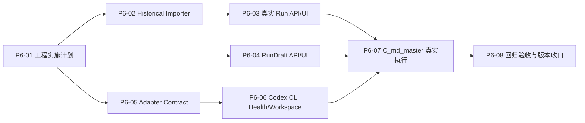

# P6 真实工作流工程实施计划与任务拆解

> **For agentic workers:** REQUIRED SUB-SKILL: Use `superpowers:subagent-driven-development`（推荐）或 `superpowers:executing-plans` 按任务逐项实施。所有步骤使用复选框跟踪，任务完成后必须经过独立代码审查、验证、task-baseline 同步和中文 Git 提交。

**Goal:** 将 P5 已评审通过的真实工作流接入设计变成可运行工程闭环：导入并展示 W24/W23 historical run，创建和确认 RunDraft，并用 Codex CLI 完成 `C_md_master` 单节点真实执行。

**Architecture:** 采用三条纵向切片并行推进。轨道 A 负责 historical importer 和真实 Run UI，轨道 B 负责 RunDraft，轨道 C 负责 Adapter Contract 与 Codex CLI；三条轨道在 `P6-07` 汇合。真实源工作区始终只读，Miracle 只向自己的 workspace 写 projection、草案、attempt workspace 和事件。

**Tech Stack:** TypeScript、Node.js Local Sidecar、React/Vite、Zod、Vitest、JSON/JSONL、本地文件 workspace、Codex CLI `exec --json`、Playwright 页面验收。

## Global Constraints

- 运行版本继续保持 `v0.7.0`，直到 P6 可运行闭环通过验收后再评估 `v0.8.0`。
- `Node.js Local Sidecar` 只负责本地 workspace、文件、CLI、MCP 和本地审计，不固化为商业化云端主后端。
- W24/W23 是 `content-production` Domain 的首个真实样本，不进入核心模型硬编码。
- 真实源目录只读；不得修改、移动或删除“热点工具更新”的源文件。
- 不把真实交付包、大媒体、凭证、Codex 登录文件或绝对用户路径提交到 Git。
- Historical run 不可调度、不可执行节点、不可写 GateDecision；Sidecar 对这些命令返回 `409 historical_run_read_only`。
- TraceEvent、NodeRun、NodeAttempt、ArtifactManifest、GateDecision 继续由 Sidecar Orchestrator 单写入。
- 单元和 API 测试使用可提交的最小合成样本；真实 W24/W23 只用于本机 opt-in smoke。
- Codex 子进程使用 `execFile`/`spawn` 参数数组，禁止 shell 字符串拼接，禁止 `dangerously-bypass-approvals-and-sandbox`。
- 每个任务提交时同步 `plans/mvp-task-baseline/roadmap.json`，并说明当前节点。
- 影响用户操作或可见能力时同步 `40_Miracle系统操作使用说明书.md`；纯内部重构不虚构用户能力升级。

---

## 1. P6 方案选择

### 1.1 方案对比

| 方案 | 做法 | 优点 | 风险 | 结论 |
|---|---|---|---|---|
| 分层先行 | 先一次性完成 Core、Sidecar，再集中接 Web | 层次整齐 | 用户价值出现晚，接口偏差会在最后集中暴露 | 不采用 |
| Adapter 先行 | 先接 Codex，再补 importer、RunDraft 和 UI | 很快看到真实模型调用 | 审计、输入、产物和只读边界尚未落地，风险最高 | 不采用 |
| 纵向可验收切片 | importer/UI、RunDraft、Adapter 三轨并行，单节点处汇合 | 每个任务可独立验收，风险逐步收敛 | 需要严格维护共享类型和依赖 | **采用** |

### 1.2 三条工程轨道



- 轨道 A：`P6-02 -> P6-03`，先让真实历史证据可观察。
- 轨道 B：`P6-04`，独立完成启动前草案和人工确认。
- 轨道 C：`P6-05 -> P6-06`，先稳定契约，再接本地 CLI。
- 汇合：`P6-07` 必须同时依赖 `P6-03`、`P6-04`、`P6-06`。

## 2. 文件结构决策

P6 不重写现有服务框架，也不继续把所有新逻辑堆入 `server.ts`。新增模块按职责拆分：

```text
packages/core/src/
  historical.ts          # historical projection 纯函数与证据置信度
  run-drafts.ts           # RunDraft 状态、hash、确认与转换前置条件
  codex-cli.ts            # Codex invocation/result/parser 纯类型与映射

apps/sidecar/src/
  historical-importer.ts # 源目录扫描、preview、commit、幂等导入
  run-draft-store.ts      # 草案文件与 audit 单写入
  codex-cli-adapter.ts    # health、attempt workspace、子进程与取消
  server.ts               # 仅保留路由组装和既有 Orchestrator 提交

apps/web/src/
  App.tsx                 # 当前单页工作台接入新页面状态
  styles.css              # 延续 Product Design A/B/C Web 风格

apps/sidecar/test/fixtures/historical/
  w24-minimal/            # 可提交的高证据合成样本
  w23-minimal/            # 可提交的缺控制文件合成样本

apps/sidecar/test/fixtures/bin/
  fake-codex.mjs          # 成功、失败、超时和非法输出测试替身
```

设计约束：

1. `packages/core` 只处理纯数据和 schema，不读取本地文件、不启动进程。
2. Sidecar 模块返回命令结果；只有现有 Orchestrator 路径可提交运行事实。
3. `server.ts` 只解析 HTTP、调用服务、映射错误码，不复制 importer/RunDraft/CLI 业务逻辑。
4. 当前 `App.tsx` 暂不进行无关页面重构；P6-03/P6-04 只抽取确实被复用的组件。

## 3. P6-02 Historical Importer 与 Projection

**目标：** 把 W24 导入为高证据 historical run，把 W23 导入为低证据降级 projection；不执行 Runner，不伪造事件，不复制大媒体。

**Files:**

- Create: `packages/core/src/historical.ts`
- Modify: `packages/core/src/types.ts`
- Modify: `packages/core/src/schemas.ts`
- Modify: `packages/core/src/index.ts`
- Create: `packages/core/test/historical.test.ts`
- Create: `apps/sidecar/src/historical-importer.ts`
- Modify: `apps/sidecar/src/server.ts`
- Create: `apps/sidecar/test/fixtures/historical/w24-minimal/`
- Create: `apps/sidecar/test/fixtures/historical/w23-minimal/`
- Create: `apps/sidecar/test/historical-importer.test.ts`
- Create: `48_P6-02HistoricalImporter与Projection交付说明.md`

**Interfaces:**

```ts
export type EvidenceConfidence =
  | "observed_from_event"
  | "observed_from_trace"
  | "observed_from_status"
  | "observed_from_artifact"
  | "inferred"
  | "missing";

export interface HistoricalImportRequest {
  source_run_dir: string;
  workflow_id: "content-production-real-v0";
  sample_kind: "w24" | "w23";
}

export interface HistoricalImportPreview {
  import_id: string;
  run_id: string;
  source_fingerprint: string;
  valid: boolean;
  files: Array<{ relative_path: string; exists: boolean; size?: number }>;
  gaps: Array<{ code: string; severity: "warning" | "error"; message: string }>;
  projected_counts: { nodes: number; artifacts: number; gates: number; events: number; attention: number };
}

export interface HistoricalSourceMeta {
  importer: "historical-run-importer";
  importer_version: "0.1.0";
  mode: "historical_readonly";
  source_run_dir: string;
  source_fingerprint: string;
  imported_at: string;
  objects: Record<string, {
    object_type: string;
    source_paths: string[];
    confidence: EvidenceConfidence;
    import_note: string;
  }>;
  gaps: HistoricalImportPreview["gaps"];
}

export type RunSpec = ExecutableRunSpec | HistoricalRunSpec;

export interface ExecutableRunSpec extends RunSpecBase {
  run_mode: "executable";
  execution_policy: "auto" | "manual" | "hybrid";
}

export interface HistoricalRunSpec extends RunSpecBase {
  run_mode: "historical_readonly";
  execution_policy: null;
  source_meta_path: string;
}
```

P5-03 示例曾把 `historical_readonly` 放进 `execution_policy`，但这会把运行来源/可写模式与
Auto/Manual/Hybrid 执行策略混成一个字段。P6 实现以这里的 discriminated union 收口：
`run_mode` 决定是否可执行，historical run 的 `execution_policy` 为 null；旧 fixture 缺少
`run_mode` 时由 schema 兼容投影为 `executable`，落盘新对象必须显式写入该字段。

**API:**

```text
POST /api/v0/historical-imports/preview
POST /api/v0/historical-imports
GET  /api/v0/historical-imports/:importId
```

`MIRACLE_IMPORT_ROOTS` 使用系统 `path.delimiter` 分隔允许读取的根目录。请求路径必须经过 `realpath` 后位于白名单内；越界返回 `403 source_path_not_allowed`。重复提交相同 `source_fingerprint + importer_version` 返回既有 `run_id`，不得重复追加 projection。

- [x] **Step 1: 写 Core 失败测试**

覆盖 W24 observed/inferred 分层、W23 missing 降级、source path 不进入 TraceEvent、historical run 不可执行标识。

Run: `npm run test -w packages/core -- historical.test.ts`

Expected: FAIL，提示 historical 类型或 projection 函数尚不存在。

- [x] **Step 2: 实现最小 Core 类型、schema 和纯 projection**

输出 `runSpec`、`workflowSnapshot`、`nodes`、`artifacts`、`gates`、`events`、`attention`、`sourceMeta`。真实事件可镜像，inferred 状态只能进入 projection metadata，不能生成伪造 NodeAttempt。

- [x] **Step 3: 运行 Core 测试**

Run: `npm run test -w packages/core -- historical.test.ts`

Expected: PASS。

- [x] **Step 4: 写 Sidecar importer 失败测试**

覆盖白名单、preview 不写文件、commit 原子写入、幂等、W23 缺口、媒体不复制和源目录未改变。

Run: `npm run test -w apps/sidecar -- historical-importer.test.ts`

Expected: FAIL，提示 importer 服务或 API 尚不存在。

- [x] **Step 5: 实现 preview 与 commit**

先写入 `runs/.staging/{import_id}`，全部 schema 校验通过后原子 rename 到 `runs/{run_id}`。目标目录包含 P5-03 定义的九类文件，并在 `manifest.json` 中加入 `source_meta_path`。

- [x] **Step 6: 验证 W24/W23 合成样本**

Run: `npm run test -w apps/sidecar -- historical-importer.test.ts`

Expected: W24 高证据导入和 W23 降级导入全部 PASS。

- [x] **Step 7: 本机真实样本 opt-in smoke**

使用 `MIRACLE_IMPORT_ROOTS` 显式允许“热点工具更新/runs/real”，先 preview，再 commit；复核源目录 Git/mtime 未变化。真实 projection 输出写入独立临时 `MIRACLE_WORKSPACE_DIR`，不写入仓库 fixture。

- [x] **Step 8: 同步文档、task-baseline 并准备评审提交**

Commit: `实现P6历史Run只读导入`

## 4. P6-03 真实 Run API 与 Web 展示

**目标：** 在现有首页、Run、Attention、Artifact、Gate、Agent 页面展示 W24/W23 historical run，并清晰标记只读和证据等级。

**Files:**

- Modify: `apps/sidecar/src/server.ts`
- Modify: `apps/sidecar/test/api.test.ts`
- Modify: `apps/web/src/App.tsx`
- Modify: `apps/web/src/styles.css`
- Create: `apps/web/src/historical.ts`
- Create: `apps/web/src/historical.test.ts`
- Create: `assets/reviews/p6-real-run-ui/`
- Create: `49_P6-03真实Run_API与Web展示交付说明.md`

**Interfaces:**

```ts
export interface RunViewMeta {
  origin: "native" | "historical_import";
  mode: "executable" | "historical_readonly";
  source_confidence: "high" | "mixed" | "low";
  source_meta_available: boolean;
}
```

`GET /runs` 与 `GET /runs/:id` 返回 `view_meta`；不改变 `RunSpec` 的运行真相。Historical run 的 scheduler、node execute、Gate decision、rework 请求统一返回 `409 historical_run_read_only`。Attention 的 acknowledge/snooze 允许写 Miracle 本地视图状态，但不得改变 Gate、Artifact 或源文件。

- [x] **Step 1: 写 API 失败测试**

覆盖 run list/view_meta、source_meta、W24/W23 查询、historical mutation 409、Artifact 本地路径边界和 Agent projection。

- [x] **Step 2: 实现 Sidecar historical read model**

`readRunBundle` 可选读取 `source_meta.json`，列表投影增加 origin/mode/confidence；所有运行写命令先执行只读 guard。

- [x] **Step 3: 运行 API 测试**

Run: `npm run test -w apps/sidecar -- api.test.ts`

Expected: PASS，且既有 demo run API 无回归。

- [x] **Step 4: 写 Web 映射失败测试**

测试 historical badge、confidence label、事件审计排序、媒体 preview capability 和 W23 gap 文案的纯函数。

- [x] **Step 5: 实现 UI 展示**

增加 Run 选择器；W24 显示 `Historical · Read-only`、F pending review 和 A/B/G inferred；W23 显示低证据警告。历史页面隐藏“执行节点、调度一次、自动推进、提交 GateDecision、创建返工”等写操作。

- [x] **Step 6: 页面与无障碍验收**

用 Playwright 生成 P5-06 约定的 W24/W23 页面截图；DAG/Canvas 继续提供列表替代视图，状态不能只靠颜色表达。

- [x] **Step 7: 同步操作手册、task-baseline 并准备评审提交**

Commit: `展示真实历史Run与证据状态`

## 5. P6-04 RunDraft API 与 Web

**目标：** 用户可从 `content-production-real-v0` 创建草案、修改输入与可选分支、执行 Dry-run、确认启动风险；在真实 Adapter 汇合前不创建正式 Run。

**Files:**

- Create: `packages/core/src/run-drafts.ts`
- Modify: `packages/core/src/types.ts`
- Modify: `packages/core/src/schemas.ts`
- Modify: `packages/core/src/index.ts`
- Create: `packages/core/test/run-drafts.test.ts`
- Create: `apps/sidecar/src/run-draft-store.ts`
- Modify: `apps/sidecar/src/server.ts`
- Create: `apps/sidecar/test/run-drafts.test.ts`
- Modify: `apps/web/src/App.tsx`
- Modify: `apps/web/src/styles.css`
- Create: `50_P6-04RunDraft_API与Web交付说明.md`

**Interfaces:**

```ts
export type RunDraftStatus =
  | "draft"
  | "ready_for_dry_run"
  | "ready_for_confirmation"
  | "confirmed"
  | "launch_pending"
  | "converted"
  | "cancelled"
  | "expired";

export interface RunDraft {
  draft_id: string;
  workflow_id: string;
  workflow_source_hash: string;
  status: RunDraftStatus;
  inputs: Record<string, unknown>;
  enabled_optional_paths: string[];
  execution_policy: "auto" | "manual" | "hybrid";
  latest_plan_id?: string;
  latest_plan_hash?: string;
  confirmation_id?: string;
  converted_run_id?: string;
  created_at: string;
  updated_at: string;
}
```

**API:**

```text
POST  /api/v0/run-drafts
GET   /api/v0/run-drafts/:draftId
PATCH /api/v0/run-drafts/:draftId
POST  /api/v0/run-drafts/:draftId/dry-run
POST  /api/v0/run-drafts/:draftId/confirmation
POST  /api/v0/runs  # 可选 draft_id，最终仍复用唯一 startRun 事务
```

- [x] **Step 1: 写 Core 状态机失败测试**

覆盖 hash 稳定性、修改后确认失效、不可跳过 required Gate、可选视频缺凭证不阻塞 MD 主链、重复确认幂等。

- [x] **Step 2: 实现 Core 状态机和 schema**

`plan_hash` 必须由 canonical JSON 计算；主题、分支、provider 或 workflow source hash 变化都使旧确认 `superseded`。

- [x] **Step 3: 写 Sidecar 文件与 API 失败测试**

覆盖草案目录独立于 `runs/`、audit 单写入、PATCH 乐观锁、未就绪 Adapter 返回 409 且草案保持 confirmed。

- [x] **Step 4: 实现 RunDraft store 与 API**

文件落在 `.miracle/run-drafts/{draft_id}`，包含 P5-07 定义的五个文件。所有命令写 `draft_audit.jsonl`，不写正式 TraceEvent。

- [x] **Step 5: 实现 Web 草案操作流**

新任务进入 RunDraft，而非直接创建 Run；页面明确区分 Historical、Run Draft 和正式 Run。Dry-run 显示 required/optional 分支、凭证、Gate、Provider、成本和风险。

- [x] **Step 6: 完整验证并提交**

Run: `npm run typecheck && npm run test && npm run build`

Commit: `实现P6半自动Run草案闭环`

## 6. P6-05 Adapter Contract Schema 与注册表

**目标：** 在不启动真实 CLI 的前提下，补齐可审计、可取消、可对账的 Invocation/Result 契约，并保持 mock-compatible Adapter 回归可用。

**Files:**

- Create: `packages/core/src/codex-cli.ts`
- Modify: `packages/core/src/types.ts`
- Modify: `packages/core/src/schemas.ts`
- Modify: `packages/core/src/runner.ts`
- Modify: `packages/core/src/adapters.ts`
- Modify: `packages/core/src/index.ts`
- Create: `packages/core/test/codex-cli.test.ts`
- Modify: `fixtures/mvp-workspace/.miracle/adapters/codex-mock-compatible.json`
- Create: `fixtures/mvp-workspace/.miracle/adapters/codex-cli-real.json`
- Create: `51_P6-05AdapterContract与注册表交付说明.md`

**Interfaces:**

```ts
export interface AdapterRuntimeControl {
  timeout_ms: number;
  cancellation_token_id: string;
  attempt_workspace: string;
  sandbox: "read-only" | "workspace-write";
}

export interface ProviderReceipt {
  provider: string;
  adapter_kind: AdapterInvocation["adapter_kind"];
  adapter_id: string;
  model?: string;
  operation_id: string;
  external_session_id?: string;
  cost?: number;
  latency_ms?: number;
}
```

`AdapterInvocation` 补齐 `attempt_id`、`adapter_id`、`runtime_control`、`prompt_path` 和 `output_schema_path`；`AdapterResult.status` 保持 `succeeded | failed | timed_out | cancelled | aborted | unknown`。

- [x] **Step 1: 写 schema 失败测试**

覆盖 operation/node/attempt 关联、receipt、artifact descriptors、超时、取消、unknown 和旧 mock invocation 迁移。

- [x] **Step 2: 实现 schema 与兼容迁移**

`createAdapterInvocation` 负责填充新字段；mock Adapter 继续通过同一契约返回，不创建第二套结果类型。

- [x] **Step 3: 注册 real manifest 但默认不可执行**

`codex-cli-real` 使用 `execution_mode: shell`、`local_executor: codex-cli`，在 health 未通过前 `can_execute` 投影为 false；不得覆盖 `codex-mock-compatible-adapter`。

- [x] **Step 4: 运行 Core 和 Sidecar 回归**

Run: `npm run test -w packages/core && npm run test -w apps/sidecar`

Expected: mock scheduler、Gate、Artifact 和 Trace 闭环继续通过。

- [ ] **Step 5: 同步 task-baseline 并提交**

Commit: `补齐P6真实Adapter执行契约`

## 7. P6-06 Codex CLI Health 与 Attempt Workspace

**目标：** 检测本地 Codex CLI 可用性，创建隔离 attempt workspace，安全 staging 输入，并通过 fake executable 验证进程生命周期；暂不接正式 NodeRun 提交。

**Files:**

- Create: `apps/sidecar/src/codex-cli-adapter.ts`
- Create: `apps/sidecar/test/fixtures/bin/fake-codex.mjs`
- Create: `apps/sidecar/test/codex-cli-adapter.test.ts`
- Modify: `apps/sidecar/src/server.ts`
- Modify: `apps/sidecar/test/api.test.ts`
- Create: `52_P6-06CodexCLI健康检查与工作区交付说明.md`

**Interfaces:**

```ts
export interface CodexCliHealth {
  adapter_id: "codex-cli-real";
  status: "healthy" | "blocked" | "degraded";
  executable_path?: string;
  version?: string;
  authenticated: boolean;
  reasons: string[];
  checked_at: string;
}

export interface CodexProcessHandle {
  operation_id: string;
  pid: number;
  cancel(): Promise<"cancelled" | "already_finished">;
  result: Promise<AdapterResult>;
}
```

**API:**

```text
GET  /api/v0/adapters/codex-cli/health
POST /api/v0/adapters/codex-cli/health/refresh
POST /api/v0/operations/:operationId/cancel
```

- [ ] **Step 1: 写 health 与 workspace 失败测试**

覆盖 CLI 不存在、版本读取、登录状态、路径越界、只读输入 staging、输出目录隔离、同 attempt 冲突和清理策略。

- [ ] **Step 2: 实现无 shell 的健康检查**

依次调用 `codex --version` 和 `codex login status`。只记录状态与版本，不读取或返回认证文件、token、环境变量值。

- [ ] **Step 3: 实现 attempt workspace**

目录固定为 `.miracle/runtime/attempts/{attempt_id}/{input,work,output,meta}`。输入按 allowlist 复制或生成只读快照；输出只能从 `output` 提交，路径越界返回 aborted。

- [ ] **Step 4: 用 fake-codex 验证进程控制**

测试成功 JSONL、非零退出、超时 SIGTERM/SIGKILL、取消幂等、非法 JSONL、超大输出和孤立 operation 恢复。

- [ ] **Step 5: 本机 Codex health smoke**

当前开发机基线为 `codex-cli 0.142.1`，实现不得锁死该版本；只要求满足命令能力检测。真实 smoke 只调用 version/login status，不执行内容任务。

- [ ] **Step 6: 同步操作手册、task-baseline 并提交**

Commit: `实现P6 Codex CLI健康检查与隔离工作区`

## 8. P6-07 C_md_master 单节点真实执行

**目标：** 从已确认 RunDraft 创建正式 Run，调度 `C_md_master` 到 Codex CLI，在隔离 workspace 生成 Markdown，提交 ArtifactManifest、GateInstance 和完整审计事件。

**Files:**

- Modify: `apps/sidecar/src/codex-cli-adapter.ts`
- Modify: `apps/sidecar/src/run-draft-store.ts`
- Modify: `apps/sidecar/src/server.ts`
- Modify: `packages/core/src/runner.ts`
- Modify: `apps/sidecar/test/api.test.ts`
- Create: `apps/sidecar/test/codex-real-node.test.ts`
- Modify: `apps/web/src/App.tsx`
- Modify: `apps/web/src/styles.css`
- Create: `53_P6-07Codex单节点真实执行交付说明.md`

**Codex 命令基线：**

```text
codex exec
--json
--ephemeral
--sandbox workspace-write
--cd <attempt-workspace>/work
--output-schema <attempt-workspace>/meta/output.schema.json
--output-last-message <attempt-workspace>/output/final.json
-
```

Prompt 通过 stdin 输入；命令参数使用数组。禁止继承与任务无关的敏感环境变量，禁止将隐藏推理写入 TraceEvent；只记录工具调用摘要、公开事件、最终输出、状态和 receipt。

- [ ] **Step 1: 写端到端失败测试**

使用 fake-codex 覆盖 confirmed draft -> POST /runs -> scheduler -> C_md_master -> Markdown Artifact -> pending Gate。验证 dispatched/received/committed 顺序和 Orchestrator 单写入。

- [ ] **Step 2: 连接 RunDraft 与唯一 startRun 服务**

校验 draft、plan hash、confirmation、workflow source hash、Adapter health 和 idempotency key；成功后原子创建 RunSpec，草案进入 converted。失败时保持 confirmed，不创建半成品 run。

- [ ] **Step 3: 实现 JSONL parser 和输出校验**

只接受 output schema 声明的 Markdown descriptor；验证真实路径、大小、UTF-8、SHA-256 和 artifact type 后再提交。临时文件、越界文件或缺失 required output 使 attempt aborted/failed，不创建 ArtifactManifest。

- [ ] **Step 4: 提交运行事实**

Orchestrator 依次写 `runner_operation_dispatched`、`adapter_result_received`、NodeAttempt、ArtifactManifest、GateInstance、`node_run_committed`。MD 产物审核状态为 pending_review，Gate 不自动批准。

- [ ] **Step 5: 实现 Web 运行反馈**

Run 页面展示真实 Adapter、operation、耗时、取消动作和 Gate；不显示隐藏推理。用户可从事件抽屉定位 attempt workspace 元数据和最终产物。

- [ ] **Step 6: fake-codex 全自动回归**

Run: `npm run typecheck && npm run test && npm run build`

Expected: 所有自动化测试通过，不依赖真实登录或网络。

- [ ] **Step 7: 本机真实 Codex opt-in 验收**

仅当 `MIRACLE_ENABLE_REAL_CODEX=1` 且 health healthy 时执行。输入使用脱敏的小型 Clean Events 样本，不直接修改真实 W24/W23；生成的 Markdown 留在 Miracle runtime workspace 并进入人工 Gate。

- [ ] **Step 8: 同步操作手册、截图、task-baseline 并提交**

Commit: `打通Codex单节点真实执行闭环`

## 9. P6-08 回归验收与版本收口

**目标：** 验证 P6 三条轨道在同一系统中成立，记录真实能力边界，并决定是否升级 `v0.8.0`。

**Files:**

- Create: `54_P6回归验收与版本收口报告.md`
- Modify: `40_Miracle系统操作使用说明书.md`
- Modify: `VERSION_HISTORY.md`
- Modify: `README.md`
- Modify: `17_文档资产关联与AI阅读导航.md`
- Modify: `07_后续对接路线图与任务拆解.md`
- Modify: `plans/mvp-task-baseline/roadmap.json`
- Create: `assets/reviews/p6-acceptance/`

- [ ] **Step 1: 执行工程回归**

Run: `npm run typecheck && npm run test && npm run build && git diff --check`

Expected: 全部退出码为 0；Web 若仍无组件测试，报告必须如实记录测试缺口。

- [ ] **Step 2: 执行 API smoke**

覆盖 historical preview/commit、run list/detail/DAG/events、historical mutation 409、RunDraft create/update/dry-run/confirm、Codex health、正式 Run 创建、scheduler、operation cancel、Artifact 和 Gate。

- [ ] **Step 3: 执行页面验收**

截图至少包含 W24 Run/DAG/Event/Attention/Artifact/Gate/Agent、W23 gap、RunDraft dry-run/confirmation、Codex operation 和最终 Gate。

- [ ] **Step 4: 复核安全与真实性**

确认源目录未变化、媒体未复制、Git 无凭证/绝对路径/真实私有交付物、历史事件未伪造、真实执行未记录隐藏推理。

- [ ] **Step 5: 决定版本**

只有 historical importer、RunDraft 和 Codex 单节点真实执行全部达到可运行验收，才升级 `v0.8.0`；否则保持 `v0.7.0` 并在报告中列出阻塞项。

- [ ] **Step 6: 收口 task-baseline 并提交**

Commit: `完成P6真实工作流工程接入验收`

## 10. P6 任务总表

| ID | 任务 | 状态 | 依赖 | 可并行 | 主要交付 |
|---|---|---|---|---:|---|
| P6-01 | 真实工作流工程实施计划 | completed | P5-09 | 否 | 本文档、路线图、task-baseline |
| P6-02 | Historical Importer 与 Projection | completed | P6-01 | 是 | W24/W23 只读导入、source_meta、API |
| P6-03 | 真实 Run API 与 Web 展示 | completed | P6-02 | 是 | historical Run/Attention/Artifact/Gate/Agent UI |
| P6-04 | RunDraft API 与 Web | completed | P6-01 | 是 | 草案、Dry-run、确认、审计 |
| P6-05 | Adapter Contract Schema 与注册表 | completed | P6-01 | 是 | invocation/result/receipt schema、real manifest |
| P6-06 | Codex CLI Health 与 Attempt Workspace | current | P6-05 | 是 | health、隔离 workspace、进程控制 |
| P6-07 | C_md_master 单节点真实执行 | planned | P6-03/P6-04/P6-06 | 否 | 正式 Run、Markdown、Artifact、Gate、Trace |
| P6-08 | 回归验收与版本收口 | planned | P6-07 | 否 | 回归报告、截图、版本决策 |

## 11. 并行执行建议

P6-01 完成后可启动三个独立任务：

```text
Agent A: P6-02 -> P6-03
  ownership: historical types/importer/API/真实 Run UI

Agent B: P6-04
  ownership: RunDraft types/store/API/UI

Agent C: P6-05 -> P6-06
  ownership: Adapter Contract/Codex CLI health/workspace
```

共享文件冲突规则：

- `packages/core/src/types.ts`、`schemas.ts`、`index.ts` 由 Lead 先合并接口骨架，再分派实现。
- `apps/sidecar/src/server.ts` 和 `apps/web/src/App.tsx` 不允许多个 Agent 同时直接修改；各 Agent 先在独立模块完成并测试，由 Lead 依次接路由/UI。
- 每条轨道使用独立 worktree/branch，分支前缀统一为 `codex/p6-*`。
- `P6-07` 只在三条轨道合并并通过全量回归后启动。

## 12. P6 验收矩阵

| 场景 | 必须结果 |
|---|---|
| W24 preview/import | 生成高证据 historical run，F 保持 pending_review，A/B/G 标记 inferred |
| W23 preview/import | 缺口 Attention 明确，不生成伪造 TraceEvent/GateDecision |
| Historical mutation | scheduler/node execute/Gate decision 返回 409，只读边界成立 |
| 大媒体 | 只保存路径和 metadata，不复制进 Miracle workspace/Git |
| RunDraft 修改 | plan hash 更新，旧确认 superseded |
| 可选视频缺凭证 | 视频分支 blocked，MD 主链仍可确认 |
| Codex health | 路径、版本、登录状态可见，不暴露凭证 |
| Codex 成功 | JSONL 映射完整，Markdown 校验后提交 Artifact 与 pending Gate |
| Codex 失败/超时/取消 | 状态准确，不提交临时产物，取消幂等 |
| Sidecar 崩溃恢复 | 未 committed operation 进入 unknown/对账，不推断成功 |
| 多 Domain 回归 | image/script/research fixture 仍能 validate/dry-run，不被内容流程硬编码破坏 |
| 用户文档 | 启动、导入、草案、真实执行、恢复动作和版本变化均可操作 |

## 13. 本轮 P6-01 验收

P6-01 完成条件：

- [x] 已明确纵向切片方案和三条并行轨道。
- [x] 已给出 P6-02 至 P6-08 的文件、接口、测试、提交和验收要求。
- [x] 已明确真实源只读、白名单、媒体、凭证和审计边界。
- [x] 已明确 Codex CLI 首接命令、安全策略和 fake/real 双层验收。
- [x] 已明确 task-baseline 从 P6-01 推进到 P6-02。

`P6-03` 真实 Run API 与 Web 展示已完成，交付见 `49`。下一步主线是
`P6-04` 与 `P6-05` 已完成并通过回归；当前进入 `P6-06` Codex CLI Health 与 Attempt Workspace。
