# 17_文档资产关联与AI阅读导航

> 文档性质：Miracle 文档资产索引、依赖关系图和 AI 阅读路由
>
> 目标：明确哪些文档是当前有效结果、哪些是基础设计、哪些是参考输入、哪些只是历史
> 评审过程，从而避免人工或 AI 每次完整读取全部文档
>
> 当前文档目录索引：`docs/README.md`
>
> 当前产品方案：`docs/03-product/information-architecture/16_融合_产品信息架构与设计图规划.md`
>
> 当前原型资产：`prototypes/p2/fusion-clickable/`

## 1. 使用方式

开始任何 Miracle 任务前，先读取：

1. `README.md`：了解项目定位和当前阶段。
2. `docs/README.md`：了解领域目录、中文目录名、文档职责和设计原因。
3. 本文：判断本次任务真正需要读取哪些文档。
4. 按本文的任务路由读取最小必要文档集。

除非任务是复盘决策过程、核查历史问题或重新评审架构，否则不要默认读取所有 Markdown。

## 2.1 目录分层规则

目录位置按内容领域组织，中文目录名和每个子目录的概念设计、设计原因见
[`docs/README.md`](../../README.md)。目录不替代文档状态：AI 仍以本文登记的
`CURRENT / ACTIVE / REFERENCE / HISTORICAL` 为准。

常用领域入口：

- `docs/01-strategy/`：战略、总体规划和路线图。
- `docs/02-architecture/`：系统架构、工作流、Agent、组件和可视化协议。
- `docs/03-product/`：产品信息架构、交互设计和原型输入。
- `docs/04-engineering/`：API、数据模型和 P3 详细设计。
- `docs/05-delivery/`：P2-P6 阶段交付与实现说明。
- `docs/06-operations/`：用户手册、回归验收和版本收口。
- `docs/99-archive/`：历史过程资产，默认可跳过。

## 2. 文档状态定义

| 状态 | 含义 | AI 默认行为 |
|---|---|---|
| `CURRENT` | 当前阶段的最终有效结果 | 必须优先读取和采用 |
| `ACTIVE` | 仍然有效的基础设计或协议 | 按任务需要读取 |
| `REFERENCE` | 竞品、路线、版本等辅助资料 | 需要背景或追溯时读取 |
| `HISTORICAL` | 评审意见、候选方案、已被融合或收口的过程资产 | 默认跳过 |

冲突处理原则：

```text
CURRENT
> 较新 ACTIVE
> 较旧 ACTIVE
> REFERENCE
> HISTORICAL
```

Git 提交时间不能单独决定业务有效性；以本文登记的状态和“被谁取代”关系为准。

## 3. 当前有效结果

### 3.1 当前产品方案

`16_融合_产品信息架构与设计图规划.md` 是当前 P2 产品信息架构的有效结果。融合方案
已经完成一轮产品评审整改，原型应以整改后的 F01-F17 和 P2F 页面范围为准。

它融合了：

- `16_产品信息架构与设计图规划.md` 的架构对象和页面职责。
- `16_abtest_产品信息架构与设计图规划.md` 的任务型首页、Attention Queue、Run
  工作区和测试方法。

因此：

- 开始产品原型、页面设计和交互设计时，读取融合版。
- 原始 `16` 和 `16_abtest` 默认跳过。
- 只有需要追溯为什么融合或比较候选方案时，才读取原始两份文档。

### 3.2 当前架构方案

当前架构规则由以下 ACTIVE 文档共同组成：

- `01_核心架构与对象模型.md`
- `03_智能路由与工作流编排设计.md`
- `09_WorkflowSpec与Registry技术草案.md`
- `10_AgentHealth与多Agent状态机设计.md`
- `11_VisualBuilder与Spec双向同步设计.md`
- `14_技术架构选型与系统架构图.md`

四轮 `15` 评审已经完成，其采纳项已回写上述文档。后续实现以这些被修订后的 ACTIVE
文档为准，不以 `15` 系列为准。

### 3.3 当前操作手册

`40_Miracle系统操作使用说明书.md` 是当前用户操作真相源。需要启动本地服务、理解
菜单用途、查看典型操作流程、确认版本变化和维护手册同步规则时，优先读取 `40`。

它不替代技术设计文档；涉及对象模型、API、Runner、Adapter 和真实工作流导入规则时，
仍读取对应的 CURRENT/ACTIVE 技术文档。

### 3.4 当前工程实施基线

`54_P6回归验收与版本收口报告.md` 是当前 `v0.8.0` 发布与 P6 最终验收真相源。
`47` 是 P6 实施计划，`48-53` 记录 P6-02 至 P6-07 的实现结果。继续 historical
importer、RunDraft、Adapter Contract 或 Codex CLI 维护任务时按需补读。

`55_P7多节点真实执行与模型Adapter扩展总体设计.md` 是已通过人工评审的 P7 总体设计
基线；`56_P7工程实施计划与任务拆解.md` 是当前 `P7-02` 至 `P7-10` 的实施真相源。
它们共同确立 Codex 多节点纵向闭环优先、retry/fallback 后置、DeepSeek/Kimi/MiniMax
通过通用 Model API Adapter 接入，以及 P7 不接 OpenAI 官方 API 的边界。进入工程
实现时优先读取 56，再按任务回读 55 和对应 P6 交付文档。

## 4. 文档依赖总图

```mermaid
flowchart TD
  P00["00 总体规划<br/>ACTIVE"]
  P01["01 核心对象模型<br/>ACTIVE"]
  P02["02 组件与插件<br/>ACTIVE"]
  P03["03 路由与编排<br/>ACTIVE"]
  P04["04 多 Agent 可视化<br/>ACTIVE"]
  P05["05 双模式编排<br/>ACTIVE"]
  P06["06 智能进化<br/>ACTIVE"]
  P07["07 路线图<br/>REFERENCE"]

  P00 --> P01
  P00 --> P02
  P00 --> P03
  P00 --> P04
  P00 --> P05
  P00 --> P06
  P01 --> P03
  P02 --> P03
  P04 --> P05
  P06 --> P07

  P08["08 竞品分析<br/>REFERENCE"]
  P08 --> P09["09 WorkflowSpec / Registry<br/>ACTIVE"]
  P08 --> P10["10 AgentHealth<br/>ACTIVE"]
  P08 --> P11["11 Visual / Spec Sync<br/>ACTIVE"]
  P08 --> P12["12 MVP 原型清单<br/>ACTIVE"]

  P01 --> P09
  P03 --> P09
  P04 --> P10
  P05 --> P11

  P09 --> P13["13 P0 决策清单<br/>ACTIVE"]
  P10 --> P13
  P11 --> P13
  P12 --> P13

  P13 --> P14["14 技术架构基线<br/>ACTIVE"]

  P14 --> R1["15 第一次评审<br/>HISTORICAL"]
  R1 --> R2["15-2 二次评审<br/>HISTORICAL"]
  R2 --> R3["15-3 三次评审<br/>HISTORICAL"]
  R3 --> R4["15-4 四次评审<br/>HISTORICAL"]

  R1 -.采纳项回写.-> P01
  R2 -.采纳项回写.-> P09
  R3 -.采纳项回写.-> P10
  R4 -.采纳项回写.-> P14

  P14 --> IA1["16 产品 IA 初版<br/>HISTORICAL CANDIDATE"]
  P12 --> IA1
  IA1 --> IAB["16 A/B 方案<br/>HISTORICAL CANDIDATE"]
  IA1 --> IAF["16 融合方案<br/>CURRENT"]
  IAB --> IAF

  IAF --> Brief["P2 双轨共同简报<br/>CURRENT"]
  Brief --> PD["Product Design 三个方向<br/>CURRENT"]
  Brief --> Pencil["Pencil 六页原型<br/>CURRENT"]
  PD --> Review["双轨人工评审<br/>CURRENT"]
  Pencil --> Review
  Review --> Fusion["Web 工作台可点击原型<br/>CURRENT"]
  Fusion --> P18["18 P2 原型评审通过<br/>CURRENT"]
  P18 --> P3["19-23 P3 技术详细设计<br/>CURRENT"]
  P3 --> P4["24 P4 MVP 可运行主链路<br/>CURRENT"]
  P4 --> P4B["25 P4 第二轮 DAG/Artifact/Gate/Canvas<br/>CURRENT"]
  P4B --> P4C["26 P4 第三轮测试/Runner<br/>CURRENT"]
  P4C --> P4D["27 P4 第四轮 Gate/Canvas/执行 UI<br/>CURRENT"]
  P4D --> P4E["28 P4 第五轮 D3 Gate 返工模型<br/>CURRENT"]
  P4E --> P4F["29 P4 第五轮 D4 Gate 返工 UI<br/>CURRENT"]
  P4F --> P4G["30 P4 第五轮 D5 Scheduler Tick<br/>CURRENT"]
  P4G --> P4H["31 P4 第五轮 D6 Scheduler Run<br/>CURRENT"]
  P4H --> P4I["32 P4 第五轮 D7 Adapter 目录<br/>CURRENT"]
  P4I --> P4J["34 P4 第五轮 D8/D9 Canvas/Run 刷新<br/>CURRENT"]
  P4J --> P4K["33 D10 MVP 验收预备<br/>CURRENT"]
  P4K --> P4L["35 D10 MVP 验收通过<br/>CURRENT"]
  P4L --> P5["36 P5 真实工作流接入计划<br/>CURRENT"]
  P5 --> P501["37 P5-01 真实工作区盘点<br/>CURRENT"]
  P501 --> P502["38 P5-02 Flow A-G 对象映射<br/>CURRENT"]
  P502 --> P503["39 P5-03 历史 Run 只读导入<br/>CURRENT"]
  P503 --> P40["40 系统操作使用说明书<br/>CURRENT"]
  P503 --> P504["41 P5-04 审核策略映射<br/>CURRENT"]
  P504 --> P505["42 P5-05 Trace 映射<br/>CURRENT"]
  P505 --> P506["43 P5-06 UI 展示验收<br/>CURRENT"]
  P506 --> P507["44 P5-07 半自动新 Run 草案<br/>CURRENT"]
  P507 --> P508["45 P5-08 首个真实 Adapter 边界<br/>CURRENT"]
  P508 --> P509["46 P5-09 回归验收通过<br/>CURRENT"]
  P509 --> P601["47 P6-01 工程实施计划<br/>CURRENT"]
  P601 --> P602["48 P6-02 Historical Importer<br/>CURRENT"]
  P602 --> P603["P6-03 真实 Run API/UI<br/>COMPLETED"]
  P603 --> P604["P6-04 RunDraft API/Web<br/>COMPLETED"]
  P603 --> P605["P6-05 Adapter Contract<br/>COMPLETED"]
  P604 --> P606["P6-06 Codex 健康与工作区<br/>COMPLETED"]
  P605 --> P606
  P606 --> P607["P6-07 Codex 单节点执行<br/>COMPLETED"]
  P607 --> P608["P6-08 回归验收<br/>COMPLETED"]
  P608 --> P701["55 P7 总体设计<br/>ACTIVE"]
  P701 --> P702["56 P7 实施计划<br/>CURRENT"]
```



图中虚线“采纳项回写”表示：评审文档本身不是最终规则，最终规则已经写回对应设计文档。

## 5. 阶段演进关系

```text
总体规划 00-07
-> 竞品与 Spec-first 升级 08-12
-> P0 决策 13
-> 技术架构基线 14
-> 架构评审过程 15 / 15-2 / 15-3 / 15-4
-> 产品 IA 初版 16
-> 产品 IA 并行 A/B 候选 16_abtest
-> 产品 IA 融合结果 16_融合
-> Product Design / Pencil 双轨原型
-> 双轨人工评审
-> Web 工作台可点击原型
-> P2 原型评审完全通过 18
-> P3 技术详细设计 19-23
-> P4 MVP 第一轮 24
-> P4 MVP 第二轮 25
-> P4 MVP 第三轮 26
-> P4 MVP 第四轮 27
-> P4 MVP 第五轮 D3 返工模型 28
-> P4 MVP 第五轮 D4 返工 UI 29
-> P4 MVP 第五轮 D5 Scheduler Tick 30
-> P4 MVP 第五轮 D6 Scheduler 连续执行闭环 31
-> P4 MVP 第五轮 D7 Adapter 插件目录实体化 32
-> P4 MVP 第五轮 D8/D9 Canvas 节点草稿与 Run 刷新 34
-> D10 MVP 回归验收预备清单 33
-> D10 MVP 回归验收与版本收口报告 35
-> P5 真实工作流接入详细计划 36
-> P5-01 真实工作区盘点报告 37
-> P5-02 Flow A-G 对象映射设计 38
-> P5-03 历史 Run 只读导入方案 39
-> 系统操作使用说明书 40
-> P5-04 审核策略映射设计 41
-> P5-05 Trace 映射设计 42
-> P5-06 真实历史 Run UI 展示验收 43
-> P5-07 半自动新 Run 草案设计 44
-> P5-08 首个真实 Adapter 边界评估 45
-> P5-09 回归验收与阶段收口 46
-> P6-01 真实工作流工程实施计划 47
-> P6-02 Historical Importer 与 Projection 48
-> P6-03 真实 Run API 与 Web 展示（已完成）
-> P6-04 RunDraft API 与 Web（当前）
```

关键关系：

- `15 -> 15-2 -> 15-3 -> 15-4` 是严格顺序依赖。
- `15` 系列通过后，架构采纳项已经回写到 `01/03/09/10/12/14`。
- 原始 `16` 是产品 IA 的第一版候选。
- `16_abtest` 是基于同一架构基线产生的并行比较方案。
- `16_融合` 同时依赖原始 `16` 与 `16_abtest`，是当前有效产品结果。
- `prototypes/p2/03_融合版原型决策与验收说明.md` 记录 Product Design A/B/C 优先和
  Web-only 复审结论，是当前融合原型的决策真相。
- `prototypes/p2/fusion-clickable/` 是当前 P2 Web 工作台可点击原型结果；`Product
  Design` 三图和 Pencil 六页仍作为视觉与结构来源保留。
- 当前 Product Design 三图不是三个并列首页方案，固定映射为：A 用于首页、B 用于 Run
  工作区、C 的根因联动用于 Attention。
- 最新可读截图位于 `assets/prototypes/fusion-clickable/`：
  `home-desktop.png`、`run-desktop.png`、`attention-desktop.png`、
  `agent-collaboration-desktop.png`。
- `18_P2原型评审纪要与修订清单.md` 是当前 Web 原型评审结论，最新结论为 P2 原型
  完全通过；原问题项进入后续设计备忘和 P3 实现关注项。
- `19-23` 是当前 P3 技术详细设计结果，明确 Miracle 是通用 Agent OS，Flow A-G 只是
  第一个样本 Domain，Node.js 本地服务只是 MVP Local Sidecar；最新修订已收口
  RunSpec、WorkflowSnapshot、审核真相、AdapterResult、EdgeSpec join_policy 和启动 Run API。
- `24_P4_MVP可运行主链路交付说明.md` 是当前 P4 第一轮工程交付入口，记录
  `apps/web`、`apps/sidecar`、`packages/core`、fixtures 和验证结果。
- `25_P4第二轮_DAG预览Gate投影与Canvas草稿交付说明.md` 是当前 P4 第二轮交付入口，
  记录 React Flow DAG、Artifact Detail、Gate 决策投影和 Infinite Canvas 草稿态。
- `26_P4第三轮_集成测试与Runner协议交付说明.md` 是当前 P4 第三轮交付入口，记录
  Sidecar 集成测试、Runner/Adapter 最小协议和 Mock Runner 执行闭环。
- `27_P4第四轮_Gate推进Canvas发布与执行UI交付说明.md` 是当前 P4 第四轮交付入口，
  记录 Gate 决策真实推进、Run 页面执行 UI、Canvas 发布 Workflow draft 和 Adapter 插件壳。
- `28_P4第五轮_D3_Gate返工模型交付说明.md` 是当前 P4 第五轮 D3 交付入口，记录
  Gate reject 后的 rework attempt、新 Artifact version、新 GateInstance 和下游恢复规则。
- `29_P4第五轮_D4_Gate返工UI与事件审计交付说明.md` 是当前 P4 第五轮 D4 交付入口，
  记录 Attention 到 Gate Review 联动、返工动作、receipt 和 TraceEvent 审计展示。
- `30_P4第五轮_D5_最小Scheduler设计与Tick接口交付说明.md` 是当前 P4 第五轮 D5
  交付入口，记录 scheduler tick、Gate 人审暂停、operation lock 复用和 Run 手动调度入口。
- `31_P4第五轮_D6_Scheduler连续执行闭环交付说明.md` 是当前 P4 第五轮 D6 交付入口，
  记录 scheduler 连续推进、Gate 暂停、失败 Attention 和 Run 自动推进入口。
- `32_P4第五轮_D7_Adapter插件目录实体化交付说明.md` 是当前 P4 第五轮 D7 交付入口，
  记录 Adapter manifest、Codex mock-compatible adapter、credential check、dry-run routing
  和执行链路 adapter 选择。
- `34_P4第五轮_D8_D9_Canvas节点草稿与Run刷新交付说明.md` 是当前 P4 第五轮 D8/D9
  交付入口，记录 Canvas NodeSpec draft、validate-before-save、Workflow draft 发布、
  Run polling 和执行反馈。
- `33_P4_MVP回归验收预备清单.md` 是 D10 验收预备资产，记录回归场景、命令、截图和
  task-baseline 同步检查项；D10 实际结论以 `35_P4_MVP回归验收与版本收口报告.md` 为准。
- `35_P4_MVP回归验收与版本收口报告.md` 是当前 P4 MVP 验收结果，记录命令验收、
  API smoke、截图证据、D10 修复项和 `v0.7.0` 收口结论。
- `36_P5真实工作流接入详细计划与任务拆解.md` 是已完成 P5 真实工作流接入设计的任务基线，
  记录 W24/W23 真实样本、P5-01 至 P5-09 任务拆解、依赖和并行规则。
- `37_P5-01真实工作区盘点报告.md` 是 P5-01 的完成证据，记录 W24/W23 文件盘点、
  控制文件缺口、对象候选映射和 P5-02 输入要求。
- `38_P5-02FlowAG对象映射设计.md` 是 P5-02 的完成证据，记录 Flow A-G 到
  WorkflowSpec、ArtifactSpec、GateSpec、AgentSpec、ComponentLibrary、Run projection
  和可信度规则的映射。
- `39_P5-03历史Run只读导入方案.md` 是 P5-03 的完成证据，记录 historical importer
  的输入输出、W24/W23 projection、source metadata、TraceEvent 边界和降级导入规则。
- `40_Miracle系统操作使用说明书.md` 是当前用户操作真相源，记录启动方式、菜单说明、
  典型操作、版本感知、常见问题和后续手册同步规则。
- `41_P5-04审核策略映射设计.md` 是 P5-04 的完成证据，记录 `approval_policy.yaml`
  到 GateSpec、GateInstance、GateDecision、Artifact review status、source_meta 和
  F_final_render pending_review 的映射规则。
- `42_P5-05Trace映射设计.md` 是 P5-05 的完成证据，记录 `task_trace.json.steps`
  到 NodeAttempt、`task_events.jsonl` 到 TraceEvent、GateDecision/TraceEvent 关联、
  W23 缺 trace 降级和 P5-06 UI 验收输入。
- `43_P5-06真实历史Run_UI展示验收方案.md` 是 P5-06 的完成证据，记录真实历史 Run
  在 Run、DAG、Agent、Artifact、Gate、Attention 中的展示口径、API smoke 范围、
  截图证据要求和 P5-07 Run draft 输入。
- `44_P5-07半自动新Run草案设计.md` 是 P5-07 的完成证据，记录 RunDraft、
  RunDraftDryRunPlan、LaunchConfirmation、草案审计和统一 Run 启动边界。
- `45_P5-08首个真实Adapter边界评估.md` 是 P5-08 的完成证据，记录 Codex CLI
  首接结论、运行隔离、凭证、取消、审计和官方 API 后续边界。
- `46_P5回归验收与阶段收口报告.md` 是 P5-09 的完成证据，记录完整回归、真实样本复核、
  roadmap 测试修复、API/页面 smoke、范围真实性结论和 P6 入口。
- `47_P6真实工作流工程实施计划与任务拆解.md` 是 P6-01 的完成证据和 P6 实现真相源，
  记录 P6-02 至 P6-08、三条并行轨道、文件边界、接口、测试、安全约束和验收矩阵。
- `48_P6-02HistoricalImporter与Projection交付说明.md` 是 P6-02 的完成证据，记录 W24/W23
  importer、RunSpec 模式收口、白名单、幂等、只读保护、真实 smoke 和 P6-03 输入。
- `49-52` 分别记录真实 Run UI、RunDraft、Adapter Contract 和 Codex CLI 隔离 runtime。
- `53_P6-07Codex单节点真实执行交付说明.md` 是 P6-07 的完成证据，记录 confirmed
  RunDraft 原子转换、真实 Codex CLI、受控 Markdown、Artifact/Gate/Trace 和 opt-in 验收。
- `54_P6回归验收与版本收口报告.md` 是 P6-08 的完成证据和 `v0.8.0` 发布真相源，记录
  工程回归、46 项 API、W24/W23、真实 Codex、安全真实性、页面截图和版本决策。
- 项目任务基线不进入系统设计文档序列，独立维护在 `plans/mvp-task-baseline/`。

## 6. 全量文档资产表

下表用文件名表达依赖关系；实际目录路径和中文目录对照以
[`docs/README.md`](../../README.md) 为准。需要打开文件时，应从该索引中的目标目录进入，
不要假设文档仍位于仓库根目录。

| 文档 | 状态 | 依赖 | 被谁使用或取代 | AI 默认 |
|---|---|---|---|---|
| `00_Miracle奇迹系统总体规划设计.md` | `ACTIVE` | 无 | 01-07、项目定位 | 需要全局背景时读 |
| `01_核心架构与对象模型.md` | `ACTIVE` | 00、15 系列采纳项 | 03、09、14、实现设计 | 对象/协议任务必读 |
| `02_组件库与插件体系设计.md` | `ACTIVE` | 00 | 03、09、资源库设计 | 组件任务时读 |
| `03_智能路由与工作流编排设计.md` | `ACTIVE` | 00、01、02、15 系列采纳项 | 09、14、P3 | 编排/路由任务必读 |
| `04_多Agent协同与可视化设计.md` | `ACTIVE` | 00、01 | 10、16_融合 | Agent 产品任务时读 |
| `05_双模式工作流可视化编排设计.md` | `ACTIVE` | 00、03、04 | 11、16_融合 | DAG/Canvas 任务时读 |
| `06_智能进化体系设计.md` | `ACTIVE` | 00、03 | 12、16_融合 | Evolution 任务时读 |
| `07_后续对接路线图与任务拆解.md` | `REFERENCE` | 当前有效设计与产品文档 | 后续阶段安排 | 计划和阶段任务时读 |
| `08_Miracle竞品分析与架构借鉴报告.md` | `REFERENCE` | 00-07 | 09-12 | 默认跳过，竞品任务时读 |
| `09_WorkflowSpec与Registry技术草案.md` | `ACTIVE` | 01、02、03、08、15 系列采纳项 | 12、14、P3 | Spec/Registry/实现必读 |
| `10_AgentHealth与多Agent状态机设计.md` | `ACTIVE` | 04、08、15 系列采纳项 | 12、14、16_融合 | Agent 状态任务必读 |
| `11_VisualBuilder与Spec双向同步设计.md` | `ACTIVE` | 05、08、09 | 12、14、16_融合 | 编辑器同步任务必读 |
| `12_MVP原型功能清单与界面草图.md` | `ACTIVE` | 09-11 | 13、16_融合 | 原型范围和验收时读 |
| `13_P0架构评审纪要与决策清单.md` | `ACTIVE` | 00-12 | 14、阶段边界 | 查决策和阶段边界时读 |
| `14_技术架构选型与系统架构图.md` | `ACTIVE` | 01-13、15 系列采纳项 | 16_融合、P3 | 技术/产品设计必读 |
| `15_架构方案评审意见.md` | `HISTORICAL` | 14 | 15-2；采纳项已回写 | 默认跳过 |
| `15-2_架构方案二次评审意见.md` | `HISTORICAL` | 15 | 15-3；采纳项已回写 | 默认跳过 |
| `15-3_架构方案第三次评审意见.md` | `HISTORICAL` | 15-2 | 15-4；采纳项已回写 | 默认跳过 |
| `15-4_架构方案第四次评审意见.md` | `HISTORICAL` | 15-3 | 架构评审通过；采纳项已回写 | 默认跳过 |
| `16_产品信息架构与设计图规划.md` | `HISTORICAL` | 12、14、15-4 | 被 `16_融合` 取代 | 默认跳过 |
| `16_abtest_产品信息架构与设计图规划.md` | `HISTORICAL` | 12、14、原始 16 | 被 `16_融合` 吸收 | 默认跳过 |
| `16_融合_产品信息架构与设计图规划.md` | `CURRENT` | 原始 16、16_abtest、14、产品评审整改 | P2 原型和 P3 | 产品任务必读 |
| `prototypes/p2/00_双轨原型共同设计简报.md` | `CURRENT` | 16_融合 | 两条原型线 | P2 原型评审必读 |
| `prototypes/p2/product-design/README.md` | `CURRENT` | 双轨共同简报 | 视觉方向选择 | 视觉评审时读 |
| `prototypes/p2/pencil/README.md` | `CURRENT` | 双轨共同简报 | 结构和任务闭环评审 | 原型评审时读 |
| `prototypes/p2/01_双轨原型评审表.md` | `CURRENT` | 两条原型交付 | 人工评分和融合决策 | 评审时必读 |
| `prototypes/p2/02_双轨原型初步对比结论.md` | `CURRENT` | 两条原型交付 | 人工选择和融合输入 | P2 融合原型任务必读 |
| `prototypes/p2/03_融合版原型决策与验收说明.md` | `CURRENT` | 02 人工选择和复审 | fusion-clickable | 当前 Web 原型必读 |
| `prototypes/p2/fusion-clickable/README.md` | `CURRENT` | 03 决策说明 | P2 Web 可点击原型 | 运行或评审原型时必读 |
| `prototypes/p2/fusion-clickable/design-qa.md` | `REFERENCE` | fusion-clickable 截图 | 原型 QA 追溯 | QA/验收时读 |
| `18_P2原型评审纪要与修订清单.md` | `CURRENT` | fusion-clickable 当前实现 | P3 技术详细设计 | P2 结论和备忘必读 |
| `19_P3技术详细设计总纲与扩展性原则.md` | `CURRENT` | 14、16_融合、18 | 20-23、P4 | P3/P4 必读 |
| `20_P3核心数据模型与领域扩展设计.md` | `CURRENT` | 01、09、10、11、19 | 21-23、P4 | 数据模型必读 |
| `21_P3本地服务API与后端演进设计.md` | `CURRENT` | 03、09、14、19、20 | 22、23、P4 | API/服务必读 |
| `22_P3前端架构与工作台状态设计.md` | `CURRENT` | 16_融合、18、19-21 | 23、P4 | 前端实现必读 |
| `23_P3MVP任务拆解与验收计划.md` | `CURRENT` | 07、12、19-22 | P4 MVP | 任务拆解必读 |
| `24_P4_MVP可运行主链路交付说明.md` | `CURRENT` | 19-23、P2 原型 | P4 第二轮、P5 | MVP 启动和验收必读 |
| `25_P4第二轮_DAG预览Gate投影与Canvas草稿交付说明.md` | `CURRENT` | 24、19-23 | P4 后续实现、P5 | P4 第二轮能力必读 |
| `26_P4第三轮_集成测试与Runner协议交付说明.md` | `CURRENT` | 25、19-23、21 | P4 后续实现、P5 | Runner/API 测试任务必读 |
| `27_P4第四轮_Gate推进Canvas发布与执行UI交付说明.md` | `CURRENT` | 26、19-23、21 | P4 后续实现、P5 | Gate/Canvas/执行 UI 任务必读 |
| `28_P4第五轮_D3_Gate返工模型交付说明.md` | `CURRENT` | 27、21、23、任务基线 | P4 D4/D5 后续实现、P5 | Gate 返工模型任务必读 |
| `29_P4第五轮_D4_Gate返工UI与事件审计交付说明.md` | `CURRENT` | 28、任务基线、apps/web | P4 D5/D9 后续实现、P5 | Gate 返工 UI 和审计任务必读 |
| `30_P4第五轮_D5_最小Scheduler设计与Tick接口交付说明.md` | `CURRENT` | 29、apps/sidecar、任务基线 | P4 D6/D9 后续实现、P5 | Scheduler 任务必读 |
| `31_P4第五轮_D6_Scheduler连续执行闭环交付说明.md` | `CURRENT` | 30、apps/sidecar、apps/web、任务基线 | P4 D7/D9 后续实现、P5 | Scheduler 执行闭环任务必读 |
| `32_P4第五轮_D7_Adapter插件目录实体化交付说明.md` | `CURRENT` | 31、packages/core、apps/sidecar、任务基线 | P4 D8/D9 后续实现、P5 | Adapter 目录和平台扩展任务必读 |
| `34_P4第五轮_D8_D9_Canvas节点草稿与Run刷新交付说明.md` | `CURRENT` | 32、apps/web、apps/sidecar、packages/core、任务基线 | D10 MVP 验收、P5 | Canvas NodeSpec draft 和 Run 刷新任务必读 |
| `33_P4_MVP回归验收预备清单.md` | `CURRENT` | 24-34、任务基线 | 35 | 验收规则追溯时读 |
| `35_P4_MVP回归验收与版本收口报告.md` | `CURRENT` | 33、24-34、任务基线、截图证据 | P5 真实工作流接入 | 当前 MVP 验收结论必读 |
| `36_P5真实工作流接入详细计划与任务拆解.md` | `CURRENT` | 35、07、23、真实热点工具更新工作区 | P5 实现、任务基线 | P5 任务必读 |
| `37_P5-01真实工作区盘点报告.md` | `CURRENT` | 36、真实热点工具更新工作区 | P5-02 对象映射、P5 importer | P5-02 前必读 |
| `38_P5-02FlowAG对象映射设计.md` | `CURRENT` | 37、20、21、approval_policy.yaml、W24 控制文件 | P5-03 importer、P5-04/P5-05 并行任务 | P5-03 前必读 |
| `39_P5-03历史Run只读导入方案.md` | `CURRENT` | 38、37、现有 run 目录结构、W24/W23 控制文件 | P5-04/P5-05/P5-06 | P5-04/P5-05/P5-06 前必读 |
| `40_Miracle系统操作使用说明书.md` | `CURRENT` | README、VERSION_HISTORY、P4/P5 当前交付文档、任务基线 | 用户操作、版本感知、手册同步 | 启动、操作、版本变化任务必读 |
| `41_P5-04审核策略映射设计.md` | `CURRENT` | 39、38、approval_policy.yaml、W24 phase_status、approval_decisions、render_manifest | P5-05 Trace 映射、P5-06 UI 展示验收 | P5-05/P5-06 前必读 |
| `42_P5-05Trace映射设计.md` | `CURRENT` | 39、41、W24 task_trace、W24 task_events、W23 控制文件缺口 | P5-06 UI 展示验收、P5 importer 实现 | P5-06 前必读 |
| `43_P5-06真实历史Run_UI展示验收方案.md` | `CURRENT` | 39、41、42、apps/web、apps/sidecar | P5-07 半自动新 Run 草案、P5 importer 实现 | P5-07 前必读 |
| `44_P5-07半自动新Run草案设计.md` | `CURRENT` | 39、41、42、43、20、21 | P5-08 Adapter 边界、Run draft 后续实现 | P5-08 前必读 |
| `45_P5-08首个真实Adapter边界评估.md` | `CURRENT` | 44、21、32、packages/core、apps/sidecar、OpenAI 官方文档 | P5-09 验收、真实 Adapter 后续实现 | P5-09 前必读 |
| `46_P5回归验收与阶段收口报告.md` | `CURRENT` | 36-45、测试、API smoke、截图证据 | P6 工程实施计划 | P5 结论和 P6 前必读 |
| `47_P6真实工作流工程实施计划与任务拆解.md` | `ACTIVE` | 39、43-46、packages/core、apps/sidecar、apps/web | 48-54 | 追溯 P6 实施范围时读 |
| `48_P6-02HistoricalImporter与Projection交付说明.md` | `ACTIVE` | 39、47、packages/core、apps/sidecar、真实 W24/W23 | 49、54 | 维护 importer 时读 |
| `49_P6-03真实Run_API与Web展示交付说明.md` | `ACTIVE` | 47、48、apps/sidecar、apps/web、assets/reviews/p6-real-run-ui | 54 | 维护 historical UI 时读 |
| `50_P6-04RunDraft_API与Web交付说明.md` | `ACTIVE` | 44、47、Core、Sidecar、Web | 53、54 | RunDraft 操作与审计维护时读 |
| `51_P6-05AdapterContract与注册表交付说明.md` | `ACTIVE` | 45、47、Core、Sidecar | 52-54、P7 | Adapter 契约维护和 P7 规划时读 |
| `52_P6-06CodexCLI健康检查与工作区交付说明.md` | `ACTIVE` | 45、47、51、Sidecar | 53、54、P7 | Health、workspace 与进程控制维护时读 |
| `53_P6-07Codex单节点真实执行交付说明.md` | `ACTIVE` | 47、50-52、Core、Sidecar、Web | 54、P7 | 真实单节点执行维护和 P7 规划时读 |
| `54_P6回归验收与版本收口报告.md` | `CURRENT` | 47-53、工程回归、真实 W24/W23、页面截图 | P7-01 | `v0.8.0` 发布、P6 结论和当前能力边界必读 |
| `55_P7多节点真实执行与模型Adapter扩展总体设计.md` | `ACTIVE` | 54、01、03、14、45、51-53 | 56、P7-02 至 P7-10 | 已评审的 P7 纵向闭环、retry/fallback 和模型 API 分层基线 |
| `56_P7工程实施计划与任务拆解.md` | `CURRENT` | 55、54、51-53、Core、Sidecar、Web | P7-02 至 P7-10 工程提交 | P7 当前逐文件 TDD 步骤、依赖、提交点和验收命令必读 |
| `VERSION_HISTORY.md` | `REFERENCE` | Git 与里程碑 | 发布和追溯 | 版本任务时读 |
| `README.md` | `CURRENT` | 全项目 | 项目入口 | 每次任务先读 |
| `17_文档资产关联与AI阅读导航.md` | `CURRENT` | 全项目 | AI/人工阅读路由 | 每次任务先读 |

## 7. AI 最小读取集

### 7.1 项目快速理解

只读：

```text
README.md
17_文档资产关联与AI阅读导航.md
00_Miracle奇迹系统总体规划设计.md
16_融合_产品信息架构与设计图规划.md
```

用途：了解定位、当前有效方案和下一阶段。

### 7.2 P2 产品原型

推荐读取：

```text
17_文档资产关联与AI阅读导航.md
12_MVP原型功能清单与界面草图.md
14_技术架构选型与系统架构图.md
16_融合_产品信息架构与设计图规划.md
prototypes/p2/00_双轨原型共同设计简报.md
prototypes/p2/product-design/README.md
prototypes/p2/pencil/README.md
prototypes/p2/01_双轨原型评审表.md
prototypes/p2/02_双轨原型初步对比结论.md
prototypes/p2/03_融合版原型决策与验收说明.md
prototypes/p2/fusion-clickable/README.md
```

按页面追加：

- Agent 页面：增加 `10`，必要时增加 `04`。
- DAG/Canvas 页面：增加 `11`，必要时增加 `05`。
- 产物/Gate 页面：增加 `09`。

默认跳过：`15*`、原始 `16`、`16_abtest`。

### 7.3 P3 技术详细设计

推荐读取：

```text
01_核心架构与对象模型.md
03_智能路由与工作流编排设计.md
09_WorkflowSpec与Registry技术草案.md
10_AgentHealth与多Agent状态机设计.md
11_VisualBuilder与Spec双向同步设计.md
14_技术架构选型与系统架构图.md
16_融合_产品信息架构与设计图规划.md
18_P2原型评审纪要与修订清单.md
19_P3技术详细设计总纲与扩展性原则.md
20_P3核心数据模型与领域扩展设计.md
21_P3本地服务API与后端演进设计.md
22_P3前端架构与工作台状态设计.md
23_P3MVP任务拆解与验收计划.md
24_P4_MVP可运行主链路交付说明.md
25_P4第二轮_DAG预览Gate投影与Canvas草稿交付说明.md
26_P4第三轮_集成测试与Runner协议交付说明.md
27_P4第四轮_Gate推进Canvas发布与执行UI交付说明.md
28_P4第五轮_D3_Gate返工模型交付说明.md
29_P4第五轮_D4_Gate返工UI与事件审计交付说明.md
30_P4第五轮_D5_最小Scheduler设计与Tick接口交付说明.md
31_P4第五轮_D6_Scheduler连续执行闭环交付说明.md
32_P4第五轮_D7_Adapter插件目录实体化交付说明.md
34_P4第五轮_D8_D9_Canvas节点草稿与Run刷新交付说明.md
33_P4_MVP回归验收预备清单.md
35_P4_MVP回归验收与版本收口报告.md
36_P5真实工作流接入详细计划与任务拆解.md
37_P5-01真实工作区盘点报告.md
38_P5-02FlowAG对象映射设计.md
39_P5-03历史Run只读导入方案.md
41_P5-04审核策略映射设计.md
42_P5-05Trace映射设计.md
43_P5-06真实历史Run_UI展示验收方案.md
44_P5-07半自动新Run草案设计.md
45_P5-08首个真实Adapter边界评估.md
46_P5回归验收与阶段收口报告.md
47_P6真实工作流工程实施计划与任务拆解.md
48_P6-02HistoricalImporter与Projection交付说明.md
49_P6-03真实Run_API与Web展示交付说明.md
50_P6-04RunDraft_API与Web交付说明.md
51_P6-05AdapterContract与注册表交付说明.md
52_P6-06CodexCLI健康检查与工作区交付说明.md
53_P6-07Codex单节点真实执行交付说明.md
54_P6回归验收与版本收口报告.md
```

默认跳过四轮评审，因为采纳项已经回写。

### 7.4 系统操作和版本感知

推荐读取：

```text
README.md
40_Miracle系统操作使用说明书.md
VERSION_HISTORY.md
plans/mvp-task-baseline/README.md
```

需要核对机器可读任务状态时，追加读取：

```text
plans/mvp-task-baseline/roadmap.json
```

### 7.5 组件、插件和 Runtime Adapter

推荐读取：

```text
01_核心架构与对象模型.md
02_组件库与插件体系设计.md
03_智能路由与工作流编排设计.md
09_WorkflowSpec与Registry技术草案.md
14_技术架构选型与系统架构图.md
32_P4第五轮_D7_Adapter插件目录实体化交付说明.md
```

### 7.6 多 Agent 协同

推荐读取：

```text
01_核心架构与对象模型.md
04_多Agent协同与可视化设计.md
10_AgentHealth与多Agent状态机设计.md
14_技术架构选型与系统架构图.md
16_融合_产品信息架构与设计图规划.md
```

### 7.7 架构决策追溯

只有需要回答“为什么这样设计”时，按顺序增加：

```text
15_架构方案评审意见.md
-> 15-2_架构方案二次评审意见.md
-> 15-3_架构方案第三次评审意见.md
-> 15-4_架构方案第四次评审意见.md
```

必须同时读取对应的当前 ACTIVE 文档，不能只根据历史评审得出当前结论。

### 7.8 产品方案决策追溯

只有需要比较产品候选方案时读取：

```text
16_产品信息架构与设计图规划.md
16_abtest_产品信息架构与设计图规划.md
16_融合_产品信息架构与设计图规划.md
```

当前执行仍以融合版为准。

## 8. AI 阅读停止规则

满足以下条件后应停止扩展读取：

1. 当前任务所需对象在 ACTIVE/CURRENT 文档中已有明确规则。
2. 没有发现同主题冲突。
3. 不需要解释历史决策原因。
4. 不需要重新进行竞品或架构评审。

不要因为文件存在就全部读取。历史文件只在以下情况打开：

- 当前有效文档明确引用但没有包含必要结论。
- 用户要求复盘评审过程。
- 当前规则出现冲突，需要查明演进原因。
- 需要验证某项评审意见是否已被正确回写。

## 9. 文档治理要求

以后新增重要 Markdown 时，必须同步更新：

1. `README.md`：增加入口和当前阶段说明。
2. 本文：登记状态、依赖、取代关系和 AI 阅读策略。
3. `07_后续对接路线图与任务拆解.md`：如果影响阶段或下一步。
4. `VERSION_HISTORY.md`：如果属于重要阶段、模块或协议变更。
5. `40_Miracle系统操作使用说明书.md`：如果影响用户启动、菜单、操作路径、可感知功能或 bug 修复。

新文档头部建议声明：

```text
文档状态：CURRENT / ACTIVE / REFERENCE / HISTORICAL
依赖文档：
取代文档：
被取代于：
AI 阅读建议：
```

评审文档完成后：

1. 将采纳项回写到正式设计文档。
2. 把评审文档标记为 `HISTORICAL`。
3. 在本文登记“采纳项已回写到哪些文件”。
4. AI 默认读取正式结果，不重复读取评审过程。

候选方案融合后：

1. 融合结果标记为 `CURRENT`。
2. 候选方案标记为 `HISTORICAL`。
3. 候选方案保留用于追溯，但从默认阅读路径移除。

## 10. 当前推荐阅读顺序

### 人工首次完整了解

```text
README
-> 17 文档关联地图
-> 00 总体规划
-> 01-06 核心设计
-> 09-12 Spec-first 设计
-> 13 决策清单
-> 14 技术架构
-> 16_融合 产品方案
-> 07 路线图
```

可以跳过：

```text
08 竞品分析
15 / 15-2 / 15-3 / 15-4
16 原始方案
16_abtest
```

需要研究来源、评审过程或产品取舍时再补读。

### AI 默认高效阅读

```text
README
-> 17
-> 47（当前 P6 工程任务）
-> 当前任务对应的 ACTIVE 文档
-> 16_融合（产品或原型任务）
```

该路径是默认规则，目标是在不丢失当前有效事实的前提下减少历史过程文档带来的 token
消耗和冲突风险。
