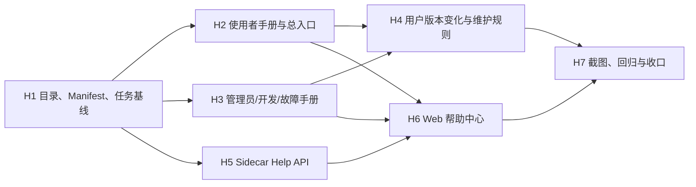

# Miracle 角色化说明书与 Web 帮助中心实施计划

> 文档状态：CURRENT
>
> 对应设计：`docs/06-operations/manuals/00_Miracle角色化说明书与Web帮助中心设计.md`
>
> 实施任务：`H1-H7`
>
> 当前版本基线：`v0.9.0`

## 1. 实施目标

将已确认的角色化说明书设计落成一套可持续维护的文档与应用内帮助能力：

1. 使用者、管理员、开发维护者分别拥有明确的阅读入口。
2. 当前所有 Web 一级菜单和核心工作流均有实际操作步骤。
3. Sidecar 通过安全白名单提供文章、搜索和图片 API。
4. Web 新增“帮助与手册”，显示与仓库 Markdown 同源的内容。
5. 当前发布版本的实际页面截图进入版本化手册资产目录。
6. 版本、AI 阅读导航、README 和 task-baseline 同步更新。

## 2. 实施边界

- 保持 `v0.9.0` 运行协议不变，不修改 Run、Scheduler、Adapter 和 Provider 行为。
- 帮助 API 是只读旁路，故障不能影响运行主链路。
- 不增加账号、RBAC、云端知识库、在线客服和移动端帮助页面。
- 不把真实凭证、个人路径、prompt、Artifact 正文或隐藏推理写入手册和截图。
- 当前截图使用本地 fixture 或脱敏测试 Run，不发起真实 Provider 请求。

## 3. 依赖关系



并行规则：

- H2 与 H3 可并行。
- H5 可在 H1 后与 H2/H3 并行。
- H6 必须等待 H5 接口稳定。
- H7 必须等待正文和 Web 页面完成，避免截图与最终界面不一致。

## 4. H1：目录、Manifest 和任务基线

### 4.1 文件变化

创建：

```text
docs/05-delivery/help-center/66_Miracle角色化说明书与Web帮助中心实施计划.md
docs/06-operations/manuals/README.md
docs/06-operations/manuals/help-manifest.json
docs/06-operations/manuals/user/
docs/06-operations/manuals/administrator/
docs/06-operations/manuals/developer/
docs/06-operations/manuals/shared/
assets/manual/v0.9.0/
```

更新：

```text
plans/mvp-task-baseline/roadmap.json
docs/README.md
docs/00-navigation/asset-index/17_文档资产关联与AI阅读导航.md
VERSION_HISTORY.md
```

### 4.2 Manifest 字段

- `schema_version`
- `product_version`
- `verified_at`
- `articles[]`: id、title、role、source、order、summary、tags
- `assets[]`: id、source、media_type

### 4.3 测试

- JSON 解析通过。
- article/asset ID 唯一。
- 文档 source 不含绝对路径和 `..`。
- task-baseline 当前节点为 `help-h1`，H1-H7 依赖完整。

## 5. H2：使用者手册与总入口

### 5.1 文件变化

创建：

```text
docs/06-operations/manuals/user/61_Miracle使用者操作手册.md
```

重构：

```text
docs/06-operations/user-guide/40_Miracle系统操作使用说明书.md
```

### 5.2 内容要求

- 五分钟快速开始。
- 首页、新任务、Dry-run、任务运行、Attention、智能体、产物、审核、画布草稿、
  Spec Sync、进化占位和帮助中心逐项说明。
- RunDraft 到 Artifact 交付的完整流程。
- Gate、Retry、Fallback 和 Historical Run 的安全操作。
- 创建/扩展工作流的当前能力与限制。
- 内容生产、研究分析、图像生成三个示例。
- 所有操作说明前置条件、输入、结果、状态、恢复动作和下一步。

### 5.3 测试

- 一级菜单覆盖检查。
- 核心 API/对象名称与当前实现一致。
- 不把占位功能描述成已完成能力。
- 文档链接和图片链接有效。

## 6. H3：管理员、开发维护和故障手册

### 6.1 文件变化

创建：

```text
docs/06-operations/manuals/administrator/62_Miracle管理员与运维手册.md
docs/06-operations/manuals/developer/63_Miracle开发维护手册.md
docs/06-operations/manuals/shared/64_Miracle故障排查手册.md
```

### 6.2 管理员重点

- 安装、启动、端口和 workspace。
- Codex CLI 与 Provider 凭证治理。
- Historical Import、备份、恢复和升级。
- Health、日志、Event Journal、task-baseline 和 Git 核对。
- Key、路径、symlink、截图和 smoke 安全边界。

### 6.3 开发维护重点

- 仓库结构、模块边界和根级命令。
- WorkflowSpec、RunSpec、Snapshot、Projection 和 Orchestrator 单写入。
- Domain、Workflow、Node、Artifact、Gate、Component、Adapter、Provider 扩展步骤。
- Sidecar API、Web 菜单、测试、发布和手册同步清单。

### 6.4 故障重点

- 按用户可观察现象索引。
- 每项包含影响、快速判断、诊断、恢复、禁忌和支持信息。
- 覆盖服务启动、数据、Codex、Provider、Run、Retry、Gate、Artifact、Import 和
  task-baseline。

## 7. H4：用户版本变化与维护规则

创建：

```text
docs/06-operations/manuals/shared/65_Miracle用户可感知版本变更.md
```

首版至少包含 `v0.7.0`、`v0.8.0`、`v0.9.0`，重点说明：

- 新增功能。
- 操作优化。
- 用户可感知问题修复。
- 操作、启动和配置变化。
- 数据兼容和已知限制。

将原 `40` 中的手册同步规则迁移至 `manuals/README.md` 和开发维护手册，避免总入口继续膨胀。

## 8. H5：Sidecar Help API

### 8.1 文件变化

创建：

```text
apps/sidecar/src/help-center.ts
apps/sidecar/test/help-center.test.ts
```

更新：

```text
apps/sidecar/src/server.ts
```

### 8.2 模块接口

```ts
loadHelpManifest(options)
listHelp(options)
readHelpArticle(articleId, options)
searchHelp(query, role, options)
readHelpAsset(assetId, options)
```

`help-center.ts` 负责路径和内容安全，`server.ts` 只负责 HTTP 路由和响应。

### 8.3 API

```text
GET /api/v0/help
GET /api/v0/help/articles/:articleId
GET /api/v0/help/search?q=:query&role=:role
GET /api/v0/help/assets/:assetId
```

### 8.4 安全测试

- article/asset 不存在返回稳定 404 reason code。
- `..`、绝对路径、symlink 逃逸和未登记资源被拒绝。
- 只允许 `image/png`、`image/jpeg`、`image/webp`。
- API 不返回磁盘绝对路径。
- 搜索空查询、非法 role 和超长查询有确定行为。
- Help 内容损坏不影响 `/api/v0/health`。

## 9. H6：Web 帮助中心

### 9.1 依赖

使用成熟解析器：

```text
react-markdown
remark-gfm
mermaid
```

原始 HTML 禁用，Mermaid 使用 strict security 配置。

### 9.2 文件变化

创建：

```text
apps/web/src/help-center.ts
apps/web/src/HelpCenter.tsx
apps/web/src/help-center.test.ts
```

更新：

```text
apps/web/src/App.tsx
apps/web/src/styles.css
apps/web/package.json
package-lock.json
```

### 9.3 页面行为

- 侧边栏新增 `BookOpen` 图标和“帮助与手册”。
- 顶部显示搜索、版本和验证日期。
- 左栏显示角色和文章列表。
- 中栏渲染 Markdown、GFM、代码块、图片和 Mermaid。
- 右栏显示 H2/H3 目录。
- 支持文章、搜索、空状态、错误状态和键盘焦点。
- 使用 URL 查询参数和 hash 恢复文章与章节。
- 图片 src 通过 API 返回的 asset map 转换为安全 asset ID URL。

### 9.4 测试

- 导航中存在帮助入口。
- 角色过滤和搜索结果正确。
- URL 深链解析和序列化稳定。
- 非法链接协议和原始 HTML 不执行。
- 长中文标题、表格、代码块不破坏布局。

## 10. H7：截图、回归和收口

### 10.1 截图

用 Playwright 在当前代码和 fixture workspace 上生成：

```text
assets/manual/v0.9.0/01-home.png
assets/manual/v0.9.0/02-new-task.png
assets/manual/v0.9.0/03-dry-run.png
assets/manual/v0.9.0/04-run-workspace.png
assets/manual/v0.9.0/05-attention.png
assets/manual/v0.9.0/06-agent-collaboration.png
assets/manual/v0.9.0/07-artifact-board.png
assets/manual/v0.9.0/08-gate-review.png
assets/manual/v0.9.0/09-provider-routing.png
assets/manual/v0.9.0/10-canvas-draft.png
assets/manual/v0.9.0/11-task-baseline.png
assets/manual/v0.9.0/12-help-center.png
```

截图前检查脱敏，不调用真实 Provider。

### 10.2 回归命令

```bash
npm run typecheck
npm run test
npm run build
git diff --check
```

### 10.3 页面验收

- Web 帮助入口、搜索、文章、目录、图片和 Mermaid。
- 现有首页、Run、Attention、Agent、Artifact、Gate 和 Canvas 无回归。
- Sidecar Help API 与运行 API 相互隔离。

### 10.4 收口同步

更新：

```text
README.md
docs/README.md
docs/00-navigation/asset-index/17_文档资产关联与AI阅读导航.md
docs/06-operations/manuals/help-manifest.json
VERSION_HISTORY.md
plans/mvp-task-baseline/roadmap.json
```

H7 完成后将 `help-center` 阶段和 `help-h7` 标记为 completed，`current_node_id` 置空。

## 11. 提交建议

建议按可审查边界提交：

1. `建立角色化说明书目录与任务基线`
2. `编写Miracle角色化系统说明书`
3. `实现Sidecar帮助内容API`
4. `实现Web帮助与手册中心`
5. `完成帮助中心截图与回归收口`

每次提交明确说明 task-baseline 是否已同步；只有任务状态真实完成后才推进 current node。

## 12. 完成定义

- `40` 成为稳定总入口，61-65 成为角色与公共手册真相。
- 用户能在 Web 内按角色浏览、搜索并深链到帮助章节。
- 当前一级菜单和典型任务闭环均有真实操作说明。
- Help API 不存在任意文件读取和路径泄露。
- 真实页面截图与 `v0.9.0` 内容一致并通过脱敏检查。
- 全量工程回归通过，任务基线、版本和导航完成同步。
