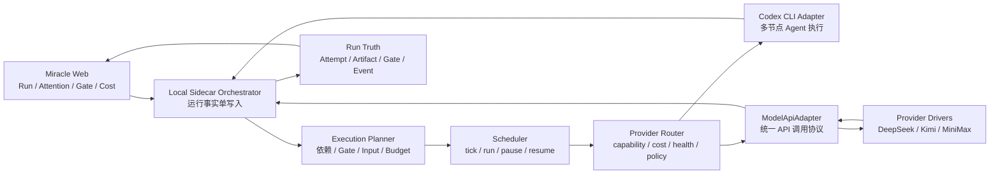

# P7 多节点真实执行与模型 Adapter 扩展总体设计

> 文档状态：`ACTIVE / P7-01 已评审总体设计基线`
>
> 前置基线：`v0.8.0`、`54_P6回归验收与版本收口报告.md`
>
> 核心决策：先以 Codex CLI 完成多节点真实执行闭环，再引入 retry/fallback，
> 后续通过通用模型 API Adapter 接入 DeepSeek、Kimi 和 MiniMax。P7 不接入
> OpenAI 官方 API，不实装 Hermes/OpenClaw。

## 1. 文档目标

P6 已证明 Miracle 能从 confirmed RunDraft 创建正式 Run，并用 Codex CLI
真实执行单个 `C_md_master` 节点，最终生成 Artifact、Gate、NodeAttempt 和
TraceEvent。P7 不再重复验证“能否调用 Codex”，而是解决以下工程问题：

1. 一次 Run 如何按 DAG 依赖连续执行多个真实节点。
2. 上游 Artifact 如何被可验证地解析为下游节点输入。
3. Gate 审核如何暂停、拒绝、返工和恢复连续执行。
4. 可恢复错误如何 retry，同能力 Provider 如何 fallback，且不破坏审计历史。
5. 如何以领域无关方式接入低成本模型 API，而不将 WorkflowSpec
   固化到某个厂商或模型名称。

P7 完成后，Miracle 应从“真实单节点执行样本”进入“可审计的多节点真实
执行基线”，但仍然保持本地优先、显式授权和成本可控。

## 2. 已确认的产品与架构决策

### 2.1 优先级

P7 按以下顺序实施：

```text
Codex 多节点计划
  -> 真实 Artifact 交接
  -> Codex Scheduler 连续执行
  -> Gate 暂停与恢复
  -> retry 与故障恢复
  -> 通用 Model API Adapter
  -> DeepSeek / Kimi / MiniMax
  -> Provider fallback 与路由
  -> UI 可观测与版本收口
```

不为了“Adapter 数量”并行实装多个尚无真实业务闭环的 Runtime。先让一条
Codex 链路稳定，再让新 Provider 共享同一套执行真相和故障处理协议。

### 2.2 P7 明确不做

- 不接入 OpenAI 官方 API。
- 不实装 Hermes 和 OpenClaw 真实执行；只保留 Adapter Contract 兼容性。
- 不做云端多租户调度、账号、计费、自动充值或密钥托管平台。
- 不允许无限 retry，不允许超过用户成本预算后继续自动调用。
- 不将普通文本模型 API 伪装为具备 CLI、MCP、文件修改或长时 Agent 循环的
  Runtime。
- 不把模型名称、价格或厂商 endpoint 写死在 WorkflowSpec 和 NodeSpec 中。

## 3. P7 总体架构



核心约束：

1. Adapter 只返回 `AdapterResult`，不直接写 NodeRun、Artifact、Gate 或 Event Journal。
2. Sidecar Orchestrator 继续是本地 Run 事实的唯一写入者。
3. Execution Planner 只做决策投影，Scheduler 负责触发，Adapter 负责外部执行。
4. 布局信息不参与执行，真实依赖仍只来自 WorkflowSnapshot 的 EdgeSpec。
5. Local Sidecar 是 MVP 执行面，后续 Cloud Control Plane 可以复用同一协议，但不在
   P7 实装。

## 4. Codex 多节点真实执行设计

### 4.1 新增执行投影

#### ExecutionPlan

`ExecutionPlan` 是某一时刻基于不可变 WorkflowSnapshot 和当前 Run 事实计算的
可重建投影，不是新的事实根对象。

```ts
interface ExecutionPlan {
  run_id: string;
  workflow_snapshot_id: string;
  calculated_at: string;
  revision: number;
  decisions: NodeExecutionDecision[];
  ready_node_run_ids: string[];
  paused_node_run_ids: string[];
  blocked_node_run_ids: string[];
  terminal: boolean;
}
```

#### NodeExecutionDecision

```ts
interface NodeExecutionDecision {
  node_run_id: string;
  node_id: string;
  decision: "execute" | "wait" | "pause_for_gate" | "blocked" | "skip";
  reason_code: string;
  required_edge_status: Array<{
    edge_id: string;
    source_node_run_id: string;
    satisfied: boolean;
  }>;
  resolved_inputs: ResolvedNodeInput[];
  eligible_adapter_kinds: Array<"codex" | "model-api">;
  selected_provider_profile_id?: string;
}
```

#### ResolvedNodeInput

```ts
interface ResolvedNodeInput {
  input_id: string;
  source_kind: "run_input" | "artifact" | "parameter";
  source_ref: string;
  artifact_id?: string;
  artifact_version?: number;
  artifact_hash?: string;
  media_type: string;
  required: boolean;
  resolved_at: string;
}
```

`ExecutionPlan` 可从 RunSpec、WorkflowSnapshot、NodeRun、ArtifactManifest、GateInstance 和
GateDecision 重新计算，因此不得被当作一套新运行真相。

### 4.2 节点就绪条件

节点只有同时满足以下条件时才能进入真实执行：

1. NodeRun 状态为 `queued`，或是由 Orchestrator 恢复的 `running`。
2. 所有 `required: true` 边的来源节点已产出合格 Artifact。
3. EdgeSpec 的 `join_policy`、`wait_if_active`、`max_wait` 和 `on_timeout` 已得出确定结果。
4. 必需 Artifact 的版本、hash、media type 和 review status 符合 NodeSpec 输入约束。
5. `required_before` 指定的 GateInstance 已有有效 approved GateDecision。
6. 没有同一 `operation_id` 的进行中执行。
7. 候选 Adapter 健康、可执行，并满足节点 capability 要求。
8. 未超过 Run、Node 和 Provider 的时间与成本预算。

optional 分支不得阻塞 required 主链；但如果 optional 分支仍处于 active 且 EdgeSpec
要求 `wait_if_active: true`，则必须在 `max_wait` 和 `on_timeout` 规则内处理。

### 4.3 Artifact 交接真实性

上游产物不通过临时字符串拼接传给下游。Orchestrator 必须先生成
`ResolvedNodeInput[]`，然后把它们写入 AdapterInvocation 的不可变输入快照。

```text
NodeRun A
  -> ArtifactManifest A v2 + sha256
  -> ResolvedNodeInput B
  -> AdapterInvocation B
  -> NodeAttempt B
  -> ArtifactManifest B v1 + sha256
```

每次交接至少记录：

- 上游 Artifact ID、版本、SHA-256 和 media type。
- 下游实际读取的工作区相对路径或结构化值。
- WorkflowSnapshot ID、NodeRun ID、operation ID 和 Attempt ID。
- 解析时间和输入解析器版本。
- 输入变化时是否创建新 operation。

任何 hash 不匹配、产物丢失或 media type 不兼容都必须进入 `blocked` 或
Attention，不得静默使用旧文件。

### 4.4 首个验收工作流

P7 首个真实多节点样本保持足够小，但必须包含产物交接和人工 Gate：

```text
A_fact_input（脱敏事实输入）
  -> B_content_plan（Codex 内容策划）
  -> C_md_master（Codex MD 母稿）
  -> Gate_md_review（人工审核）
  -> D_platform_summary（Codex 平台摘要）
```

验收行为：

- Scheduler 在无人工介入时连续完成 B 和 C。
- C 产物生成后 Run 暂停在 Gate，D 不得提前执行。
- Gate 批准后 D 使用已批准的 C Artifact 继续执行。
- Gate 拒绝时创建 C 的 rework operation，旧 Attempt 和旧 Artifact 保留。
- 任一节点失败时，下游不得误判为就绪。

## 5. Retry 与故障恢复

### 5.1 错误分类

| 错误类型 | 默认处理 | 是否自动 |
|---|---|---:|
| 临时网络或限流 | 按退避策略 retry | 是 |
| Codex 进程可恢复异常 | 限次 retry | 是 |
| 节点超时 | 按节点策略 retry 或转人工 | 可配置 |
| 凭证缺失或权限错误 | `NodeRun.blocked` + Attention | 否 |
| 输入或 Artifact 缺失 | `NodeRun.blocked` + Attention | 否 |
| 输出格式可修复 | retry 或转人工 | 可配置 |
| Gate 审核拒绝 | 创建 rework operation | 否 |
| 用户修改输入后重跑 | 创建新 operation | 否 |
| 不可恢复 Adapter 错误 | NodeAttempt failed + Attention | 否 |

Core classifier 是 Adapter outcome 的唯一归一化入口。真实 Codex
`process_exit_nonzero` / `process_spawn_failed` 映射为 `adapter_process_error`，
`process_timeout` 与 `timed_out` 同时成立时映射为 `adapter_timeout`，
`invalid_adapter_output` 映射为 `adapter_output_invalid`。只有 policy 明确允许的
归一化 code 才能自动 retry；`cancelled`、`aborted`、`unknown`、
`dispatched_unknown` 和 `invalid_result` 始终阻断自动重派。

### 5.2 Operation 与 Attempt 规则

| 场景 | `operation_id` | `NodeAttempt` |
|---|---|---|
| 网络 retry | 复用 | 新建 |
| 同能力 Provider fallback | 复用 | 新建 |
| 超时后系统自动 retry | 复用 | 新建 |
| Gate 返工 | 新建 | 新建 |
| 用户修改输入后重跑 | 新建 | 新建 |
| preview 转 real Run | 新建 | 新建 |

每次自动 retry 必须同时受以下约束：

```ts
interface RetryPolicy {
  max_attempts: number;
  backoff: "fixed" | "exponential";
  initial_delay_ms: number;
  max_delay_ms: number;
  retryable_error_codes: string[];
  attempt_timeout_ms: number;
  total_time_budget_ms: number;
  cost_budget: number;
  manual_confirmation_after?: number;
}
```

P7 默认 `max_attempts <= 3`。如果超过时间、次数或成本预算，Orchestrator
必须停止自动执行并创建 Attention Item。

默认和 legacy NodeSpec 映射使用保守有限 `cost_budget = 5`，模板可以显式覆盖；
任何有效 RetryPolicy 都必须具有有限 cost budget。

NodeSpec 可在 `failure_policy.retry_policy` 提供完整覆盖。首 Attempt 使用
`attempt_timeout_ms`；retry Attempt 使用
`min(attempt_timeout_ms, remaining_total_budget_ms)`，remaining 不大于 0 时不得派发。
Sidecar 以原子 schedule 和 durable retry state 区分 `waiting_for_retry`、到期、
`exhausted` 与 `blocked`；恢复扫描始终使用 current now，terminal tombstone 不会被旧
`created_at` 复活。

## 6. 通用模型 API Adapter

### 6.1 为什么不做三套独立 Adapter

DeepSeek、Kimi 和 MiniMax 都属于“远程模型 API”这一类 Runtime，共享大量执行
语义：请求构建、超时、取消、usage、成本、限流、凭证和错误映射。复制三套
Adapter 会让审计、retry 和 fallback 行为逐渐分叉。

P7 采用三层模型：

```text
ModelApiAdapter
  -> ProviderDriver
      -> DeepSeekDriver
      -> KimiDriver
      -> MiniMaxDriver
  -> ProviderProfile
```

### 6.2 分层职责

| 对象 | 职责 | 不负责 |
|---|---|---|
| `ModelApiAdapter` | 统一接收 AdapterInvocation，执行超时/取消，返回 AdapterResult | 不选择业务工作流 |
| `ProviderDriver` | 处理 endpoint、请求字段、流式响应、usage 和错误差异 | 不写运行事实 |
| `ProviderProfile` | 声明模型、capability、上下文、成本等级、限流和凭证引用 | 不包含明文密钥 |
| `ProviderRouter` | 按 capability、健康、成本、策略和历史表现选择 Profile | 不直接调用外部 API |

不论某个厂商是否提供 OpenAI-compatible 协议，Miracle 只把它当作一种传输
兼容形式，不调用 OpenAI 官方服务，也不把 OpenAI 类型写入核心业务模型。

### 6.3 ProviderProfile

```yaml
id: deepseek-chat-default
adapter_kind: model-api
provider: deepseek
model: deepseek-chat
driver: openai-compatible

capabilities:
  - text.generate
  - content.rewrite
  - structured_output

credential_ref: env:DEEPSEEK_API_KEY

limits:
  context_window: provider_reported
  timeout_ms: 120000
  max_retries: 2

routing:
  cost_tier: low
  priority: 10
  fallback_profiles:
    - kimi-default
    - minimax-default
```

`provider_reported` 表示上下文长度和实时价格在实施阶段从厂商官方文档和
本地 Registry 配置确认，不在 WorkflowSpec 中固化为长期不变的数字。

### 6.4 接入顺序

1. **DeepSeek**：首先验证通用文本生成、改写和结构化输出。
2. **Kimi / Moonshot AI**：验证长上下文、资料整理和研究类节点。
3. **MiniMax**：补充文本能力，并为后续语音或多模态 capability 预留 Profile，
   P7 不扩展语音和视频执行。

实际实装顺序可以因用户已有凭证、实时成本和接口稳定性调整，但不得改变
`ModelApiAdapter -> ProviderDriver -> ProviderProfile` 的分层。

每个 Provider 实装前必须基于其官方文档重新核对 endpoint、认证、模型名、
usage、价格、限流、数据保留和取消能力；本文不把易变信息当作长期常量。

P7-07 对三个 Provider 的验收层级分开处理：

- DeepSeek、Kimi 和 MiniMax 都必须通过 fake server 契约测试、错误映射和凭证缺失测试。
- 至少一个由用户提供凭证的 Provider 必须完成真实脱敏小样本调用。
- 没有凭证或未完成真实调用的 Provider 标记为 `configured_unverified`，不得对外显示
  `healthy` 或声称已接通。
- 后续补充凭证时可以独立升级单个 Provider 的验收状态，不需要重新发布
  WorkflowSpec。

## 7. Provider 路由与 Fallback

### 7.1 两类 fallback

#### 同类模型 Provider fallback

```text
DeepSeek -> Kimi -> MiniMax
```

只用于节点共同声明的可替代 capability，例如 `text.generate`、
`content.rewrite` 和 `structured_output`。

#### Codex 与 Model API 路由

```text
Codex CLI -> Model API
```

只有 NodeSpec 显式允许多种 Runtime，且下降后仍能满足所有 capability 时才能进行：

```yaml
capability_requirements:
  - content.longform_draft

runtime_policy:
  allowed_adapter_kinds:
    - codex
    - model-api
  automatic_cross_kind_fallback: false
```

P7 默认 `automatic_cross_kind_fallback: false`。Codex 节点切换到 Model API 需要用户确认；
同类 Model API Profile 之间可以在预算和策略内自动 fallback。

### 7.2 禁止自动降级的能力

节点需要以下任一能力时，普通 Model API 不能作为 Codex 的自动替代：

- 修改本地工作区文件。
- 执行 CLI 或脚本。
- 调用 MCP Tool。
- 进行多轮 Agent 规划与工具循环。
- 依赖本地 Git、浏览器会话或系统凭证。
- 产生必须由特定工具验证的产物。

### 7.3 路由决策输出

ProviderRouter 每次决策必须返回可审计投影：

```ts
interface ProviderRoutingDecision {
  operation_id: string;
  selected_adapter_kind: "codex" | "model-api";
  selected_provider_profile_id?: string;
  candidate_profile_ids: string[];
  rejected_candidates: Array<{ profile_id: string; reason_code: string }>;
  reason_codes: string[];
  estimated_cost?: { currency: string; min: number; max: number };
  requires_confirmation: boolean;
  decided_at: string;
}
```

决策理由至少包含 capability、健康、成本等级、用户策略、上下文上限、凭证
可用性和历史成功率。不记录密钥和隐藏推理链。

## 8. 安全、成本与数据边界

### 8.1 凭证

- ProviderProfile 只保存 `credential_ref`，不保存明文 API Key。
- Local Sidecar 从 env 或后续 keychain provider 解析凭证。
- API Key 不得出现在 WorkflowSnapshot、RunSpec、TraceEvent、Adapter receipt 和日志中。
- 凭证缺失时必须在 dry-run 或执行前阻断，不得先调用再报错。

### 8.2 成本

- ProviderProfile 声明成本等级和可选估算规则。
- AdapterResult 返回厂商 usage 和可验证的 provider receipt。
- Run 和 Node 都可配置成本预算，超过预算必须暂停并请求确认。
- 估算成本和实际成本分开存储，界面必须显示差异。
- 价格是 Registry 配置的可更新投影，不是执行核心常量。

### 8.3 数据外发

向远程模型 API 发送数据前，dry-run 必须显示：

- Provider 和模型。
- 将要外发的 Artifact 类型和数量。
- 是否包含用户标记的敏感数据。
- 是否需要人工确认。
- 预计成本和超时。

P7 默认远程 API 节点需要在 RunDraft 确认时明确授权。

## 9. UI 与可观测性

P7 不重做信息架构，仅在现有 Product Design A/B/C 基线上增加运行信息：

### 9.1 Run 工作区

- 节点展示 `Runtime: Codex / Model API`。
- Model API 节点展示 Provider Profile 和模型。
- Node Detail 展示所有 Attempt、retry/fallback 关系和每次成本。
- Scheduler 展示当前 tick、就绪节点、暂停理由和下一动作。
- Artifact 交接展示上游版本、hash 和下游消费者。

### 9.2 Attention

增加以下根因类型：

- retry budget exhausted。
- provider quota or rate limit。
- provider credential missing。
- fallback requires confirmation。
- artifact input conflict。
- execution cost budget exceeded。

同一根因仍只生成一个主 Attention Item，相关 Agent、NodeRun、NodeAttempt、Artifact
和 Gate 作为关联对象展开。

### 9.3 Event Journal

新增事件类型至少包含：

- `execution_plan_calculated`
- `node_inputs_resolved`
- `retry_scheduled`
- `retry_exhausted`
- `provider_routing_decided`
- `provider_fallback_started`
- `provider_fallback_completed`
- `cost_budget_paused`

事件只记录可审计决策摘要，不记录隐藏推理链或凭证。

## 10. P7 任务拆分

| ID | 任务 | 核心交付 | 依赖 | 并行 |
|---|---|---|---|---:|
| P7-01 | 多节点执行与模型路由总体设计 | 本文、路线图和 task-baseline | P6-08 | 否 |
| P7-02 | 多节点 ExecutionPlan 与输入解析 | 就绪判断、ResolvedNodeInput、Artifact 绑定 | P7-01 | 否 |
| P7-03 | Codex 多节点产物交接 | 上游 Artifact 到下游 Invocation 的真实交接 | P7-02 | 否 |
| P7-04 | Codex Scheduler 连续执行闭环 | 多节点连续推进、Gate 暂停与恢复 | P7-03 | 否 |
| P7-05 | Retry 与故障恢复 | 错误分类、退避、预算、Attempt 历史 | P7-04 | 否 |
| P7-06 | 通用 Model API Adapter | Adapter、Driver、Profile 和凭证边界 | P7-05 | 否 |
| P7-07 | DeepSeek/Kimi/MiniMax Provider | Provider Driver、健康检查和真实小样本 | P7-06 | 是 |
| P7-08 | Provider fallback 与灵活路由 | 能力、成本、健康和人工确认策略 | P7-05/P7-07 | 否 |
| P7-09 | 多运行时 UI 与可观测性 | Run、Attention、Attempt、Provider 和成本展示 | P7-08 | 否 |
| P7-10 | P7 回归验收与版本收口 | 测试、API、真实样本、截图、手册和版本记录 | P7-09 | 否 |

P7-07 内的三个 Provider Driver 在共享契约和 fake server 测试完成后可并行，
但每个 Driver 必须分别评审和验收，不以一个 Provider 成功代替其他 Provider 验收。

## 11. 验收方案

### 11.1 Codex 纵向闭环

1. 使用脱敏样本启动一个至少三个真实执行节点的 Run。
2. Scheduler 根据 DAG 依赖连续执行就绪节点。
3. 上游 Artifact 的版本和 hash 与下游 ResolvedNodeInput 一致。
4. Gate 会暂停下游，批准后恢复，拒绝后进入返工。
5. 每个 NodeAttempt、Artifact、GateDecision 和 TraceEvent 都可追溯到 RunSpec 和
   WorkflowSnapshot。

### 11.2 Retry/fallback

1. 可恢复错误在限制内自动 retry，每次都新增 NodeAttempt。
2. 超过次数、时间或成本预算后自动暂停并创建 Attention。
3. 同类 Provider fallback 保留 operation ID 且记录路由原因。
4. Codex 转 Model API 默认需要用户确认。
5. 需要 CLI、MCP 或本地文件操作的节点不得自动降级到 Model API。

### 11.3 Model API

1. DeepSeek、Kimi 和 MiniMax 的 Provider Driver 全部通过 fake server 契约测试。
2. 至少一个低成本 Provider 完成真实脱敏小样本执行；其他未真实验证的
   Provider 必须标记为 `configured_unverified`。
3. DeepSeek、Kimi 和 MiniMax 可通过 ProviderProfile 切换，无需修改 WorkflowSpec。
4. 凭证只以引用形式存在，日志和回执不包含 API Key。
5. UI 展示 runtime、provider、model、usage、估算/实际成本和 fallback 原因。
6. 任一 Provider 不可用时，不影响 Codex 纵向闭环的独立运行。

### 11.4 回归与安全

- Core、Sidecar 和 Web 全量测试通过。
- Historical Run 继续严格只读。
- 真实源工作区、大媒体、凭证和登录文件不进入 Git。
- Event Journal 仍由 Orchestrator 单写入。
- 不记录隐藏推理链。
- 用户手册、VERSION_HISTORY、README、17 号导航和 task-baseline 同步。

## 12. 风险与对策

| 风险 | 影响 | 对策 |
|---|---|---|
| Scheduler 同时承担计划和执行真相 | 难测试、难迁移 | Planner 只产生投影，Orchestrator 单写入 |
| Artifact 用路径代替 ID/hash | 下游读到错误版本 | 必须生成 ResolvedNodeInput 快照 |
| retry 覆盖旧 Attempt | 审计丢失 | 新增 Attempt，永不就地覆盖 |
| 无界 retry 产生费用 | 成本失控 | 次数、时间、成本三重预算 |
| 厂商协议差异泄露到 WorkflowSpec | 难切换 Provider | 通过 Driver/Profile 隔离 |
| 把 OpenAI-compatible 等同于 OpenAI 服务 | 产品和成本边界混乱 | 仅作为 transport driver，P7 不接 OpenAI 官方 API |
| Codex 节点静默降级为普通模型 | 工具能力丢失、结果不对等 | 跨 kind fallback 默认人工确认 |
| Provider 价格和模型快速变化 | 文档过时 | 易变数据放 Registry，接入时核对官方文档 |
| 远程 API 外发敏感数据 | 隐私和合规风险 | dry-run 显示数据边界并要求显式授权 |

## 13. P7-01 出口条件

P7-01 只在以下条件全部满足后进入 P7-02：

- [x] Codex 纵向闭环优先级已明确。
- [x] OpenAI 官方 API 已明确排除在 P7 外。
- [x] DeepSeek、Kimi、MiniMax 使用通用 Model API Adapter 分层。
- [x] ExecutionPlan 是可重建投影，不是新核心事实对象。
- [x] Artifact 真实交接、Gate 暂停/恢复和 retry/fallback 边界已定义。
- [x] P7-01 至 P7-10 的顺序、依赖、并行点和验收标准已定义。
- [x] 用户完成本文人工评审。
- [x] 基于评审通过的设计生成 P7 逐文件实施计划。

P7-01 已通过人工评审，逐文件实施计划见
`56_P7工程实施计划与任务拆解.md`；task-baseline 从 `p7-01` 推进到 `p7-02`。
