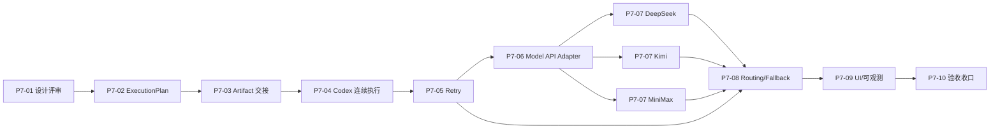

# P7 工程实施计划与任务拆解

> 文档状态：`CURRENT / P7-02 至 P7-10 实施真相源`
>
> 已评审设计：`55_P7多节点真实执行与模型Adapter扩展总体设计.md`
>
> **For agentic workers:** REQUIRED SUB-SKILL: Use `superpowers:subagent-driven-development`
> (recommended) or `superpowers:executing-plans` to implement this plan task-by-task. Steps use
> checkbox (`- [ ]`) syntax for tracking.

**Goal:** 在不改变 Miracle 运行真相边界的前提下，先以 Codex CLI 打通多节点
真实连续执行、Artifact 交接、Gate 暂停/恢复和 retry，然后以可插拔模型 API
层接入 DeepSeek、Kimi 和 MiniMax，最终完成 Provider fallback 和可观测性。

**Architecture:** Core 新增纯函数 Execution Planner 和路由/重试契约，不写入运行事实；
Sidecar Orchestrator 继续单写入 NodeRun、NodeAttempt、ArtifactManifest、GateInstance 和
TraceEvent。Codex 使用仓库外 Attempt workspace 执行；远程模型统一通过
`ModelApiAdapter -> ProviderDriver -> ProviderProfile` 调用，WorkflowSpec 只声明 capability
和 runtime policy，不固化厂商 endpoint、模型或价格。

**Tech Stack:** TypeScript 5、Node.js Local Sidecar、React/Vite、Zod、Vitest、React Flow、JSON/JSONL、
Node.js 原生 `fetch`。

## Global Constraints

- P7 的真实执行优先级固定为 Codex 多节点纵向闭环，再实施 retry/fallback 和模型 API。
- P7 不接入 OpenAI 官方 API；仅允许使用 OpenAI-compatible 传输格式调用已批准的
  DeepSeek、Kimi 和 MiniMax endpoint。
- Hermes/OpenClaw 保留现有 Adapter shell，P7 不实装它们的真实执行。
- Historical Run 严格只读，不允许 Planner、Scheduler、retry、fallback 或 Gate 写入。
- Adapter 只返回 AdapterResult；Event Journal 只由 Sidecar Orchestrator 写入。
- `ExecutionPlan` 和 `ProviderRoutingDecision` 是可重建投影，不是新的 Run 根对象。
- 网络 retry 和同能力 Provider fallback 复用 operation ID 并新增 NodeAttempt；Gate 返工和
  输入变化必须新建 operation ID。
- Codex 与 Model API 之间的跨 kind fallback 默认需要人工确认。
- Provider Key 只以 env/keychain 引用形式使用，不得进入 Git、RunSpec、WorkflowSnapshot、
  Event Journal、截图或 Adapter receipt。
- 任何远程 API 真实调用都要求用户提供凭证并显式设置 opt-in 开关。
- 每个任务按 TDD 完成，单任务验收通过后才提交，每次提交都同步 task-baseline。

---

## 1. 文件结构锁定

### Core 执行契约

| 文件 | 职责 |
|---|---|
| `packages/core/src/execution-plan.ts` | 计算节点就绪、Gate 暂停、Artifact 输入和 terminal 投影。 |
| `packages/core/src/retry-policy.ts` | 错误分类、retry 预算、退避和 operation/attempt 决策。 |
| `packages/core/src/provider-routing.ts` | 根据 capability、健康、成本和策略生成 ProviderRoutingDecision。 |
| `packages/core/src/model-api.ts` | ModelApiAdapter、ProviderDriver、ProviderProfile 的共享类型和规范化函数。 |
| `packages/core/src/types.ts` | 只存放稳定的共享对象定义。 |
| `packages/core/src/schemas.ts` | 对外边界的 Zod schema 和关联一致性验证。 |

### Sidecar 执行面

| 文件 | 职责 |
|---|---|
| `apps/sidecar/src/artifact-input-resolver.ts` | 验证 Artifact 版本/hash/media type，建立 ResolvedNodeInput。 |
| `apps/sidecar/src/execution-planner.ts` | 读取 Run bundle 并调用 Core Planner，不写入事实。 |
| `apps/sidecar/src/node-output-contract.ts` | 从 NodeSpec 构建 Codex 输出 schema，解析多种文本 Artifact。 |
| `apps/sidecar/src/retry-store.ts` | 原子记录 retry schedule 和预算投影。 |
| `apps/sidecar/src/model-api-adapter.ts` | 处理超时、AbortSignal、usage、receipt 和 ProviderDriver 调度。 |
| `apps/sidecar/src/provider-drivers/*.ts` | DeepSeek、Kimi、MiniMax 请求/响应/错误差异。 |
| `apps/sidecar/src/server.ts` | 仅组装 API、Orchestrator 事实提交和上述模块。 |

### Web 投影

| 文件 | 职责 |
|---|---|
| `apps/web/src/run-observability.ts` | 转换 Attempt、retry、fallback、usage 和路由投影为 UI view model。 |
| `apps/web/src/App.tsx` | 在现有 Run/Attention 页面组装新投影。 |
| `apps/web/src/styles.css` | 新增 runtime/provider/retry/cost 的紧凑展示样式。 |

### Fixtures 与证据

| 文件 | 职责 |
|---|---|
| `fixtures/mvp-workspace/.miracle/workflows/codex-content-chain-v0.json` | P7 Codex 三节点 + Gate 真实样本。 |
| `fixtures/mvp-workspace/.miracle/providers/*.json` | 不含凭证的 ProviderProfile 样例。 |
| `apps/sidecar/test/fixtures/provider-server.mjs` | 三个 Provider Driver 的本地契约测试 server。 |
| `assets/reviews/p7-*` | 分阶段页面和真实执行验收截图。 |

---

### Task 1: P7-02 ExecutionPlan 与输入解析契约

**Files:**
- Create: `packages/core/src/execution-plan.ts`
- Create: `packages/core/test/execution-plan.test.ts`
- Modify: `packages/core/src/types.ts`
- Modify: `packages/core/src/schemas.ts`
- Modify: `packages/core/src/index.ts`
- Modify: `plans/mvp-task-baseline/roadmap.json`

**Interfaces:**
- Consumes: `WorkflowSpec`, `NodeRun[]`, `ArtifactManifest[]`, `GateInstance[]`.
- Produces: `calculateExecutionPlan(input): ExecutionPlan`, `resolveNodeInputs(input): ResolvedNodeInput[]`.

- [ ] **Step 1: 先写 Core 失败测试**

```ts
it("only executes a node whose required edges and reviewed artifacts are satisfied", () => {
  const plan = calculateExecutionPlan({ workflow, nodeRuns, artifacts, gates, calculatedAt: now });
  expect(plan.decisions.find((item) => item.node_id === "C_md_master")).toMatchObject({
    decision: "execute",
    resolved_inputs: [expect.objectContaining({ artifact_id: "art_plan_v1", artifact_hash: "sha256:plan" })]
  });
  expect(plan.decisions.find((item) => item.node_id === "D_platform_summary")?.decision).toBe("pause_for_gate");
});

it("does not let an optional failed branch block the required path", () => {
  const plan = calculateExecutionPlan({ workflow: workflowWithOptionalVideo, nodeRuns, artifacts, gates: [], calculatedAt: now });
  expect(plan.decisions.find((item) => item.node_id === "D_platform_summary")?.decision).toBe("execute");
});
```

- [ ] **Step 2: 运行失败测试**

Run: `npm run test -w packages/core -- execution-plan.test.ts`

Expected: FAIL，提示 `calculateExecutionPlan` 未定义。

- [ ] **Step 3: 定义稳定类型和 schema**

```ts
export type ExecutionDecision = "execute" | "wait" | "pause_for_gate" | "blocked" | "skip";

export interface ResolvedNodeInput {
  input_id: string;
  source_kind: "run_input" | "artifact" | "parameter";
  source_ref: string;
  artifact_id?: string;
  artifact_version?: number;
  artifact_hash?: string;
  media_type: string;
  required: boolean;
  resolved_at: string;
}

export interface ExecutionPlan {
  run_id: string;
  workflow_snapshot_id: string;
  calculated_at: string;
  revision: number;
  decisions: NodeExecutionDecision[];
  ready_node_run_ids: string[];
  paused_node_run_ids: string[];
  blocked_node_run_ids: string[];
  terminal: boolean;
}
```

- [ ] **Step 4: 实现纯函数 Planner**

`calculateExecutionPlan` 按 WorkflowSpec 节点顺序计算，不读文件、不调用 Adapter、不写事件。
它必须对 `required`、`join_policy`、Artifact selector、Gate 和终态节点给出确定决策。

- [ ] **Step 5: 运行 Core 测试和类型检查**

Run: `npm run test -w packages/core -- execution-plan.test.ts && npm run typecheck`

Expected: ExecutionPlan 新测试 PASS，typecheck PASS。

- [ ] **Step 6: 同步 task-baseline 并提交**

`p7-02 -> completed`，`p7-03 -> current`。

Commit: `git commit -m "实现P7多节点执行计划契约"`

---

### Task 2: P7-03 Artifact 真实交接与 Codex 多输出契约

**Files:**
- Create: `apps/sidecar/src/artifact-input-resolver.ts`
- Create: `apps/sidecar/src/node-output-contract.ts`
- Create: `apps/sidecar/test/artifact-input-resolver.test.ts`
- Modify: `packages/core/src/types.ts`
- Modify: `packages/core/src/schemas.ts`
- Modify: `packages/core/src/runner.ts`
- Modify: `apps/sidecar/src/server.ts`
- Modify: `apps/sidecar/test/codex-real-node.test.ts`
- Modify: `plans/mvp-task-baseline/roadmap.json`

**Interfaces:**
- Consumes: `ExecutionPlan`, `ArtifactManifest[]`, NodeSpec input/output ports.
- Produces: `resolveArtifactInputFiles(input): ResolvedArtifactFile[]`,
  `buildNodeOutputContract(nodeSpec): NodeOutputContract`.

- [ ] **Step 1: 写 hash、版本、media type 和路径逃逸失败测试**

```ts
it("copies only the exact artifact version and hash selected by the execution plan", async () => {
  const files = await resolveArtifactInputFiles({ workspaceDir, runId, resolvedInputs });
  expect(files).toEqual([expect.objectContaining({
    artifact_id: "art_plan_v2",
    hash: "sha256:expected",
    target_path: "artifacts/art_plan_v2.md"
  })]);
});

it.each(["hash_mismatch", "artifact_missing", "media_type_mismatch", "workspace_escape"])(
  "blocks invalid artifact handoff: %s",
  async (reason) => expect(resolveFixture(reason)).rejects.toMatchObject({ code: reason })
);
```

- [ ] **Step 2: 运行失败测试**

Run: `npm run test -w apps/sidecar -- artifact-input-resolver.test.ts`

Expected: FAIL，解析器未实现。

- [ ] **Step 3: 扩展 AdapterInvocation 输入快照**

```ts
export interface AdapterInvocation {
  // existing fields remain
  resolved_inputs: ResolvedNodeInput[];
}
```

`input_artifacts` 在 P7-03 保留为兼容投影，但真实 Codex 输入只从 `resolved_inputs`
生成；P7-10 再评估是否废弃旧字段。

- [ ] **Step 4: 把上游 Artifact 复制到 Attempt workspace**

`executeRealCodexAdapter` 调用 `resolveArtifactInputFiles`，将通过 hash 验证的输入复制到
`input/artifacts/`，并生成 `input/resolved-inputs.json`。任何验证失败都返回 recoverable=false
的 `AdapterResult.failed`，不启动 Codex 进程。

- [ ] **Step 5: 用 NodeSpec 构建输出 schema**

```ts
interface NodeOutputContract {
  schema: Record<string, unknown>;
  parse(value: unknown): Array<{ output_id: string; artifact_type: string; content: string }>;
}
```

将当前写死的 `codexMarkdownOutputSchema` 改为从 `expected_outputs` 构建，先支持
`markdown | document | report | script | outline`，未支持类型在启动前 blocked。

- [ ] **Step 6: 运行 Sidecar/Core 回归**

Run: `npm run test -w apps/sidecar -- artifact-input-resolver.test.ts codex-real-node.test.ts && npm run test -w packages/core`

Expected: 新交接测试 PASS，P6 单节点回归仍 PASS。

- [ ] **Step 7: 同步 task-baseline 并提交**

`p7-03 -> completed`，`p7-04 -> current`。

Commit: `git commit -m "实现Codex多节点Artifact真实交接"`

---

### Task 3: P7-04 Codex Scheduler 连续执行与 Gate 恢复

**Files:**
- Create: `apps/sidecar/src/execution-planner.ts`
- Create: `apps/sidecar/test/codex-multi-node.test.ts`
- Create: `fixtures/mvp-workspace/.miracle/workflows/codex-content-chain-v0.json`
- Modify: `apps/sidecar/src/server.ts`
- Modify: `packages/core/src/run.ts`
- Modify: `packages/core/test/validation.test.ts`
- Modify: `apps/sidecar/test/codex-real-node.test.ts`
- Modify: `apps/sidecar/test/api.test.ts`
- Modify: `plans/mvp-task-baseline/roadmap.json`

**Interfaces:**
- Consumes: `calculateExecutionPlan`, existing `executeNodeRunOnce`, Gate decision API.
- Produces: `buildRunExecutionPlan(runId)`, Scheduler response fields `initial_candidates` and final `execution_plan`.

- [ ] **Step 1: 写三节点 + Gate 端到端失败测试**

```ts
it("runs B and C, pauses at the gate, then resumes D after approval", async () => {
  const first = await runScheduler(runId, { max_ticks: 8, max_nodes_per_tick: 1 });
  expect(first.stop_reason).toBe("paused_for_gate");
  expect(first.summary.nodes_executed).toBe(2);

  const beforeApproval = await getRun(runId);
  expect(node(beforeApproval, "D_platform_summary").status).toBe("queued");
  await approveGate(runId, pendingGate(beforeApproval).gate_instance_id);

  const resumed = await runScheduler(runId, { max_ticks: 8, max_nodes_per_tick: 1 });
  expect(resumed.summary.nodes_executed).toBe(1);
  expect(node(await getRun(runId), "D_platform_summary").status).toBe("done");
});
```

- [ ] **Step 2: 运行失败测试**

Run: `npm run test -w apps/sidecar -- codex-multi-node.test.ts`

Expected: FAIL，现有 Scheduler 只按 queued 状态判断，不会校验 ResolvedNodeInput/Gate。

- [ ] **Step 3: 用 ExecutionPlan 替换 buildSchedulerDecisions**

`buildSchedulerPlan` 改为读取完整 Run bundle，调用 `buildRunExecutionPlan`，然后只取
`decision === "execute"` 的 NodeRun。不再用“queued 即可执行”作为唯一条件。每个 slot 在
Run mutation lock 内按最新事实重算计划；同一 tick 记录已尝试的 NodeRun，任一非 accepted
结果即停止本 tick，绝不把 `operation_in_progress` 隐式放大成重复派发。

响应中的 `initial_candidates` 固定为 tick 开始时的候选；`executable`、`execution_plan`、
`decisions` 和 `paused` 一律来自最终重算计划，避免同 tick 新 Gate 产生互相矛盾的投影。

`createRunFromWorkflow` 只把存在 required 入边的节点初始化为 `waiting`；只有 optional
入边的节点保持 `queued`，由 Planner 的 `wait_if_active` 与
`on_no_qualified_artifact` 决定是否执行或等待。

- [ ] **Step 4: 实现 Gate 批准后重算 Planner**

Gate decision API 继续只提交 GateDecision 和节点状态变化。Scheduler 下次运行时
重算 ExecutionPlan，不持久化可变 Scheduler cursor 作为事实。

- [ ] **Step 5: 增加 Planner 审计事件**

Orchestrator 在 commit tick 开始时写 `execution_plan_calculated`。每个节点启动前先原子持久化
`NodeDispatchIntent`（固定 invocation/attempt identity、输入摘要、reason code 和确定性
`node_inputs_resolved` event），再按 `event_id` 幂等写审计事件，最后启动 Adapter。成功的
`NodeCommitTransaction` 消费 intent；若派发后结果未知则保留可审计 intent，不自动新建
Attempt。事件 message 只记录 ID、数量和 reason code，不记录 Artifact 全文。

Scheduler Attention 按 `root_cause_key` 去重；每个新根因只创建一条稳定 `event_id` 的
`attention_item_created` 事件。

- [ ] **Step 6: 验证 Gate reject 不误推进**

```ts
expect((await rejectAndRun(runId)).stop_reason).toBe("paused_for_gate");
expect(node(await getRun(runId), "D_platform_summary").status).not.toBe("running");
expect(attempts(await getRun(runId), "C_md_master")).toHaveLength(1);
```

reject 只记录 GateDecision 和下游阻断事实，不自动创建新的 NodeAttempt；返工或 retry 由后续任务触发。
同时覆盖 `max_nodes=5` 持锁不重复尝试、同 tick Gate 阻断、直接 execute Gate 阻断、精确
`gate_instance_id`、输入 intent 启动前可见/无效结果保留/重放不重复，以及 optional 入边的
Planner 行为。

- [ ] **Step 7: 运行测试并提交**

Run: `npm run test -w apps/sidecar -- codex-multi-node.test.ts codex-real-node.test.ts api.test.ts`

`p7-04 -> completed`，`p7-05 -> current`。

Commit: `git commit -m "打通Codex多节点Scheduler连续执行"`

---

### Task 4: P7-05 Retry 与故障恢复

**Files:**
- Create: `packages/core/src/retry-policy.ts`
- Create: `packages/core/test/retry-policy.test.ts`
- Create: `apps/sidecar/src/retry-store.ts`
- Create: `apps/sidecar/test/retry-recovery.test.ts`
- Modify: `packages/core/src/types.ts`
- Modify: `packages/core/src/schemas.ts`
- Modify: `packages/core/src/index.ts`
- Modify: `apps/sidecar/src/server.ts`
- Modify: `apps/web/src/App.tsx`
- Modify: `plans/mvp-task-baseline/roadmap.json`

**Interfaces:**
- Consumes: `AdapterResult.error`, NodeSpec failure policy, previous NodeAttempt list.
- Produces: `decideRetry(input): RetryDecision`, `RetryScheduleRecord`.

- [x] **Step 1: 写 Core retry 决策失败测试**

```ts
it("reuses the operation and creates a later attempt for a retryable error", () => {
  expect(decideRetry({ policy, error: rateLimitError, attempts, now })).toMatchObject({
    action: "schedule_retry",
    operation_id: attempts[0]?.operation_id,
    next_attempt_number: 2,
    delay_ms: 1000
  });
});

it.each(["attempt_budget_exhausted", "time_budget_exhausted", "cost_budget_exhausted"])(
  "pauses instead of retrying when %s",
  (reason) => expect(decideFixture(reason)).toMatchObject({ action: "require_attention", reason_code: reason })
);
```

- [x] **Step 2: 运行失败测试**

Run: `npm run test -w packages/core -- retry-policy.test.ts`

Expected: FAIL，`decideRetry` 未实现。

- [x] **Step 3: 实现 RetryPolicy 和 RetryDecision**

```ts
export interface RetryDecision {
  action: "schedule_retry" | "require_attention" | "fail_terminal";
  reason_code: string;
  operation_id: string;
  next_attempt_number?: number;
  delay_ms?: number;
  scheduled_for?: string;
}
```

默认 `max_attempts <= 3`，退避只允许 fixed/exponential，不得接受负数、NaN 或无上限。

- [x] **Step 4: 实现原子 RetryScheduleRecord**

Sidecar 写入 `runs/:runId/retry_schedule.json`，通过 temp file + rename 保证原子更新。记录只包含
operation ID、node run ID、attempt number、reason code、scheduled time 和 budget snapshot。

- [x] **Step 5: 把 retry 接入 Scheduler**

Scheduler 只在 `scheduled_for <= now` 时启动新 Attempt。同一 operation 最多一条 active
schedule；进程重启后通过 attempts + schedule 幂等恢复，不重复派发。

- [x] **Step 6: 添加 retry/attention 事件和 API 投影**

写入 `retry_scheduled`、`retry_exhausted`，Node detail 返回 `retry_decision`。超预算时生成
一个根因 Attention Item，不按 Attempt 重复建卡。

- [x] **Step 7: 端到端验证并提交**

Run: `npm run test -w packages/core -- retry-policy.test.ts && npm run test -w apps/sidecar -- retry-recovery.test.ts codex-multi-node.test.ts`

`p7-05 -> completed`，`p7-06 -> current`。

Commit: `git commit -m "实现真实执行retry与故障恢复"`

---

### Task 5: P7-06 通用 Model API Adapter 与 fake driver

**Files:**
- Create: `packages/core/src/model-api.ts`
- Create: `packages/core/test/model-api.test.ts`
- Create: `apps/sidecar/src/model-api-adapter.ts`
- Create: `apps/sidecar/src/provider-drivers/openai-compatible.ts`
- Create: `apps/sidecar/test/model-api-adapter.test.ts`
- Create: `apps/sidecar/test/fixtures/provider-server.mjs`
- Create: `fixtures/mvp-workspace/.miracle/adapters/model-api.json`
- Modify: `packages/core/src/types.ts`
- Modify: `packages/core/src/schemas.ts`
- Modify: `packages/core/src/adapters.ts`
- Modify: `packages/core/src/index.ts`
- Modify: `apps/sidecar/src/server.ts`
- Modify: `plans/mvp-task-baseline/roadmap.json`

**Interfaces:**
- Consumes: `AdapterInvocation`, ProviderProfile, AbortSignal.
- Produces: `ModelApiAdapter.execute(input): Promise<AdapterResult>`, `ProviderDriver`.

- [ ] **Step 1: 写 ProviderProfile 和 Adapter 契约失败测试**

```ts
it("normalizes a compatible chat response without exposing the credential", async () => {
  const result = await adapter.execute({ invocation, profile, credential: "secret", signal });
  expect(result).toMatchObject({
    status: "succeeded",
    provider_receipt: { provider: profile.provider, model: profile.model, operation_id: invocation.operation_id }
  });
  expect(JSON.stringify(result)).not.toContain("secret");
});

it.each([401, 429, 500])("maps HTTP %s into a stable provider error", async (status) => {
  expect(await executeFixture(status)).toMatchObject({ status: "failed", error: { code: expect.any(String) } });
});
```

- [ ] **Step 2: 运行失败测试**

Run: `npm run test -w apps/sidecar -- model-api-adapter.test.ts`

Expected: FAIL，ModelApiAdapter 未实现。

- [ ] **Step 3: 定义通用契约**

```ts
export type ProviderVerificationStatus = "configured_unverified" | "healthy" | "degraded" | "unavailable";

export interface ProviderDriver {
  id: string;
  buildRequest(input: ModelApiRequest): { url: string; init: RequestInit };
  parseResponse(input: { response: Response; body: unknown; profile: ProviderProfile }): NormalizedModelResponse;
  mapError(input: { response?: Response; error?: unknown }): AdapterError;
}
```

`AdapterInvocation.adapter_kind` 新增 `model-api`；保留旧 `official-api` shell 用于向后兼容，但不选为
P7 可执行 Adapter。

- [ ] **Step 4: 用 Node.js fetch 实现 Adapter**

不引入 OpenAI SDK。ModelApiAdapter 使用 Node.js 原生 `fetch`，统一 AbortController、超时、
response size 限制、JSON 解析、usage 和 receipt。这样不会因为“兼容协议”引入
OpenAI 官方服务依赖。

- [ ] **Step 5: 实现 fake provider server**

fake server 支持 success、401、429、500、慢响应、无效 JSON、usage 缺失和超大响应，
作为后续三个 Driver 的共享契约基线。

- [ ] **Step 6: 回归并提交**

Run: `npm run test -w packages/core -- model-api.test.ts && npm run test -w apps/sidecar -- model-api-adapter.test.ts`

`p7-06 -> completed`，`p7-07 -> current`。

Commit: `git commit -m "建立通用模型API Adapter契约"`

---

### Task 6: P7-07 DeepSeek、Kimi 和 MiniMax Provider Driver

**Files:**
- Create: `apps/sidecar/src/provider-drivers/deepseek.ts`
- Create: `apps/sidecar/src/provider-drivers/kimi.ts`
- Create: `apps/sidecar/src/provider-drivers/minimax.ts`
- Create: `apps/sidecar/src/provider-smoke.ts`
- Create: `apps/sidecar/test/provider-drivers.test.ts`
- Create: `fixtures/mvp-workspace/.miracle/providers/deepseek.json`
- Create: `fixtures/mvp-workspace/.miracle/providers/kimi.json`
- Create: `fixtures/mvp-workspace/.miracle/providers/minimax.json`
- Modify: `apps/sidecar/src/model-api-adapter.ts`
- Modify: `apps/sidecar/src/server.ts`
- Modify: `package.json`
- Modify: `.env.example`
- Modify: `plans/mvp-task-baseline/roadmap.json`

**Interfaces:**
- Consumes: P7-06 `ProviderDriver`, `ProviderProfile`, fake provider server.
- Produces: three registered drivers and `GET /api/v0/providers` health projection.

- [ ] **Step 1: 实施前核对三家官方文档**

只使用以下官方入口，将核对日期、base URL、认证、当前模型、usage、限流和
取消能力记录到对应 ProviderProfile 的 `verified_at` 和交付文档：

- DeepSeek: `https://api-docs.deepseek.com/api/create-chat-completion`
- Kimi: `https://platform.kimi.com/docs/api/overview`
- MiniMax: `https://platform.minimaxi.com/docs/guides/text-generation`

模型名从 ProviderProfile 读取，不写死在 Driver 中。

- [ ] **Step 2: 写三个 Driver 的参数差异测试**

```ts
it.each([
  ["deepseek", "DEEPSEEK_API_KEY"],
  ["kimi", "MOONSHOT_API_KEY"],
  ["minimax", "MINIMAX_API_KEY"]
])("builds a credential-safe %s request", async (provider, envKey) => {
  const request = driver(provider).buildRequest(fixtureRequest(provider));
  expect(request.init.headers).toMatchObject({ authorization: "Bearer test-secret" });
  expect(JSON.stringify(providerProfile(provider))).toContain(envKey);
  expect(JSON.stringify(providerProfile(provider))).not.toContain("test-secret");
});
```

- [ ] **Step 3: 运行失败测试**

Run: `npm run test -w apps/sidecar -- provider-drivers.test.ts`

Expected: FAIL，三个 Driver 未注册。

- [ ] **Step 4: 实现三个 Driver 和 Profile**

所有 Profile 默认 `verification_status: configured_unverified`。只有完成真实 health probe 和脱敏
completion 后才转为 `healthy`。未提供凭证返回 `missing_credential`，不发送网络请求。

- [ ] **Step 5: 用 fake server 完成三个 Driver 契约验收**

Run: `npm run test -w apps/sidecar -- provider-drivers.test.ts model-api-adapter.test.ts`

Expected: DeepSeek、Kimi、MiniMax 的 success/error/usage/timeout 用例全部 PASS。

- [ ] **Step 6: 在用户提供凭证后运行至少一个真实小样本**

Run: `MIRACLE_ENABLE_MODEL_API=1 MIRACLE_SMOKE_PROVIDER=deepseek npm run smoke:provider`

Expected: 返回一个脱敏 Markdown Artifact、usage、latency 和 provider receipt；日志中 API Key
0 命中。smoke 必须复用 Model API manifest 的 credential/provider scope 授权；未设置
`MIRACLE_WORKSPACE_DIR` 时 Artifact 写入系统临时目录安全创建的独立 workspace，不写入仓库
fixture；若系统临时目录受环境变量影响而解析到仓库内，必须清理并在联网前拒绝。Provider
选择只按 `profile.provider` 匹配，不接受 Catalog ID 别名。未实测的其他 Provider 保持
`configured_unverified`。

- [ ] **Step 7: 同步 task-baseline 并提交**

`p7-07 -> completed`，`p7-08 -> current`。

Commit: `git commit -m "接入DeepSeek Kimi与MiniMax模型Provider"`

---

### Task 7: P7-08 Provider Router 与 Fallback

**Files:**
- Create: `packages/core/src/provider-routing.ts`
- Create: `packages/core/test/provider-routing.test.ts`
- Create: `apps/sidecar/test/provider-fallback.test.ts`
- Modify: `packages/core/src/types.ts`
- Modify: `packages/core/src/schemas.ts`
- Modify: `packages/core/src/index.ts`
- Modify: `apps/sidecar/src/server.ts`
- Modify: `apps/sidecar/src/model-api-adapter.ts`
- Modify: `plans/mvp-task-baseline/roadmap.json`

**Interfaces:**
- Consumes: Node capability/runtime policy, ProviderProfile registry, health and budget projection.
- Produces: `selectProviderRoute(input): ProviderRoutingDecision`.

- [x] **Step 1: 写成本/能力/健康和跨 kind 确认失败测试**

```ts
it("selects the lowest-cost healthy profile that satisfies every capability", () => {
  expect(selectProviderRoute(routeInput)).toMatchObject({
    selected_adapter_kind: "model-api",
    selected_provider_profile_id: "deepseek-default",
    requires_confirmation: false
  });
});

it("requires confirmation before replacing a Codex tool-capable node", () => {
  expect(selectProviderRoute(codexFallbackInput)).toMatchObject({
    selected_adapter_kind: "model-api",
    requires_confirmation: true,
    reason_codes: expect.arrayContaining(["cross_kind_fallback_requires_confirmation"])
  });
});
```

- [x] **Step 2: 运行失败测试**

Run: `npm run test -w packages/core -- provider-routing.test.ts`

Expected: FAIL，Provider Router 未实现。

- [x] **Step 3: 实现确定性路由排序**

排序键固定为：`capability complete -> executable -> credential -> health -> user priority -> cost tier -> profile id`。
对所有未选候选项生成 `rejected_candidates[].reason_code`。

- [x] **Step 4: 实现同类 Provider fallback**

429、临时 5xx 和网络超时可触发 Profile fallback；401/403、内容策略拒绝、输入错误
不能自动 fallback。新 Attempt 复用 operation ID，记录 `provider_fallback_started/completed`。

- [x] **Step 5: 实现人工确认 API**

```text
POST /api/v0/runs/:runId/nodes/:nodeRunId/fallback-confirmation
GET  /api/v0/runs/:runId/routing-decisions
```

确认体包含不可变 decision ID、operation ID、expected current adapter kind、target profile ID
和 actor，并要求匹配活动 RetrySchedule，防止过期确认覆盖新决策。

- [x] **Step 6: 运行回归并提交**

Run: `npm run test -w packages/core -- provider-routing.test.ts && npm run test -w apps/sidecar -- provider-fallback.test.ts retry-recovery.test.ts`

`p7-08 -> completed`，`p7-09 -> current`。

Commit: `git commit -m "实现模型Provider路由与fallback"`

---

### Task 8: P7-09 多运行时 UI 与可观测性

**Files:**
- Create: `apps/web/src/run-observability.ts`
- Create: `apps/web/src/run-observability.test.ts`
- Modify: `apps/web/src/App.tsx`
- Modify: `apps/web/src/styles.css`
- Modify: `apps/sidecar/src/server.ts`
- Modify: `plans/mvp-task-baseline/roadmap.json`

**Interfaces:**
- Consumes: Run detail attempts, execution plan, routing decisions, retry schedule, usage/cost.
- Produces: `buildAttemptTimeline`, `runtimeBadge`, `costSummary`, `recoveryActionLabel`.

- [ ] **Step 1: 写 UI view-model 失败测试**

```ts
it("groups retries and fallbacks under one operation without hiding attempts", () => {
  expect(buildAttemptTimeline(attempts)).toEqual([
    expect.objectContaining({
      operation_id: "op_1",
      attempts: [
        expect.objectContaining({ provider: "deepseek", status: "failed" }),
        expect.objectContaining({ provider: "kimi", status: "succeeded" })
      ]
    })
  ]);
});
```

- [ ] **Step 2: 运行失败测试**

Run: `npm run test -w apps/web -- run-observability.test.ts`

Expected: FAIL，view-model 未实现。

- [ ] **Step 3: 实现 Run 可观测投影**

Node Detail 展示 runtime、provider profile、model、operation/attempt 关系、retry 倒计时、
fallback 原因、usage、估算/实际成本。状态必须继续带对象归属。

- [ ] **Step 4: 实现 Attention 恢复操作**

支持查看 retry budget、停止自动重试、确认 fallback、打开凭证配置说明和返回 Run。
未实现的恢复操作不显示可点击按钮。

- [ ] **Step 5: 保持 Product Design A/B/C 视觉基线**

不新增独立 Provider 一级页面；路由和成本信息保持在 Run/Attention 共同上下文内。

- [ ] **Step 6: 浏览器验收**

Run: `npm run test -w apps/web && npm run build`

用 Playwright 验收 Run 和 Attention，检查控制台 0 error、长 ID 不重叠、runtime/provider 可读、
fallback 确认不误触。截图存入 `assets/reviews/p7-observability/`。

- [ ] **Step 7: 同步 task-baseline 并提交**

`p7-09 -> completed`，`p7-10 -> current`。

Commit: `git commit -m "增加多运行时与fallback可观测性"`

---

### Task 9: P7-10 回归验收与版本收口

**Files:**
- Create: `docs/06-operations/release/57_P7回归验收与版本收口报告.md`
- Create: `assets/reviews/p7-acceptance/`
- Modify: `docs/06-operations/user-guide/40_Miracle系统操作使用说明书.md`
- Modify: `README.md`
- Modify: `docs/README.md`
- Modify: `docs/00-navigation/asset-index/17_文档资产关联与AI阅读导航.md`
- Modify: `docs/01-strategy/roadmap/07_后续对接路线图与任务拆解.md`
- Modify: `VERSION_HISTORY.md`
- Modify: `plans/mvp-task-baseline/roadmap.json`

**Interfaces:**
- Consumes: P7-02 至 P7-09 全部交付。
- Produces: P7 发布决策、操作手册、验收证据和下一阶段 task-baseline。

- [ ] **Step 1: 运行工程回归**

Run:

```bash
npm run typecheck
npm run test
npm run build
git diff --check
```

Expected: 全部 exit 0，测试数和耗时记录到 57 号报告。

- [ ] **Step 2: 验收 Codex 三节点真实闭环**

用仓库外 Attempt workspace 和脱敏输入运行 `codex-content-chain-v0`，确认 B/C 连续执行、
Gate 暂停、批准后 D 执行，并核对 Artifact hash 交接链。

- [ ] **Step 3: 验收 retry/fallback**

通过 fake Codex 和 fake provider server 触发 429、超时、不可恢复错误、retry 用尽、
同类 Provider fallback 和跨 kind 确认。确认 operation/attempt 规则与 Attention 去重。

- [ ] **Step 4: 验收模型 API 与安全**

- 三个 Driver 契约测试全部通过。
- 至少一个 Provider 真实小样本通过。
- 未真实验证的 Provider 保持 `configured_unverified`。
- 凭证、隐藏推理、绝对路径和真实业务全文扫描 0 命中。
- Historical Run 所有 POST 写接口继续返回只读错误。

- [ ] **Step 5: 验收 Web 并生成截图**

覆盖 Run DAG、Node Attempt 时间线、Gate 暂停/恢复、retry budget、Provider fallback、
Attention 和成本摘要。使用 Playwright 检查控制台、文字重叠和关键交互。

- [ ] **Step 6: 同步手册和版本**

操作手册新增启动开关、Provider 凭证引用、多节点执行、retry/fallback 处置和
历史版本差异。版本号在 P7-10 根据实际兼容性和交付范围决定，不在本计划中预设。

- [ ] **Step 7: 更新 task-baseline 并提交**

`p7-10 -> completed`，P7 phase -> completed，下一节点只在 57 号报告审批后设为 current。

Commit: `git commit -m "完成P7多节点执行与模型Adapter验收"`

---

## 2. 依赖和并行策略



- P7-02 至 P7-06 为严格主链，不并行开发共享真相对象。
- P7-07 在 ProviderDriver 契约稳定后可由三个独立 Agent 并行，每个 Agent 只修改
  自己的 Driver、Profile 和对应契约测试。
- P7-08 必须等待 P7-05 和 P7-07，不在 retry 和 Provider 错误语义未稳定时提前实装。
- P7-09 可以在 P7-08 API 响应 schema 冻结后由 Web Agent 实施，不直接读本地 JSON 文件。

## 3. 全局验收命令

```bash
npm install
npm run typecheck
npm run test
npm run build
jq empty plans/mvp-task-baseline/roadmap.json
git diff --check
```

真实运行验收必须使用仓库外的 `MIRACLE_RUNTIME_WORKSPACE_DIR`，真实模型 API 还必须
显式设置 `MIRACLE_ENABLE_MODEL_API=1`。任何真实凭证只由当前 shell/env 提供。

## 4. 计划自审结论

- [x] P7-02 至 P7-10 均有独立、可验收的交付边界。
- [x] 文件、函数、API、测试命令和提交点已明确。
- [x] ExecutionPlan、ResolvedNodeInput、RetryDecision、ProviderDriver 和
  ProviderRoutingDecision 命名与 55 号设计一致。
- [x] OpenAI 官方 API、Hermes/OpenClaw 真实执行、云多租户和自动充值均排除在 P7 外。
- [x] P7-07 允许三个 Provider Driver 并行，其余主链保持串行。
- [x] 所有步骤均给出具体文件、命令和验收标准，无占位内容。

## 5. 执行入口

P7-01 设计已完成人工评审，本计划已经落地，task-baseline 已从 `p7-01`
切换到 `p7-02`。实施时按 Task 1 至 Task 9 严格执行。

推荐执行方式：

1. **Subagent-Driven（推荐）**：P7-02 至 P7-06 每个任务分配新子 Agent，逐任务做
   spec review 和 code review；P7-07 三个 Provider Driver 并行。
2. **Inline Execution**：在当前任务中按顺序执行，每个提交点停留一次复核。
