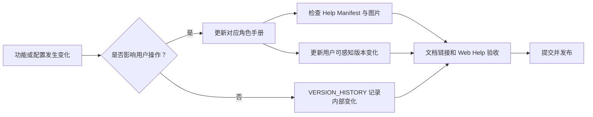

# Miracle 角色化说明书与 Web 帮助中心设计

> 文档状态：ACTIVE（设计已确认，等待实施）
>
> 适用版本：`v0.9.0` 及后续版本
>
> 文档性质：说明书体系、Web 帮助中心和持续维护规则的设计真相源
>
> 前置依据：`40_Miracle系统操作使用说明书.md`、当前 Web 菜单、P7 发布基线

## 1. 背景与问题

Miracle 已完成第一期本地优先 Agent OS MVP，但现有操作资料主要集中在单一的
`40_Miracle系统操作使用说明书.md`。该文档同时承担启动说明、菜单说明、用户流程、
Provider 配置、开发维护、版本变化和故障处理，已经出现以下问题：

1. 普通使用者需要从大量工程信息中寻找实际操作步骤。
2. 管理员配置环境、凭证和运行目录时缺少独立的治理入口。
3. 开发维护者需要跨 README、交付文档和 API 设计理解扩展方式。
4. Git 提交和 `VERSION_HISTORY.md` 能说明工程变化，但不能稳定回答用户“升级后怎么用”。
5. Web 工作台没有帮助入口，用户必须离开系统查找仓库文档。
6. 旧原型和不同阶段截图并存，缺少与当前发布版本绑定的操作截图。

本设计建立“分角色成册、统一帮助入口、单一内容真相、版本持续同步”的说明书体系。

## 2. 设计结论

采用以下组合方案：

- 按使用者、管理员、开发维护者拆分三份角色手册。
- 将故障排查和用户可感知版本变化作为公共手册独立维护。
- 保留现有 `40` 路径，但将其收敛为帮助与手册总入口，避免历史链接失效。
- Web 侧边栏新增“帮助与手册”，通过 Sidecar 读取同一套 Markdown，不复制第二份文案。
- 当前发布版本的真实截图统一放入版本目录，原型图只作为设计参考，不作为操作证据。
- 每次功能提交根据“手册影响检查”决定更新哪一份角色手册和版本变化记录。

## 3. 目标与非目标

### 3.1 目标

1. 新用户能够只阅读使用者手册完成创建任务、Dry-run、启动 Run、审核和交付。
2. 管理员能够独立完成安装、启动、配置、健康检查、备份、升级和故障恢复。
3. 开发维护者能够理解工程边界，并按既有契约扩展 Domain、Workflow、Adapter 和页面。
4. 用户在 Miracle Web 内可以搜索和阅读帮助，不需要自行定位仓库文件。
5. Markdown、Web 帮助内容、截图和版本说明使用同一份受控资产。
6. 发布验收能够自动发现缺失文章、失效图片和未登记的帮助内容。

### 3.2 非目标

- 本轮不实现云端知识库、在线客服或社区问答。
- 本轮不引入账号和基于角色的访问控制；角色只表示阅读视角。
- 本轮不允许 Web 帮助接口读取任意仓库文件或本地绝对路径。
- 本轮不把全部架构和交付文档复制进帮助中心。
- 本轮不使用历史 Product Design/Pencil 原型代替 `v0.9.0` 真实页面截图。

## 4. 文档信息架构

```text
docs/06-operations/
├── user-guide/
│   └── 40_Miracle系统操作使用说明书.md
└── manuals/
    ├── README.md
    ├── help-manifest.json
    ├── user/
    │   └── 61_Miracle使用者操作手册.md
    ├── administrator/
    │   └── 62_Miracle管理员与运维手册.md
    ├── developer/
    │   └── 63_Miracle开发维护手册.md
    └── shared/
        ├── 64_Miracle故障排查手册.md
        └── 65_Miracle用户可感知版本变更.md

assets/manual/
└── v0.9.0/
    ├── 01-home.png
    ├── 02-new-task.png
    ├── 03-dry-run.png
    ├── 04-run-workspace.png
    ├── 05-attention.png
    ├── 06-agent-collaboration.png
    ├── 07-artifact-board.png
    ├── 08-gate-review.png
    ├── 09-provider-routing.png
    ├── 10-canvas-draft.png
    └── 11-task-baseline.png
```

### 4.1 现有 `40` 的处理

`40_Miracle系统操作使用说明书.md` 不删除、不改名。它改为简洁的“帮助与手册总入口”，
只保留：

- 当前版本和支持边界。
- 三类角色应该阅读哪一本手册。
- 最短启动命令和 Web 帮助入口。
- 故障排查和用户版本变化入口。
- 手册更新规则摘要。

原有详细内容迁移到 61-65，并通过 Git 历史保留来源。迁移完成后不在 `40` 与角色手册
重复维护同一段操作步骤。

### 4.2 文档职责

| 文档 | 核心问题 | 默认读者 |
|---|---|---|
| `40` 总入口 | 我应该读哪一本、如何最快启动 | 所有人 |
| `61` 使用者手册 | 如何完成任务和工作流操作 | 业务使用者、审核者 |
| `62` 管理员手册 | 如何部署、配置、治理和恢复系统 | 本地管理员、运维者 |
| `63` 开发维护手册 | 如何理解、开发、测试和扩展 Miracle | 开发者、维护者 |
| `64` 故障排查 | 出现某个现象时如何诊断和恢复 | 所有人，按现象检索 |
| `65` 用户版本变化 | 当前版本相对上一版本改变了什么 | 使用者、管理员、发布评审者 |

## 5. 使用者操作手册设计

`61_Miracle使用者操作手册.md` 按用户完成任务的顺序组织，不按内部对象或开发阶段组织。

### 5.1 章节结构

1. Miracle 能做什么、当前能力边界。
2. 五分钟快速开始。
3. Web 工作台整体布局。
4. 首页：待处理、继续运行、快速启动、最近交付和系统风险。
5. 新任务：选择 Domain、模板、任务主题和可选分支。
6. RunDraft 与 Dry-run：检查 required/optional 路径、Gate、Provider、凭证、成本和风险。
7. 启动正式 Run：确认计划、创建 RunSpec 和进入 Run 工作区。
8. 任务运行：DAG、节点详情、Attempt、Scheduler、事件审计、成本和耗时。
9. Attention：根因聚合、关联对象、恢复动作和关闭规则。
10. 智能体：多 Agent 状态、依赖、等待和交接。
11. 产物：Artifact 版本、hash、审核状态、预览和消费者。
12. 审核：approve、reject、request_changes、返工版本和下游恢复。
13. Retry 与 Fallback：等待、预算耗尽、停止重试和跨运行时二次确认。
14. 画布草稿：Node card、NodeSpec draft、spec diff 和发布 Workflow draft。
15. 创建和扩展工作流：模板复制、节点输入输出、审核门和可选分支。
16. Historical Run：只读标识、证据缺口和禁止操作。
17. 三个完整案例：内容生产、研究分析、图像生成。
18. 常见问题和进一步阅读。

### 5.2 菜单说明标准

每个菜单使用同一模板：

```text
用途 -> 什么时候使用 -> 页面区域 -> 操作步骤 -> 系统结果 -> 风险提示 -> 相关页面
```

每个可执行操作必须说明：

- 操作前置条件。
- 用户需要输入什么。
- 点击后系统创建或修改什么对象。
- 成功、等待、阻塞和失败分别如何显示。
- 操作能否撤销，是否需要人工确认。
- 下一步应该进入哪个菜单。

## 6. 管理员与运维手册设计

`62_Miracle管理员与运维手册.md` 面向本地服务操作者。“管理员”当前不是账号或 RBAC
角色，不得暗示系统已经具备多租户权限管理。

### 6.1 章节结构

1. 支持环境、依赖和目录约束。
2. 首次安装、标准启动、单独启动 Web/Sidecar。
3. 端口、workspace 和 runtime workspace 配置。
4. Codex CLI 安装、登录和健康检查。
5. DeepSeek、Kimi、MiniMax ProviderProfile 与凭证引用。
6. 脱敏 Provider smoke 和健康状态解释。
7. Historical Run preview、commit、回执和只读治理。
8. 数据目录、备份、恢复和迁移。
9. 进程、日志、Event Journal、审计和健康 API。
10. Retry、Fallback、Attention 和人工恢复治理。
11. 安全：Key、环境变量、路径、symlink、日志和截图脱敏。
12. 升级、回滚、fixture 兼容和发布后检查。
13. task-baseline、Git 同步和证据文件核对。
14. 故障排查入口和升级支持信息。

### 6.2 凭证规则

- 手册只展示环境变量名和占位符，不展示任何真实 Key。
- Web 帮助不返回环境变量值、prompt、Artifact 正文或 runtime 绝对路径。
- Provider 的“已配置”“已验证”“健康”必须分开解释。
- 真实 smoke 必须说明费用、授权和证据脱敏要求。

## 7. 开发维护手册设计

`63_Miracle开发维护手册.md` 以“修改一个能力需要经过哪些边界”为主线，不复制全部架构文档。

### 7.1 章节结构

1. 仓库结构与模块所有权。
2. 根级开发、测试、构建和 fixture 命令。
3. React Web、Local Sidecar、packages/core 的依赖方向。
4. WorkflowSpec、RunSpec、WorkflowSnapshot 和运行投影。
5. Orchestrator 单写入与 AdapterResult 回执边界。
6. 新增 DomainPack、RoleProfile 和 WorkflowTemplate。
7. 新增 NodeSpec、ArtifactType、GateSpec 和 ComponentLibrary。
8. 新增 Adapter manifest、ProviderProfile 和 ProviderDriver。
9. 新增 Sidecar API 和 Web 页面/菜单。
10. Retry、Fallback、Scheduler 和恢复兼容要求。
11. Schema、fixture、单元测试、API smoke 和 Playwright 验收。
12. 版本、task-baseline、操作手册和 Git 提交同步。
13. 安全审查和禁止事项。
14. 发布清单和常见维护场景。

### 7.2 关联技术文档

开发手册只给扩展路径和关键不变量，详细协议通过链接指向 `19-23`、P6/P7 交付说明和
`60` 发布报告。Web 帮助默认不把这些工程文档加入普通用户搜索结果。

## 8. 公共手册设计

### 8.1 故障排查

`64` 按“用户看到的现象”组织，每个条目包含：

```text
现象 -> 影响 -> 快速判断 -> 诊断步骤 -> 恢复动作 -> 不应执行的操作 -> 仍未解决时收集的信息
```

首批必须覆盖：

- Web 或 Sidecar 无法启动。
- 端口被占用、Web 能打开但无数据。
- workspace/runtime workspace 非法。
- Codex CLI 缺失、未登录或真实执行未开启。
- Provider 缺凭证、未验证、429、5xx 或超时。
- Run queued、blocked、failed、dispatched_unknown。
- Retry waiting、exhausted 或被人工停止。
- Gate 无法推进或返工后下游未恢复。
- Artifact 缺失、hash 不一致或无法预览。
- Historical Import preview/commit 失败。
- task-baseline 与 Git 状态不一致。

### 8.2 用户可感知版本变化

`65` 不复制完整技术提交历史。每个发布版本固定回答：

| 项目 | 内容 |
|---|---|
| 新增功能 | 用户新增了哪些可执行能力 |
| 操作优化 | 哪些步骤更少、更清晰或更安全 |
| 问题修复 | 修复了哪些用户可感知问题 |
| 操作变化 | 原操作路径是否需要改变 |
| 启动与配置 | 是否新增命令、环境变量或迁移步骤 |
| 数据兼容 | 旧 Run、Workflow 和 Artifact 是否兼容 |
| 已知限制 | 本版本仍不支持什么 |

## 9. 图片与流程图策略

### 9.1 截图规则

- 使用当前发布版本的真实 Web 页面，并在仓库外脱敏 runtime 上生成。
- 图片按发布版本存放，文件名稳定，不覆盖上一版本证据。
- 截图不得包含 API Key、prompt 正文、个人路径、未脱敏产物或隐藏推理。
- 每张截图在正文中配“图中编号说明”，避免将大量说明文字写入图片。
- 页面发生明显变化时生成新版本目录；未变化的截图可继续引用并明确适用版本。
- 原型图可出现在设计背景，不得标为当前系统操作界面。

### 9.2 流程图规则

Markdown 使用 Mermaid 作为可维护源。Web 帮助支持经过安全配置的 Mermaid 渲染，渲染失败时
回退为代码块，不影响正文阅读。首批流程图包括：

1. 新任务到 Artifact 交付。
2. Gate approve/reject/request_changes。
3. Attention 根因处置。
4. Retry 与 Provider Fallback。
5. Workflow 草稿到发布。
6. 管理员启动与健康检查。
7. 开发者扩展 Domain/Adapter 的交付链路。

## 10. Help Manifest

`help-manifest.json` 是文档发现与 Web 导航真相，不是正文副本。最小结构：

```json
{
  "schema_version": "1.0",
  "product_version": "0.9.0",
  "verified_at": "2026-08-10",
  "articles": [
    {
      "id": "user-guide",
      "title": "Miracle 使用者操作手册",
      "role": "user",
      "source": "user/61_Miracle使用者操作手册.md",
      "order": 10,
      "summary": "从创建任务到产物交付的完整操作说明",
      "tags": ["新任务", "Dry-run", "Run", "审核", "工作流"]
    }
  ],
  "assets": [
    {
      "id": "v0.9.0-home",
      "source": "v0.9.0/01-home.png",
      "media_type": "image/png"
    }
  ]
}
```

约束：

- `id` 稳定且唯一，Web URL 和关联帮助使用 ID，不暴露文件路径。
- `articles[].source` 必须位于 `manuals/` 白名单根目录内，不允许 `..`、绝对路径或
  symlink 逃逸。
- 图片必须通过独立 `assets` 白名单登记，
  Sidecar 将配置路径解析到固定 `assets/manual/` 根目录后再校验，Web 不直接传文件路径。
- 角色只控制默认分类和搜索筛选，不代表权限。
- `product_version` 和 `verified_at` 在发布收口时更新。
- Manifest 中登记的文档和图片必须由测试验证存在。

## 11. Sidecar Help API

新增只读接口：

```text
GET /api/v0/help
GET /api/v0/help/articles/:articleId
GET /api/v0/help/search?q=:query&role=:role
GET /api/v0/help/assets/:assetId
```

### 11.1 响应职责

- `/help`：返回版本、角色分类和文章元数据。
- `/help/articles/:articleId`：返回经白名单解析的 Markdown 和标题目录。
- `/help/search`：对标题、摘要、标签和正文进行本地搜索，返回片段和文章 ID。
- `/help/assets/:assetId`：只返回 Manifest 或派生白名单登记的图片。

### 11.2 安全和错误处理

- 拒绝任意路径参数、目录穿越、未登记文章和非允许媒体类型。
- Markdown 原始 HTML 默认禁用，链接协议仅允许安全白名单；Mermaid 使用 strict security
  配置并关闭可点击外链和脚本能力。
- 错误使用稳定 reason code：`help_article_not_found`、`help_manifest_invalid`、
  `help_asset_not_allowed`、`help_content_unavailable`。
- 帮助服务失败不能影响 Run、Scheduler 或 Adapter 主链路。
- 文章读取采用只读缓存；开发环境文件变化后允许刷新，生产构建按版本冻结。

## 12. Web 帮助中心

### 12.1 导航

侧边栏新增 `帮助与手册`，使用 Lucide `BookOpen`。它是一级入口，不放入“设置”占位页。

### 12.2 页面结构

```text
顶部：帮助搜索 | 当前版本 | 最后验证日期
左栏：快速入门 / 使用者 / 管理员 / 开发者 / 故障排查 / 版本变化
中栏：文章标题、适用角色、正文、流程图和截图
右栏：当前文章目录
底部：上一篇 / 下一篇 / 相关操作 / 关联技术文档
```

首期保持现有桌面 Web 交互风格，不做移动端帮助中心设计。文章正文宽度受控，长命令可横向
滚动，长标题和中文路径必须换行，不能挤压主布局。

### 12.3 搜索和深链

- 搜索覆盖标题、标签、H2/H3 标题和正文片段。
- 支持 `?page=help&article=user-guide#启动新任务` 形式的可复制深链。
- 页面刷新后恢复当前文章和锚点。
- 业务页面后续可通过稳定 article ID 添加“查看帮助”，首期至少覆盖新任务、Run、Attention、
  Gate、Provider 配置和 Historical Run。

### 12.4 状态和可访问性

- 加载、空结果、文章不存在和内容服务失败必须有独立状态。
- 搜索和目录可键盘操作；焦点在文章切换后移动到文章标题。
- 图片具备描述实际操作目的的 alt text。
- Mermaid 图提供紧邻的文字步骤，不以颜色作为唯一状态表达。

## 13. 单一真相与更新流程



提交前检查：

1. 菜单、按钮、状态或操作路径是否变化。
2. 启动命令、端口、环境变量、凭证或目录是否变化。
3. 是否新增错误、Attention 或恢复动作。
4. 是否新增开发扩展点或破坏既有契约。
5. 用户相对上一版本能够感知到什么。

对应关系：

| 变化类型 | 必须更新 |
|---|---|
| 用户操作变化 | `61`、必要时截图、`65` |
| 部署配置变化 | `62`、`64`、`65` |
| 开发契约变化 | `63`、关联技术文档、`VERSION_HISTORY.md` |
| 故障和恢复变化 | `64`，必要时 `61/62` |
| 纯内部重构 | `VERSION_HISTORY.md`，提交说明标记“无手册影响” |

## 14. 测试与验收

### 14.1 文档验收

- `40` 能在三次点击内把读者引导到目标角色手册。
- `61-65` 不存在未完成占位标记、失效链接或互相冲突的版本号。
- 使用者手册覆盖当前所有一级菜单和端到端任务流程。
- 管理员手册不包含真实 Key，开发手册不复制过时协议。
- 每张操作截图都标明适用版本并通过脱敏检查。

### 14.2 API 验收

- Manifest 合法时返回全部文章元数据。
- 未登记文章、路径穿越和非法图片均被拒绝。
- 搜索可命中“新任务”“Gate”“Provider”“工作流”等关键操作。
- Help API 故障不影响 `/health`、Run 和 Scheduler API。

### 14.3 Web 验收

- 侧边栏可进入帮助中心。
- 角色分类、文章目录、搜索、深链和上一篇/下一篇可用。
- Markdown 表格、代码块、图片和 Mermaid 正常显示。
- 当前版本、验证日期和适用角色清晰可见。
- 使用 Playwright 生成帮助首页、使用者手册、搜索结果和故障排查截图。

### 14.4 内容任务验收

邀请未参与开发的读者仅根据手册完成：

1. 启动本地系统并确认健康。
2. 创建 RunDraft、完成 Dry-run 并启动任务。
3. 在 Run 中定位暂停原因并完成 Gate 审核。
4. 查看 Artifact 并识别产物版本。
5. 管理员判断一个 Provider 为什么不可执行。
6. 开发者定位新增 Provider Driver 所需修改和测试位置。

## 15. 实施顺序

```text
H1 说明书目录、Manifest 和 40 总入口
-> H2 使用者手册与真实截图
-> H3 管理员、开发维护和故障手册
-> H4 用户版本变化与维护规则迁移
-> H5 Sidecar Help API
-> H6 Web 帮助中心、搜索和深链
-> H7 文档/API/Web 回归验收与版本记录
```

依赖关系：

- H2、H3 可在 H1 后并行。
- H5 可在 Manifest 字段冻结后与手册正文并行。
- H6 依赖 H5 的稳定响应合同。
- 截图必须来自实现完成后的当前页面，不能在旧页面上提前定稿。

## 16. 决策记录

| 决策 | 结论 | 原因 |
|---|---|---|
| 单册还是分册 | 分角色成册，统一入口 | 降低阅读成本并明确维护责任 |
| Web 是否复制文案 | 不复制 | 避免两套手册漂移 |
| `40` 是否删除 | 保留并改为入口 | 保护历史链接和 AI 阅读路径 |
| 管理员是否等于权限角色 | 否 | 当前没有账号、RBAC 和多租户 |
| 图片使用原型还是真实页面 | 当前版本真实页面 | 保证操作可信度 |
| 版本变化放哪里 | 独立 `65`，技术历史仍在根目录 | 区分用户变化与工程演进 |
| Help API 是否允许文件路径 | 不允许，只接受稳定 article/asset ID | 防止目录穿越和本地文件泄露 |

## 17. 完成定义

当以下条件全部满足时，本说明书体系视为完成：

- 三类角色可以从 `40` 或 Web 帮助中心进入自己的阅读路径。
- 普通使用者无需阅读工程文档即可完成主任务闭环。
- 管理员能够安全配置并诊断当前本地系统。
- 开发者能够按既有契约扩展系统并完成发布同步。
- Web 与 Markdown 展示同一内容真相。
- 每次发布都有用户可感知版本变化和手册影响结论。
- 自动测试能够阻止失效 Manifest、越权路径和缺失资产进入发布版本。
