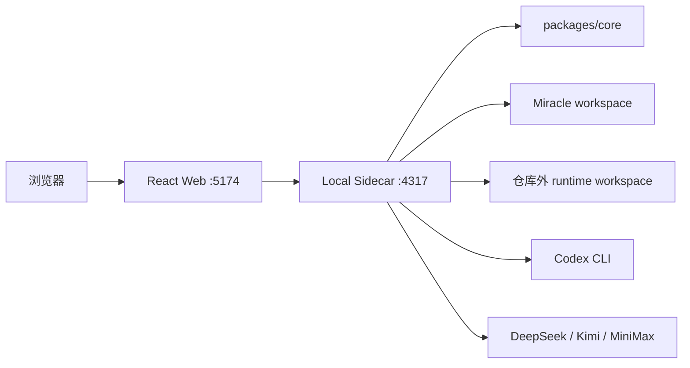

# Miracle 管理员与运维手册

> 适用角色：本地系统管理员、运维者、发布验收者
>
> 适用版本：`v0.9.0`
>
> 最后验证日期：2026-08-10
>
> 说明：“管理员”是运行维护视角，当前版本尚无账号、RBAC 和多租户

## 1. 系统运行形态

Miracle `v0.9.0` 由以下本地组件组成：



Node.js Sidecar 是 MVP 的本地控制和执行边界，不代表未来商业化云端主后端必须使用 Node.js。

## 2. 环境要求

- macOS 或兼容 Node.js 的开发环境。
- Node.js 与 npm，版本以项目当前 lockfile 和 CI/开发基线为准。
- Git，用于版本和 task-baseline 证据同步。
- 真实 Codex 运行时需要已安装并登录的 Codex CLI。
- 真实 Model API 运行时需要目标 Provider 的合法凭证和明确授权。

检查：

```bash
node --version
npm --version
git --version
codex --version
codex login status
```

## 3. 首次安装

```bash
cd /Users/zhangyue/miracle-agent
npm_config_cache=.npm-cache npm install
```

不要提交 `.npm-cache`、真实 `.env`、runtime workspace 或 Provider smoke 临时产物。

## 4. 启动和停止

### 4.1 标准启动

```bash
npm run dev
```

根级命令会先构建 `packages/core`，再启动 Web 与 Sidecar。默认地址：

| 服务 | 地址 |
|---|---|
| Web | `http://127.0.0.1:5174/` |
| Sidecar health | `http://127.0.0.1:4317/api/v0/health` |
| Task Baseline | `http://127.0.0.1:4317/task-baseline` |

### 4.2 单独启动

```bash
npm run dev:sidecar
npm run dev:web
```

Web 依赖 Sidecar API。只启动 Web 时页面可以加载静态资源，但数据区域会报错。

### 4.3 停止

在启动终端使用 `Ctrl+C`。存在真实 operation 时，应先通过 UI 或 operation cancel API 请求
取消，再停止 Sidecar，避免外部状态不明确。

## 5. 环境变量

| 变量 | 默认值 | 作用 |
|---|---|---|
| `MIRACLE_WORKSPACE_DIR` | `fixtures/mvp-workspace/.miracle` | Workflow、Run 和投影数据目录 |
| `MIRACLE_RUNTIME_WORKSPACE_DIR` | `~/.miracle-agent` | 真实 Attempt 隔离目录 |
| `MIRACLE_WORKFLOW_REGISTRY_DIR` | fixture workflows | Workflow registry |
| `MIRACLE_SIDECAR_PORT` | `4317` | Sidecar 端口 |
| `MIRACLE_IMPORT_ROOTS` | 空 | Historical Import 允许读取的根目录列表 |
| `MIRACLE_ENABLE_REAL_CODEX` | 未设置 | 设为 `1` 才允许真实 Codex 执行 |
| `MIRACLE_CODEX_CLI_PATH` | `codex` | Codex CLI 可执行文件 |
| `MIRACLE_ENABLE_MODEL_API` | 未设置 | 设为 `1` 才允许显式 Provider smoke/执行 |
| `DEEPSEEK_API_KEY` | 未设置 | DeepSeek credential_ref 对应值 |
| `MOONSHOT_API_KEY` | 未设置 | 当前 Kimi Profile 使用的凭证 |
| `MINIMAX_API_KEY` | 未设置 | MiniMax 凭证 |

不要在命令历史、README、截图、Git 文件或聊天记录中粘贴真实 Key。推荐通过当前终端的一次性
环境或操作系统安全凭证方案注入。

## 6. Workspace 规划

### 6.1 Fixture workspace

仓库内 `fixtures/mvp-workspace/.miracle` 用于演示和测试，可提交版本控制。不要把真实运行凭证
或敏感业务资料写入其中。

### 6.2 Runtime workspace

真实执行默认写入：

```text
~/.miracle-agent
```

Sidecar 会拒绝把真实 runtime 指向 Miracle 仓库内部，也会解析 symlink 防止路径伪装。

### 6.3 推荐生产式本地布局

```text
~/.miracle-agent/
├── workspace/.miracle/
├── attempts/
├── operations/
├── imports/
└── smoke-artifacts/
```

运行数据和代码仓库分开备份；不要直接手工修改运行 JSON 来“修复”状态。

## 7. 健康检查

### 7.1 Sidecar

```bash
curl http://127.0.0.1:4317/api/v0/health
```

### 7.2 Codex CLI

```bash
curl http://127.0.0.1:4317/api/v0/adapters/codex-cli/health
curl -X POST http://127.0.0.1:4317/api/v0/adapters/codex-cli/health/refresh
```

健康投影只返回状态、版本和原因码，不返回登录凭证。

### 7.3 Provider

```bash
curl http://127.0.0.1:4317/api/v0/providers
```

状态解释：

| 状态 | 含义 | 是否可路由 |
|---|---|---|
| `missing_credential` | credential_ref 对应环境变量不存在 | 否 |
| `configured_unverified` | 配置和凭证存在，但未完成真实验证 | 否 |
| `healthy` | 当前环境完成允许的健康验证 | 可以参与路由 |
| `degraded/unhealthy` | 最近验证或执行显示异常 | 依据策略禁用或降级 |

一次开发机 smoke 不应永久写入默认 fixture 的全局 healthy 状态。

## 8. Provider 凭证和 smoke

### 8.1 配置

```bash
export DEEPSEEK_API_KEY='REDACTED'
export MOONSHOT_API_KEY='REDACTED'
export MINIMAX_API_KEY='REDACTED'
```

上面的 `REDACTED` 只是占位，不是可用值。当前版本不接 OpenAI 官方 API。

### 8.2 显式 smoke

取得用户对费用和外部请求的明确授权后执行：

```bash
MIRACLE_ENABLE_MODEL_API=1 MIRACLE_SMOKE_PROVIDER=deepseek npm run smoke:provider
```

可将目标替换为 `kimi` 或 `minimax`。执行前确认：

- ProviderProfile 的 provider 与 Driver 一致。
- credential_ref scope 授权正确。
- 主题和输出已脱敏。
- smoke Artifact 写入仓库外临时目录。
- 日志、receipt 和错误中没有 Key。

`v0.9.0` 的 DeepSeek 脱敏 smoke 已通过；新机器、新 Key、Kimi 或 MiniMax 仍需在本机重新验证。

## 9. 真实 Codex 执行

### 9.1 开启条件

```bash
MIRACLE_ENABLE_REAL_CODEX=1 npm run dev
```

还需要：Codex CLI 已安装、登录状态健康、RunDraft 已确认、Workflow 使用允许的真实 Adapter。

### 9.2 运行隔离

- 每个 Attempt 使用独立目录。
- 上游输入只读复制到 `input/artifacts/`。
- `resolved-inputs.json` 冻结版本与 hash。
- 输出经过 schema、路径、media type 和 hash 校验后才由 Orchestrator 提交。
- timeout、cancel、unknown 和进程退出必须保留 operation/Attempt 审计。

## 10. Historical Import

### 10.1 准备仓库外 workspace

```bash
mkdir -p "$HOME/.miracle-agent/workspace"
cp -R fixtures/mvp-workspace/.miracle "$HOME/.miracle-agent/workspace/"
```

### 10.2 启动允许读取的根目录

```bash
MIRACLE_WORKSPACE_DIR="$HOME/.miracle-agent/workspace/.miracle" \
MIRACLE_IMPORT_ROOTS="/path/to/allowed/runs" \
npm run dev:sidecar
```

先 `POST /api/v0/historical-imports/preview`，核对 valid、gaps、projected counts，再 commit。

### 10.3 治理原则

- 导入按源内容 SHA-256 识别并保持幂等。
- 缺少 task events 或审批证据时只生成只读 projection，不伪造事实。
- Historical Run 禁止调度、Gate 决策、返工和 Retry。
- symlink、非法根目录、损坏控制文件和回执缺失按稳定错误处理。

## 11. 数据备份与恢复

### 11.1 备份范围

- Miracle workspace 中的 workflows、runs、artifacts、gates、events 和 receipts。
- 仓库外 runtime 中仍需审计的 operation/attempt 数据。
- Provider 配置引用，不包含环境变量真实值。
- 代码仓库 Git commit 和当前版本号。

### 11.2 一致性

停止新的 Scheduler 写入后再做文件级备份。不要只备份 Artifact 而遗漏 RunSpec、Snapshot、
Attempt、GateDecision 和 Event Journal。

### 11.3 恢复

1. 恢复到新的仓库外目录。
2. 使用只读副本检查 JSON/JSONL 和文件 hash。
3. 设置 `MIRACLE_WORKSPACE_DIR` 启动 Sidecar。
4. 先查询 Run、Artifact 和 event API，不立即调度。
5. 对 unknown/dispatched_unknown operation 做人工对账。

## 12. 日志与审计

权威运行事实只能由 Sidecar Orchestrator 写入。Agent/Adapter 返回结果和事件建议，不直接写
Event Journal。

排查时按以下顺序：

1. RunSpec 和 WorkflowSnapshot。
2. NodeRun 当前投影。
3. NodeAttempt 历史。
4. Adapter receipt/operation。
5. ArtifactManifest 和 hash。
6. GateInstance/GateDecision。
7. TraceEvent/Event Journal。
8. Attention 和 RetryState。

截图或支持包只导出必要元数据，去除 prompt、Artifact 正文、绝对 runtime 路径和凭证。

## 13. Retry、Fallback 与恢复治理

- 自动 Retry 受次数、总时间和成本三类有限预算约束。
- 凭证、权限、输入和 Artifact 缺失直接 blocked，不应靠 Retry 消耗预算。
- `dispatched_unknown` 不自动重派，先与外部 Provider/Codex 对账。
- 同类 Provider Fallback 只选择 healthy Profile。
- Codex 到 Model API 的跨 kind Fallback 必须人工二次确认。
- 手工停止自动 Retry 会写入 terminal state 和审计，不要删除 schedule 文件。

## 14. Task Baseline 与 Git

入口：

```text
http://127.0.0.1:4317/task-baseline
```

每次重要提交后检查：

- Git HEAD 是否更新。
- 工作区是否 dirty。
- 当前任务节点是否与实际一致。
- evidence path 是否存在并被 Git 跟踪。
- 完成任务是否有测试、文档或截图证据。

任务状态只在真实完成后推进，不因代码已开始或文档已创建而提前标记 completed。

## 15. 升级与回滚

### 15.1 升级前

1. 阅读[用户可感知版本变更](../shared/65_Miracle用户可感知版本变更.md)。
2. 记录当前 Git commit、版本、Node/npm 和环境变量名称。
3. 备份 workspace 和必要 runtime 审计资料。
4. 确认没有正在执行或状态未知的 operation。

### 15.2 升级后

```bash
npm install
npm run typecheck
npm run test
npm run build
```

再检查 health、Provider 状态、历史 Run 读取、fixture Run 和 Web 核心页面。

### 15.3 回滚

代码回滚不自动回滚运行数据。若新版本已经写入新 schema，必须依据对应发布说明评估数据兼容，
不能直接切回旧代码后继续调度。

## 16. 安全清单

- 不提交或展示真实 API Key、密码和 token。
- 不在 URL、错误消息或 TraceEvent 中写 credential。
- 不把真实 runtime 放入仓库。
- 不允许任意文件路径进入 Artifact Preview、Import 或 Help API。
- 解析 realpath 并拒绝 symlink/path traversal。
- 对外请求必须有 timeout、cancel、响应大小和 JSON 校验。
- 用户内容、Artifact 和 screenshot 在分享前脱敏。
- 曾在非安全渠道暴露的 Key 应立即撤销并轮换。

## 17. 常用验收命令

```bash
npm run typecheck
npm run test
npm run build
git diff --check
git status --short --branch
```

Provider smoke 和真实 Codex 运行不属于默认回归，必须单独获得授权并使用仓库外 workspace。

## 18. 遇到问题

先阅读[故障排查手册](../shared/64_Miracle故障排查手册.md)。仍无法解决时收集：

- Miracle 版本和 Git commit。
- Node/npm/Codex 版本。
- Sidecar health 和稳定 reason code。
- 受影响的 Run/NodeRun/Attempt/operation ID。
- 已脱敏的事件片段。
- 问题发生前最后一次成功动作。

不要在支持信息中包含 Key、完整 prompt、未脱敏 Artifact 或个人绝对路径。
