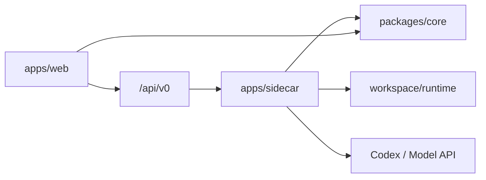

# Miracle 开发维护手册

> 适用角色：前端、Sidecar、Core、Adapter 开发者和项目维护者
>
> 适用版本：`v0.9.0`
>
> 最后验证日期：2026-08-10

## 1. 开发原则

Miracle 是通用 Agent OS，`content-production` 和 Flow A-G 只是第一个真实样本。新增能力时
必须保持 Workflow、Node、Agent、Component、Provider 和 Artifact 的领域无关性。

核心原则：

1. Spec 是执行和编辑的唯一真相，UI 不是第二套模型。
2. `RunSpec` 是运行根对象，`WorkflowSnapshot` 是不可变工作流副本。
3. NodeSpec、NodeRun、NodeAttempt 分层，Retry/Fallback/返工只新增 Attempt。
4. Gate 审核真相位于 GateSpec/GateInstance/GateDecision 和目标 Artifact。
5. Event Journal、NodeRun、Attempt、Artifact 和 Gate 只由 Orchestrator 单写入。
6. Adapter/Agent 返回受控结果，不直接修改运行事实。
7. 本地优先但不本地限定，Node.js Sidecar 不是商业云端主后端的永久约束。

## 2. 仓库结构

```text
apps/
├── web/                 React/Vite 工作台
└── sidecar/             Node.js Local Sidecar、Orchestrator 和 Adapter
packages/
└── core/                共享类型、Schema、Planner、投影和纯函数
fixtures/
└── mvp-workspace/       可提交的测试工作区
plans/
└── mvp-task-baseline/   机器可读任务基线和独立页面
docs/                    设计、交付、操作和发布真相
assets/                  架构图、原型、验收和手册图片
prototypes/              历史原型输入，不是运行产品
```

依赖方向：



`packages/core` 不反向依赖 Web、Sidecar 或 Node 文件系统。

## 3. 本地开发

### 3.1 安装

```bash
cd /Users/zhangyue/miracle-agent
npm_config_cache=.npm-cache npm install
```

### 3.2 根级命令

```bash
npm run dev
npm run dev:web
npm run dev:sidecar
npm run typecheck
npm run test
npm run build
```

根级命令先构建 Core，再运行依赖它的 workspace。不要绕过根级 build 后使用陈旧的 Core dist
判断测试结果。

### 3.3 测试位置

```text
packages/core/test/        Schema、Planner、投影和纯函数
apps/sidecar/test/         API、文件、Adapter、恢复和安全
apps/web/src/*.test.ts     页面辅助函数、状态和渲染规则
```

真实 Provider 和 Codex 调用不进入默认测试；使用 fake server、fake Codex 和临时 workspace。

## 4. 核心运行对象

### 4.1 WorkflowSpec

必须包含稳定 ID、版本、nodes、edges、gates、artifacts、provider policy 和 layouts。布局只影响
编辑显示，执行依赖只看 nodes/edges/gates。

### 4.2 RunSpec 与 Snapshot

启动时冻结：

- WorkflowSnapshot。
- resolved components。
- resolved ProviderPolicy。
- 启动输入和确认。

运行中不允许直接 patch Snapshot。需要修改时创建新的 Workflow draft 或新的 Run。

### 4.3 Node 三层

| 对象 | 作用 |
|---|---|
| NodeSpec | 工作流节点定义、输入输出和能力需求 |
| NodeRun | 某个 Run 内该节点的聚合状态 |
| NodeAttempt | 一次具体执行、Retry、Fallback 或返工记录 |

### 4.4 Artifact 与 Gate

ArtifactSpec 定义期望产物，ArtifactManifest 记录运行产物版本、hash、producer 和状态。
GateDecision 必须绑定具体 Artifact ID/hash，不能只绑定 Node 或文件名。

## 5. Orchestrator 单写入

Adapter 的职责止于：接收 `AdapterInvocation`，返回 `AdapterResult` 和 Artifact descriptors。
Sidecar Orchestrator 校验 operation/node/attempt/provider 关联后，再提交：

- NodeAttempt。
- NodeRun 投影。
- ArtifactManifest。
- GateInstance/GateDecision。
- TraceEvent/Event Journal。

不要给 Agent 或 Adapter `trace:event` 直接写权限。事务失败必须保留可恢复 intent/journal，
不能让外部调用成功但内部事实完全丢失。

## 6. 新增 DomainPack

1. 在 workspace `domains/` 创建领域定义。
2. 定义 category、默认 RoleProfile、ArtifactType 和模板引用。
3. 在 `registry/templates.json` 注册 WorkflowTemplate。
4. 提供至少一个 validate 通过的 WorkflowSpec。
5. 增加 Core/Sidecar fixture 测试。
6. 在“新任务”页面验证 Domain 和模板可见。
7. 更新使用者手册案例，不把领域名硬编码进核心状态机。

验收至少用两种不同领域证明模型没有被 Flow A-G 固化。

## 7. 新增 WorkflowTemplate

### 7.1 定义

- 稳定 `id/name/version/category`。
- Node 输入输出端口完整。
- Edge required/optional、join_policy、timeout 行为明确。
- ArtifactSpec 和 GateSpec 引用完整。
- capability 和 candidate Agent/ComponentLibrary 可解析。
- ProviderPolicy 有成本、能力和 fallback 边界。

### 7.2 验证

```text
validate -> dry-run -> fixture Run -> Gate/Artifact/Attention -> 版本发布
```

stable 模板不能被 UI 或远端更新静默覆盖；布局变化不能改变 DAG。

## 8. 新增 Node、Artifact 和 Gate

### NodeSpec

只声明流程语义、inputs、outputs、capability、Agent/组件候选和 failure policy。审核只保留可选
`review_gate_ref`，不要在 NodeSpec 重复创建第二套 review policy。

### ArtifactType

新增类型时同时定义：

- media type。
- manifest schema。
- preview capability。
- hash 和版本规则。
- 可选审核状态。
- Web 展示和不可预览降级。

### Gate

定义目标 Artifact、required_before、决策集合和返工影响。新增决策行为必须更新 Core 投影、
Sidecar API、Web、事件审计、使用者手册和故障排查。

## 9. 新增 ComponentLibrary

ComponentLibrary 封装 tool、skill、MCP、prompt、script runner、Adapter 和 Provider 组合。

要求：

- 明确 capability 和输入输出合同。
- 不在组件库中持久化明文 credential。
- 版本化并声明兼容范围。
- Tool/Skill 组合失败时返回稳定错误，不直接写 Run 文件。
- 组件变更通过 Registry 发布，不隐式改变 stable WorkflowSnapshot。

## 10. 新增 Adapter

### 10.1 Manifest

在 Adapter 注册表声明：

- `adapter_id` 和 kind。
- capability。
- credential requirements。
- timeout/cancel 支持。
- input/output 合同。
- runtime metadata 和安全边界。

### 10.2 执行合同

AdapterResult status 只允许：

```text
succeeded | failed | timed_out | cancelled | aborted | unknown
```

必须返回 operation ID、node_run_id、attempt ID、provider receipt 和 artifact descriptors。
任何关联不一致都不能提交运行事实。

### 10.3 测试

- success、启动失败、进程退出、timeout、cancel、unknown。
- 输入 hash/media type/path 错误。
- 输出路径逃逸、symlink、hardlink 和 schema 错误。
- 重启恢复、重复请求和事务幂等。

## 11. 新增 ProviderDriver/Profile

结构保持：

```text
ModelApiAdapter -> ProviderDriver -> ProviderProfile
```

ProviderProfile 只保存 `credential_ref`，不保存 Key。Driver 负责协议差异和响应解析，通用
ModelApiAdapter 负责 fetch、timeout、cancel、响应大小、JSON、usage 和错误归一化。

新增 Provider：

1. 新增 Driver 和最小兼容响应解析。
2. 在注册表显式注册，未知 Driver 不 fallback。
3. 增加 fake server 契约测试：200、401、403、429、5xx、timeout、invalid JSON、oversize。
4. 增加 credential scope 授权测试。
5. 配置 ProviderProfile、成本等级和 capability。
6. 在明确授权后运行脱敏 smoke。
7. 只有真实验证后才标记 healthy。

## 12. Retry 与 Fallback 维护

- RetryPolicy 必须有有限 attempts、time 和 cost budget。
- schedule 创建和消费都在 Run mutation lock 内复核。
- operation ID 跨 Attempt 保持稳定，attempt_number 递增。
- `unknown/dispatched_unknown` 不自动重派。
- fallback 路由输出确定性候选排序和拒绝原因。
- 同类 Model API 可自动 fallback；跨 kind 必须人工确认。
- 恢复时必须使用持久化的精确 Provider Profile，不猜测旧 Attempt 身份。

修改这些规则时同时更新 retry/fallback 单元测试、API 投影、Web 恢复动作和 64 故障手册。

## 13. 新增 Sidecar API

1. 在独立模块中实现领域逻辑，避免继续膨胀 `server.ts`。
2. `server.ts` 只做路由、请求校验、状态码和响应。
3. 使用稳定 reason code，不把内部绝对路径和敏感上下文返回给 Web。
4. 写 API 必须经过 Orchestrator/mutation lock；只读投影不能产生事件。
5. 增加成功、无效参数、404、409、422、恢复和安全测试。
6. 更新 API 设计、管理员/开发手册和用户版本变化。

## 14. 新增 Web 页面或菜单

当前 Web 由 `App.tsx` 维护一级页面状态，复杂新页面应拆成独立组件和纯辅助模块。

要求：

- 使用现有 Lucide 图标和 8px 以内圆角。
- 页面保持工作台风格，不使用营销 Hero 或装饰卡片。
- 状态带对象归属，不能只用颜色。
- 加载、空、错误、刷新和陈旧数据状态完整。
- 长 ID、中文标题、表格和代码块不会撑破布局。
- 真实数据只从 `/api/v0` 获取，不直接读取 workspace 文件。
- 添加辅助函数测试、页面 API smoke 和 Playwright 截图。

## 15. Visual/Spec 和 Canvas

- WorkflowSpec 是唯一真相。
- CanvasLayout/DagLayout 只保存视图信息。
- UI 操作必须生成 spec diff。
- stable Workflow 不自动覆盖。
- 文件与 UI 冲突必须显式提示。
- 当前 Canvas 仍是草稿态；不要在文档或 UI 中描述为完整无限画布产品。

## 16. Fixture 与真实性

测试数据必须标识来源：

- `fixture/mock/fake`：用于开发和错误场景。
- `historical read-only`：来自真实历史文件，但不是 Miracle 执行事实。
- `real Codex/provider`：必须有脱敏 receipt、operation 和验收说明。

不能用 fake Provider 测试宣称真实 Provider healthy，也不能基于缺失 trace 推测历史 completed。

## 17. 发布流程

### 17.1 提交前

```bash
npm run typecheck
npm run test
npm run build
git diff --check
git status --short --branch
```

### 17.2 文档与任务同步

- 更新交付说明或发布报告。
- 更新 `VERSION_HISTORY.md`。
- 用户操作有变化时更新 61/62/64/65。
- 更新 `docs/README.md` 和 17 AI 阅读导航。
- 更新 `plans/mvp-task-baseline/roadmap.json`。
- 提交说明明确 task-baseline 和手册影响。

### 17.3 截图

使用当前实现和脱敏 fixture。截图文件进入对应版本目录，不覆盖历史版本。检查 API Key、个人
路径、prompt、Artifact 正文和隐藏推理。

## 18. 代码审查清单

- 核心模型是否被某个业务 Domain 硬编码。
- 是否创建了第二套 Run/Gate/Artifact 真相。
- 是否绕过 Orchestrator 写运行文件。
- 是否可能重复外部调用或覆盖 Attempt 历史。
- 凭证、路径和正文是否可能进入日志/API/UI。
- 是否有无界 Retry、成本或响应大小。
- 是否保留旧 fixture/Run 的读取兼容。
- 是否补充测试、手册、版本和 task-baseline。

## 19. 进一步阅读

- `docs/02-architecture/system/01_核心架构与对象模型.md`
- `docs/02-architecture/system/14_技术架构选型与系统架构图.md`
- `docs/04-engineering/data-model/20_P3核心数据模型与领域扩展设计.md`
- `docs/04-engineering/api/21_P3本地服务API与后端演进设计.md`
- `docs/05-delivery/p7-adapter-expansion/55_P7多节点真实执行与模型Adapter扩展总体设计.md`
- `docs/06-operations/release/60_P7回归验收与版本收口报告.md`
