# Miracle 使用者操作手册

> 适用角色：任务发起者、业务使用者、审核者、产物接收者
>
> 适用版本：`v0.9.0`
>
> 最后验证日期：2026-08-10
>
> 当前形态：本地 Web + Local Sidecar；角色仅表示阅读视角，不代表账号权限

## 1. Miracle 能帮助你做什么

Miracle 是一个本地优先的 Agent OS。你可以把一个复杂目标拆成工作流，让 Codex、模型
Provider、工具和多个 Agent 按节点协作，并在同一个工作台观察任务、审核产物和处理异常。

当前已经可以：

- 从模板创建 RunDraft，执行 Dry-run 后启动正式 Run。
- 使用 Codex 执行真实单节点或多节点任务，并在节点之间传递带版本和 hash 的 Artifact。
- 在 Gate 暂停点进行批准、驳回或要求修改。
- 查看 Agent、NodeRun、NodeAttempt、Artifact、Attention、事件和成本。
- 对符合策略的失败进行 Retry，或在受控条件下切换 Provider。
- 导入并只读查看历史真实 Run。
- 在画布草稿中创建 NodeSpec draft 并发布新的 Workflow draft。

当前还不是云端多租户产品，不提供账号、团队权限、计费、移动端，也没有完整的自由画布和
自动进化算法。`Spec Sync` 与`进化占位`仍是预留入口。

## 2. 五分钟快速开始

### 2.1 启动系统

在终端执行：

```bash
cd /Users/zhangyue/miracle-agent
npm run dev
```

打开：

```text
http://127.0.0.1:5174/
```

若页面没有数据，先检查：

```text
http://127.0.0.1:4317/api/v0/health
```

返回 `status: ok` 表示 Local Sidecar 正常。更完整的安装、凭证和运行目录说明请阅读
[管理员与运维手册](../administrator/62_Miracle管理员与运维手册.md)。

### 2.2 完成第一个示例任务

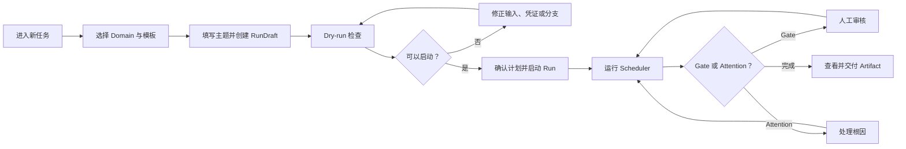

1. 点击左侧“新任务”。
2. 选择一个 Domain 和 WorkflowTemplate。
3. 填写任务主题，选择是否启用可选视频分支，创建 RunDraft。
4. 进入 Dry-run，核对 required path、可选分支、Gate、Provider、风险、成本和凭证。
5. 确认当前计划，再点击启动正式 Run。
6. 在“任务运行”中点击“调度一次”或“自动推进”。
7. 遇到 Gate 时进入“审核”；遇到异常时进入 Attention。
8. 完成后进入“产物”查看 Artifact 版本、审核状态和预览。

## 3. Web 工作台整体布局

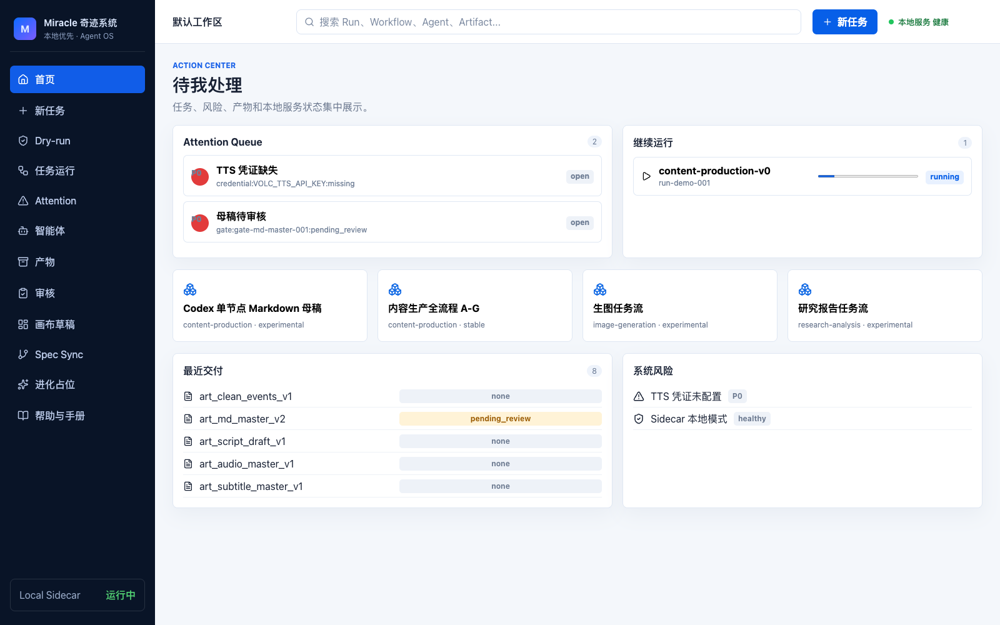

页面由三部分组成：

| 区域 | 作用 |
|---|---|
| 左侧导航 | 在首页、新任务、Run、Attention、Agent、Artifact、Gate、Canvas 和帮助之间切换 |
| 顶部栏 | 显示工作区、全局搜索入口、新任务入口和本地服务健康状态 |
| 主内容区 | 展示当前菜单的列表、详情、操作和反馈 |

页面状态应始终带对象归属，例如 `NodeRun · blocked`、`NodeAttempt · failed`、
`GateInstance · pending_review`、`AgentHealth · waiting`。不要只凭颜色判断状态。

## 4. 首页

### 用途

首页是 Action Center，用于决定“现在最需要处理什么”，不是营销页。

### 页面区域

| 区域 | 内容 | 常见操作 |
|---|---|---|
| Attention Queue | 当前需要决策、修复、核对或关注的根因 | 点击进入 Attention 详情 |
| 继续运行 | 活跃或可继续的 Run | 进入 Run 工作区 |
| 快速启动 | 推荐模板、AI 草案、自定义模板和导入入口 | 创建新任务 |
| 最近交付 | 最近完成的 Artifact 或发布包 | 查看产物 |
| 系统风险 | 凭证、配额、存储和 Provider 状态 | 进入恢复说明 |

### 操作结果

- 点击 Attention 会同时带入对应 Run 和根因对象。
- 点击继续运行会把 Run 设置为当前上下文。
- 点击新任务只进入 RunDraft 阶段，不会立即创建正式运行事实。

## 5. 新任务

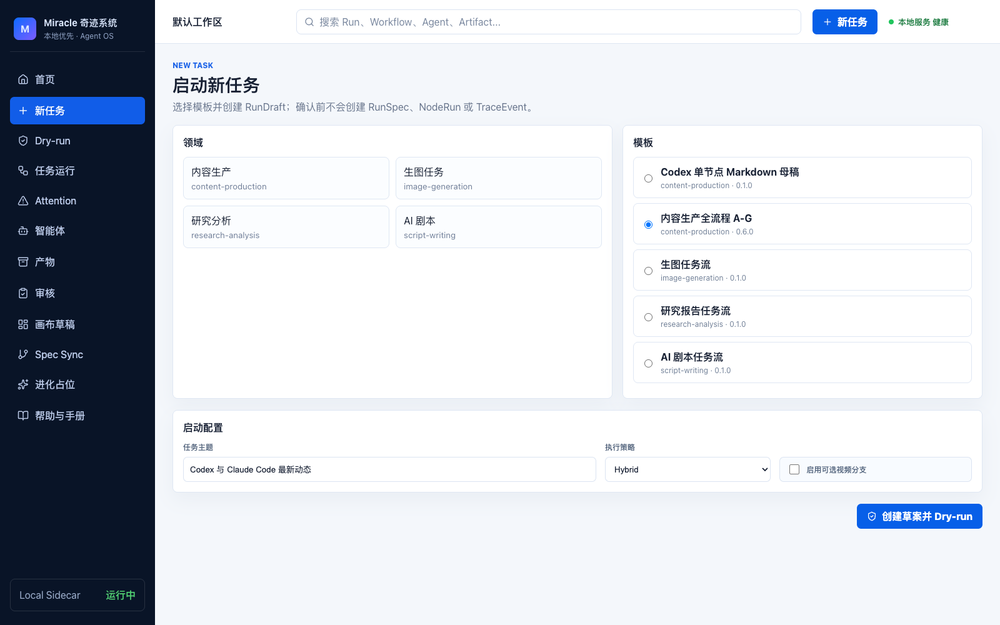

### 5.1 选择 Domain

DomainPack 表示业务领域，例如内容生产、研究分析、图像生成、剧本制作。它决定可推荐的
模板、角色、产物类型和组件，但不会改变 Miracle 核心运行模型。

### 5.2 选择工作流模板

模板是可复制、可版本化的 WorkflowSpec。选择模板时确认：

- 模板名称和版本。
- required 主链路。
- optional 分支。
- 所需 Agent、Adapter、Provider 和凭证。
- 审核门和预计产物。

### 5.3 填写任务输入

当前表单至少包括任务主题和可选分支。不要在主题中填写 API Key、密码或不应进入
Artifact 的敏感资料。

点击创建后系统生成 `RunDraft`。RunDraft 只是启动意图，可以修改、重新 Dry-run、撤回或
取消；它不是 `RunSpec`，不会创建 NodeRun 或 TraceEvent。

## 6. Dry-run

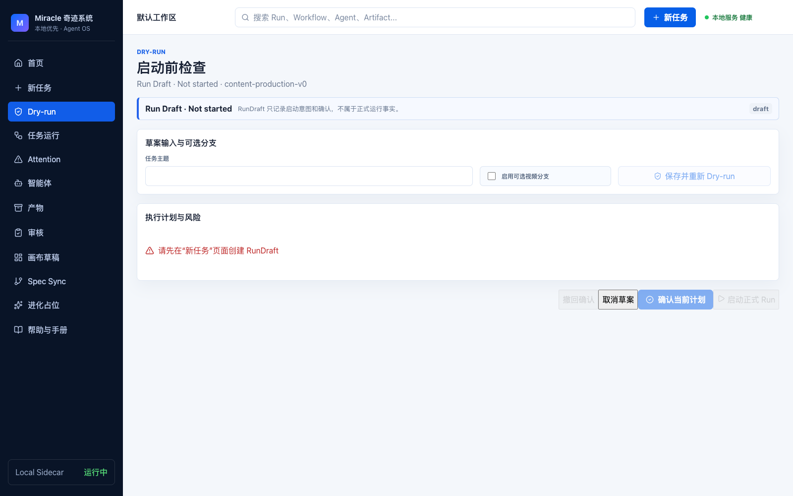

### 6.1 必须检查的内容

| 项目 | 你要确认什么 |
|---|---|
| Required path | 主链路是否完整，是否存在阻断 |
| Optional path | 未启用或失败是否会影响主交付 |
| Gate plan | 哪些产物必须人工审核，阻塞哪些下游 |
| Provider | runtime、Profile、model 和可执行状态 |
| Credentials | 是否缺少 Codex 登录或 Provider 环境变量 |
| Estimate | 预计成本、时间和节点数量 |
| Risks | 缺失输入、未验证 Provider、路径或能力风险 |
| Confirmations | 启动真实运行前需要人工确认的事项 |

### 6.2 状态解释

- `ready`：满足启动条件。
- `ready_with_warnings`：可以启动，但应理解警告影响。
- `blocked`：不能启动，先处理凭证、输入、模板引用或 Provider 状态。
- `configured_unverified`：配置存在但未完成真实验证，不等于 healthy。

修改主题或 optional 分支后必须重新 Dry-run。确认的是当前计划版本；草案变化后，旧确认
不得继续用于启动。

## 7. 启动正式 Run

启动操作会：

1. 冻结 WorkflowSnapshot。
2. 创建 RunSpec。
3. 解析并冻结组件、ProviderPolicy 和启动输入。
4. 创建初始 NodeRun。
5. 由 Sidecar Orchestrator 写入 `run_created` 等事件。

正式 Run 的 Snapshot 不可修改。需要调整流程时，应基于当前快照创建新的 Workflow draft，
而不是直接修改运行中的 DAG。

真实 Codex 执行还要求管理员使用 `MIRACLE_ENABLE_REAL_CODEX=1` 启动系统，并确认 Codex
CLI 健康。普通 fixture Run 不会调用外部真实 Runner。

## 8. 任务运行


### 8.1 顶部运行上下文

查看 Run ID、状态、WorkflowSnapshot 版本、Attention 数量、已运行时间、预计/实际成本。
这些信息在流程、协作、产物、时间线和审计视图之间保持同一个 Run 上下文。

### 8.2 阶段过滤器

左侧阶段列表来自 WorkflowSnapshot，只是过滤和聚焦器，不是第二套页面导航。点击阶段会
过滤当前 DAG 或列表；选择“全部阶段”恢复全局视图。

### 8.3 DAG

节点显示 NodeRun 状态、执行 Agent、产物、Gate 和 required/optional 边。点击节点后查看：

- NodeSpec 和当前 NodeRun。
- NodeAttempt 时间线。
- Adapter kind、Provider Profile、model 和 operation ID。
- resolved inputs、上游 Artifact 版本和 hash。
- 输出 Artifact、消费者和 Gate。
- Retry 决策、预算、Fallback 和恢复动作。

### 8.4 调度操作

- “调度一次”：执行一个 Scheduler tick，只推进当前可执行节点。
- “自动推进”：连续重算 ExecutionPlan，直到 Gate、Attention、失败或完成边界。
- “刷新”：只读取最新投影，不创建执行事件。

Scheduler 只执行 ExecutionPlan 中的 `execute` 决策。页面上的布局和筛选不影响依赖关系。

### 8.5 事件与审计

事件抽屉按时间显示 run、node、attempt、artifact、gate、retry 和 fallback 事实。事件仅显示
审计摘要，不包含 API Key、隐藏推理和 Artifact 正文。

## 9. Attention

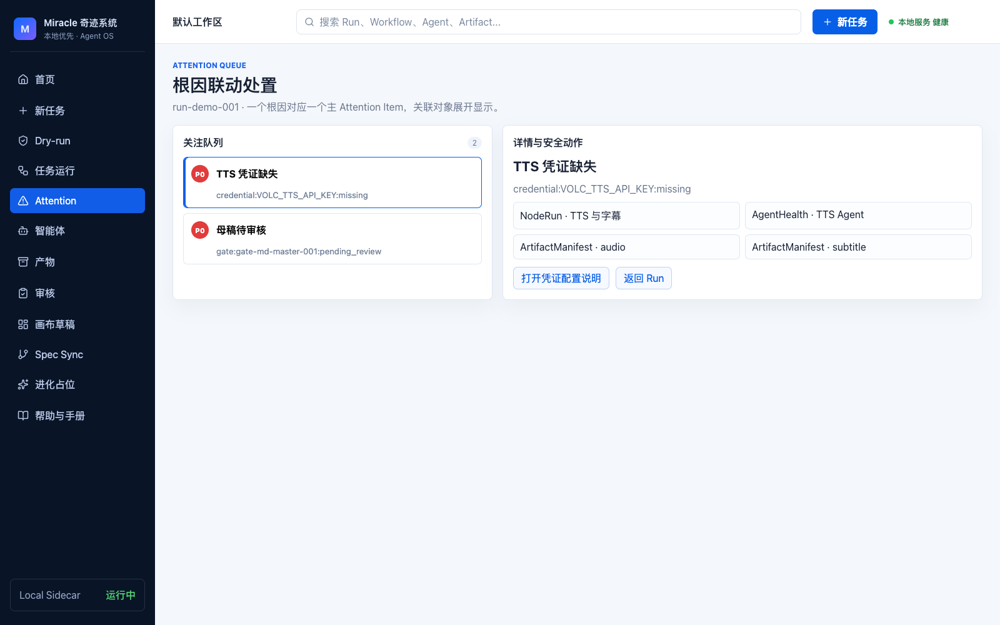

Attention 使用“一个根因一个主卡片”：Node、Agent、Artifact 和 Gate 作为关联对象展开，
避免同一问题重复报警。

### 9.1 处理步骤

1. 先看根因和优先级，不要只看受影响对象数量。
2. 核对关联 Run、NodeRun、Attempt、Agent、Artifact 和 Gate。
3. 阅读影响范围，确认 required 主链路是否停止。
4. 选择系统提供的恢复动作，例如配置凭证、检查根因、停止自动 Retry、审核 Gate 或确认 Fallback。
5. 操作后刷新 Run，确认底层状态恢复和 Attention 是否进入 resolved。

未解决的审核、危险确认和对账问题不能通过手工删除规避。已解决项进入历史，不直接抹除。

## 10. 智能体

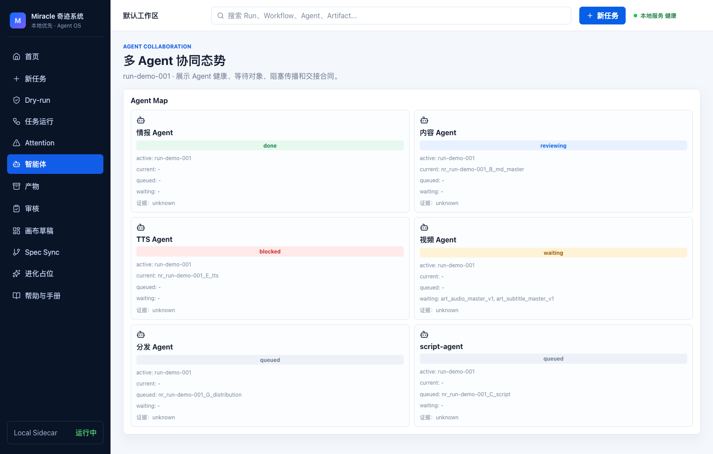

智能体视图用于回答：谁在执行、谁在等待、谁被阻塞、等待什么 Artifact/Gate、下一步交给谁。

| 状态 | 含义 |
|---|---|
| `idle` | 当前没有活动任务 |
| `queued` | 已分配但尚未执行 |
| `running` | 正在调用能力或处理节点 |
| `waiting` | 等待输入、Artifact、Gate 或其他 Agent |
| `blocked` | 存在必须处理的根因 |
| `reviewing` | 处于审核或复核阶段 |
| `done` | 本轮任务完成 |
| `failed` | 本轮执行失败 |

同一个 Agent 可以参与多个 Run。应同时查看整体健康、活跃任务、排队任务、阻塞任务和最近交接。

## 11. 产物

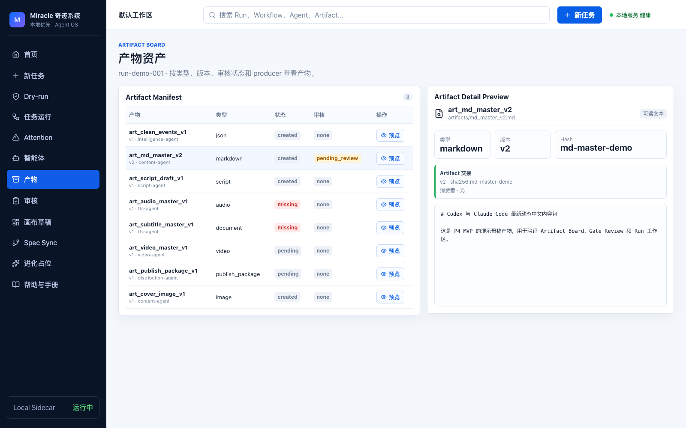

Artifact Board 展示：

- Artifact ID、类型、版本和 SHA-256。
- producer NodeAttempt。
- review status 和关联 Gate。
- 上游来源和下游消费者。
- 文本预览或二进制引用状态。

### 11.1 版本原则

返工不会覆盖旧 Artifact，而是创建新版本。审核和下游选择应绑定具体 Artifact ID 和 hash，
不要只凭文件名判断“最新”。

### 11.2 预览原则

Markdown、JSON 和文本可在本地预览。视频、音频等二进制可能只显示引用和元数据。
`preview unavailable` 不等于 Artifact 不存在，应继续检查路径、类型和 hash。

## 12. 审核与返工

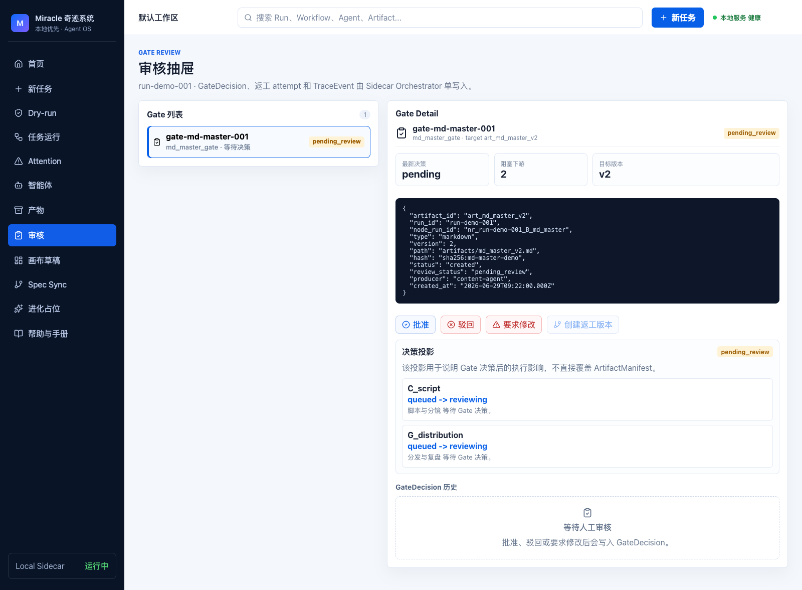

### 12.1 决策

| 决策 | 结果 |
|---|---|
| `approve` | 当前 Artifact 通过，符合条件的下游可继续 |
| `reject` | 当前 Artifact 被驳回，下游不推进，可创建返工版本 |
| `request_changes` | 需要修改并重新审核，旧版本和决策保留 |

提交前检查 Artifact 版本/hash、历史决策、required_before 和受影响下游。GateDecision 一旦写入
审计历史不会被覆盖。

### 12.2 返工

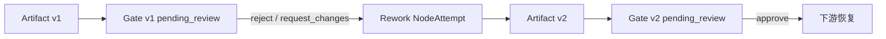

创建返工后会产生新 Attempt、Artifact version 和 GateInstance。旧 Artifact 和 GateDecision
仍可审计。Historical Run 是只读对象，不能提交决策或创建返工。

## 13. Retry 与 Fallback

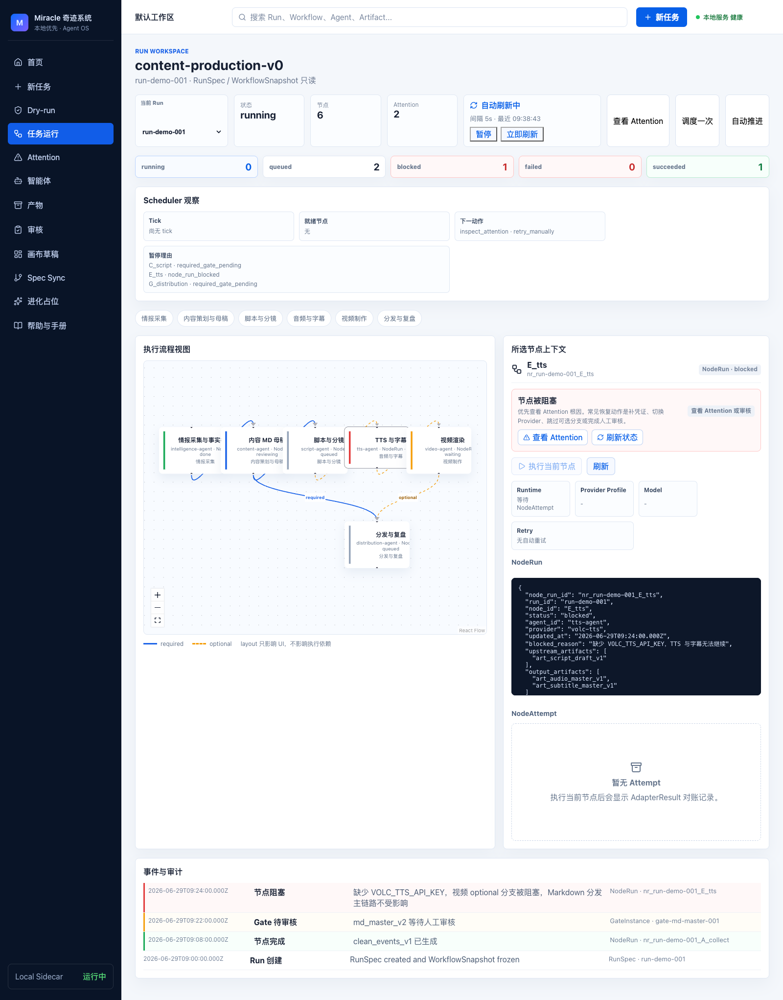

### 13.1 Retry

- `waiting_for_retry`：已排期但尚未到时间。
- `due`：可以由 Scheduler 创建下一次 Attempt。
- `exhausted`：次数、总时间或成本预算耗尽，进入 Attention。
- `blocked`：凭证、权限、输入或 Artifact 等问题不能通过自动 Retry 解决。

每次 Retry 都新增 NodeAttempt，不覆盖失败历史。`unknown` 或 `dispatched_unknown` 不会自动
重派，必须先核对外部回执，避免重复执行。

### 13.2 Provider Fallback

同类 Model API 遇到允许恢复的 429、临时 5xx、网络错误或确认终止的超时时，可根据路由
策略切换到另一个 healthy Profile。Codex 切换到 Model API 属于跨 kind Fallback，必须二次
人工确认。

确认前核对 decision ID、operation、当前 adapter kind、目标 Profile、model、成本和可执行状态。
陈旧 Decision 会返回 409，重新加载最新路由后再决定。

## 14. 画布草稿

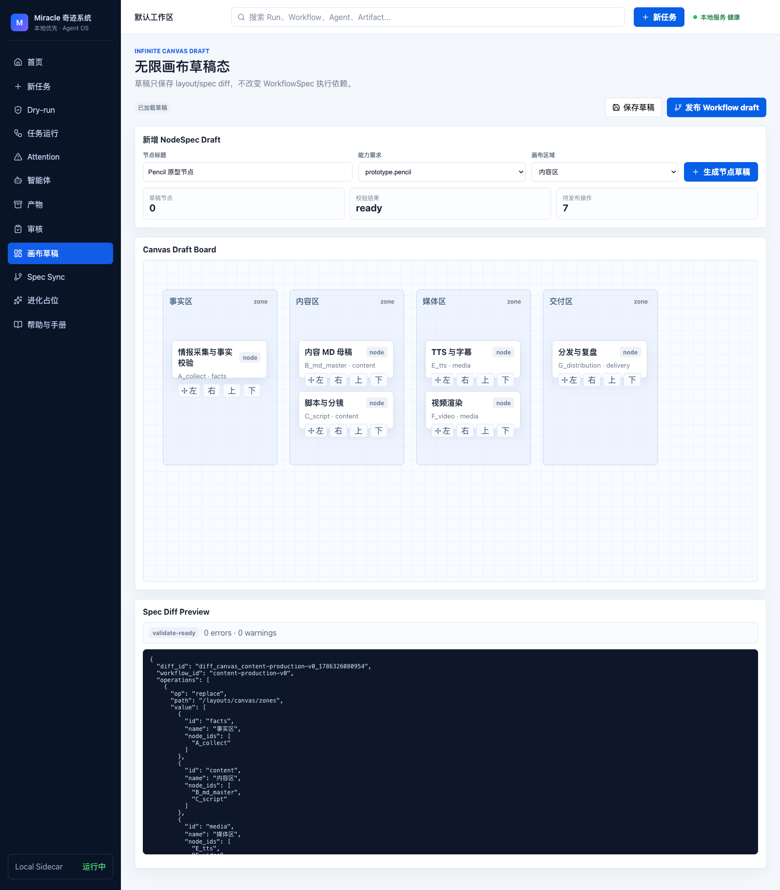

当前画布是草稿态，不是完整 Lovart 式自由创作产品。

1. 新增或移动 node card。
2. 填写节点名称、类型和能力需求。
3. 生成 NodeSpec draft。
4. 查看 Spec Diff Preview 和校验结果。
5. 发布新的 draft WorkflowSpec。

画布位置只进入 `CanvasLayout`，不改变 DAG 执行依赖。发布不会修改 stable Workflow，也不会
改变已启动 Run 的 WorkflowSnapshot。

## 15. 创建和扩展工作流

当前 Web 提供模板选择、Canvas NodeSpec draft 和 Workflow draft 发布能力；完整 DAG 编辑器、
文件 watcher 和 Visual/Spec 冲突合并仍未完成。

### 15.1 建议步骤

1. 从最接近的 WorkflowTemplate 复制草案。
2. 明确任务输入、最终 Artifact 和人工审核点。
3. 为每个 Node 声明 capability、inputs、outputs、候选 Agent 和组件库。
4. 使用 EdgeSpec 表达 required/optional、join 和超时行为。
5. 使用 ArtifactSpec/GateSpec 定义审核，不在 Node 内重复写审核真相。
6. 运行 validate 和 Dry-run。
7. 在 fixture workspace 试运行，再发布为 experimental/stable 模板。

复杂 YAML/JSON 编辑和模板安装当前主要由开发维护者完成，详见
[开发维护手册](../developer/63_Miracle开发维护手册.md)。

## 16. Historical Run

历史 Run 页面显示 `Historical · Read-only`。它用于查看已存在的 DAG、Agent、Artifact、Gate、
Trace 和证据缺口，不代表 Miracle 亲自执行过该历史任务。

禁止操作：

- 调度历史节点。
- 重试历史 Attempt。
- 提交 GateDecision。
- 创建返工版本。
- 把缺失的事件推测为真实执行事实。

当源工作区缺少 task events 或审批证据时，页面必须显示 gap/confidence，而不是伪造 completed
或 approved。

## 17. 三个任务案例

### 17.1 内容生产

```text
主题 -> 资料采集 -> 事实核验 -> MD 母稿 -> Gate -> 脚本/分镜
     -> TTS/字幕 -> 视频（optional）-> 分发 -> 复盘
```

重点：视频分支可选时，TTS 缺凭证不应阻塞“仅 Markdown”required 交付。

### 17.2 研究分析

```text
问题定义 -> 资料采集 -> 事实核验 -> 分析 -> 引用审计 -> 报告审核 -> 交付
```

重点：把来源、引用和事实核验结果作为可审计 Artifact，不把模型回答直接当成事实。

### 17.3 图像生成

```text
需求 -> Prompt 策划 -> 图像生成 -> 人工审核 -> 放大/变体 -> 交付
```

重点：图像、Prompt 版本和审核决策分别记录；选择 Provider 时考虑能力、成本、授权和历史表现。

## 18. Task Baseline

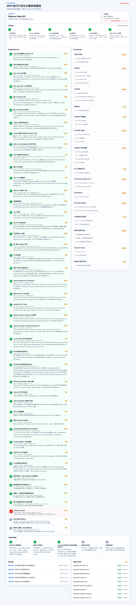

入口：`http://127.0.0.1:4317/task-baseline`。

它用于查看项目实施任务、依赖、当前节点、Git HEAD 和证据文件，不是业务 Run 页面。
普通业务使用者通常不需要操作；项目维护和版本验收时使用。

## 19. 帮助与手册

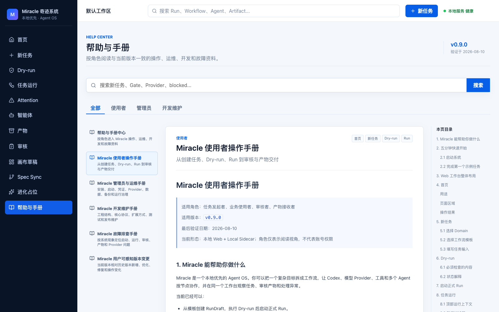

侧边栏“帮助与手册”提供：角色分类、全文搜索、文章目录、版本标记、截图和流程图。搜索
“新任务”“Gate”“Provider”“blocked”等关键词可以直接定位操作或故障章节。

## 20. 常见问题

### 页面能打开但没有数据

检查 Sidecar health，确认 Web 与 Sidecar 端口匹配。参见
[故障排查手册](../shared/64_Miracle故障排查手册.md)。

### 为什么 Run 一直停在 Gate

进入“审核”，选择对应 `GateInstance · pending_review` 并提交决策。Historical Run 不能操作。

### 为什么配置了 Key 仍不能执行

凭证存在只表示 configured。Provider 还需完成授权、健康检查和脱敏 smoke 才可能成为 healthy。

### 为什么修改画布后正在运行的 DAG 没变化

Run 使用不可变 WorkflowSnapshot。画布修改只产生新的 Workflow draft，不影响当前 Run。

### 如何知道本版本改变了什么

阅读[用户可感知版本变更](../shared/65_Miracle用户可感知版本变更.md)，技术细节再查看根目录
`VERSION_HISTORY.md`。
