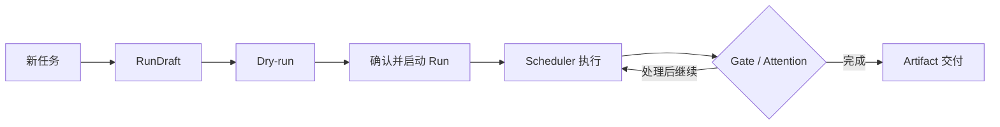

# Miracle 系统操作使用说明书

> 文档状态：CURRENT
>
> 文档性质：系统帮助总入口和历史链接兼容入口
>
> 当前产品版本：`v0.9.0`
>
> 最后验证日期：2026-08-10

## 1. 选择你的手册

Miracle 的详细说明已按角色拆分，避免普通用户、管理员和开发者在同一份长文档中查找信息。

| 你的目标 | 阅读入口 |
|---|---|
| 创建任务、Dry-run、启动 Run、审核和交付产物 | [Miracle 使用者操作手册](../manuals/user/61_Miracle使用者操作手册.md) |
| 安装、启动、凭证、Provider、备份、升级和运行治理 | [Miracle 管理员与运维手册](../manuals/administrator/62_Miracle管理员与运维手册.md) |
| 扩展 Domain、Workflow、Adapter、Provider、API 和页面 | [Miracle 开发维护手册](../manuals/developer/63_Miracle开发维护手册.md) |
| 系统出现异常，需要按现象诊断 | [Miracle 故障排查手册](../manuals/shared/64_Miracle故障排查手册.md) |
| 了解当前版本相对历史版本改变了什么 | [Miracle 用户可感知版本变更](../manuals/shared/65_Miracle用户可感知版本变更.md) |

统一目录见[帮助与手册中心](../manuals/README.md)。

## 2. 最短启动

```bash
cd /Users/zhangyue/miracle-agent
npm run dev
```

默认入口：

| 服务 | 地址 |
|---|---|
| Miracle Web | `http://127.0.0.1:5174/` |
| Sidecar health | `http://127.0.0.1:4317/api/v0/health` |
| Task Baseline | `http://127.0.0.1:4317/task-baseline` |

首次安装、环境变量和真实运行配置请阅读管理员手册，不要在仓库文件中保存真实 API Key。

## 3. 最短任务流程



1. 进入“新任务”，选择 Domain 和 WorkflowTemplate。
2. 填写主题和 optional 分支，创建 RunDraft。
3. 在 Dry-run 检查 required path、Gate、Provider、凭证、成本和风险。
4. 确认当前计划并启动 Run。
5. 在“任务运行”调度节点、查看 DAG、Attempt 和事件。
6. 遇到 Gate 进入“审核”，遇到异常进入 Attention。
7. 完成后在“产物”查看 Artifact 版本、hash、审核状态和预览。

完整逐页说明见使用者操作手册。

## 4. 当前功能边界

当前已支持：

- Workflow/RunDraft/Dry-run/Run 主链路。
- Codex 多节点真实执行、Artifact 交接和 Gate 恢复。
- Retry、Provider Router、同类 Fallback 和跨 kind 人工确认。
- Agent Collaboration、Attention、Artifact Board 和事件审计。
- Historical Run 只读导入和查看。
- Canvas NodeSpec 草稿和 Workflow draft 发布。
- DeepSeek/Kimi/MiniMax Driver；DeepSeek 已完成真实脱敏 smoke。

当前未完成：

- Kimi/MiniMax 当前环境真实验证。
- Hermes/OpenClaw Adapter。
- 完整 Infinite Canvas、Visual/Spec 文件同步和 Evolution Engine。
- 云端控制平面、账号、RBAC、多租户、计费、团队协作和移动端。

## 5. 版本与真实性

- 当前发布结论以 `docs/06-operations/release/60_P7回归验收与版本收口报告.md` 为准。
- 技术演进以根目录 `VERSION_HISTORY.md` 为准。
- 用户可感知变化以 65 号手册为准。
- 项目任务以 `plans/mvp-task-baseline/roadmap.json` 和 `/task-baseline` 为准。
- Historical、fixture/fake、真实 Codex/Provider 证据必须明确区分。

## 6. 手册维护规则

功能提交前判断：用户操作、启动配置、故障恢复、开发扩展和版本感知是否变化。变化时更新对应
角色手册；纯内部重构在版本历史和提交说明标记“无手册影响”。

详细规则见[帮助与手册中心 README](../manuals/README.md)和
[角色化说明书与 Web 帮助中心设计](../manuals/00_Miracle角色化说明书与Web帮助中心设计.md)。
