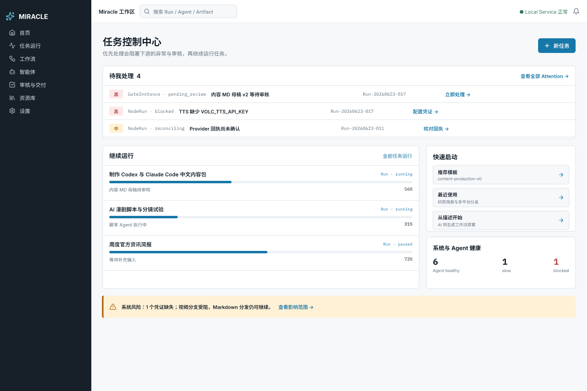
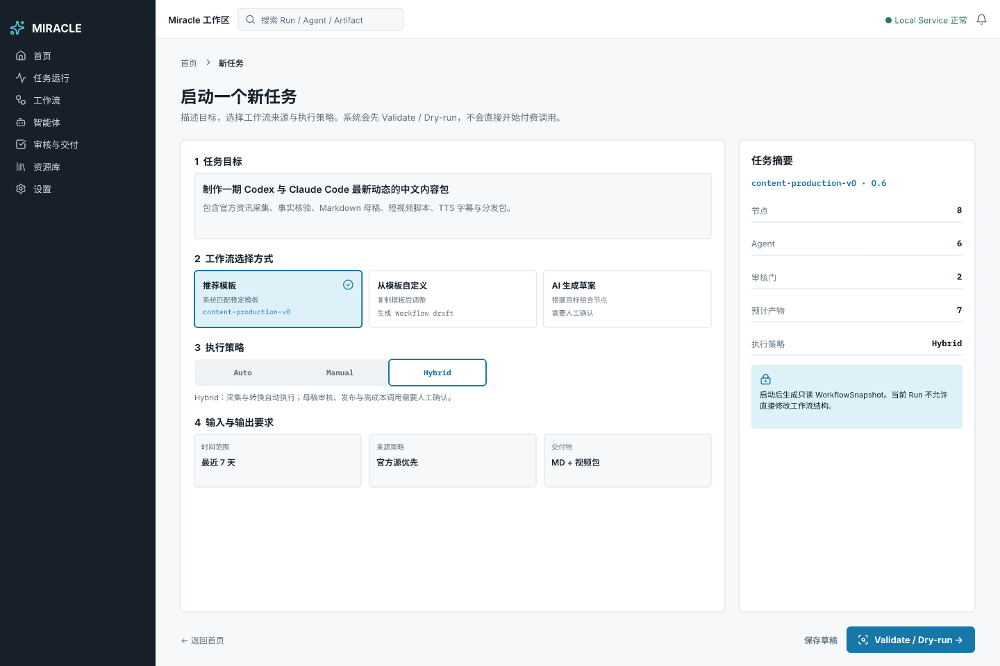
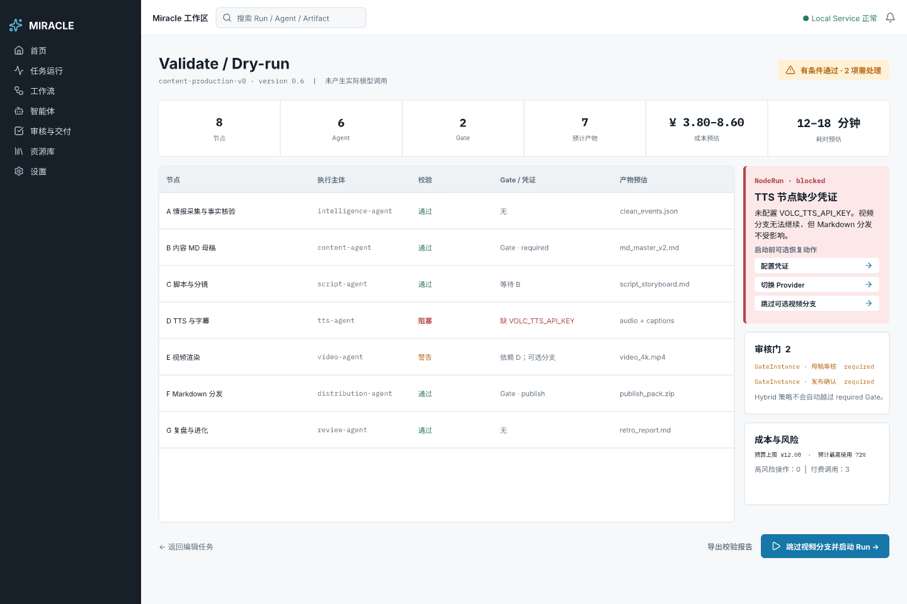
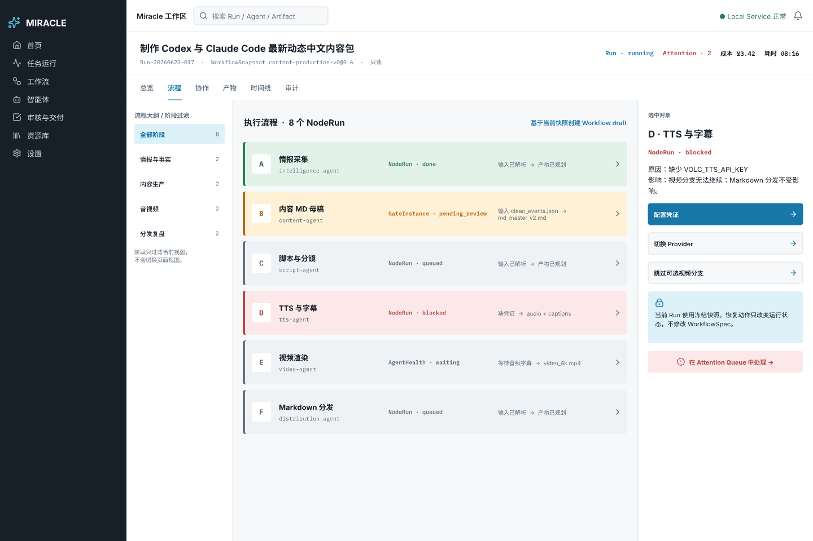
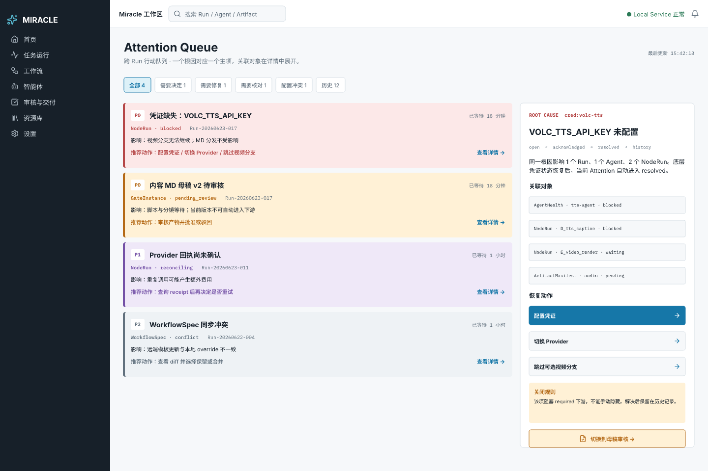
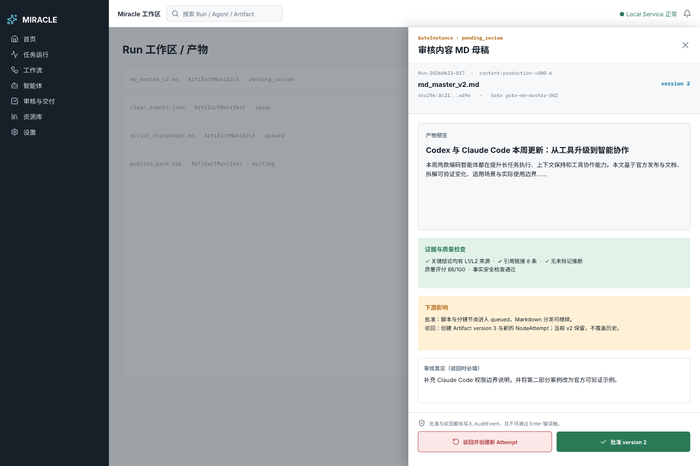

# Miracle P2 Pencil 低保真原型

## 交付物

- 可编辑源文件：[miracle-p2-lowfi.pen](miracle-p2-lowfi.pen)
- 共同设计简报：[../00_双轨原型共同设计简报.md](../00_双轨原型共同设计简报.md)
- 双轨评审表：[../01_双轨原型评审表.md](../01_双轨原型评审表.md)

## 页面清单

| Frame ID | 页面 | 导出图 |
|---|---|---|
| `P2F-01` | 任务型首页 | [P2F-01-home.png](../../../assets/prototypes/pencil/P2F-01-home.png) |
| `P2F-02` | 新任务 | [P2F-02-new-task.png](../../../assets/prototypes/pencil/P2F-02-new-task.png) |
| `P2F-03` | Validate / Dry-run | [P2F-03-dry-run.png](../../../assets/prototypes/pencil/P2F-03-dry-run.png) |
| `P2F-04` | Run 工作区 | [P2F-04-run-workspace.png](../../../assets/prototypes/pencil/P2F-04-run-workspace.png) |
| `P2F-05` | Attention Queue | [P2F-05-attention-queue.png](../../../assets/prototypes/pencil/P2F-05-attention-queue.png) |
| `P2F-06` | 审核抽屉 | [P2F-06-review-drawer.png](../../../assets/prototypes/pencil/P2F-06-review-drawer.png) |

## 页面预览

### P2F-01 首页



### P2F-02 新任务



### P2F-03 Validate / Dry-run



### P2F-04 Run 工作区



### P2F-05 Attention Queue



### P2F-06 审核抽屉



## 主链路

```text
P2F-01 首页
-> P2F-02 新任务
-> P2F-03 Validate / Dry-run
-> P2F-04 Run 工作区
-> P2F-05 Attention Queue
-> P2F-06 审核抽屉
```

页面以统一 App Shell、对象状态和 Flow A-G 样例数据表达链路关系。当前 `.pen` 是可编辑
设计源，但本轮没有实现代码级路由或运行逻辑；页面中的按钮和箭头表达目标跳转关系。

## 已实现的产品规则

- 工作流选择方式和执行策略分开显示。
- Run 使用只读 WorkflowSnapshot，并提供“基于当前快照创建 Workflow draft”。
- 状态带对象归属，例如 `NodeRun · blocked` 和 `GateInstance · pending_review`。
- Dry-run 显示节点、Agent、Gate、凭证、成本、耗时、风险和产物预估。
- Attention Queue 使用根因聚合，并显示关联对象、恢复动作和关闭规则。
- 审核抽屉保留 Run、Workflow、Artifact version/hash、Gate 和下游影响。
- 驳回动作明确创建新 Artifact version 和 NodeAttempt，不覆盖历史。

## 共享组件

Pencil 文件中包含：

- `component/App Sidebar`
- `component/Top Bar`
- `component/Primary Button`
- `component/Status Pill`

这些组件用于保持六个页面的导航、状态和操作样式一致。

## 检查结果

- 六个页面均为 `1440 × 960`。
- 已使用 Pencil `snapshot_layout` 检查完整文档。
- 最终结果：`No layout problems.`。
- 已目视检查首页、新任务、Dry-run、Run、Attention 和审核抽屉导出图。
- 未发现文字重叠、页面裁切或主要控件溢出。

## 已知限制

- 本轮是低保真/中低保真结构原型，不是最终品牌视觉。
- `.pen` 文件表达页面和组件关系，但尚未建立真实业务数据绑定。
- Agent Collaboration、DAG 编辑、Infinite Canvas、智能体中心、完整审核与交付及资源库
  不在第一轮范围。
- 下一轮需要通过人工走查和目标用户测试确认首页布局、Attention 默认入口和 Run
  阶段过滤方式。
