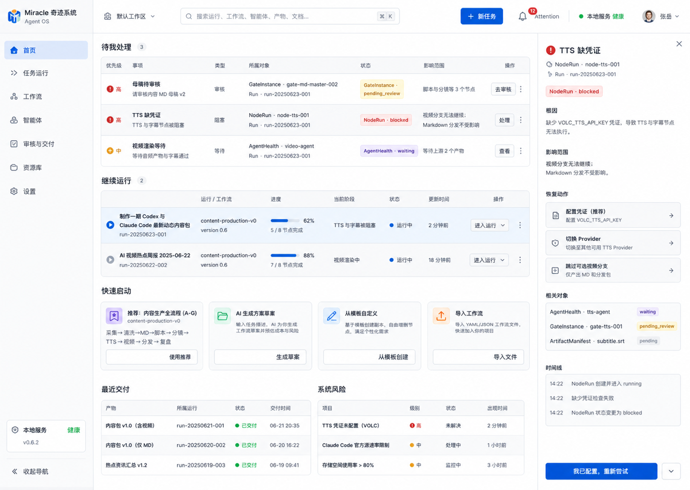
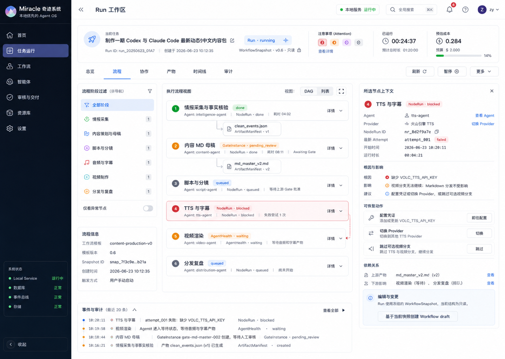
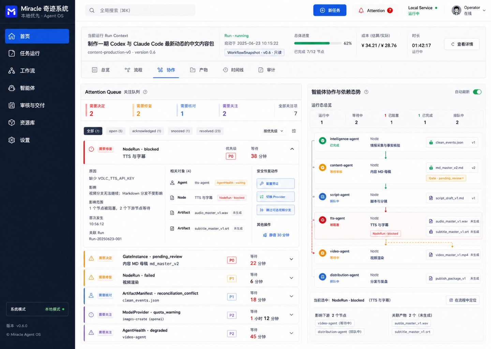

# Miracle P2 Product Design 视觉候选

## 交付说明

本目录记录 Miracle P2 第一轮 Product Design 独立视觉探索。三张候选图共享
`00_双轨原型共同设计简报.md` 的产品规则，但分别强化不同的信息层级和交互模型。

本轮只用于视觉方向对比，不是代码原型，也不替代可编辑的 Pencil 低保真原型。

## 最终采纳结果

2026-06-26 复审后，A/B/C 不再作为并列首页方案，而是固定映射到三个 Web 工作台页面：

- A 行动中枢 -> 首页。
- B Run 驾驶舱 -> Run 工作区。
- C 态势与处置台 -> Attention 的根因联动与关联对象态势。

当前有效的代码级原型见 [../fusion-clickable/README.md](../fusion-clickable/README.md)，
最新截图见：

- [home-desktop.png](../../../assets/prototypes/fusion-clickable/home-desktop.png)
- [run-desktop.png](../../../assets/prototypes/fusion-clickable/run-desktop.png)
- [attention-desktop.png](../../../assets/prototypes/fusion-clickable/attention-desktop.png)

## 概念 A：行动中枢

- 图片：`assets/prototypes/product-design/miracle-p2-concept-a.png`
- 布局：任务型首页，按“待我处理 -> 继续运行 -> 快速启动 -> 最近交付与系统风险”
  排列；右侧上下文面板承接所选行动的影响和恢复动作。
- 交互模型：用户先选择需要处理的行动，再进入对应 Run、审核或恢复流程。
- 优点：首次进入时下一步明确；适合一人公司操作者和任务发起者；异常与正常任务
  在同一首页完成分流。
- 风险：Run 的流程结构和 Agent 协作关系不是首屏重点；高密度首页需要严格控制
  Attention 数量和摘要层级。
- 最适合验证：用户能否在 10 秒内找到最需要处理的事项，以及能否从 TTS 缺凭证
  直接进入安全恢复动作。

## 概念 B：Run 驾驶舱

- 图片：`assets/prototypes/product-design/miracle-p2-concept-b.png`
- 布局：Run 状态栏持续保留任务、快照、成本和耗时；左侧是动态阶段过滤器，
  中间是执行流程，右侧是选中节点详情，底部是事件与审计。
- 交互模型：以 Run 为稳定共同上下文，用户在固定视图、阶段过滤和节点详情之间
  切换；恢复动作始终贴近根因与下游影响。
- 优点：WorkflowSnapshot 只读边界清晰；NodeRun、AgentHealth、GateInstance 和
  ArtifactManifest 的归属容易理解；适合长时间监控执行过程。
- 风险：首次进入的用户需要理解较多运行对象；三栏布局在窄屏下需要降级为抽屉或
  分步视图。
- 最适合验证：固定 Run 视图与动态阶段过滤是否互不冲突，以及用户能否理解
  “当前 Run 只读、结构调整进入 Workflow draft”。

## 概念 C：态势与处置台

- 图片：`assets/prototypes/product-design/miracle-p2-concept-c.png`
- 布局：左侧主体是按根因聚合的 Attention Queue，右侧是 Agent、Node 和 Artifact
  的依赖与交接态势，上方保留当前 Run 上下文。
- 交互模型：选择一个根因后，同步高亮受影响的 Agent、Node、Artifact 和 Gate，
  并在同一区域提供安全恢复动作。
- 优点：异常、等待和交接关系可同时判断；适合多 Agent 并发和故障密集场景；
  Attention 去重规则可以直接通过界面验证。
- 风险：对正常运行任务的日常入口弱于概念 A；如果缺少严格的根因聚合，界面容易
  退化为高噪声告警台。
- 最适合验证：用户能否识别一个根因影响的多个对象、选择正确恢复动作，并理解
  resolved 项进入历史而不是被删除。

## 对比建议

| 方向 | 首要问题 | 更适合的默认入口 | 主要验证风险 |
|---|---|---|---|
| A 行动中枢 | 我现在应该做什么 | 首页 | 摘要过多导致行动优先级失焦 |
| B Run 驾驶舱 | 当前 Run 运行到哪里 | Run 工作区 | 三栏密度和对象认知成本 |
| C 态势与处置台 | 什么根因影响了谁 | Attention / 协作 | 告警聚合失效造成噪声 |

建议评审时不要直接选定一套覆盖所有页面的视觉结构。更可行的组合是：A 作为首页，
B 作为 Run 工作区，C 的根因联动模型用于 Attention Queue 和后续 Agent
Collaboration；再由 Pencil 原型验证它们在同一 App Shell 下是否连续。

## 交付限制

- 图片由 ImageGen 生成并统一调整为 `1440 × 1024` PNG。
- 图片中的小字号文案、ID 和图标仅用于表达信息结构，不能直接作为最终 UI 规格。
- 本轮没有制作代码原型、交互热点、响应式状态或无障碍实现。
- 精确字段、状态机和对象关系仍以当前有效产品文档与后续可编辑原型为准。
